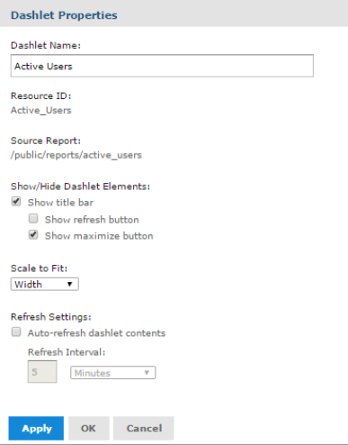

                             

Dashlet Properties
------------------

You can view and edit the basic information and appearance of each dashlet on your dashboard using the **Dashlet Properties**. The properties displayed varies based on the type of dashlet you are working.

To view and edit the dashlet properties, follow these steps:

1.  Click **Create Dashboard** from the **Custom Dashboards** window.
    
    The **Dashboard Designer** appears.
    
2.  In the **Dashboard Designer** window, drag an element from the **Available Content** pane to **Dashboard Canvas**.
    
    Each element added to the dashboard canvas is considered as a dashlet.
    
3.  Right-click on a dashlet and select **Properties** to open the **Dashlet Properties** window.

The Dashlet Properties window displays the following properties. The properties are applicable for dashlets containing the custom reports, and reports (standard reports).

**Properties of the dashlets containing the custom reports, and reports (standard reports) include the following:**

  
| Property | Description |
| --- | --- |
| Dashlet Name | Editable field for the displayed dashlet name. |
| Resource ID | Non-editable ID taken from the original dashlet name. |
| Source Data | Non-editable path of the source data. |
| Show/hide Dashlet Elements | Select or deselect to show or hide the title bar, which includes the dashlet name, refresh button, and maximize button. Enabling the title bar in the dashlet properties includes the following elements: **Dashlet Name**: Displays the name of the dashlet added to the dashboard. **Dashlet toolbar** displays the following icons.
  
| Icon | Name | Description |
| --- | --- | --- |
|  | Maximize | Click to open the dashlet as a larger view. |
|  | Refresh | Click to refresh the dashlet. |

 |
| Scale to Fit | The menu list to determine how the element is scaled in the dashlet. |
| Refresh Settings | 

Select or deselect to enable or disable auto-refresh. Use the text entry and menu list to set the time between each content refresh.

The setting overrides refresh properties set at the dashboard level.

 |
| Apply | 

Click to view the changes.

 |
| OK | Click to accept the changes. |
| Cancel | Click to discard the changes. |

**Properties of dashlets containing the text include:**

  **Properties of dashlets containing the text include:**

**Properties of dashlets containing the text include:**

  
| Property | Description |
| --- | --- |
| Dashlet Name | Editable field for the displayed dashlet name. |
| Resource ID | Non-editable ID taken from the original dashlet name. |
| Text | Editable field for the text displayed in the dashlet. |
| Scale to Fit | The menu list to determine how the text is scaled in the dashlet. It overrides the specified font size. |
| Font | Use the selection lists and buttons to set the font, font size, font style, alignment, and font color for the text displayed in the dashlet. |

**Properties of dashlets containing a web page include:**

  
| Property | Description |
| --- | --- |
| Dashlet Name | Editable field for the displayed dashlet name. |
| Resource ID | Non-editable ID taken from the original dashlet name. |
| Web page address (URL) | Editable field for the URL displayed in the dashlet. |
| Show/Hide Dashlet Elements | Select or deselect to show or hide the title bar, that includes the dashlet name, refresh button, and maximize button. |
| Show Scroll Bars | Select or deselect to show or hide scroll bars. |
| Refresh Settings | Select or deselect to enable or disable auto-refresh, and use the text entry and menu list to set the time between each content refresh. The setting overrides refresh properties set at the dashboard level. |

> **_Note:_** As manage.hclvoltmx.com is on https, we can request only https URLs. Other requests will be blocked by the browser.  
If the page has **X-Frame-Options HTTP** response header, the page will be blocked by the browser.  

**Properties for dashlets containing an image include:**

  
| Property | Description |
| --- | --- |
| Dashlet Name | Editable field for the displayed dashlet name. |
| Resource ID | Non-editable ID taken from the original dashlet name. |
| Web page address / Repository (URL) | Editable field for the for the location of the image displayed in the dashlet. The field can include the parameters. |
| Show/Hide Dashlet Elements | Select or deselect to show or hide the title bar, that includes the dashlet name, refresh button, and maximize button. |
| Scale to Fit | The menu list to determine how the image is scaled in the dashlet. |

**Properties of dashlets containing a filter include:**

  
| Property | Description |
| --- | --- |
| Dashlet Name | Editable field for the displayed dashlet name. |
| Resource ID | Non-editable ID taken from the original dashlet name. |
| Show/Hide Dashlet buttons | Select or deselect to show or hide the Apply or Reset buttons. |
| Position of Dashlet buttons | The menu list to select bottom or right position. |
