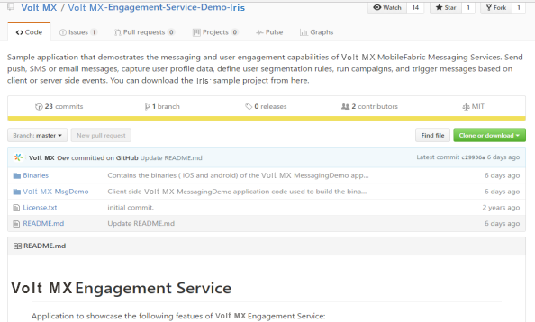
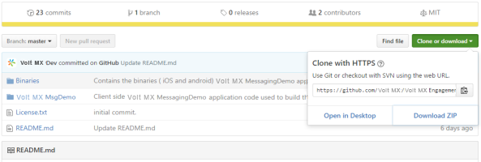
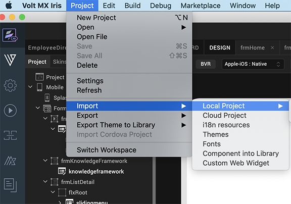
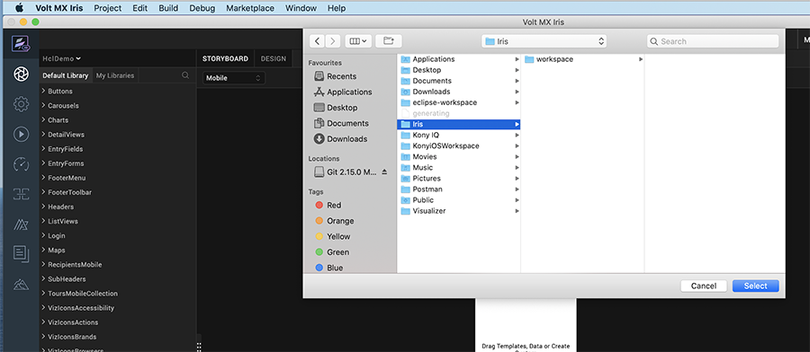
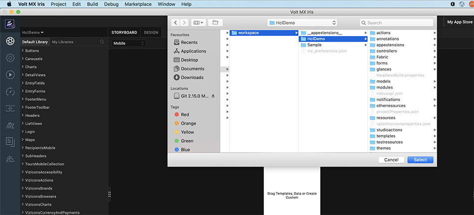

                           

Demo App QuickStart Guide (Building a Sample App – iOS): Downloading and Configuring the Engagement Services Demo Client Application

Downloading and Configuring the Engagement Services Demo Client Application
===========================================================================

The section explains how to download the Engagement services demo application from GitHub and configure the app using Iris for iOS devices.

> **_Note:_** We assume that Apple’s Xcode and Iris are installed before the following steps are performed.  

To download and configure the Engagement demo client application, follow these steps:

1.  Connect to the URL [https://github.com/voltmx/VoltMX-Engagement-Service-Demo-Iris](https://github.com/voltmx/VoltMX-Engagement-Service-Demo-Iris) where the application is located. 
    
    
    
    The **VoltMX-Engagement-Service-Demo-Iris** page appears.
    
2.  On the upper-right corner of the page, click **Clone or download** and save the zip file on your system.
    
    
    
    The list-view displays the following files:
    
    *   **Binaries**: Contains the binaries (iOS) of the VoltMXMessagingDemo app.
    *   **VoltMXMsgDemo app**: Client side VoltMXMessagingDemo application code.
    *   **License.txt**: GitHub provides an option to include a software license in your project when you create a new repository.
    *   **README.md**: The `README.md` is used to generate the.html summary you see at the bottom of projects.
3.  Close the **VoltMX-Engagement-Service-Demo-Iris** page.
4.  Open **Iris**. Under the **File** menu, click **Import** > **Local Project**.
    
    
    
    The **Import Volt MX Project** window appears.
    
    
    
5.  Click the **Browse** button and navigate to the project folder that has the files you want to import.
    
    
    
6.  Select the **VoltMX Engagement Services Demo App** and click **Finish** to complete the importing of project in to Iris.
    
    The **Engagement Services Demo App** project opens into **Iris**.
    
    
