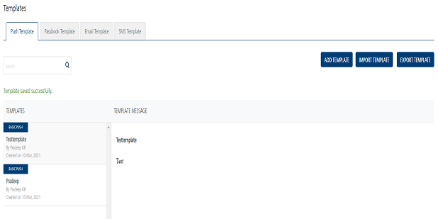
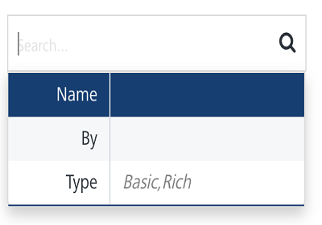
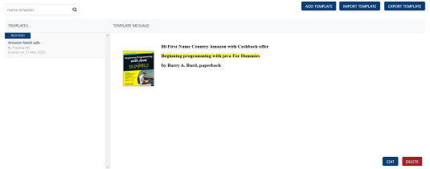
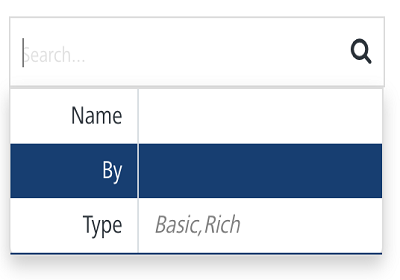
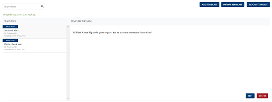
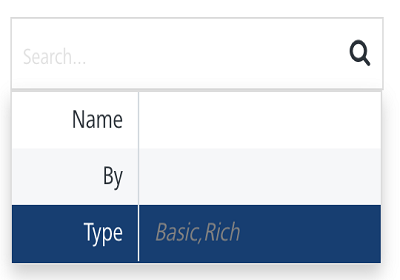
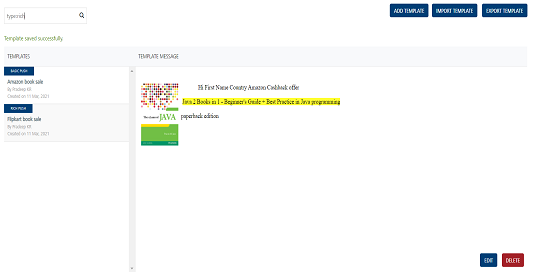
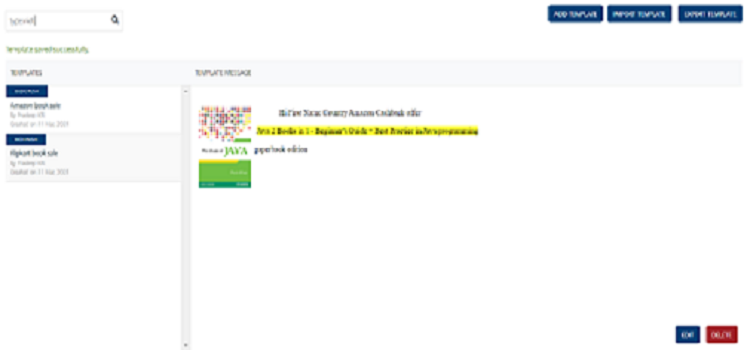

                              

Push Template
=============

As an administrator, you add various push templates to use in campaigns and events. The push templates save creation time, because you can use the same template for sending similar push message to users.

From the **Settings** section, click **Template** from the left panel. The **Templates** page appears with the four tabs including **Push Template**, **Email Template**, **SMS Template** and **Passbook Template**.By default, the **Templates** home page displays **Push Template** tab details.

The Push template home page displays the following details:

*   **Add Template** button: The button helps you add a new push template to the list.
*   **Import Template button**: The button helps you import push templates.
*   **Export Template button**: The button helps you export push templates.
*   **Search** field: Click in the search field to view options to search a push template. You can search push templates based on the following criteria:
    
    *   **Name**: Enter the push template name in the search field and click **Enter**.
        
        
        
        The required push template appears on the home page. To clear your search result, click in the search field to view the **Push Template** page.
        
        
        
    *   **By:** Enter the name of the template's creator in the search field and click **Enter**.
        
        
        
        The required push template appears on the home page. To clear your search result, click in the search field to view the **Push Template** page.
        
         
    *   **Type**: Enter the type of the push template in the search field and click **Enter**.
        
        
        
        The required push template appears on the home page. To clear your search result, click in the search field to view the **Push Template** page.
        
        
        
        *   **Searching without Labelling with Multiple Parameters**: Enter the required parameters with a space in the search field. For example, the following image displays search result for two push templates based on entered parameters.
            
            
            
    
    The **Push Template** list-view displays the following details:
    
    | Push Template Element | Description |
    | --- | --- |
    | Templates | \- Template Name- Template Title- Name of the template's creator- Date and time the template is created- Template type: basic or rich push |
    | Templates Message | Displays the user attributes, name-value pairs, and the push message |
    

You can do the following tasks from the Push Template screen:

*   [Adding Push Templates](Adding_Message_Templates.html)
*   [Modifying Push Templates](Modifying_Message_Template.html)
*   [Exporting Push Templates](Exporting_msg_temp.html)
*   [Importing Push Templates](Importing_msg_temp.html)
*   [Deleting Push Templates](Deleting_Message_Templates.html)
