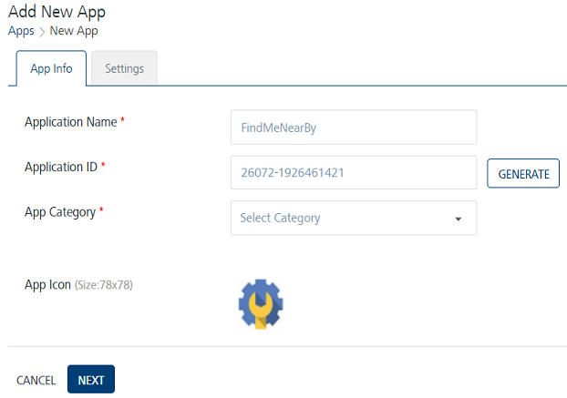
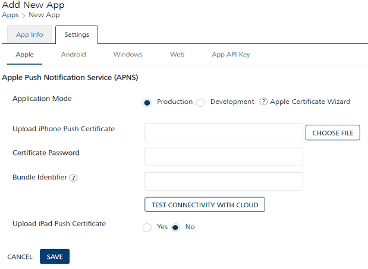
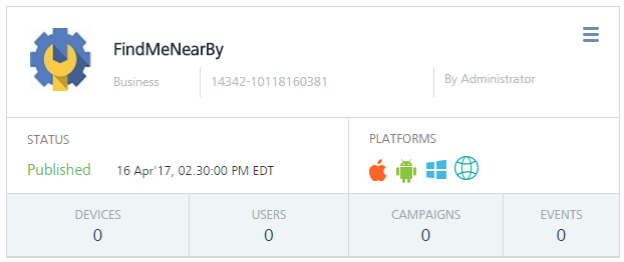
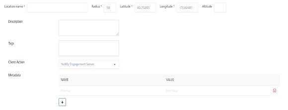
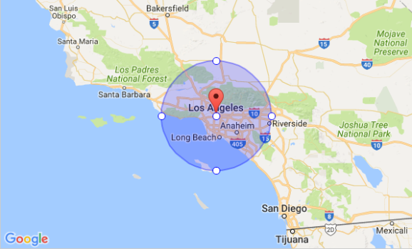
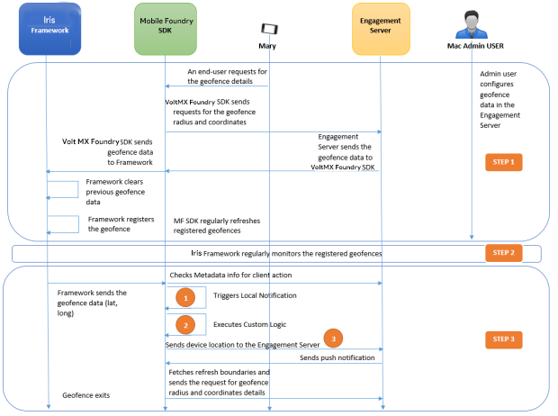

                           

Use Case Scenario: Four
=======================

McDonalds wants to show all the branches in a city so that a user can search the nearest location to dine with friends or give a party bash. McDonalds also wants to issue a coupon when the user is in the vicinity of one mile.

Solution
--------

You need to load the Engagement server with geolocations of the McDonalds branches and invoke the following APIs:

*   API that returns the ordered list of geo-boundaries based on the distance.
*   API that returns the location of a device when the device enters in to the specific geo-boundary area.
    
    For more information, refer to [Find Nearest Location]({{ site.baseurl }}/docs/documentation/Foundry/engagement_api_guide/Content/REST_API_Geo_Location/Find_Nearest_Location.html) API and [Update Geolocation of a Device]({{ site.baseurl }}/docs/documentation/Foundry/engagement_api_guide/Content/REST_API_Geo_Location/Update_Geolocation_of_Device_to_VoltMX_Foundry_Messaging.html) API
    

Description
-----------

Lisa serves as a customer service manager for **McDonalds** in Los Angeles, CA. Lisa wants that users can search the nearest **McDonalds** locations in a radius of one mile in Los Angeles city. Lisa also wants to attract the visitors by offering special free food coupons when users search for the nearest Mcdonald’s locations.

Prerequisites
-------------

The following prerequisites should be fulfilled before a user searches for a location in neighbourhood:

*   [Adding Applications in the Engagement Server](#adding-applications-in-the-engagement-server)
*   [Adding Subscribers (Devices and Users) in the Engagement Server](#adding-subscribers-devices-and-users-in-the-engagement-server)
*   [Mapping Users to the Subscribers' list](#mapping-users-to-the-subscribers-39-list)
*   [Adding Geolocations in the Engagement Server](#adding-geolocations-in-the-engagement-server)
*   [Fetching nearest McDonalds Locations and Getting Coupon Notifications](#fetching-nearest-mcdonalds-locations-and-getting-coupon-notifications)

### Adding Applications in the Engagement Server

Lisa needs an app that quickly sends push notifications when a user finds out the nearby locations, such as **McDonalds** restaurants. The app should be developed cross platforms so the search can be done from all the devices (Android, Windows, and iOS). In this section, Lisa learns how to create an app in the Engagement server. There are two basic steps to create an app.

*   [App Info](#app-info)
*   [Settings](#settings)

#### App Info

Lisa enters a name for the app such as, **FindMeNearBy** and selects the app category from the drop-down list. Lisa clicks **Generate** to auto generate the **Application** **ID**.

#### Settings

Under the **Settings** section, Lisa needs to choose Apple, Android, or Windows platform to save and publish the **FindMeNearBy** app successfully.

After entering the required platform details, Lisa saves the app. The default status of a newly added app in the **Engagement** server is unpublished. Lisa needs to publish the app as only published apps can be used for sending messages to customers.

For more details about how to add a new app, refer to [Adding Apps]({{ site.baseurl }}/docs/documentation/Foundry/vms_console_user_guide/Content/Apps/Adding_an_Application.html)

### Adding Subscribers (Devices and Users) in the Engagement Server

Lisa needs to subscribe user devices with the **FindMeNearBy** app to search required geolocations. For more details about how to add new subscribers refer [Adding new Subscribers]({{ site.baseurl }}/docs/documentation/Foundry/engagement_api_guide/Content/REST_API_Subscribers/Create_New_Subscriber.html).

### Mapping Users to the Subscribers' list

Lisa needs to map the users of her app to the Subscribers' list. She can do this in two ways:

*   From the Engagement console, go to **Subscribers** > **Users** tab in the console and manually add the users.
*   From the Engagement console, go to **API help** > **Users** > **Create User**, call this API using integration service to create a user. For more details about the Create User API, refer to [Create Users]({{ site.baseurl }}/docs/documentation/Foundry/engagement_api_guide/Content/REST_API_Audience_Member/Create_AudienceMemebrs.html).

### Adding Geolocations in the Engagement Server

In this section, Lisa learns how to create geolocations. Lisa visits the **Location** page and clicks **Add New** to open the **Add Location** page. The **Add Location** procedure includes the following steps:

Lisa needs to enter the following information on the **Add Location** page:

*   **Location Name**: Lisa needs to enter the location name in the **Location Name** field such as **McDonalds**.
*   **Radius**: Lisa wants that customers in the periphery of one mile should be able to search the **McDonald** restaurants. So, Lisa enter the radius as one mile.
*   **Latitude**: Lisa enter the latitude details such as 34.052235.
*   **Longitude**: Lisa enters the longitude details such as -118.243683.
    
    
    
    The **McDonalds** geofence area appears on the **Google** map. You can also use the search option to locate the geofence.
    
    
    
*   **Description**: Lisa enters the description for the geofence, such as McDonalds, Los Angeles CA.
*   **Tags**: Lisa needs to enter tag values for a geofence. Lisa can enter multiple tags for a geofence. The data is optional. A user can query a list of geofences based on the tags list.
    
    Let us assume that a user wants to visit **McDonalds** to dine tonight with friends. Lisa can add required tags, such as Big Mac, McCafé Coffee, Sausage McMuffin, and Sausage McMuffin with Egg.
    
    
    
*   **Client Action**: The **Client Action** is a drop-down list with three options.
    
    *   [Notify Engagement Server](#notify-engagement-server)
    *   [Local Client Notification](#local-client-notification)
    *   [Custom Business Logic](#custom-business-logic)
    
    #### Notify Engagement Server
    
    Let us understand, if Lisa selects the option as **Notify Engagement Server**. Initially the app launched on a user device communicates the geographic co-ordinates of a geofence to the **Engagement** server. The **Engagement** server pushes any notifications associated with the geofence. If no notification is received, the communication from the app is ignored.
    
    #### Local Client Notification
    
    Let us understand, if Lisa selects the option as **Local Client Notification**. The system displays the text message box to enter the notification message. The message is displayed when the device enters into the specific geofence for which the notification is configured.
    
    For example, Lisa wants to send free food coupon notifications to users when they enters the McDonalds geofence area. When a user enters the McDonalds geofence area, the app displays the free food coupon message.
    
    
    
    #### Custom Business Logic
    
    Let us understand, if Lisa selects the option as **Custom Business Logic**. The system displays the JavaScript editor to enter the JavaScript code. For example, Lisa can add the Java script code to return the geolocation of a user's position.
    
    For more details about how to define a geofence refer, [Adding Geofences]({{ site.baseurl }}/docs/documentation/Foundry/vms_console_user_guide/Content/Geolocation/Ge_Adding.html)
    

### Fetching nearest McDonalds Locations and Getting Coupon Notifications

Mary is an avid McDonald visitor and uses the **FindMeNearBy** app to search for the nearest **McDonald** location to dine with friends tonight. Let us understand how Mary finds the nearest McDonald restaurant and receives free food coupon notification.

1.  The **McDonald Admin User** creates the McDonald geofence in the Engagement server.
2.  Mary enters the key word such as **McDonald** in the search field of **FindMeNearby** app to search for the nearest McDonald location.
3.  Volt MX Foundry SDK requests for the geofence data by passing the radius and tags to the Engagement server.
4.  The Engagement server maintains a list of all the geographic coordinates for the registered geofences. The Engagement server will return locations that are matching with the existing geofences. Generally the Engagement server returns 19+1 geofences. Here one geofence pertains to refresh boundaries.
5.  The Engagement server returns a set of configured geofences to Volt MX Foundry SDK.
6.  Volt MX Foundry SDK sends the geofence data to the Iris framework.
7.  The Iris framework clears the previous geofence data and registers the new geofence.
8.  The Iris framework then regularly monitors the geofences.
9.  The Iris framework notifies the Volt MX Foundry SDK when the device enters the McDonald geofence and sends the geofence information to the Volt MX Foundry SDK.
10.  The Volt MX Foundry SDK checks for the following actions:
    
    *   **Notify Engagement server** - The Volt MX Foundry SDK sends the device location to the Engagement server. The Engagement server sends a push notification to Volt MX Foundry SDK. The **FindmeNearby** app receives the push notification about the nearest McDonald location.
    *   **Trigger local notification** - Based on the received geofence data (radius, latitude ,and longitude) Volt MX Foundry SDK sends the free food coupon to the user.
    *   Execute custom logic
    
    Thus Mary receives the nearest McDonald location on her device to dine with friends tonight with a free food coupon.
