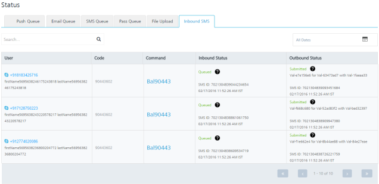
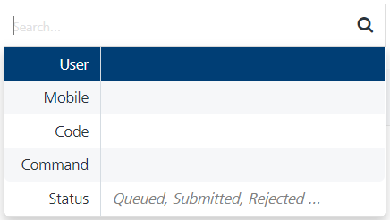
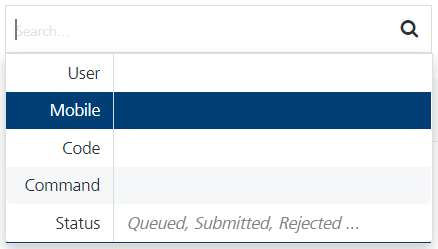
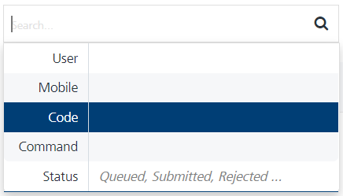
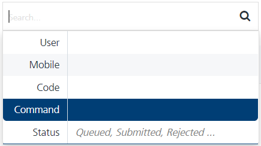
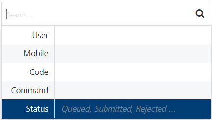
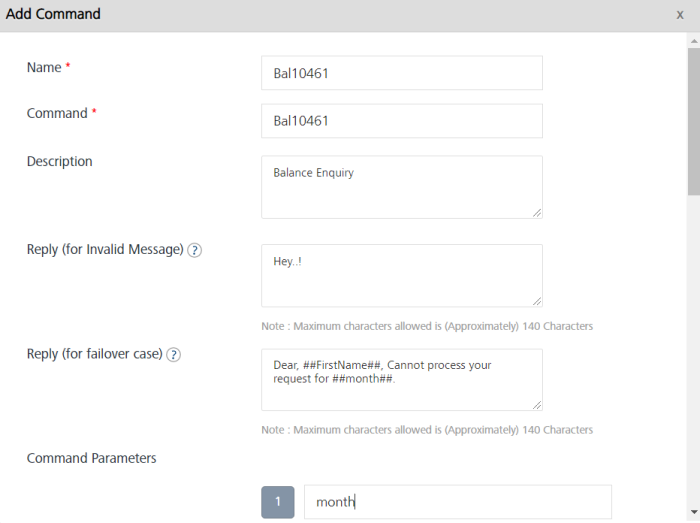

                            

Inbound SMS
===========

The **Inbound SMS** services enables you to view inbound SMS details sent through the subscribers to the **Engagement** server.

The **Inbound SMS** page displays the following details:

*   **All Dates** calendar: To use **All Dates**, see [All Dates](../Dashboard/Dashboard.html#All_Dates).
*   **Search** field: Click in the **Search** field to view options to search an inbound SMS. You can search inbound SMS based on the following criteria:
    *   **User**: Enter the user name in the **Search** field and click **Enter**.
        
        
        
        The inbound SMS details appears in the list-view.
        
        
        
    *   **Mobile**: Enter the mobile number in the **Search** field and click **Enter**.
        
        
        
        The inbound SMS details appears in the list-view.
        
        
        
    *   **Code**: Enter code in the **Search** field and click **Enter**.
        
        
        
        The inbound SMS details appears in the list-view.
        
        
        
    *   **Command**: Enter the command in the search field and click **Enter**.
        
        
        
        The inbound SMS details appears in the list-view.
        
        
        
    *   **Inbound Status**: Enter the inbound status in the **Search** field as queued, submitted or rejected and click **Enter**.
        
        
        
        The inbound SMS details appears in the list-view.
        
        
        
        > **_Note:_** To clear your search result, click in the **Search** field to view the **Inbound SMS** page.
        

The **Inbound SMS** list view includes the following details:

  
| Inbound SMS Elements | Description |
| --- | --- |
| User | The user column displays the user details who has sent the inbound SMS to Volt MX Foundry Engagement Services |
| Code | The code column displays the code assigned to the inbound SMS. |
| Command | Displays the command name associated with the inbound message. To know more about commands, see [Command](#Command) |
| Inbound Status | The inbound status column displays the current inbound status of the message such as queued. |
| Outbound Status | The outbound status column displays the outbound status for the SMS. |
| Display Controls | By default, only 20 messages are displayed in the grid. You can view more screens by navigating through the **Forward** arrow icon. You can move back through the **Backward** arrow icon. |

*   **Command**: Click the required link under the Command column to view command details:
    
    The **View Command** window appears. For more details, see [Adding a Command](../Administration/SMS_Configuration.html#adding-a-command).
    
    
