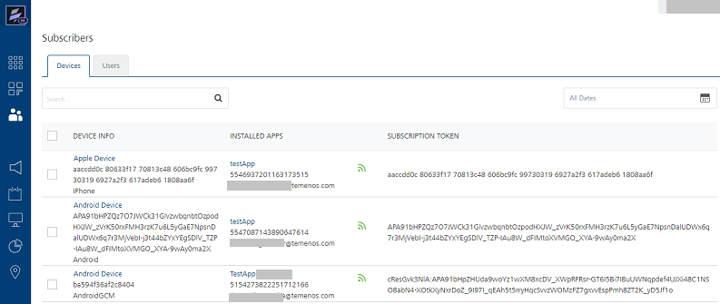
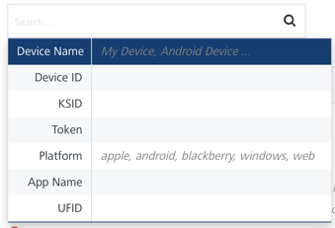
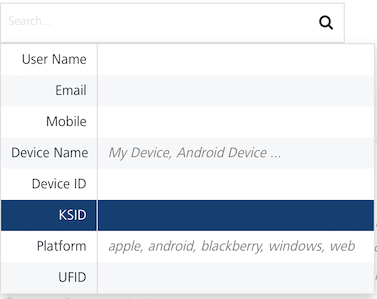
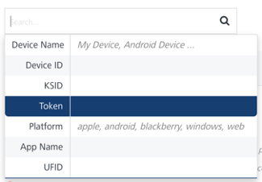
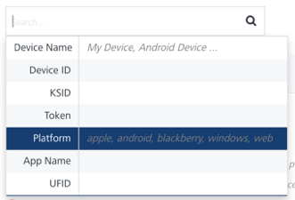
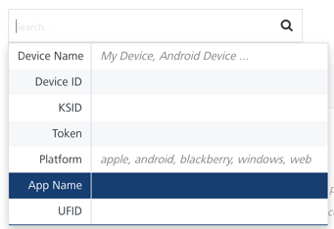
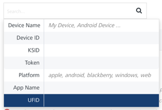

                            

Devices
=======

A device subscription relates in the scope of a specific application. An application can have several device subscriptions. The device subscription is created when the application on a device registers with **Engagement** Services.

> **_Important:_** As a user, you must have the following permissions to perform different tasks based on the role.  
-ROLE\_ DEVICES\_ALL

> **_Important:_**  
The green subscriber icon indicates that a device is active to that application, and can receive push notifications.  
The gray subscriber icon indicates that a device is inactive to that application, and cannot receive push notifications.  
The red error icon indicates that the provider status is inactive and cannot receive push notifications.

The **Devices** page displays the following details:

*   **Search**: Click in the **Search** field to view the available options to search a device. You can search devices based on the following search criteria:
    *   **Device Name**: Enter the name of the desired device in the Search field and click **Enter**.

        
        

        
        The required device appears in the list view.

        
        > **_Note:_** A text string such as **Android Device, Windows Device**, **Web Device** or **Apple Device** is displayed in the **Device Name** column when the device name is not set for all the platforms respectively.

        
        

        
    *   **Device ID**: Enter the device ID of the required device in the Search field and click **Enter**.

        
        

        
        The required device appears in the list view.

        
        

        
    *   **KSID**: Enter the Volt MX Subscription Identification Serial Number (KSID) in the Search field and click **Enter**.
     
        
        

        
        The required device appears in the list view.

        
        

        
    *   **Token**: Enter the device **Token** in the search field and click **Enter**.
     
        
        

        
        The required device appears in the list view.

        
        

        
    *   **Platform**: Enter the platform name in the Search field and click **Enter**.
     
        
        

        
        The required device appears in the list view.

        
        

        
    *   **Application**: Enter the application name in the **Search** field and click **Enter**.

        
        

        
        The required device appears in the list view.

        
        

        
    *   **UFID**: Enter the **User Friendly Identifier** (UFID) in the Search field and click **Enter**.

        
        

        
        The required device appears in the list view.

        
        

        
        > **_Note:_** To clear your search result, click in the **Search** field to view the **Devices** home page.

        
    *   **Searching without Labelling with Multiple Parameters**: Enter the required parameters with a space in the search field. Based on entered parameters, the system displays the search result in the list view.

*   **All Dates:** To know more about the **All Dates** option, see [All Dates](../Dashboard/Dashboard.html#All_Dates)
*   **Devices List View**: The **Devices** list view displays the following details:

    
| User Element | Description |
| --- | --- |
| Device Info | Device Name: Displays the device name, such as John Doe’s Phone. The system displays a text such as Android Device or Apple Device in the Device Name column when the device name is not set for the Android and Apple devices respectively   DeviceID: Displays the device IDs of registered devices. When an application registers for push notifications, the device ID of the mobile device is registered in the Push Notification Service (PNS). When PNS wants to send a push message, the cloud uses the device ID to locate the device on which the client application is installed, and then sends a push notification  Platform: Displays a list of targeted platforms configured for each of the added devices |
| Installed Apps | Application Name: Displays the application names the device is subscribed  KSID: Displays Volt MX Subscription Identification serial number. The KSID communicates with Engagement server. The Engagement server generates the KSID based on provided details when you send a request for a subscription. The details include application ID, device ID, and SID |
| Subscription Token | Displays subscription tokens from the cloud. |
| Inactivate Button | Helps you inactivate subscriptions from the list. |
| Delete Button | Helps you delete subscriptions from the list. |
| Display Controls | By default, the number range is set to 20, so that only 20 devices are displayed in the list view. You can view more devices through the forward arrow icon. You can navigate back through the backward arrow icon. |
    

You can perform the following tasks from the **Devices** page:

*   [Viewing a Device](Vewing_a_Device.html)
*   [Activating or Inactivating a Subscription from a Device](Activating_or_Inactivating_a_Device.html)
*   [Deleting a Subscription](Deleting_a_Device.html)
