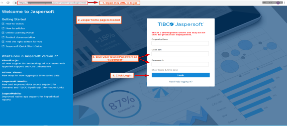
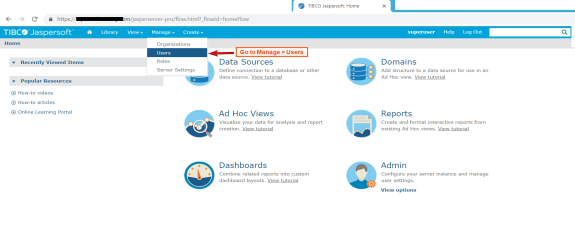
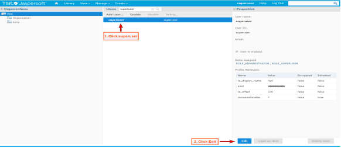
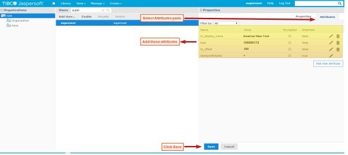

                          

You are here: How to Set Up the JasperReports Server

How to Set Up the JasperReports Server
--------------------------------------

After JasperReports Server is installed, attributes such as timezone, location, and account information must be configured for the logged-in user. The Jasper reports internally use the attributes to give accurate results for account and location.

> **_Important:_**  Ensure that you have the required hardware and access to the supporting software as provided in the [Prerequisites](Prerequisites.html) section.

To set up the JasperReports Server, follow these steps:

1.  Once the JasperReports Server is installed, the **Install Complete** window appears with the confirmation message. Select the **Launch** check box to launch the JasperReports Server.
    
    The **Welcome to Jaspersoft** page appears.
    
    > **_Note:_**  To remember the URL of this portal, shown in the image below, bookmark the URL by adding it to your favorites.
    
    
    
2.  Provide your default log-in credentials (username as `superuser` and password as `superuser`), and then click **Login**.
    
    The **Getting Started** page appears.
    
3.  On the **Manage** menu, click **Users**.
    
    
    
    > **_Note:_**  You need to edit  `superuser` attributes only if reports are going to be run outside of the Volt MX Foundry Console's context for users of Foundry 6.5 and above.  
      
    For most users of Foundry 6.5 and above, reports can be directly accessed from Volt MX Foundry Console after following the setup steps as mentioned in the [Post-Installation Tasks](Post-Installation_Tasks.html)  and [How to Configure Volt MX Foundry in the JasperReports Server](How_to_Configure_Foundry.html) sections to finish the post-installation tasks and configuring Volt MX Foundry Console to communicate with JasperReports Server.
    
4.  From the **Users** list, click **superuser**, and then click **Edit** to continue.
    
    
    
5.  In the **Attributes** tab, click the **Add** button to add a row for the attribute.
6.  Add the following details:
    
      
    
    | Attribute Name | Attribut Value |
    | --- | --- |
    | **kaid** - Volt MX Account ID. This value needs to match the Account Id generated by Volt MX Foundry Installer.The value of  `Account ID`  field generated for Volt MX Foundry Server can be viewed from the **Settings** page in Appservices. The Settings URL format is as follows:http://<mfconsoleIP:Port>/admin/console/config/configuration.html | Example: `100000002`> **_Note:_**  For Foundry 6.5, the default **kaid** value is always `100000002`. |
    | **tz\_display\_name** - The timezone display name attribute appears on all reports as a footer indicating the timezone in which a report was generated. It is generally set to the Country/City | `Example: America/New_York` |
    | **tz\_offset** - The timezone offset attribute indicates the offset in minutes from UTC time. Date calculations are adjusted according to this attribute while running reports to ensure that time is based on a user's timezone. The offset contains sign (+ or -) with minutes to indicate if it is behind or ahead of UTC. For example: UTC - 5:00 for New York City would be set as -300 minutes varies for Japan which is at UTC + 9:00 would be set as 540 minutes. | Example: `-300` |
    
7.  Click **Save** to save the new attributes.
    
    > **_Note:_** To change the default password of a user, you can change the password from the edit section of the user as well (optional).
    
8.  Re-login to JasperReports portal with the user to test the reports.
9.  To modify attributes of a user, repeat [Step 1](#Step1) through [Step 7](#Step7) in this procedure. After modifying attributes, re-login to JasperReports portal.
