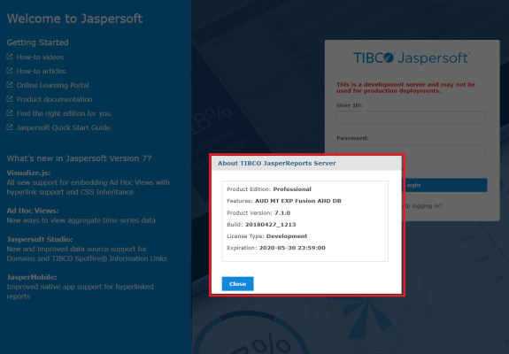

                         

You are here: How to Upgrade the JasperReports Server

How to Upgrade Jasper Reports Server
------------------------------------

This section explains how to upgrade Jasper Reports Server from `V 6.0` to `V 6.2`   or   `V 6.2` to `V 7.1`   or  `V 6.0` to `V 7.1`.

> **_Important:_** To get access to the reports created with latest features, Volt MX recommends to upgrade Jasper Enterprise edition 6.2 or 7.1 with V8 or latest.

To Upgrade JasperReports Server, follow these steps:

1.  Back up your JRS War file, as follows:
    
    1.  Create a folder where you can save your `jasperserver-pro.war` file. For example, `C:\JS_BACKUP`  or  `/opt/JS_BACKUP`.
    
    1.  Copy the `<tomcat>/webapps/jasperserver-pro` to `<path>/JS_BACKUP`.
2.  Back up your JasperServer Database.
    
    1.  Create a folder where you can save your JasperServer database. For example, `C:\JS_BACKUP` or `/opt/JS_BACKUP`.
    2.  Run the following commands for PostgreSQL.
    
    1.  cd <path>/JS_BACKUP
        
    2.  <jrs-server-home>/postgresql/bin/pg_dump.exe --host=<host> --port=<port> --username=<username> jasperserver  >  js-db-7.1-dump.sql
        
3.  Export the current Repository Data, as follows:
    
    *   Command for Windows
    
    1.  cd <js-install-7.1>/buildomatic
        
    2.  js-export.bat --everything --output-zip js-export-7.1.zip
        
    
    *   Command for Linux.
        1.  cd <js-install-7.1>/buildomatic
            
        2.  js-export.sh --everything --output-zip js-export-7.1.zip
            
            
4.  Download the JRS 7.1 WAR file from [http://support.jaspersoft.com](http://support.jaspersoft.com/).
    
5.  Extract all files from the `jasperreports-server-7.1-bin.zip` to a the local system - for example, `<js-install-7.1>(C:\Jaspersoft on Windows, /home/<user> on Linux)`
    
    > **_Important:_** If the system displays the error `` `The filename or extension is too long` ``, change the parent folder name to a smaller one.
    
6.  Configure the buildomatic for your Database and Application Server, as follows:
    
    1.  Copy the `postgresql_master.properties` configuration file located in `<js-install-7.1>/buildomatic/sample_conf/postgresql_master.properties`
    2.  Paste the `postgresql_master.properties` file to `<js-install-7.1>/buildomatic`.
    3.  Rename the `postgresql_master.properties`  to  `default_master.properties`.
        
        For example,
        
        From `<js-install-7.1>/buildomatic/postgresql_master.properties`
        
        to `<js-install-7.1>/buildomatic/``default_master.properties`.
        
    4.  Edit the `default_master.properties` with your database and application server details.
        *   appServerDir=<your Tomcat Server location where you have deployed JasperServer>
        *   dbUsername=postgres
        *   dbPassword=postgres
        *   dbHost=localhost
        *   dbPort=<port of the database server/postgresql>
7.  Upgrade to JasperReports Server 7.1
    
    1.  Stop your application server (Tomcat Server)
    2.  Start your database server (Postgres Server)
    3.  Run the following command:
        *   Command to run in Windows
            
            cd <js-install-7.1>/buildomatic  
              
            js-upgrade-newdb.bat <path>\js-export-7.1.zip  
            
            
        *   Command to run in Linux
            
            $ cd <js-install-7.1>/buildomatic  
              
            $ ./js-upgrade-newdb.sh <path>/js-export-7.1.zip  
            
            
            
            Output Log Location: The output logs are available at <js-install-7.1>/buildomatic/logs/js-upgrade-<date>-<number>.log
            
8.  Start and Log into JasperReports Server 7.1.
    
    1.  Start your application server(Tomcat server).
    2.  Clear your browsing cache.
    3.  Log in to the JasperReports Server. You can view the JasperServer version upgraded to V7.1.
        
        To check the upgraded version of the Jasper Reports Server, click the link specified in the footer immediately after the upgrade. The **About TIBCO JasperReports Server** dialog appears with upgraded details, shown below:
        
        
        
9.  Perform the Post-Installation tasks as specified in the [Post-Installation Tasks.](Post-Installation_Tasks.html)
    
10.  Clear the application server's **Work** and **Temp** folder.
    
    1.  Go to `<tomcat>/work` folder and delete all the files and folders in that directory.
    2.  Go to `<tomcat>/temp` folder and delete all the files and folders in that directory.
11.  Clear the **Repository Cache Database** table.
    
    1.  Run the following commands in the JasperServer's PostgreSQL DB with `postgres` user.
        1.  update JIRepositoryCache set item_reference = null;
            
        2.  delete from JIRepositoryCache;
            
    
    Now your JasperServer is upgraded to V 7.1, and all the analytics information from the previous version is available in the upgraded version.
