                          

Configuring Device Pools
========================

A device pool contains the configuration and specification about the devices that are used to run tests on your app source code. Based on your device pool, at run time, AWS Device Farm selects a set of devices from a list of available devices in a region or location. You can create, update, and delete device pools for your App Factory projects. You can also create multiple device pools for your App Factory projects.

From V9 ServicePack 1, you can use device filters to define the type of devices that you want to include in the device pool. You can also the set the maximum number of devices in your pool. A filter consists of an attribute, an operator, and an operand (which can contain one or more values). These attributes are based on device specifications such as OS Version, Platform, and Manufacturer. For example: you can create a filter for Android devices that run on OS versions between 8.0 and 10.

### Why use device filters?

Creating a pool by using device filters gives users an advantage over selecting specific devices, as these dynamic pools can adapt when new devices become available. During an App Factory run, the device pool is passed to AWS Device Farm, which selects the best possible set of devices that match the specifications of the pool. This results in faster allocation of devices and reduced number of timeouts that are caused due to indefinite waiting for devices.

### Components of a filter

*   **Attribute**: Specifies the aspect of a device (such as the platform, model, or OS version) that is used as the selection criteria in a device filter.
*   **Operator**: Specifies how the attribute must be compared with the operand.
*   **Operand**: Specifies a set of one or more values that corresponds to the **Attribute** that is used in the filter.

For more information about filters, you can refer to the following table.

<table style="mc-table-style: url('Resources/TableStyles/Basic.css');width: 75%;" class="TableStyle-Basic" cellspacing="0"><colgroup><col class="TableStyle-Basic-Column-Column1" style="width: 25%;"> <col class="TableStyle-Basic-Column-Column1" style="width: 25%;"> <col class="TableStyle-Basic-Column-Column1" style="width: 25%;"></colgroup><tbody><tr class="TableStyle-Basic-Body-Body1"><th class="TableStyle-Basic-BodyE-Column1-Body1">Attributes</th><th class="TableStyle-Basic-BodyE-Column1-Body1">Operators</th><th class="TableStyle-Basic-BodyD-Column1-Body1">Operands</th></tr><tr class="TableStyle-Basic-Body-Body1"><td class="TableStyle-Basic-BodyE-Column1-Body1">AVAILABILITY: Specifies whether the device is currently available.</td><td class="TableStyle-Basic-BodyE-Column1-Body1">EQUALS</td><td class="TableStyle-Basic-BodyD-Column1-Body1">AVAILABLE; HIGHLY_AVAILABLE</td></tr><tr class="TableStyle-Basic-Body-Body1"><td class="TableStyle-Basic-BodyE-Column1-Body1">MANUFACTURER: Specifies the manufacturer of the device.</td><td class="TableStyle-Basic-BodyE-Column1-Body1">EQUALS; IN; NOT IN</td><td class="TableStyle-Basic-BodyD-Column1-Body1">Apple; Samsung; etc For the IN and NOT&nbsp;IN operators, you can provide multiple values by separating them with a comma (<b>,</b>) <b><i>Note: </i></b>Results are provided only for valid manufacturer names.</td></tr><tr class="TableStyle-Basic-Body-Body1"><td class="TableStyle-Basic-BodyE-Column1-Body1">MODEL:&nbsp;Specifies the model of the device.</td><td class="TableStyle-Basic-BodyE-Column1-Body1">CONTAINS; EQUALS; IN; NOT IN</td><td class="TableStyle-Basic-BodyD-Column1-Body1">Apple iPhone 11; Google Pixel 2; etc For the IN and NOT&nbsp;IN operators, you can provide multiple values by separating them with a comma (<b>,</b>) <b><i>Note: </i></b>For operators such as EQUALS and IN, results are provided only for valid model names.</td></tr><tr class="TableStyle-Basic-Body-Body1"><td class="TableStyle-Basic-BodyB-Column1-Body1">OS&nbsp;VERSION: Specifies the version of the operating system of the device.</td><td class="TableStyle-Basic-BodyB-Column1-Body1">EQUALS; IN; NOT IN; GREATER THAN; GREATER THAN OR EQUALS; LESS THAN; LESS THAN OR EQUALS</td><td class="TableStyle-Basic-BodyA-Column1-Body1">10.3.2; 9; 7.1; etc For the IN and NOT&nbsp;IN operators, you can provide multiple values by separating them with a comma (<b>,</b>)</td></tr></tbody></table>

For more information about creating and managing device pools, refer to the following sections.

*   [Creating a Device Pool](#creating-a-device-pool)
*   [Updating a Device Pool](#updating-a-device-pool)
*   [Removing a Device Pool](#removing-a-device-pool)

Creating a Device Pool
----------------------

1.  From your project folder, navigate to the **Tests** folder.
2.  In the **Tests** folder, verify that you see the jobs that are displayed in the following screenshot.  
    [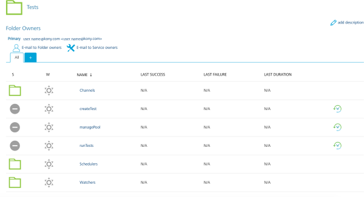](Resources/Images/TestsFolder.png)
3.  For the **managePool** job, click the **Build with Parameters** icon.  
    [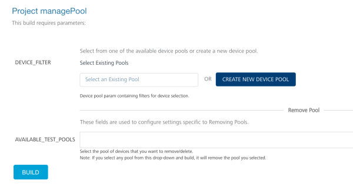](Resources/Images/DEVICE_FILTER.png)
4.  For the DEVICE\_FILTER parameter, click **CREATE NEW DEVICE POOL**. App Factory displays additional fields that you need to configure for the DEVICE\_FILTER parameter.  
    Alternatively, you can select an existing device pool to [edit and update](#updating-a-device-pool) its configuration.  
    
    > **_Note:_** If you are using version V9 or earlier, you need to use the POOL\_NAME and DEVICE\_LIST parameters to create a device pool. For more information, refer to [Creating Device Pools (V9 or earlier)](#reference-creating-device-pools-v9-or-earlier).
    
5.  Under **Create Device Pool**, type a **Name** for the device pool.  
    [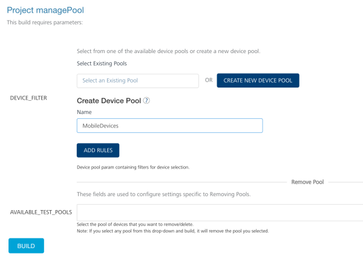](Resources/Images/Enter_Name.png)
6.  Click **ADD RULE**. The **Create New Rule** window opens.  
    [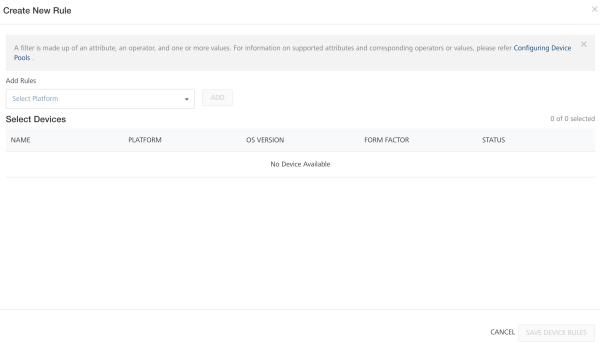](Resources/Images/Create_New_Rule.png)  
    
    1.  On the **Create New Rule** window, select a platform from the drop-down list. For example: **Android - Mobile**
    2.  After you select a platform, click **ADD**. App Factory displays additional fields for the rule.
    3.  Configure the fields based on your preference. You can add multiple filters by adding more fields for the platform.  
        [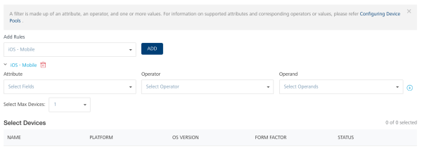](Resources/Images/Add_Platform__3_.png)
    4.  After you configure the fields, click the plus icon on the right side of the row. A new row is created that you can use to specify more filters.  
        The list of devices updates every time you add a new filter.  
        
        <table style="width: 80%;border-left-style: none;border-left-width: 1.5pt;border-left-color: ;border-right-style: none;border-right-width: 1.5pt;border-right-color: ;border-top-style: none;border-top-width: 1.5pt;border-top-color: ;border-bottom-style: none;border-bottom-width: 1.5pt;border-bottom-color: ;"><colgroup><col style="width: 40%;"></colgroup><tbody><tr><td style="padding-left: 5px;padding-right: 5px;padding-top: 5px;padding-bottom: 5px;border-left-style: none;border-left-width: 1px;border-left-color: #fff;border-right-style: none;border-right-width: 1px;border-right-color: #fff;border-top-style: none;border-top-width: 1px;border-top-color: #fff;border-bottom-style: none;border-bottom-width: 1px;border-bottom-color: #bbb;" colspan="2"> </td><td>zzEmptyCellzz</td></tr><tr><td style="padding-left: 5px;padding-right: 5px;padding-top: 5px;padding-bottom: 5px;border-left-style: none;border-left-width: 1px;border-left-color: #fff;border-right-style: none;border-right-width: 1px;border-right-color: #fff;border-top-style: none;border-top-width: 1px;border-top-color: #fff;border-bottom-style: none;border-bottom-width: 1px;border-bottom-color: #bbb;" colspan="2"> </td><td>zzEmptyCellzz</td></tr></tbody></table>
        
        > **_Note:_** You can also set the maximum number of devices on which you want to run your tests. App Factory uses a public pool, therefore, a limit of 5 devices exists for every platform that can be selected for your rules.
        
    5.  After you add filters for the required platforms, from the lower-right corner of the **Create New Rule** window, click **SAVE DEVICE RULES**.
    
    The landing page displays the name of the pool and an edit option. The page also displays a table that contains the cumulative result of the devices that match your rules.
    
    
    
7.  After configuring the name and the rules, click **BUILD**.

When the device pool **BUILD** is complete, the **managePool** job passes successfully. After the job passes, you can verify the build status as shown in the following screenshot (Build #1 is green and marked as successful). A new device pool is created, which you can use to run tests within the build pipeline or separately.

[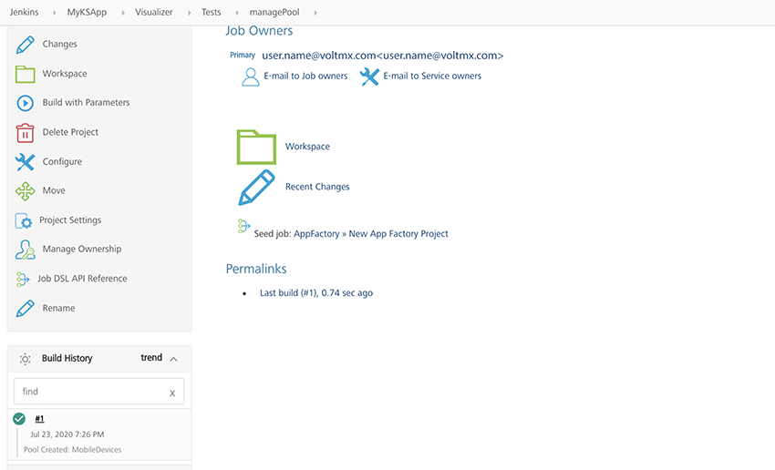](Resources/Images/Pool_Created_Build_Success.png)

Updating a Device Pool
----------------------

1.  From your project folder, navigate to the **Tests** folder.
2.  For the **managePool** job, click the **Build with Parameters** icon.  
    [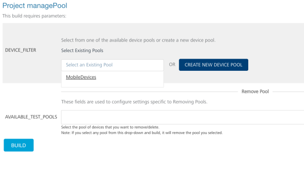](Resources/Images/Select_Existing_Pool.png)
3.  For DEVICE\_FILTER parameter, from the **Select Existing Pool** list, select a device pool.  
    The console displays the name of pool and an edit icon. The console also displays the cumulative list of devices that match the rules that are defined in the pool.  
    
    > **_Note:_** Device pools that were created before **V9 ServicePack 1** do not contain rules or filters. Therefore, the console does not display any results.  
    However, you can upgrade the device pool by editing it and adding rules.
    
4.  For the selected pool, click the edit icon. The **Edit Rules** window appears.  
    
5.  The Edit Rules window displays the pre-existing filters and the max devices in the pool. Add platforms and filters based on your requirement.  
    [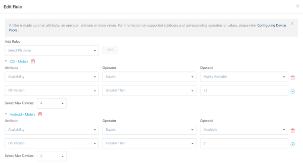](Resources/Images/Edit_Rules_Window.png)
    *   To add a new platform, select a platform from the drop-down list, and then click **ADD**.
    *   To add a filter for an existing platform, in the row of the filter that was last created, click the plus icon.
    
    <table style="width: 80%;border-left-style: none;border-left-width: 1.5pt;border-left-color: ;border-right-style: none;border-right-width: 1.5pt;border-right-color: ;border-top-style: none;border-top-width: 1.5pt;border-top-color: ;border-bottom-style: none;border-bottom-width: 1.5pt;border-bottom-color: ;"><colgroup><col><col></colgroup><tbody><tr><td style="border-left-style: none;border-left-width: 1px;border-right-style: none;border-right-width: 1px;border-top-style: none;border-top-width: 1px;border-bottom-style: none;border-bottom-width: 1px;padding-left: 5px;padding-right: 5px;padding-top: 5px;padding-bottom: 5px;"></td><td style="border-left-style: none;border-left-width: 1px;border-right-style: none;border-right-width: 1px;border-top-style: none;border-top-width: 1px;border-bottom-style: none;border-bottom-width: 1px;padding-left: 5px;padding-right: 5px;padding-top: 5px;padding-bottom: 5px;"></td></tr></tbody></table>
    
6.  After you add filters for the required platforms, from the lower-right corner of the **Edit Rules** window, click **SAVE DEVICE RULES**.
7.  After you edit the rules and filters, click **BUILD**.

When the device pool **BUILD** is complete, the **managePool** job build passes and you can see the status of the update operation in the build description.

[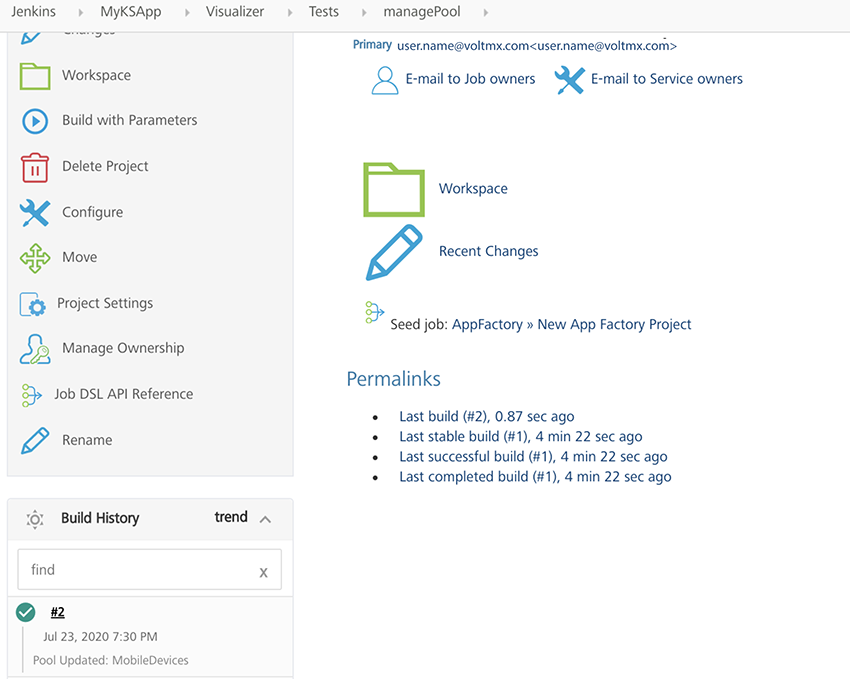](Resources/Images/Pool_Updated_Build_Success.png)

> **Note:**  
*   To update a device pool for projects that were created before V9 ServicePack 1, you need to [remove the device pool](#removing-a-device-pool) and [create a new device pool](#creating-a-device-pool) with the same name.  
*   If you upgrade your projects by recreating them in V9 ServicePack 1, the POOL\_NAME and DEVICE\_LIST parameters will not be available for device pools.  
    Any existing pools will still be available for use.  
*   If you upgrade the device pool, it is overwritten to have device filters and no longer contains a static set of devices.    
    [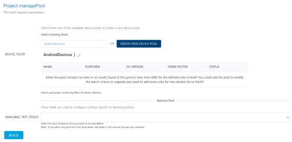](Resources/Images/Pool_Created_Before_V9SP1.png)  
    
Removing a Device Pool
----------------------

A device pool can be removed when it is outdated or obsolete. To remove a device pool, follow these steps:

1.  From your project folder, navigate to the **Tests** folder.
2.  For the **managePool** job, click the **Build with Parameters** icon.
3.  Under **Remove Pool**, from the AVAILABLE\_TEST\_POOLS list, select the device pool that you want to remove.
4.  After selecting a device pool, click **BUILD**.

After the build passes, verify that the build status is successful as shown in the following screenshot.

[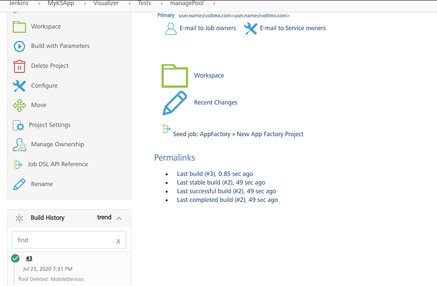](Resources/Images/Pool_Deleted_Build_Success.png)

Reference: Creating Device Pools (V9 or earlier)
------------------------------------------------

If you are using Volt MX and App Factory V9 (or earlier), you need to create a device pool by using the POOL\_NAME and DEVICE\_LIST parameters.

[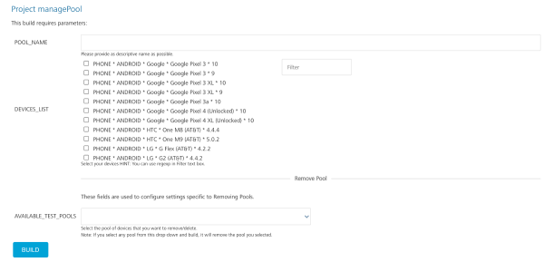](Resources/Images/ManagePool_Before_V9SP1.png)

<table style="mc-table-style: url('Resources/TableStyles/Basic.css');width: 80%;" class="TableStyle-Basic" cellspacing="0"><colgroup><col style="width: 15%;" class="TableStyle-Basic-Column-Column1"> <col style="width: 55%;" class="TableStyle-Basic-Column-Column1"></colgroup><tbody><tr class="TableStyle-Basic-Body-Body1"><th class="TableStyle-Basic-BodyE-Column1-Body1">Parameter</th><th class="TableStyle-Basic-BodyD-Column1-Body1">Description</th></tr><tr class="TableStyle-Basic-Body-Body1"><td class="TableStyle-Basic-BodyE-Column1-Body1" style="background-color: #ffffff;padding-left: 10px;padding-right: 20px;padding-top: 10px;padding-bottom: 10px;border-left-style: solid;border-left-width: 1px;border-left-color: #fff;border-right-style: solid;border-right-width: 1px;border-top-style: solid;border-top-width: 1px;border-top-color: #fff;border-bottom-style: solid;border-bottom-width: 1px;">POOL_NAME</td><td class="TableStyle-Basic-BodyD-Column1-Body1" style="background-color: #ffffff;padding-left: 10px;padding-right: 20px;padding-top: 10px;padding-bottom: 10px;border-left-style: solid;border-left-width: 1px;border-left-color: #fff;border-right-style: solid;border-right-width: 1px;border-top-style: solid;border-top-width: 1px;border-top-color: #fff;border-bottom-style: solid;border-bottom-width: 1px;">Specifies the name of the device pool. The name is used to identify and select the device pool while triggering a build job or a test job.</td></tr><tr class="TableStyle-Basic-Body-Body1"><td class="TableStyle-Basic-BodyB-Column1-Body1" style="background-color: #ffffff;padding-left: 10px;padding-right: 20px;padding-top: 10px;padding-bottom: 10px;border-left-style: solid;border-left-width: 1px;border-left-color: #fff;border-right-style: solid;border-right-width: 1px;border-top-style: solid;border-top-width: 1px;border-top-color: #fff;border-bottom-style: solid;border-bottom-width: 1px;">DEVICE_LIST</td><td class="TableStyle-Basic-BodyA-Column1-Body1" style="background-color: #ffffff;padding-left: 10px;padding-right: 20px;padding-top: 10px;padding-bottom: 10px;border-left-style: solid;border-left-width: 1px;border-left-color: #fff;border-right-style: solid;border-right-width: 1px;border-top-style: solid;border-top-width: 1px;border-top-color: #fff;border-bottom-style: solid;border-bottom-width: 1px;">Specifies a list of devices for different platforms, vendors, and models. The name of the device contains the following details: Device type, such as phone or tablet Platform, such as Android or iOS Vendor, such as Motorola or Apple Model, such as Nexus 6 or iPhone 8 OS version such as 8.0 </td></tr></tbody></table>
