                          

Auto-Triggered Jobs
-------------------

Currently, there are two types of auto-triggered jobs: **scm-triggered(Watchers)** and **cron-triggered(Schedulers)**.

Every project structure has a folder called **Triggers** in the **Iris** sub-folder. The **Triggers** folder contains a job for creation of auto-triggered jobs (createTrigger) and two sub-folders, where the created jobs are stored.

### Configuration for GitHub

Perform the following steps to configure triggers on Git server side.

1.  Open the repository at GitHub in a web browser.
2.  Navigate to the **Settings** tab of the current repository. The Settings tab is not visible if you do not have necessary permissions.

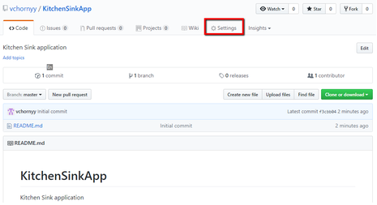

4.  In the Settings page, click the **Webhooks** page link on the left navigation panel. The **Webhooks** page opens.

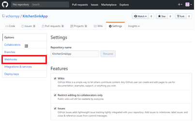

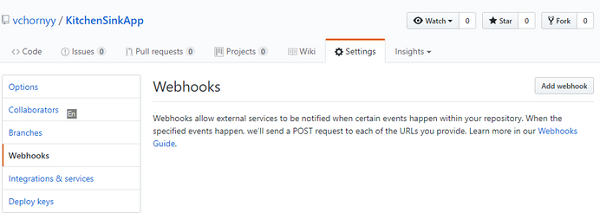

7.  Create a new Webhook by clicking **Add webhook** on the upper-right corner.

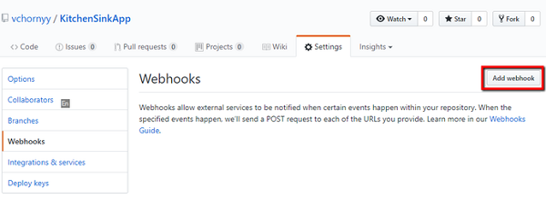

9.  Provide your login credentials and confirm your authorization.

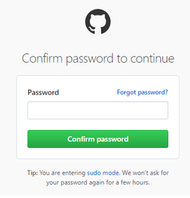

11.  After a successful login, the Webhooks configuration page opens. Add Webhook at App Factory console.

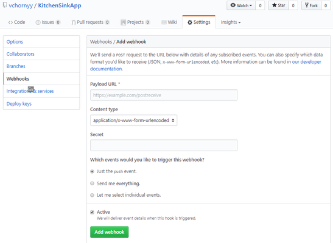

13.  Enter the following parameters in Webhook configuration page:
    *   Compose the Payload URL (mandatory field) based on the following template:
        
        `https://<Jenkins URL>/github-webhook/` (last forward slash is mandatory);  
        Where **<Jenkins URL>** is `<protocol>://<domain name>`, for example - `https://ci.voltmx.com`
        
        Jenkins URL format depends on git server type, here is list of examples for currently supported git servers:
        
        **Bitbucket Server (Stash)**: Payload URL is `https://<Jenkins URL>/github-webhook/`
        
        **AWS CodeCommit** - currently there is no available solution but checkout option.
        
        **Other**: Rest of the git server implementations use Jenknis plugin; Generic Webhook Trigger Plugin. In this case the Jenkins URL has the following format - `https://<Jenkins URL>/generic-webhook-trigger/invoke`
        
        Once the payload URL is entered, GitHub automatically checks the https connection and offers you to disable SSL verification. Ignore this message.
        
        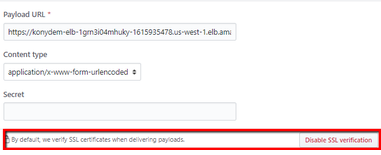
        
    *   Content type should be selected as `application/x-www-form-urlencoded`
    *   Jenkins verification does not require a **Secret**. Leave the field empty.
    *   Select the **Push** event option to trigger event by push to repository. Only push of code to specific branch triggers the **buildIris** job.
    *   Active should be marked by default.
    
    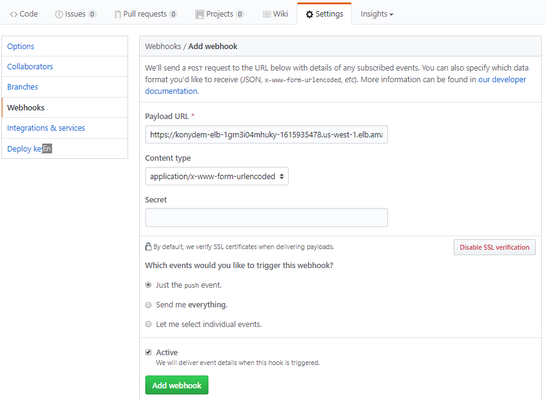
    
14.  After providing the necessary parameters, click **Add Webhook**.

16.  After a successful Webhook creation, the following screen appears. There is a message in-line with the Webhook that contains the Payload URL and the supported events (in brackets). For example, **https://voltmxdem-elb-1grn3i04mhuky-1615935478.us-west-1.elb.amazonaws.com/github-webhook/** and **(push)**.

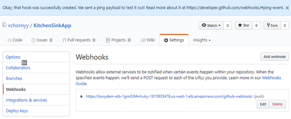

18.  To update or delete a Webhook, select the **Edit** or **Delete** respectively. For more details on how to configure Webhooks refer to [GitHub Webhook Documentation](https://developer.github.com/webhooks).

### Configuration for Bitbucket

To enable triggers in Stash/Bitbucket, install the Bitbucket add-on **Webhook to Jenkins for Bitbucket**.

*   Sign-in to your Bitbucket instance as an admin.
*   Click the **admin** drop-down, and then choose **Add-ons**. The **Manage add-ons** screen appears.
*   Click **Find new add-ons** from the left-hand side of the page
*   Locate Webhook to Jenkins for Bitbucket using the search option. The results include the app versions that are compatible with your Bitbucket instance.
*   Click **Install** to download and install your app.
*   You're all set! Click **Close** in the Installed.

For more information about add-ons, refer to https://marketplace.atlassian.com/plugins/com.nerdwin15.stash-stash-webhook-jenkins/server/overview

For configuring triggers on Bitbucket/Stash side perform the following steps:

1.  Open the BitBucket repository in a web browser, and then navigate to the **Settings** of the targeted repository. The **Settings** tab is available only if you have necessary permissions.

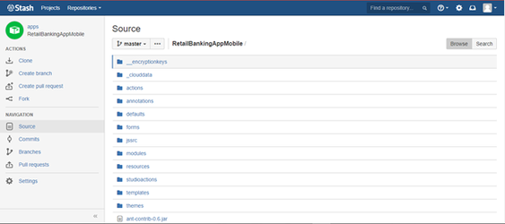

3.  On the **Settings** page, find the Hooks link in the settings panel.

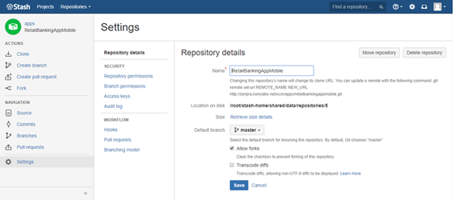

5.  Open the **Hooks** page. Click **Enable** for the Stash Webhook to Jenkins to open the Webhook configurations section.

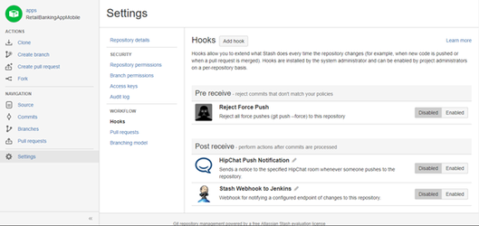

7.  Add the Jenkins URL and the Repo Clone URL.
    
    The Jenkins URL is Jenkins home page URL. The Repo Clone URL is URL used for cloning the repository. The Trigger Jenkins button can be used to check whether you can trigger the required watcher Jenkins job. If the trigger is successful, click **Enable** in the lower-right corner.
    

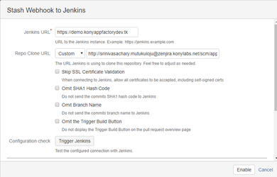

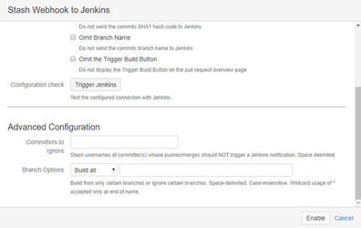

10.  For further edit or disable Webhook, we can refer to same section. To edit setting in Webhook, click on edit icon just after you Webhook.

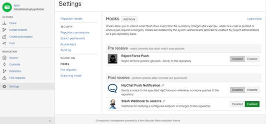

### Configuration for App Factory Console

To setup auto-triggered job, perform the following steps:

1.  Navigate to **Triggers** folder under root folder of the project.

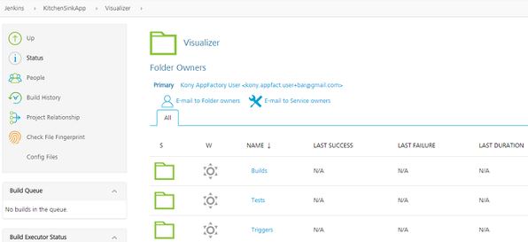

3.  Click on **createTrigger** job.

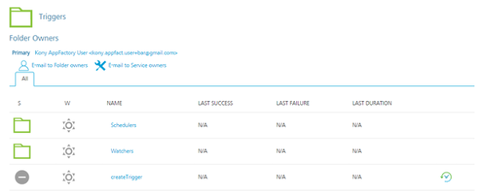

5.  Provide all the required parameters (they are the same as in buildIris job). Please note, that there is one additional parameter, which is called "CRON\_SCHEDULE".
    

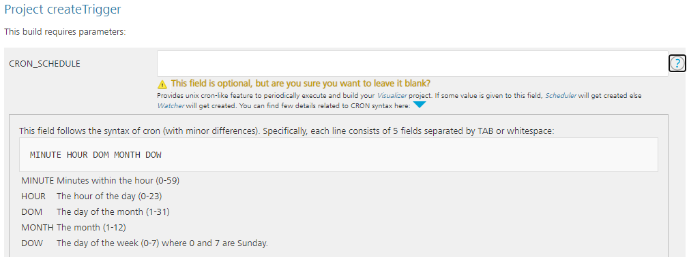

7.  A cron-triggered job is created and stored in "Schedulers" subfolder, If "CRON\_SCHEDULE" parameter is provided. Else, an scm-triggered job is created and stored in "Watchers" subfolder.
8.  Every Scheduler that is created, has a cron string in job's name to simplify job search. For information on cron expressions that can be set up in the CRON\_SCHEDULE parameter, refer to the [Cron Documentation](https://en.wikipedia.org/wiki/Cron).

10.  Every Watcher has a branch name in the name of Job to simplify job search.

### Schedule Nightly Builds

You might have a requirement to build applications at night on a regular basis. Nightly builds provide better performance and efficient resource allocation. Also, nightly builds are used for solid product building and testing without ongoing development.

Follow these steps to configure night builds of any required Iris application:

1.  Setup Iris project as a prerequisite. Refer to the [Setup](Setup.html) section for more details.

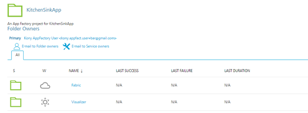

3.  After the Iris project is configured, navigate to the **Iris** folder .

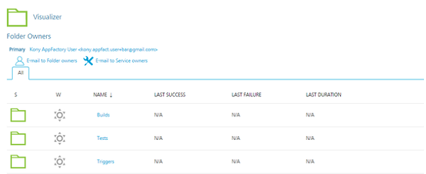

5.  Select the **Triggers** folder. The Triggers folder contains all jobs necessary to schedule and run Iris builds by code changes.

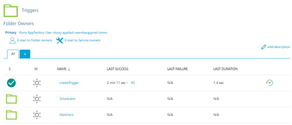

7.  Click the **createTrigger** link. The createTriggers job opens.

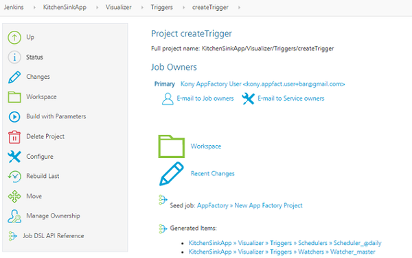

9.  After the createTrigger job is displayed, a **Build with Parameters** action is displayed on the left panel. Select **Build with Parameters** to launch a configuration build that generates the Schedulers or the Watchers job. See section [Configuration for App Factory console](#configuration-for-app-factory-console) above.
10.  Configure the parameters that are required to run the **Build with Parameters** job. For more details, refer to [Building Iris app](BuildingAnApp.html).

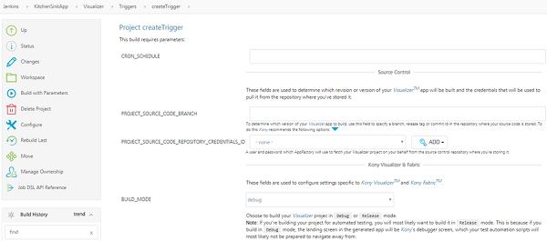

12.  Specify the CRON\_SCHEDULE parameter that corresponds to the [Cron](https://en.wikipedia.org/wiki/Cron) expression: `0 0 * * *` for a nightly build. Configure the other parameters based on the standard **buildIris** job parameters.
13.  After you configure the parameters, click **BUILD** to run the createTrigger job.
14.  The createTriggers job creates the **Schedule\_0 0 \* \* \*** job under the **Schedulers** folder. This specific job is launched based on the CRON\_SCHEDULE expression time schedule. As we set **0 0 \* \* \***, it triggers the Iris build with the parameters that are stored in the **Scheduler\_0 0 \* \* \*** job and the usual flow (see section [Building Iris app](BuildingAnApp.html)) is executed.

### Scheduling Custom Builds

The following are additional scheduling options that can be uses to build Iris by specific frequency.

1.  Setup Iris project as prerequisite, as defined in [Setup](Setup.html) section.
2.  Setup Scheduler job as prerequisite, as defined in [Scheduling Nightly Builds](#schedule-nightly-builds) (Steps 1-6).
3.  Select the **Build with Parameters** option on the left panel of the createTrigger job, and then define CRON\_SCHEDULE parameter. For more information, refer to [Cron](https://en.wikipedia.org/wiki/Cron).
4.  After configuring the parameters, click BUILD to generate the scheduler job, which is triggered based on the time that is set by the CRON\_SCHEDULE parameter.
5.  After createTrigger finishes successfully, navigate to the **Schedulers** folder to confirm the **Scheduler job** creation.

### Running builds by code change

In addition, an administrator can configure the **buildIrisApp** job to trigger based on the changes in source control. The administrator must configure the Webhook in accordance with the [Configuration for github](#configuration-for-github) or [Configuration for Bitbucket](#configuration-for-bitbucket). When the Webhook is configured in the project repository, the administrator needs to configure a watcher job that corresponds to [Configuration for App Factory console](#configuration-for-app-factory-console).

The following scenarios can be automated by using watchers:

*   An administrator configures a watcher on release branch. A developer merges code changes from the feature branch to the release branch. Automatically, the **buildIrisApp** job is triggered when changes appear in the release branch.
*   A developer wants to build an app every time they push changes to the source control. The developer works in a specific branch. An administrator configures a watcher that triggers the **buildIrisApp** job on changes in the dev branch.
*   A tester wants to build and test an app every time the developer pushes changes to the source control into a specific branch. An administrator configures a watcher that triggers the **buildIrisApp** job with the device pool, so that the tester can receive test results on every code change.

Every scenario depends on a different set of parameters, such as channels, device pool, branch, environment (development, staging, production), and other combinations.
