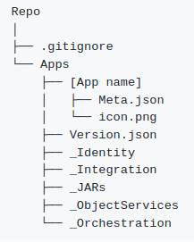
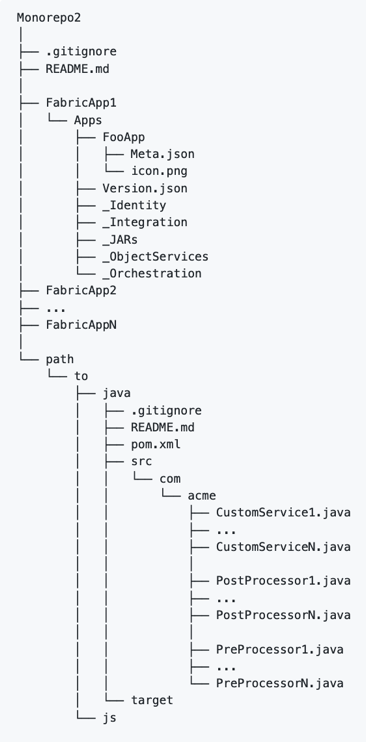
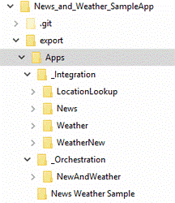

                         

Versioning a Foundry project in SCM
==================================

Even though the Foundry Console supports [versioning of apps]({{ site.baseurl }}/docs/documentation/Foundry/voltmx_foundry_user_guide/Content/App_Versioning.html), you may want to version your Foundry projects in a source control management system (SCM) instead.

A Foundry app directory must contain unzipped packages of the app. To obtain a zipped package, [export an app]({{ site.baseurl }}/docs/documentation/Foundry/voltmx_foundry_user_guide/Content/Export-Import_Apps.html) from the Foundry Console. When you extract the zip file, it creates an export folder for the app source. Make sure that you check-in the Foundry app folder to your repository.

> **_Important:_** Currently, the only SCM supported by App Factory is Git. You can choose a Git vendor based on your preference, for example: GitHub, Bitbucket, Gitlab, AWS CodeCommit, Azure Repos, or a Git server that you're running locally.

You can follow different strategies to create a repository for your Foundry app. For example: Your repository can contain a single project for a Foundry app at the root, this means that your folder structure will look similar to the following screenshot.

For this repository structure, the [FOUNDRY\_DIR](Setup.html#FOUNDRY_DIR) parameter must remain empty. While this is the simplest strategy for a repository, it may not be the best fit for Foundry apps that leverage custom Java code. Placing the Foundry application at the root leaves no room to add the Java code with it. Therefore, you will need to manage your Java source code in a different repository.

> **_Note:_**

*   If you host the Java assets in a separate repository, you need to prefix the repository name to the Java projects path in the build parameters. For more information, refer to [JAVA\_PROJECTS\_DIR](BuildingFoundryApp.html#JAVA_PROJECTS_DIR).
*   You can also refer to a [sample repository](https://github.com/HCL-VoltMX/foundry-java-sample) on GitHub, which contains a Foundry app and the dependent Java assets.

Monorepo Strategies in SCM
--------------------------

A common practice to create a repository is to use a [Monorepo](https://en.wikipedia.org/wiki/Monorepo) strategy. A Monorepo for App Factory may contain different sub-directories for different Foundry Apps and their Java dependencies, such as [Preprocessors]({{ site.baseurl }}/docs/documentation/Foundry/voltmx_foundry_user_guide/Content/Java_Preprocessor_Postprocessor_.html), [Postprocessors]({{ site.baseurl }}/docs/documentation/Foundry/voltmx_foundry_user_guide/Content/Java_Preprocessor_Postprocessor_.html), and [Java services]({{ site.baseurl }}/docs/documentation/Foundry/voltmx_foundry_user_guide/Content/Java_Adapter.html). The Monorepo can also contain Maven configuration files (pom.xml) to manage the Java assets and compiling the source to generate binaries.

You can use the following approaches to implement a Monorepo for your Foundry projects and Java dependencies. You can also use these approaches to version your Foundry projects and Iris projects in the SCM.

Approach 1: Common Subdirectory

In the common subdirectory approach, the Foundry project and Java assets together in the same subdirectory, but in different folder structures. Every Java asset contains a Maven config file (pom.xml) to manage the Java assets and to package them into the Foundry App.

> **_Note:_**  
The parent Java directory can also contain a common Maven config file to customize the Java packages.

Approach 2: Multiple Subdirectories

In the multiple subdirectories approach, every asset is stored in a subdirectory that contains the source file, a Maven POM file, and a gitignore file. The parent subdirectory can also contain a common Maven POM file.

> **_Note:_**  
If you are already using an existing structure (refer to the screenshot) of the Foundry App in Git for the App Factory jobs, you can continue to use the same.  
  
If you want to integrate Java assets from the source code into the Foundry app, you can migrate to one of the Monorepo structures that are mentioned earlier in this section. With the Monorepo strategy, you can easily track and use the **buildFoundryApp** pipeline. You can use Git commands to retain the commit history while migrating to the new structure.
