                           
Testing an App - Jasmine
========================

Jasmine is a behavior driven development test framework for JavaScript. With App Factory, you can use the Jasmine framework to run test cases for the Native and Desktop Web platforms. For more information, refer to the following sections.

*   [Native Tests](#native-tests)
*   [Desktop Web Tests](#desktop-web-tests)

> **_Note:_** You can run Jasmine tests only during the build process.

Native Tests
------------

> **_Important:_** To run the Jasmine tests on the native platform, you need a Custom Test Environment. Standard test environment is not supported to run Jasmine tests on the native platform.

### Custom Test Environment

Jasmine tests always run in a Custom Test Environment. App Factory uses the default Appium version to launch the app on the test device. But, you can provide a version number in the Build Parameters to override the Appium version. You can also provide the name of the Test Runner file that you want to run on the test device.

### Prerequisites

*   Make sure that the Iris project contains the test files at the following locations:
    *   `<Project-Root>/testresources/Jasmine/Mobile` for Mobile
    *   `<Project-Root>/testresources/Jasmine/Tablet` for Tablet
*   Make sure that you configure a device pool before you test the application.  
    For more information, refer to [Configuring Device Pools](Configuring_Device_Pools.html).
*   Jasmine tests are executed in the AWS Device Farm Cloud environment.
    
    > **_Note:_** You can find the Jasmine tests in the root folder of the project.  
    
    

### Native build related parameters

[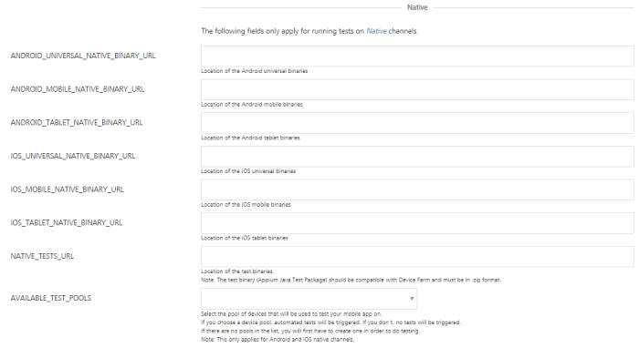](Resources/Images/runTests_native.png)

<table style="mc-table-style: url('Resources/TableStyles/Basic.css');width: 90%;" class="TableStyle-Basic" cellspacing="0"><colgroup><col class="TableStyle-Basic-Column-Column1" style="width: 35%;"> <col class="TableStyle-Basic-Column-Column1" style="width: 55%;"></colgroup><tbody><tr class="TableStyle-Basic-Body-Body1"><th class="TableStyle-Basic-BodyE-Column1-Body1">Parameter</th><th class="TableStyle-Basic-BodyD-Column1-Body1">Description</th></tr><tr class="TableStyle-Basic-Body-Body1"><td class="TableStyle-Basic-BodyE-Column1-Body1">ANDROID_UNIVERSAL_NATIVE_BINARY_URL</td><td class="TableStyle-Basic-BodyD-Column1-Body1">Specifies the URL of the Android universal binaries that are generated by a build job or generated locally.</td></tr><tr class="TableStyle-Basic-Body-Body1"><td class="TableStyle-Basic-BodyE-Column1-Body1">ANDROID_MOBILE_NATIVE_BINARY_URL</td><td class="TableStyle-Basic-BodyD-Column1-Body1">Specifies the URL of the Android Mobile binary that is generated by a build job or generated locally.</td></tr><tr class="TableStyle-Basic-Body-Body1"><td class="TableStyle-Basic-BodyE-Column1-Body1">ANDROID_TABLET_NATIVE_BINARY_URL</td><td class="TableStyle-Basic-BodyD-Column1-Body1">Specifies the URL of the Android Tablet binary that is generated by a build job or generated locally.</td></tr><tr class="TableStyle-Basic-Body-Body1"><td class="TableStyle-Basic-BodyE-Column1-Body1">IOS_UNIVERSAL_NATIVE_BINARY_URL</td><td class="TableStyle-Basic-BodyD-Column1-Body1">Specifies the URL of the iOS universal binaries that are generated by a build job or generated locally.</td></tr><tr class="TableStyle-Basic-Body-Body1"><td class="TableStyle-Basic-BodyE-Column1-Body1">IOS_MOBILE_NATIVE_BINARY_URL</td><td class="TableStyle-Basic-BodyD-Column1-Body1">Specifies the URL of the iPhone binary that is generated by a build job or generated locally.</td></tr><tr class="TableStyle-Basic-Body-Body1"><td class="TableStyle-Basic-BodyE-Column1-Body1">IOS_TABLET_NATIVE_BINARY_URL</td><td class="TableStyle-Basic-BodyD-Column1-Body1">Specifies the URL of the iPad binary that is generated by a build job or generated locally.</td></tr><tr class="TableStyle-Basic-Body-Body1"><td class="TableStyle-Basic-BodyE-Column1-Body1">NATIVE_TESTS_URL</td><td class="TableStyle-Basic-BodyD-Column1-Body1">Specifies the URL of the binaries for the compiled test project. If you provide Git parameters, you can skip this parameter.</td></tr><tr class="TableStyle-Basic-Body-Body1"><td class="TableStyle-Basic-BodyB-Column1-Body1">AVAILABLE_TEST_POOLS</td><td class="TableStyle-Basic-BodyA-Column1-Body1">Specifies the device pool that must be used for the tests. If a device pool is empty, the build fails. For more information, refer to <a href="Configuring_Device_Pools.html" target="_blank">Configuring Device Pools</a>.</td></tr></tbody></table>

> **_Note:_** The URLs that you provide must be open and accessible on the internet. For example, a URL to an S3 bucket from the email notification that is sent by the **buildIrisApp** job.

### Custom Test Environment Run (Raw Mode)

In a custom test environment, you can select the Appium version on which you want to run your tests. Make sure that you provide an appropriate Appium version. For more information, refer to [AWS Device Farm](https://docs.aws.amazon.com/devicefarm/latest/developerguide/test-types-android-appium-java-junit.html).

### Native Testing related Parameters

The following parameters are applicable only if you want to run automated tests on a native app that is generated by the protected build.

<table style="mc-table-style: url('Resources/TableStyles/Basic.css');width: 90%;" class="TableStyle-Basic" cellspacing="0"><colgroup><col class="TableStyle-Basic-Column-Column1" style="width: 35%;"> <col class="TableStyle-Basic-Column-Column1" style="width: 55%;"></colgroup><tbody><tr class="TableStyle-Basic-Body-Body1"><th class="TableStyle-Basic-BodyE-Column1-Body1">Parameter</th><th class="TableStyle-Basic-BodyD-Column1-Body1">Description</th></tr><tr class="TableStyle-Basic-Body-Body1"><td class="TableStyle-Basic-BodyE-Column1-Body1">RUN_IN_CUSTOM_TEST_ENVIRONMENT</td><td class="TableStyle-Basic-BodyD-Column1-Body1">Specifies whether the tests in Device Farm are run on a Custom Test Environment. For more information, refer to <a href="CustomTestEnvRun_RawMode.html">Custom Test Environment Run</a>. <b><i>Note: </i></b>Even if the checkbox is not selected, App Factory runs the Jasmine tests only in the custom test environment.</td></tr><tr class="TableStyle-Basic-Body-Body1"><td class="TableStyle-Basic-BodyE-Column1-Body1">APPIUM_VERSION</td><td class="TableStyle-Basic-BodyD-Column1-Body1">Specifies the Appium version that you want to run for the tests. For more information, refer to <a href="CustomTestEnvRun_RawMode.html">Custom Test Environment Run</a>. For information about the artifacts that are available in the notification mail for AWS Custom Environment Run, refer <a href="BuildingAnApp.html#AWS_Custom">Building an App in AWS Custom Environment</a>.</td></tr><tr class="TableStyle-Basic-Body-Body1"><td class="TableStyle-Basic-BodyE-Column1-Body1">TEST_PLAN</td><td class="TableStyle-Basic-BodyD-Column1-Body1">Specifies the test plan that you want to execute. The test plan files must be located at <code class="file_names" style="font-size: 11pt;">&lt;Project-Root&gt;/testresources/Jasmine/Mobile/TestPlans</code></td></tr><tr class="TableStyle-Basic-Body-Body1"><td class="TableStyle-Basic-BodyB-Column1-Body1">NATIVE_TEST_PLAN</td><td class="TableStyle-Basic-BodyA-Column1-Body1">Specifies the relative path of the test plan (such as <code class="file_names" style="font-size: 11pt;">testRunner.js</code>) that you want to execute. The path is relative to the following folders: <code class="file_names" style="font-size: 11pt;">/testresources/Jasmine/Mobile/Test Plans</code> <code class="file_names" style="font-size: 11pt;">/testresources/Jasmine/Tablet/Test Plans</code> <b><i>Note: </i></b>If the test plan is not provided, the default test plan (testPlan.js) is executed.</td></tr></tbody></table>

> **_Important:_**

*   To run the tests individually, make sure that you provide public URLs in the [Native parameters](#native-build-related-parameters).
*   You can use the universal application binary and run the tests on mobile and tablet devices based on the availability in the device pool. You can trigger a runTest job either with a universal binary or with a mobile or a tablet binary.

Desktop Web Tests
-----------------

### Prerequisites

*   Make sure that the Iris project contains Jasmine test files at the following location:  
    `<Project-Root>/testresources/Jasmine/Desktop`

*   Make sure that the Jasmine tests are running in your local machines in Google Chrome.

### Desktop Web related parameters

<table style="mc-table-style: url('Resources/TableStyles/Basic.css');width: 90%;" class="TableStyle-Basic" cellspacing="0"><colgroup><col class="TableStyle-Basic-Column-Column1" style="width: 35%;"> <col class="TableStyle-Basic-Column-Column1" style="width: 55%;"></colgroup><tbody><tr class="TableStyle-Basic-Body-Body1"><th class="TableStyle-Basic-BodyE-Column1-Body1">Parameter</th><th class="TableStyle-Basic-BodyD-Column1-Body1">Description</th></tr><tr class="TableStyle-Basic-Body-Body1"><td class="TableStyle-Basic-BodyE-Column1-Body1">FOUNDRY_APP_URL</td><td class="TableStyle-Basic-BodyD-Column1-Body1">Specifies the URL of the Foundry app with which the Desktop Web WAR file is published.</td></tr><tr class="TableStyle-Basic-Body-Body1"><td class="TableStyle-Basic-BodyE-Column1-Body1">AVAILABLE_BROWSERS</td><td class="TableStyle-Basic-BodyD-Column1-Body1">Specifies the browser on which you want to run the Desktop Web tests.</td></tr><tr class="TableStyle-Basic-Body-Body1"><td class="TableStyle-Basic-BodyE-Column1-Body1">SCREEN_RESOLUTIONS</td><td class="TableStyle-Basic-BodyD-Column1-Body1">Specifies the resolution at which the browser must launch and run the tests.</td></tr><tr class="TableStyle-Basic-Body-Body1"><td class="TableStyle-Basic-BodyB-Column1-Body1">WEB_TEST_PLAN</td><td class="TableStyle-Basic-BodyA-Column1-Body1">Specifies the relative path of the test plan (such as <code class="file_names" style="font-size: 11pt;">testRunner.js</code>) that you want to execute. The path is relative to the following folder: <code class="file_names" style="font-size: 11pt;">/testresources/Jasmine/Desktop/Test Plans</code> <b><i>Note: </i></b>If the test plan is not provided, the default test plan (testPlan.js) is executed.</td></tr></tbody></table>

Custom Hooks related parameters
-------------------------------

<table style="mc-table-style: url('Resources/TableStyles/Basic.css');width: 90%;" class="TableStyle-Basic" cellspacing="0"><colgroup><col class="TableStyle-Basic-Column-Column1" style="width: 35%;"> <col class="TableStyle-Basic-Column-Column1" style="width: 55%;"></colgroup><tbody><tr class="TableStyle-Basic-Body-Body1"><th class="TableStyle-Basic-BodyE-Column1-Body1">Parameter</th><th class="TableStyle-Basic-BodyD-Column1-Body1">Description</th></tr><tr class="TableStyle-Basic-Body-Body1"><td class="TableStyle-Basic-BodyB-Column1-Body1">RUN_CUSTOM_HOOKS</td><td class="TableStyle-Basic-BodyA-Column1-Body1">Specifies whether Custom Hooks must be run in the after the tests are executed (the Post-Test stage). For more information, refer to <a href="CustomHooks.html" target="_blank">Custom Hooks</a>.</td></tr></tbody></table>

Notifications related parameters
--------------------------------

<table style="mc-table-style: url('Resources/TableStyles/Basic.css');width: 90%;" class="TableStyle-Basic" cellspacing="0"><colgroup><col class="TableStyle-Basic-Column-Column1" style="width: 35%;"> <col class="TableStyle-Basic-Column-Column1" style="width: 55%;"></colgroup><tbody><tr class="TableStyle-Basic-Body-Body1"><th class="TableStyle-Basic-BodyE-Column1-Body1">Parameter</th><th class="TableStyle-Basic-BodyD-Column1-Body1">Description</th></tr><tr class="TableStyle-Basic-Body-Body1"><td class="TableStyle-Basic-BodyB-Column1-Body1">RECIPIENTS_LIST</td><td class="TableStyle-Basic-BodyA-Column1-Body1">Specifies the list of email addresses that must receive the results of the test jobs. You can provide multiple email addresses by separating them with a comma.</td></tr></tbody></table>

Running Tests from the buildIrisApp job
---------------------------------------------

You can trigger the tests from the buildIrisApp job available at **Project Name** > **Iris** > **Builds** folder. It is the simplest way to validate your code by launching tests right after Building the application. There is no need to specify all parameters as they are provided while running the tests manually. The results can be viewed in line to the Test Results of Manual Tests.

Test Results
------------

### Native test Results

When the project test build is complete and the test results are published at S3, e-mail notifications are sent to recipients:

On an unsuccessful build for the tests run, the following e-mail is sent to the recipients:

#### Sample email for Native tests

In the final stage, the consolidated test run status is notified via e-mail. Refer the following screenshots for the sample email for consolidated status.

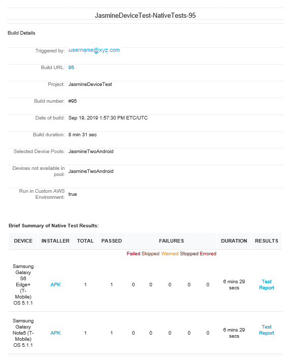

To download test data that is fetched from the AWS Device Farm, click the **Download File** link. The data is stored at S3 and available for review without any time limitations.

To view the detailed test report, click the **Test Report** link.

### Desktop Web test results

When the project test build is complete and the test results are published at S3, e-mail notifications are sent to recipients:

On an unsuccessful build for the tests run, the following e-mail is sent to the recipients:

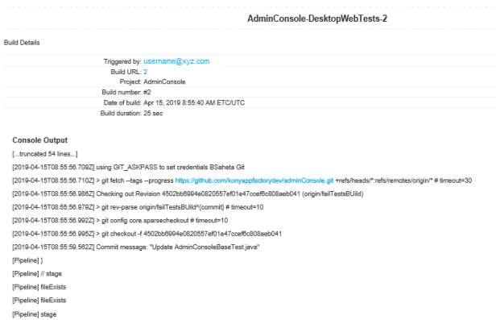

#### Sample email for Desktop Web tests

In the final stage, the consolidated test run status is notified via e-mail. Refer the following screenshots for the sample email for consolidated status.

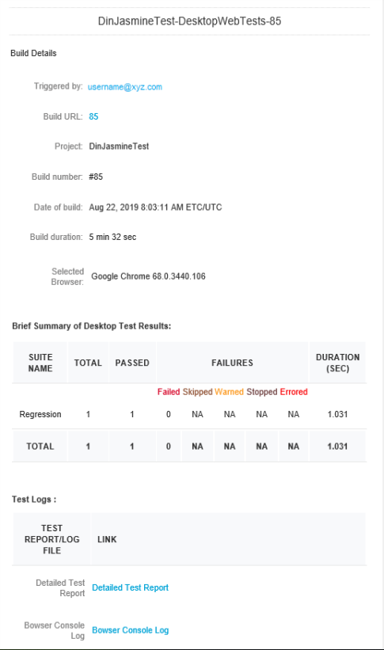

The summary of the test results are shown based on the tests executed on specified browser that includes passed, failed, skipped. Usually the tests are skipped when the driver initialization fails.

To view the detailed test report, click the **Detailed Test Report** link.

To view the details on the browser log, click the **Browser Console Log** link.

### Test Status

Test Status is available in the test result email which is sent to the recipient after you execute the test cases. Following are different statuses in the test result email:

*   **PASSED**: The status of the test result is **PASSED** when the test case is executed without any issues, and when the assertion is successful.
*   **FAILED**: The status of the test result is **FAILED** when the expected result does not match with the actual result of the test case, and the assertion fails.

The **SKIPPED**, **WARNED**, **STOPPED**, **ERRORED** statuses are not applicable for Jasmine Tests.

Troubleshooting Issues
----------------------

The following errors can help you during troubleshooting runTests job fail:

*   **Error**: Jasmine Tests can only be executed when the app is built in Debug mode.  
    **Solution**: Make sure that you have selected the build mode as **debug** when the app is built before running the tests.
*   **Error**: Please provide pool to test on.  
    **Solution**: Make sure that you provide a value to AVAILABLE\_TEST\_POOLS parameter to run the native tests.
*   **Error**: Sorry, You can't run test for Android Universal binary along with Android Mobile/Tablet.  
    **Solution**: The universal binary tests both the Mobile and Tablet binaries are based on the availability of the devices in the device pool. So it is not required to provide mobile/tablet binary when you give universal binary.
*   **Error**: Build parameter <parameter name> value is not valid URL!  
    **Solution**: Make sure that the URL you provide for the following parameters is valid:
    *   ANDROID\_MOBILE\_NATIVE\_BINARY\_URL
    *   ANDROID\_TABLET\_NATIVE\_BINARY\_URL
    *   IOS\_MOBILE\_NATIVE\_BINARY\_URL
    *   IOS\_TABLET\_NATIVE\_BINARY\_URL
    *   NATIVE\_TESTS\_URL
        
    *   ANDROID\_UNIVERSAL\_NATIVE\_BINARY\_URL
        
    *   DESKTOPWEB\_TESTS\_URL
        
    *   IOS\_UNIVERSAL\_NATIVE\_BINARY\_URL
        

The builds that failed during the test can be tracked for the issues that caused the failure. For example, consider build #4 from the following screenshots of runTests job. To troubleshoot the issue, follow these steps.

1.  From your project folder, navigate to **Iris** > **Tests**.

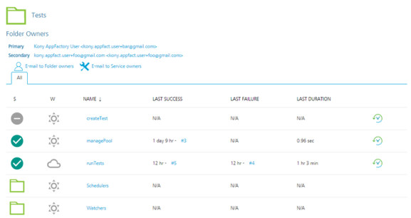

3.  Select the runTests job, and then find the failed build.  
    For example, find and click the link for build **#4**.

5.  From the details page of the failed build, select the **Console Output** on the left panel. The **Console Output Log** opens in the right pane.

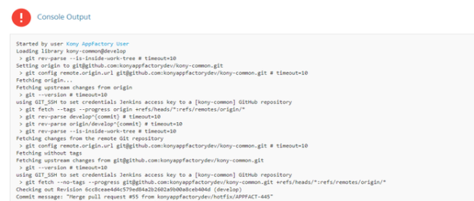

7.  Scroll to find errors in the log that caused the build to fail. For example, you can trace an error that is related to invalid Android Tablet URL.

9.  Check if the ANDROID\_TABLET\_NATIVE\_BINARY\_URL parameter is valid.

Alternatively you can troubleshoot the issue from the stages of Manual Testing.

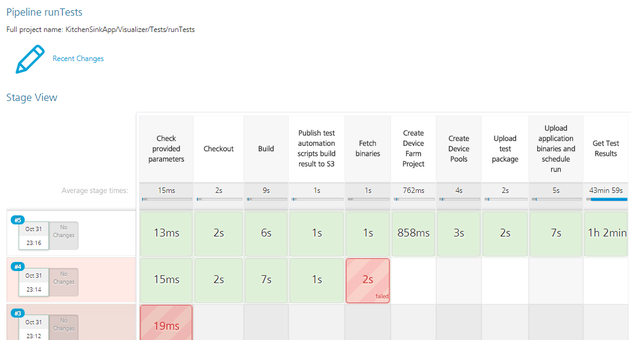

To troubleshoot the issue from the Stage View, follow these steps:

1.  From the Stage View, point to the failed stage, and then click **Logs**.  
    
2.  From log messages in the **Stage Logs** window, identify the error message that corresponds to the failure of the build.  
    For example, you can trace an error that is related to invalid Android Tablet URL.

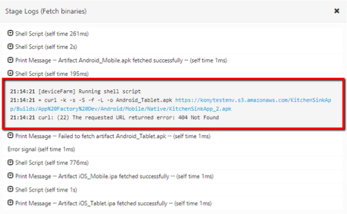

4.  Check whether the ANDROID\_TABLET\_NATIVE\_BINARY\_URL parameter is valid.

Auto Triggering Tests
---------------------

App Factory supports two types of auto-triggered test jobs: scm-triggered (Watchers) and cron-triggered (Schedulers). Every project contains a folder called **Tests** in the **Iris** sub-folder, which contains job for creation of auto-triggered jobs (createTrigger) and two sub-folders where created jobs are stored.

To setup an auto-triggered test job, follow these steps:

1.  From the project folder, navigate to the **Tests** sub-folder.
2.  Select the **createTest** job.

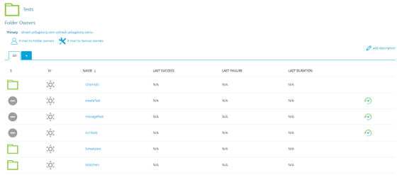

4.  Configure the CRON\_SCHEDULE parameter based on your requirement.
    *   If you want to create a **Scheduler**, type a Cron expression that corresponds to the time at which the build job must be triggered.  
        For information about cron expressions, refer to [Cron](https://en.wikipedia.org/wiki/Cron).
    *   If you want to create a **Watcher**, leave the CRON\_SCHEDULE parameter blank.
5.  Configure the remaining parameters, which are the same as the runTest job.

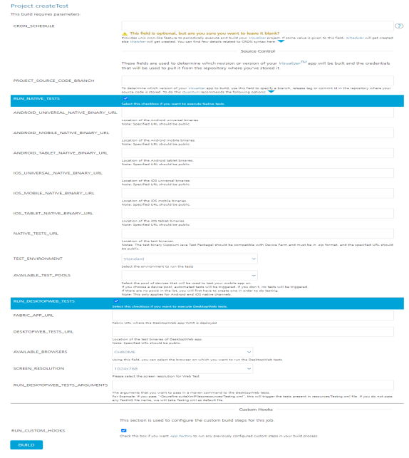

7.  After you configure all the parameters, click **BUILD**.

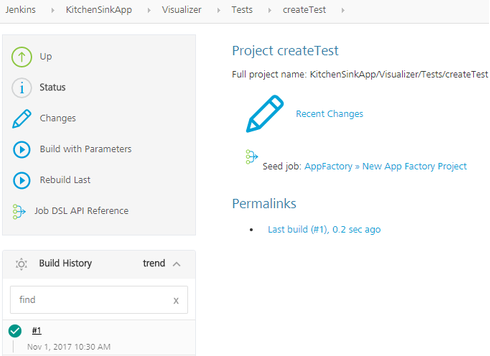

> **_Note:_**

*   Every Scheduler that is created contains the cron string in job name to simplify the job search.  
    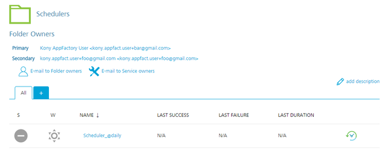
*   Every Watcher that is created contains the branch name in job name to simplify the job search.  
    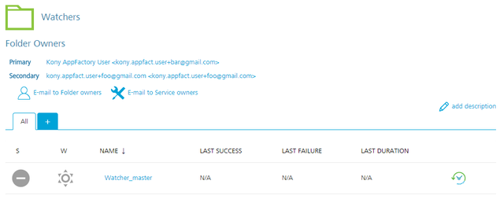
