                           

Introduction to Engagement Campaigns and Events: Introduction to Events in Engagement

Introduction to Events and Event Invocation
===========================================

In this chapter, we will cover events of the Engagement Server. We will explain event definition, how to create events in the Engagement Server, and invoke events using the demo application to receive a push notification from the events.

It is assumed that you already have access to the trial account of Volt MX Foundry, which has Engagement provisioned. It is also assumed that you have reviewed the Beginner’s track of Volt MX Engagement tutorials and also installed the demo application.

Introduction to Events in Engagement
------------------------------------

Events in the Engagement server are entities that are invoked by external system when something of importance occurs. These events are saved in the Engagement Server and when triggered or invoked by the external system, send various notifications, such as push, email, SMS, and passes. For example, a banking system may have a use case to send notification to the customer when the balance is less than 100$. In such a case, an event can be set up in the Engagement Server, which when triggered will send a notification to the customer about the low balance in the account.

Events in the Engagement Server are identified by event ids and invoked using REST APIs. A sample REST API payload is provided in the Engagement Server when an event is saved. This payload can be provided as a sample to the external system, which would invoke the event.

Event Creation in the Engagement Server
---------------------------------------

This section details the steps that are needed to create events in the Engagements Server. We will also review the sample REST API payload that can be used to invoke the created event.

1.  Log in to your Volt MX Foundry account and open the Engagement server console. On the left pane, click **Events** under the **Engagement** category. This will open the events screen.
    
    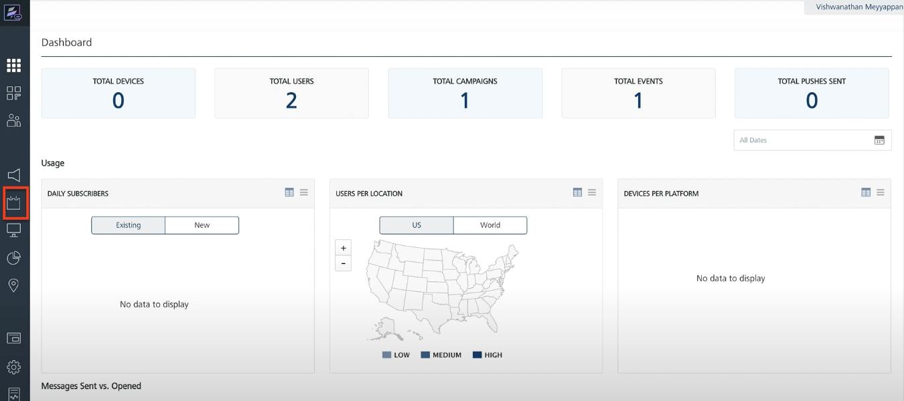
    
2.  Enter the name of the event and the event description in the event creation screen. We will call the event as **LowBalanceEvent**. The **Event Id** and **Owner** will be prepopulated. Enter a description for the event and click **Next – Define Message** to define the message for the event.
    
    Note the event id. The event id will be used with your demo application to invoke the event in the next section.
    
    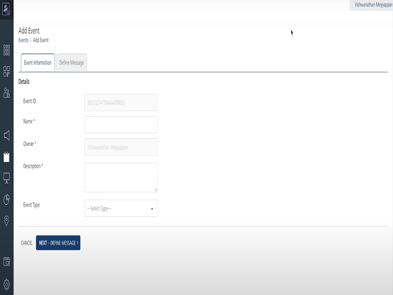
    
3.  Select the **Push Message** as the message channel. Click **Compose Message** to compose the push message.
    
    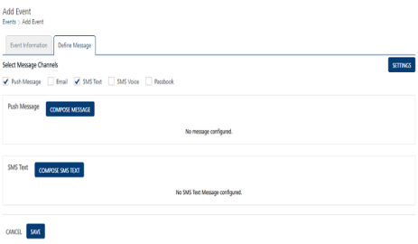
    
4.  In the **Compose Message** section, choose message type as **Standard Push**. Enter the **Message Name**.  
    In this example, we have provided the name as **Low Balance Message**. Since you will send a push message, you need to choose the application for which this message will be sent. In this example, we will choose the created app **EngagementTestApp** as the name of the application. In the **Message** section. Next we will enter the message that needs to be sent through the push message channel.
    
    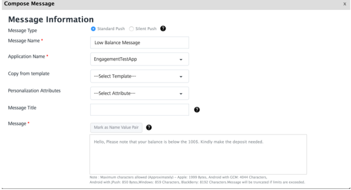
    
5.  Click **Save** to save the event after all the information is provided. This will save the message and the Event page is displayed.
    
    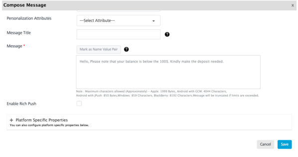
    
6.  Click **Save** to save the event. This will navigate you to the Event list page where all the events are displayed.
    
    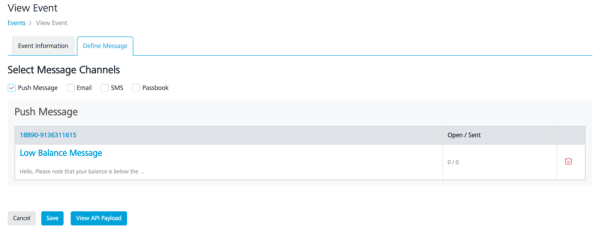
    
7.  You will see that the event you have created is in an inactive status with a red cross. Events need to be in an active state so that they can be triggered. Hover on the red cross under the status and choose **Activate** to active the event.
    
    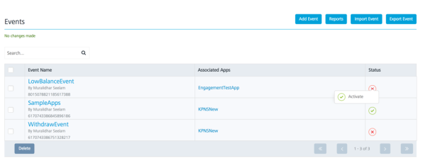
    
8.  Click **Ok** to continue the activation of the event. This will finish the activation of the event and will display the Event list page.
    
    
    
9.  Next we will review the sample REST API payload that is associated with the event you just created. This API can be provided to the invoking application so that it can correctly invoke the event. Click **LowBalanceEvent** in the Event listing page.
    
    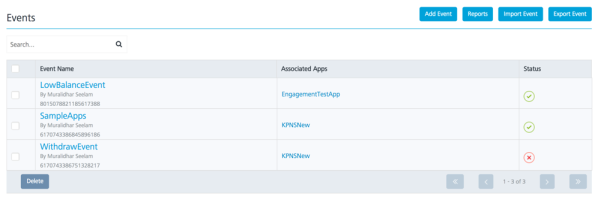
    
10.  Click the **Define Message** tab to view the message.
    
    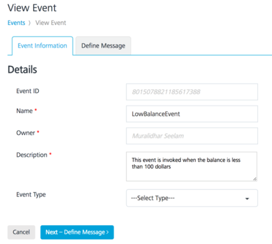
    
11.  Click **View API Payload** to see the sample payload of this event.
    
    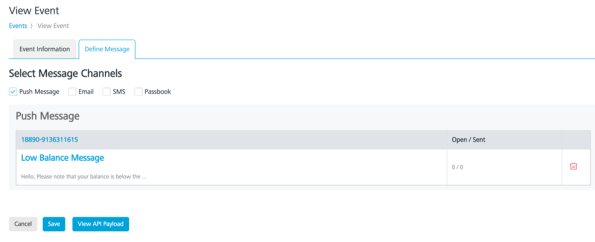
    
12.  The sample payload for the event you created will look similar as shown below. You will see the eventid as a part of the payload. You can also view the payload in the XML or the JSON format.
    
    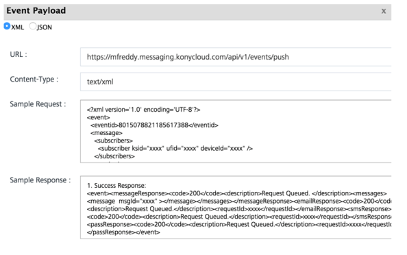
    
    That’s it! You have successfully created an event that can send push notifications when invoked.
    

Event Invocation using the Demo Application
-------------------------------------------

In this section, you will invoke the event you have created using the demo application that was installed earlier.

Before you start this section, it is assumed that you have already installed the demo application, created a user along with a subscription and also were able to receive a push notification.

We strongly suggest that you complete the steps in the beginner’s course before this section is completed.

1.  Launch the demo application on your device and create a user and a subscription if not already done. Do refer the last chapter of the beginner’s guide for the steps to create a user and subscription, if not already done.
2.  Navigate to the **Options** page of the demo application to invoke an event. Click **Trigger Event** on the screen to enter the event id
    
    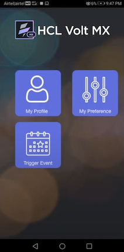
    
3.  Enter the event id in the empty text field provided under the description. As you will invoke the **LowBalanceEvent**, the event id of the same should be entered in the screen below.
4.  Click **Trigger Event** to invoke the event in the Engagement server.
    
    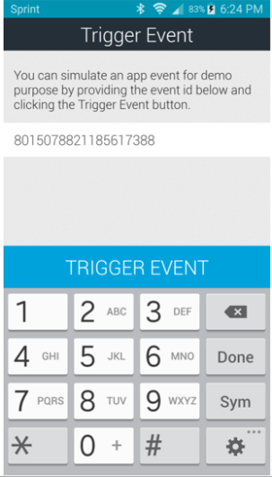
    
5.  After the event was successfully triggered, you will see a message that the event was successfully queued. Click **Ok** to navigate to the next screen.
    
    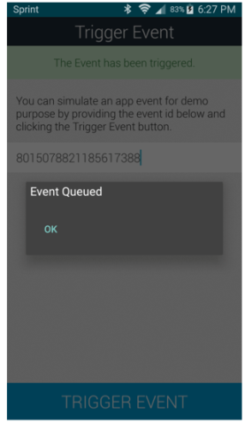
    
6.  You will receive the push message as shown below when the event is successfully invoked. Do note that this message is the configured message that was set up with the event.
    
    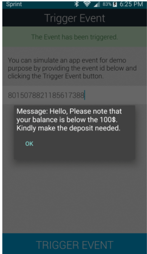
    
    That’s it! This finishes the current chapter in which you created your own event and successfully invoked it to receive push notifications.
    

> **_Important:_** For more information, refer to the following video:


