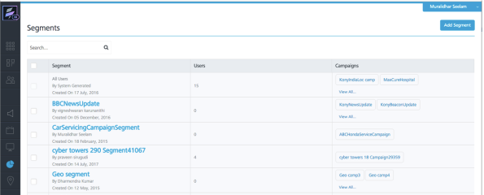
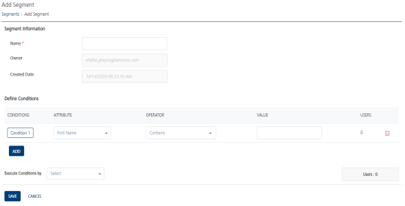
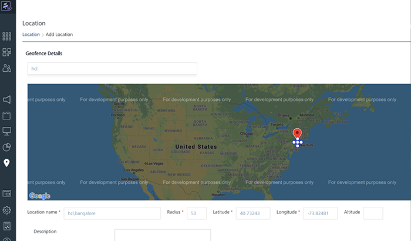
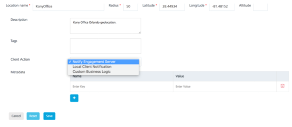
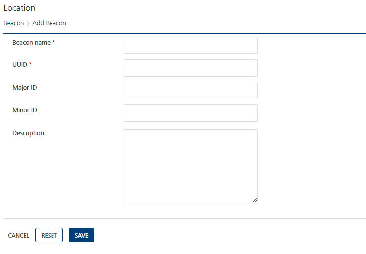
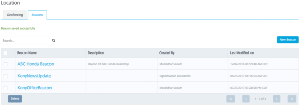

                           

Introduction to Engagement Campaigns and Events: Introduction to Segments in Engagement

Introduction to Location Based Segment Creation
===============================================

In this chapter, we will cover the segments feature of the Engagement server. We will explain what segments are, discuss the supported location features such as geoboundaries and beacons, and show you how to create segments in the Engagement Server.

It is assumed that you already have access to the trial account of Volt MX Foundry which has Engagement Server provisioned.

Introduction to Segments in Engagement
--------------------------------------

Segments are subset of the users in the Engagement server who satisfy a certain criteria. Segments are used to send targeted messages using campaigns or other supported notification mechanism, such as adhoc and events. Segments can be created based on the user attributes or location of the user. Location based segments use geolocations and beacons.

Once the segments are created and saved, you can also apply logical operators to create more complex conditions.

Segment Creation in the Engagement Server
-----------------------------------------

This section details the steps that are needed to create segments in the Engagements server. We will walk you through the creation of segments using the user attributes first and then also walk you through the creation of segments using geolocations and beacons.

### Creation of Segments using User Attributes

1.  Log in to your Volt MX Foundry account and open the Engagement server console. From the left pane, click **Segments** under the **Engagement** category. This will open the **Segments** screen.
2.  Click **Add Segment** to begin the creation of the segment.
    
    
    
3.  Enter the name of the segment and the segment description in the Segment creation screen. We will call our segment as **FloridaResidentSegment**. The **CreatedDate** and **Owner** will be prepopulated.
4.  Choose the **Attribute** as **State** and value as **Florida**. In the **Execute Conditions By** choose **Match all conditions** option. You will see the **users** count as 1, which means there is one user in the system that matches the criteria of the segment.
5.  Click **Save** to save the segment.
    
    
    
6.  You will be navigated to the **Segments** list page, which will display all the segments. You will also see a message that segment has been saved successfully.
    
    That’s it! You have successfully created and saved a segment using the user attributes.
    

### Creation of Segments using User Location

In this section, you will create location based segments. First we will walk through the steps to create a geolocation based segment and then you will be creating a beacon based segment.

1.  Click **Location** option under the **Engagement** category. This will display the screen as below and the **Geofencing** tab is selected by default. Click **Add New** to start the creation of a new geoboundary.
2.  Next we will start entering the details of the new geoboundary that we are creating. Enter **VoltMX** as location. You will be able to pick the option from the drop-down list. Once the location is selected, the **Latitude** and **Longitude** will be filled in by default. Next you can enter the radius of this geolocation. In this example, it is **50** miles.
3.  Enter the **Location Name**. In this example, we will call it as **VoltMXOffice**. You can provide a **Description** for your geolocation if needed.
4.  The **Tags** value allows you to group a set of geoboundaries. For example, the geoboundaries of all the applications can be grouped using the application name.
    
    
    
5.  In the **Client Action**, there are three options available as shown. The **Notify Engagement Server** means the client application needs to update the device location with the Engagement server when the user enters the geoboundary. The **Local Client Notification** means that the application needs to display a local notification on the device. The **Custom Business Logic** mean that the any custom code set up with this geoboundary needs to be executed on the device.
6.  For this example, choose **Notify Engagement Server** and click **Save** to save the geoboundary.
    
    
    
7.  Once the geoboundary is saved, the list of all the geoboundaries is displayed.
8.  Next we will create a segment based on a beacon. Click the **Beacons** tab to begin the creation of a beacon.
    
    
    
9.  Click **New Beacon** and this will display the screen to enter the beacon information. Enter the **Beacon Name** and the **UUID** as these are the required parameters. The **UUID** or the universally unique identifier is an id that identifies a beacon. The **Major Id**, **Minor Id** and the **Description** are not needed and will be ignored.
    
    
    
10.  Click **Save** to save the beacon. This will list the complete list of the beacons that will be saved.
    
    
    
11.  Now that the geoboundary and the beacon are created, we will create segments. Click **Segments** under **Engagement** section.
12.  Click **Add Segment** to start the creation of the segment.
13.  In the segment creation screen, enter the name of the segment as **VoltMXLocationGeoSegment**. Choose Location in the attribute column and choose the value as **OldVoltMXOfficeLocation** from the drop-down list.
14.  Select **Match all Conditions** from the **Execute Conditions by** drop-down list. Click **Save** to save the geolocation based segment.
15.  In the segment creation screen, enter the name of the segment as **VoltMXLocationBeaconSegment**. Choose **Beacon** in the attribute column and choose the value as **OldVoltMXOfficeBeacon** from the drop-down list.
16.  Select **Match all Condition**s from the **Execute Conditions by** drop-down list. Click **Save** to save the beacon based segment.
17.  The next screen displays the list of the all beacons including the **VoltMXLocationBeaconSegment** that you have just created.
18.  That’s it! You have successfully created and saved location based geoboundary and beacon segments.

> **_Important:_** For more information, refer to the following video:


