                              

Use Case Scenarios - App SSO
----------------------------

Single sign-on is a feature that permits the user to log in to one application and access the supported applications automatically with out logging again. For more information, refer [Overview of Application SSO](Overview_AppSSO.HTM).

The following sections explain the SSO functionality using sample apps with different scenarios and code examples.

[1.1 Introduction to Scenario](#Intro)

[1.2 Sample Apps from Iris](#Sample)

[1.3 Process Flow](#Process)

[1.4 Enabling SSO](#Enabling)

[1.4.1 Enabling SSO on Volt MX Foundry](#EnablingSSO_MF)

[1.4.2 Client App Code Changes](#Client)

[1.5 SSO Permissions](#SSO_Permsns)

[1.6 Build Apps for Distribution](#Build)

Introduction to Scenario
------------------------

Volt MX  supports the following scenarios for the Single Sign-On feature:

  
| Scenarios | Scenarios Supported for SSO |
| --- | --- |
| **Scenario**: Same Identity service used in both SSO apps. | Supported |
| **Scenario**: Different Identity services of different flavors such as basic with Oauth, or two Oauth services with different back-end providers. | Supported |
| **Scenario**: Different Identity services of same flavor. For example, two different Facebook Oauth services connecting to same back end having different configurations. | Not Supported. |

Sample Apps from Iris
---------------------------

To understand the functionality of SSO feature, let’s take an example of two apps. Assume we have a BankApp and a TradeApp. With the SSO functionality implemented, if you log into one app and then opens the other app, the second app should automatically display the Home screen instead of the login screen.

The following describes two different scenarios for implementing the SSO functionality:

**Scenario 1**: If the identity service is the same for both apps.

Let us assume both apps use the same identity service **[User Store](Identity12_VoltMXUR.html#Identity.html#UserRepository)** in their Volt MX Foundry backend.

**BankApp**

**TradeApp**

The Iris apps (client apps) use the following code to call this service. Here, the BankApp and the TradeApp will use the same code listed below to connect to the Volt MX Foundry backend as both the apps share the same identity service.

 // login call
function bankapp_login2() {
    var voltmxIdent = HCLFoundry.getIdentityService("userstore");
    var options = {};
    options.userid = < userid textfield > .text;
    options.password = < password textfield > .text;
    voltmxIdent.login(options, function(res) {
        showAlert("SSO userstore success" + JSON.stringify(res));
        frm2.show();
    }, function(res) {
        showAlert("SSO userstore failed" + JSON.stringify(res));
    });
}   
// logout call
function bankapp_logout() {
    var voltmxIdent = HCLFoundry.getIdentityService("userstore");
    var options = {};
    voltmxIdent.logout(function(response) {
            voltmx.print("Success in mobilefoundry logout");
        },
        function(error) {
            voltmx.print("Error in mobilefoundry logout : " + JSON.stringify(error));
        }, options);
}


**Scenario 2**: The identity service is different for the apps.

Assume the BankApp uses the**User Store** identity service and the TradeApp uses the **[Open LDAP](Identity4_LDAP.html#Identity.html#OpenLDAP)** identity service in their Volt MX Foundry backend.

**BankApp with Volt MX userstore as identity service**

**TradeApp with OpenLDAP as Identity Service**

The TradeApp uses the following code as it uses **Open LDAP** identity service. The BankApp uses the code described in the first scenario as it uses the **User Store** identity service.

 // login call
function tradeapp_login2() {
    var voltmxIdent = HCLFoundry.getIdentityService("openldap");
    var options = {};
    options.userid = < userid textfield > .text;
    options.password = < password textfield > .text;
    voltmxIdent.login(options, function(res) {
            showAlert("SSO userstore success" + JSON.stringify(res));
            frm2.show();
        },
        function(res) {
            showAlert("SSO userstore failed" + JSON.stringify(res));
        });
}

// logout call
function tradeapp_logout() {
    var voltmxIdent = HCLFoundry.getIdentityService("openldap");
    var options = {};
    voltmxIdent.logout(function(response) {
            voltmx.print("Success in mobilefoundry logout");
        },
        function(error) {
            voltmx.print("Error in mobilefoundry logout : " +
                JSON.stringify(error));
        }, options);
}


#### Expected End-User Flow

With the SSO feature, we can simplify the app usage for the end-users. The app developers has the power to leverage the login of other apps to identify and validate the user.

The expected end-user flow for both scenarios is described in the following:

**Scenario 1**:

1.  The user launches the BankApp and the **Login** screen is displayed.
2.  The user provides the valid login credentials and clicks the **Login** button.
3.  On successful authentication, the user is shown the **Home** screen.
4.  Next, the user launches the TradeApp.
5.  SSO login happens at the login form init and the **Home** screen is displayed without the need for the user to enter their login credentials again.

**Scenario 2**:

1.  The user launches the BankApp and the **Login** screen is displayed.
2.  The user provides the valid login credentials and clicks the **Login** button.
3.  On successful authentication, the user is shown the **Home** screen.
4.  Next, the user launches the TradeApp
5.  SSO login triggered at the login form init of the TradeApp.
6.  The **Home** screen is is displayed without the need for the user to enter their login credentials again.
    

Process Flow
------------

The following diagrams show the process flow for each scenario.

**Scenario 1**:

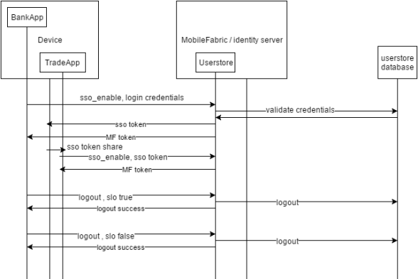

**Scenario 2**

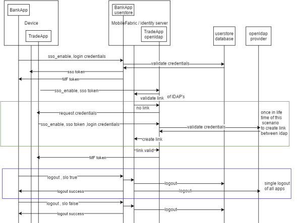

Enabling SSO
------------

To enable SSO for BankApp and TradeApp, you must do the following:

1.  [Enable SSO on Volt MX Foundry Console](#EnablingSSO_MF)
2.  [Enable SSO through code changes](#Client)

### Enabling SSO on Volt MX Foundry Console

To enable SSO on Volt MX Foundry Console follow these scenarios:

**Scenario 1**: The identity service is the same for both apps. (The BankApp and TradeApp use the same identity service **User Store**).

*   Open BankApp in [VoltMX Foundry Console.](How_to_access_VoltMX_Foundry_Portal_on-Prem.html)
    *   To [Enable SSO](Identity14_Manage_Existing.html#context-based-options) for the **User Store** Identity service, click the **More Options** icon across the identity service and click **Enable SSO**.
        
        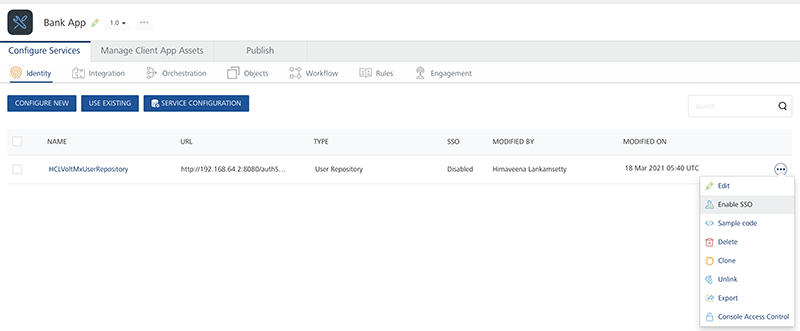
        
*   Open TradeApp in Volt MX Foundry Console.
    *   To [Enable SSO](Identity14_Manage_Existing.html#context-based-options) for the identity service **User Store**, click **More Options** across the identity service and click **Enable SSO**.
        
        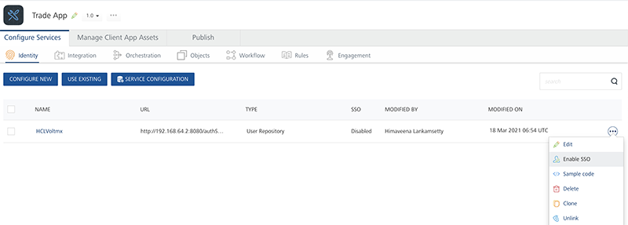
        

**Scenario 2**: The identity service is different for each app. (BankApp uses User Store & TradeApp uses Open LDAP).

*   **For BankApp**
    *   Open the **BankApp** in Volt MX Foundry Console.
        
    *   Import the **OpenLDAP** Identity Service.
    *   Click **More Options** icon across each identity service and click **Enable SSO** for both **User Store** and **Open LDAP**.
        
        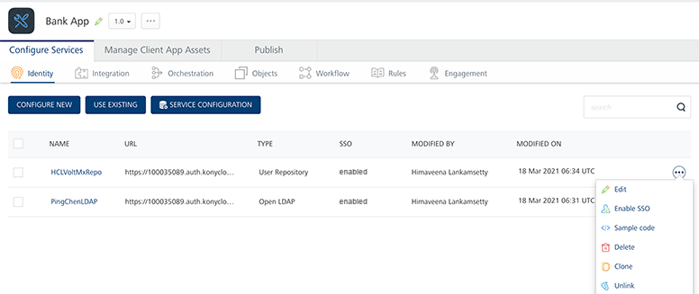
        
*   **For TradeApp**
    *   Open the TradeApp in **VoltMX Foundry Console**.
        
    *   Import the **User Store** identity service.
    *   Click **More Options**icon across each identity service and click **Enable SSO** for both **User Store** and **Open LDAP**.
        
        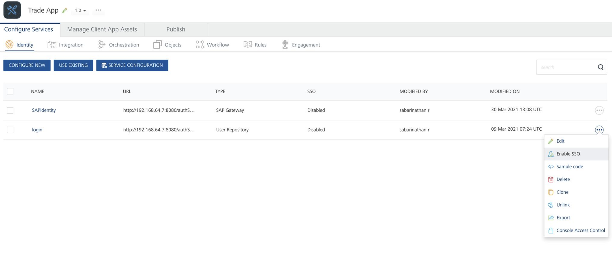
        
*   Republish the respective apps (BankApp and TradeApp) with the SSO enabled in the Volt MX Foundry for the backend apps. The modified services are republished to the run time.
    
    > **_Note:_** Ensure all identity services to be used with SSO must be mapped with all apps that are using SSO, irrespective of whether a particular identity service is used for authentication or not.  
      
    Ensure all the mapped identity services are SSO enabled.
    

> **_Note:_** If you unpublish and republish the app, make sure that you link the app to Volt MX Iris client app because the app key and secret key changes with the unpublish event.

### Client App Code Changes to Enable SSO

In the previous section, we mentioned enabling SSO at backend Volt MX Foundry services. Similarly, we must enable SSO on client side by modifying the identity service code in the client app.

#### Code changes in Login for SSO / code changes in the identity service call for both apps.

SSO options property in the login call of the identity service requires to pass a property. We have to set the loginOption.isSSOEnabled key to enable the SSO for the identity services. Set the property to **True** to enable the SSO and automatically access the relative apps. Otherwise, set the property to **False** to disable the SSO functionality.

**Login Call**

> **_Note:_** In scenario 1, both apps will use the first function below to connect to the Volt MX Foundry backend app identity service. In scenario 2, the trade app uses the second function.

 function bankapp_login2() {
    var voltmxIdent = HCLFoundry.getIdentityService("userstore");
    var options = {};
    var loginOption = {};
    loginOption.isSSOEnabled = true;
    options.loginOptions = loginOption;
    options.userid = < userid textfield > .text;
    options.password = < password textfield > .text;
    voltmxIdent.login(options, function(res) {
            showAlert("SSO userstore success" + JSON.stringify(res));
            frm2.show();
        },
        function(res) {
            showAlert("SSO userstore failed" + JSON.stringify(res));
        });
}
 function tradeapp\_login2() {
    var voltmxIdent = HCLFoundry.getIdentityService("openldap");
    var options = {};
    var loginOption = {};
    loginOption.isSSOEnabled = true;
    options.loginOptions = loginOption;
    options.userid = < userid textfield > .text;
    options.password = < password textfield > .text;
    voltmxIdent.login(options, function(res) {
            showAlert("SSO userstore success" + JSON.stringify(res));
            frm2.show();
        },
        function(res) {
            showAlert("SSO userstore failed" + JSON.stringify(res));
        });
}


#### Code Changes in Logout for SSO

SSO options property in the logout call of the identity service requires one more property to be passed. We have to set the slo key of the options property in the logout call to handle the SSO scenarios. By default the property value of the slo key is set to **false**.

Set the property to **True** to log out of all the SSO logins/apps. Otherwise, set it to **false** to logout of the current app without disturbing the SSO functionality of the relative apps.

> **_Note:_** In scenario 1, both the apps will use the first function below to connect to the Volt MX Foundry backend app identity service. In scenario 2, the trade app uses the second function.

 //logout call bank app
function bankapp_logout() {
    var voltmxIdent = HCLFoundry.getIdentityService("userstore");
    var options = {};
    options.slo = true;
    voltmxIdent.logout(function(response) {
            voltmx.print("Success in mobilefoundry logout");
        },
        function(error) {
            voltmx.print("Error in mobilefoundry logout : " + JSON.stringify(error));
        }, options);
}
//logout call Trade app
function tradeapp_logout() {
    var voltmxIdent = HCLFoundry.getIdentityService("openldap");
    var options = {};
    options.slo = true;
    voltmxIdent.logout(function(response) {
            voltmx.print("Success in mobilefoundry logout");
        },
        function(error) {
            voltmx.print("Error in mobilefoundry logout : " + JSON.stringify(error));
        }, options);
}


#### Coding Guidelines (Error Handling and Recommended use of feature)

The changes described in the previous section for the login call events are called/triggered when the user clicks the **Login** button. However, when the SSO is enabled the ideal user scenario would be for the user to skip the login page, if the user had already signed into a relative app (that is, both apps are SSO linked and enabled).

To get this experience, the user needs to call the similar login function at the preshow/init of the login. In the case of SSO login failure, show the login screen for the user to enter the login credentials. The user should write the code to handle the errors thrown by the SSO login.

Sample code to handle the error:

 function init_BankApp_loginpage() {
    //voltmx.sdk.getCurrentInstance().getIdentityService("userstore");
    var voltmxIdent = HCLFoundry.getIdentityService("userstore");
    var options = {};
    var loginOption = {};
    loginOption.isSSOEnabled = true;
    options.loginOptions = loginOption;
    voltmxIdent.login(options, function(res) {
            alert("SSO userstore success" + JSON.stringify(res)); < welcomeform > .show();
        },
        function(res) {
            //alert("SSO userstore failed"+JSON.stringify(res));
            if (res.code == -58) {
                alert("SSO login token expired please login again");
            } else if (res.code == -5) {
                alert("SSO login is not possible due to invalid token");
            } else if (res.code == -3) {
                alert("invalid app key / app secret Please contact admin / download the latest version of the app from store");
            } else if (res.code == -48) {
                alert("need to provide username password first time for ssologin");
            } else {
                alert("invalid error state");
            } < loginform > .show();
        });
}
 function init\_TradeApp\_loginpage() {
    //voltmx.sdk.getCurrentInstance().getIdentityService("openldap");
    var voltmxIdent = HCLFoundry.getIdentityService("openldap");
    var options = {};
    var loginOption = {};
    loginOption.isSSOEnabled = true;
    options.loginOptions = loginOption;
    voltmxIdent.login(options, function(res) {
            alert("SSO userstore success" + JSON.stringify(res)); < welcomeform > .show();
        },
        function(res) {
            //alert("SSO userstore failed"+JSON.stringify(res));
            if (res.code == -58) {
                alert("SSO login token expired please login again");
            } else if (res.code == -5) {
                alert("SSO login is not possible due to invalid token");
            } else if (res.code == -3) {
                alert("invalid app key / app secret Please contact admin / download the latest version of the app from store");
            } else if (res.code == -48) {
                alert("need to provide username password first time for ssologin");
            } else {
                alert("invalid error state");
            } < loginform > .show();
        });
}


#### Error Codes

The following list describes the error codes that you might encounter while adding SSO functionality:

*   **\-58** : The SSO login token has expired, so the user has to login again to get a fresh token.
*   **\-5** : The SSO token is present and valid. However, the apps are not linked in the Volt MX Foundry backend apps for SSO to work.
*   **\-3** : The SSO token is valid, however the Volt MX Foundry app key and secret key sent by the app to the Volt MX Foundry backend service is not valid. This might occur due to the following:
    *   The backend service was unpublished and republished again, resulting in app key and secret key changes.
    *   The app developer might have made the corresponding changes to the client iris app and pushed the new version to the app store which the user has not updated/downloaded.
*   **\-48** : This error is hit only once in the lifetime for apps that use different identity services in their Volt MX Foundry backend apps and are linked to work for SSO. In this scenario the user has to provide the credentials for the second app also even though the SSO token from the first app exists. This is required to validate the login of the second app once in life time and link the accounts of the first and second apps in the Volt MX Foundry backend Identity service.

SSO Permissions
---------------

The SSO tokens are stored in the shared space/keychains in the devices and some application settings have to be modified to ensure these tokens are shared among all the SSO enabled apps so that the single sign-on is implemented and others can access these tokens.

### **Android**

We need to modify the Android native specific project settings of the Iris client app for SSO to work in the Android devices.

> **_Note:_** If the applications built in V8 SP3 or earlier versions are used in V8 SP4, SSO does not work in those applications. Update all the applications to V8 SP4 or later versions for the SSO to work efficiently.

#### Enabling SSO for Iris from version V8 SP4 onwards

To enable SSO for Iris from version V8 SP4 onwards, do the following:

1.  Under **Project Settings** > **Native** > **Android** > **Mobile/Tablet** > **Miscellaneous**, select the **Enable SSO** check box.
    
    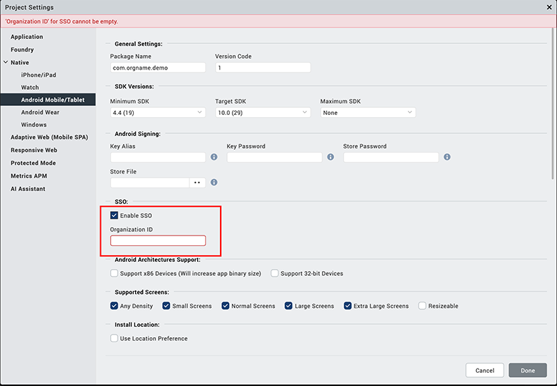
    
2.  Click **Finish**.

#### Enabling SSO for the upgraded versions of Iris

To enable SSO when Iris is upgraded from V8 SP3 or previous versions to V8 SP4 or higher versions, do the following:

1.  Under **Project Settings** > **Native** > **Android** > **Mobile/Tablet**, select the **Enable SSO** check box in **Miscellaneous**.
2.  In the **Manifest Properties and Gradle Build Entries**, remove the existing SSO tags from the following fields:
    *   `<manifest>` tag
    *   `<application>` tag
3.  Click **Finish**.
    
    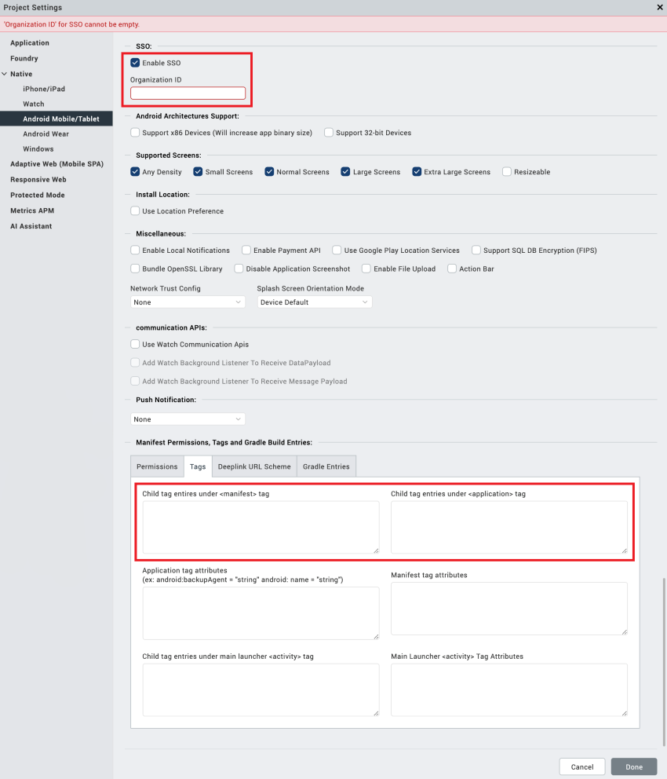
    

#### Enabling SSO for Iris version V8 SP3 or previous versions

To enable SSO for Iris version V8 SP3 or previous versions, do the following:

1.  Open the Android native specific project/application settings in Iris. For more information, refer to the [Set Native App Properties]({{ site.baseurl }}/docs/documentation/Iris/iris_user_guide/Content/Native_App_Properties.html) topic in Iris.
    
    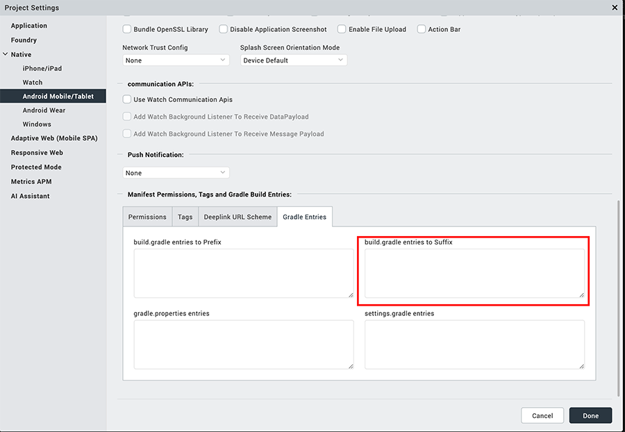
    
2.  If a developer wants to restrict the broadcast of the SSO token to a specific group of apps, then the developer must declare a permission that is used by the apps.
    
    Add the below code to declare a permission in the child tag entries under the manifest tag:
    
 <permission android:name="com.voltmx.sso" android:protectionLevel="signature">
  <uses-permission android:name="com.voltmx.sso"> 
  </uses-permission>
</permission> 
4.  The permission must be added to the receiver tag present in the child tag entries under the applications tag:
 <receiver android:name="com.voltmx.sso.SSOTokenReceiver" android:permission="com.voltmx.sso">
  <intent-filter> 
         <action android:name="com.voltmx.ssobroadcast"/>
  </intent-filter>
  <intent-filter>
         <action android:name="com.voltmx.ssoappinstalled"/>
  </intent-filter>
</receiver> 
6.  The permission tag as well as the user-permission tag has to be added in all the apps since the order in which the apps are installed is not known.
    
7.  If the permission tag is not added, then any app that has access to the intent filter com.voltmx.ssobroadcast can receive and send the broadcast which will compromise on the security of the apps.
    
8.  The com.voltmx.sso is a user-defined string that needs to be added to ensure the security. One of the apps need to declare the permission and the other apps can use the android permission.
    
    > **_Note:_** The string com.voltmx.sso is a PERMISSION\_STRING. For all the apps that intend to share the same SSO token, the string must be the same. This string must be different for different SSO groups.
    
9.  The action android.intent.action.PACKAGE\_ADDED should be added as each app needs to listen for a system intent which will broadcast when a new app is installed.
    
10.  To initiate SSO in the newly installed applications on Android device, call `voltmx.sdk.util.initializeSSO()` in the Pre-App Init of the application.
    

### **iOS**

**Follow the below steps to enable SSO in iOS:**

1.  Open the project in Xcode.
2.  Under the **Capabilities** section, enable the **Keychain Sharing** option.
3.  Add an entry in the **Keychain Groups**.
    
    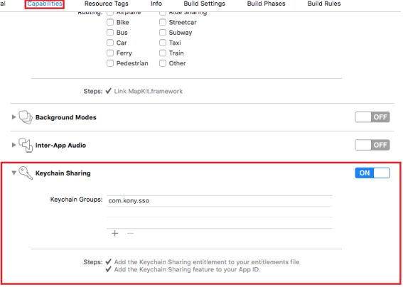
    
4.  Add an entry in the info.plist file.
    
    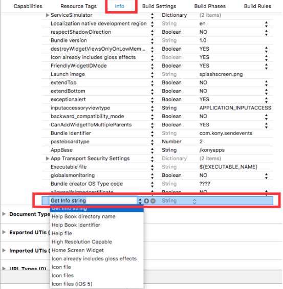
    
5.  Enter the key name as VOLTMX\_SHARED\_KEYCHAIN\_GROUP and keychain group name with organization unit value as a prefix as the value.
    
    The keychain group name will be the same name created under **Keychain Sharing** section.
    
    For example:
    
     VOLTMX_SHARED_KEYCHAIN_GROUP = PM7352S8QE.com.voltmx.sso
    
    
    
    
    Here `PM7352S8QE` is an Organizational Unit value in the certificate as shown in the following, which can be obtained from the developer certificate.
    
    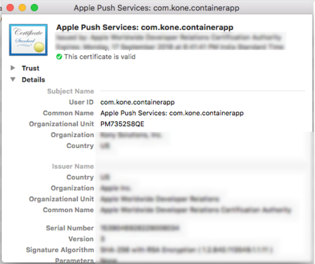
    
    > **_Important:_** For all apps that intend to share the same SSO group, the key name string must be the same. The key name string must be different for different SSO groups.
    

Build Apps for Distribution
---------------------------

After the apps are built, they can be pushed to the [EMM enterprise store]({{ site.baseurl }}/docs/documentation/management/voltmxemm/Content/VoltMX_Management_User_Guide.html#Device_Agent.html) / any public app store. Users can select the required apps (BankApp and TradeApp) to download and install on their device.

> **_Note:_** Ensure the new version of the apps are consumed by the end user specifically in scenarios where Volt MX Foundry apps were unpublished and then republished.

Scenario 1

Tom uses two mobile apps on his mobile phone: BankApp and TradeApp. Both the mobile apps use the same identity service Volt MX Userstore in their Volt MX Foundry backend.

Tom launches the BankApp on his mobile phone and enters the user credentials to login to the application. On successful authentication, the next screen of the BankApp is displayed. Now, Tom launches the TradeApp. Tom can directly view the next screen of the TradeApp without logging to the application.

As both the mobile apps use the same identity service in their Volt MX Foundry backend, the SSO functionality is implemented on the login form(init) of the selected identity service.

> **_Note:_** SSO login functionality works till the SSO token is expired. Once the token is expired, user will be prompted to provide the login credentials whenever user tries to access the apps.

**Scenario 2**

Tom uses two mobile apps: BankApp and TradeApp. Both the mobile apps use different identity service: the BankApp uses **VoltMX Userstore** and the TradeApp uses **OpenLDAP** identity service in their Volt MX Foundry backend.

Tom launches the BankApp on his mobile phone and enters the user credentials to login. On successful authentication, the next screen is displayed. Now, Tom launches the TradeApp. If the SSO login is not triggered at the login form (init) of the TradeApp, an error -48 is displayed. Tom needs to enter the user credentials to login. The SSO token is updated with the link between the identity services. On successful authentication, the next screen is accessed.

> **_Note:_** All the subsequent SSO logins do not require the above steps to login. The next screen can be accessed without logging to the application again.

> **_Note:_** SSO login functionality works only till the SSO token is expired. Once the token is expired, user will be prompted to provide the login credentials whenever user tries to access the apps.
