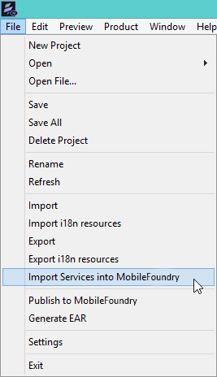

                              

User Guide: [Legacy Services](Legacy_Serivces.html) > CSD App - Files and Folders

Migrate a Consolidated Service Definition to Volt MX Foundry
===========================================================

You can import apps into Volt MX Iris that are originally created manually or with external tools. Such apps are called as **Consolidated Services Definition (CSD)** apps. A CSD app can contain a combination of [non-legacy services (for example, XML, JSON, SOAP, and Java)]({{ site.baseurl }}/docs/documentation/Foundry/voltmx_foundry_user_guide/Content/Services.html) and legacy services (SAP JCo connector or Scraper connector).

A CSD app comprises multiple artifacts such as service definition, sync configuration, and jars. You cannot directly import a CSD app directly into Iris as the folder structure of a CSD app is different from the folder structure of an IDE app. To migrate a CSD app to Iris, copy all files based on the defined format within the existing app folder. The following sections provide more details.

Prerequisites
-------------

A CSD app created manually or through external tools must contain the required files and folders that are listed in the following section.

CSD App - Files and Folders
---------------------------

A CSD app contains the following folders and files.

*   **dsl** - The dsl folder contains one `.properties` file and `.dsl` files. The dsl folder is only for scraper services.  
    The name of the properties file should match the app name.
    
*   **files** - The files folder contains .properties for SAP JCo/Siebel.
    
*   **lib** - The lib folder contains jars required by an app. The lib folder is only for scraper services.
*   **wsdl** - The wsdl folder contains the following additional files for SOAP services:
    *   **mapping.json**: contains mapping file for wsdl source to operation names using that wsdl source (URL/file).
        
         // Sample entry in the mapping file in JSON format:  
          
        {
            "partner.wsdl": [
                "convertLead",
                "create"
            ],
            "http://wsf.cdyne.com/WeatherWS/Weather.asmx?wsdl": [
                "GetCityForecastByZIP",
                "GetCityWeatherByZIPtest"
            ]
        }
        
    *   **.wsdl**: contains wsdl files in the mapping entries mentioned above. The mapping entries refer to json entries present in `mapping.json` file.
*   **servicedef.xml**: Servicedef.xml includes all services in the app.
    
*   **syncconfig.xml**: The syncconfig.xml file contains sync definition.
    

CSD App - Folder Structure
--------------------------

When an app that contains SAP JCo services is migrated through Iris, the file name mentioned as a value for the `sapserverfile` config-param must be copied to the `files` folder.

> **_Important:_**  The app name and the app\_ID in the service definition must match.

The following is a sample folder structure of a CSD app.

 \---ServicesApp
    |   servicedef.xml
    |
    +---dsl
    |       exp.dsl
    |       ServicesApp.properties
    |       test9314.dsl
    |       yahooFinance.dsl
    |
    +---files
    |       sap_VOLTMXAWSCRM.properties
    |       sap_Non_SSO.properties
    |       sap_Non_SSO_AutoCommit.properties
    |       sap_Non_SSO_SkyTech.properties
    |       sap_Non_SSO_SkyTech2.properties
    |       sap_SapServer.properties
    |       sap_SAP_SSO.properties
    |
    +---lib
    |       exelonServices.jar
    |           
    \---wsdl
            mapping.json
            partner.wsdl


Migrating and Importing a CSD App
---------------------------------

To migrate CSD app created to Iris 7.x, follow these steps:

1.  Copy the folders and files from a CSD app. Paste them to your root of the workspace folder that you created for Iris under the app name folder.
    
    For example: `C:\Users\kh1423\Workspace_Folder\Sample_App_Folder\`.
    
2.  In the Iris, go to **File** > **Import Services into Volt MX Foundry**.
    
    
    
    Iris imports your app into Volt MX Foundry.
    
    You can launch Volt MX Foundry to view newly imported services in the app.
    

> **_Important:_** Apps with the same name are not allowed while importing to Volt MX Foundry.

<table style="margin-left: 0;margin-right: auto;" data-mc-conditions="Default.HTML5 Only"><colgroup><col> <col> <col></colgroup><tbody><tr><td>Rev</td><td>Author</td><td>Edits</td></tr><tr><td>7.1</td><td>SD</td><td>SD</td></tr></tbody></table>
