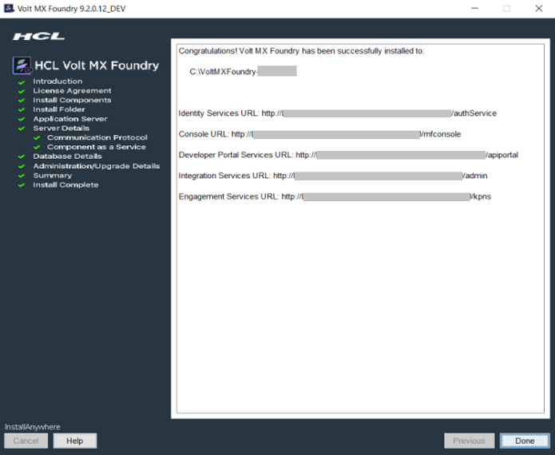
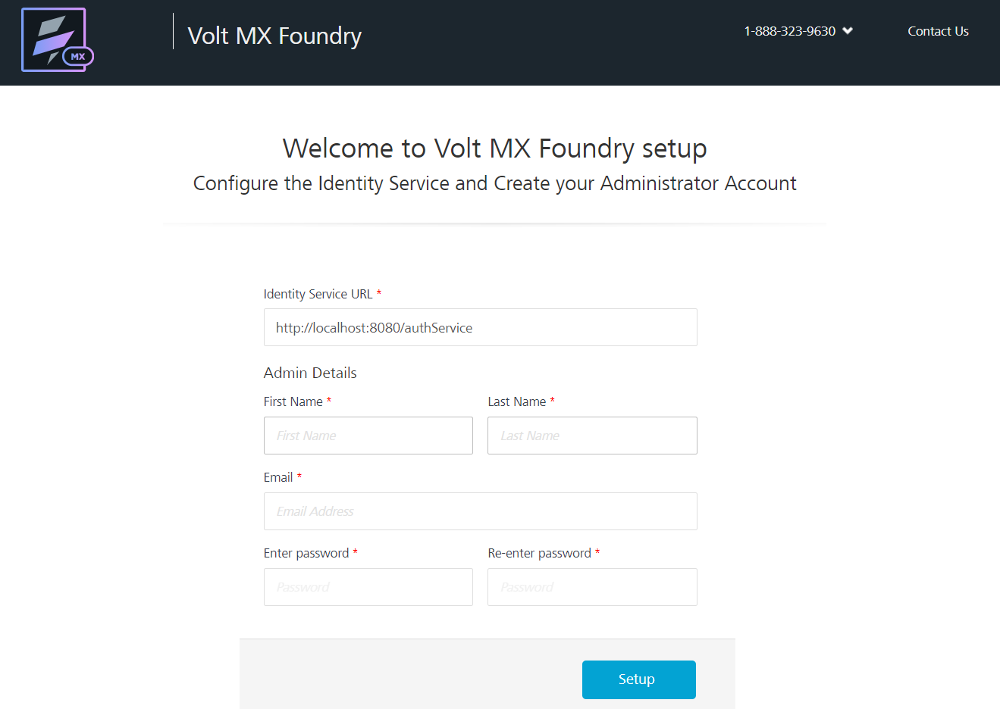
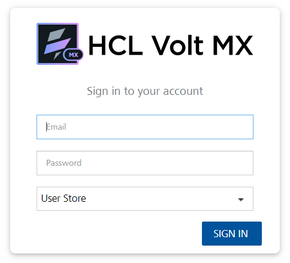

                              

User Guide: How to Get Started with Volt MX Foundry Console

Accessing Volt MX Foundry Console - On-premises
==============================================

Before you use various Volt MX Foundry services, you must create a superuser.

> **_Important:_** **VoltMX Iris and Volt MX Foundry Version Compatibility**   
Volt MX  Iris and Volt MX Foundry support each other for the current release version and the immediate previous version. For example, with Volt MX Iris V8, Volt MX Foundry V8 and V7.3 will be compatible and vice versa.  

To access Volt MX Foundry, follow these steps:

1.  [How to Get Started With Volt MX Foundry Console](#how-to-get-started-with-foundry-console)
2.  [How to Log In to Volt MX Foundry Console](#how-to-log-in-to-foundry-console)

<h2 id="how-to-get-started-with-foundry-console"> How to Get Started With Volt MX Foundry Console</h2>

> **_Note:_** If you have installed Console and Identity Service along with one or more Volt MX Foundry components such as **Integration**, **Engagement** and **Sync** services on **Tomcat** or **JBoss** on a **single node**, you can directly log in to Volt MX Foundry Console as you have already created your super administrator account.   
While installing Volt MX Foundry components with above combination, the **Administrator Account Configuration** window helps you to configure your super administrator account.

After Volt MX Foundry is installed, you need to configure identity services, and create your administrator account. Based on the installation, you will see the list of URLs in the **Install Complete** window shown below:

To launch Volt MX Foundry Console, follow these steps:

1.  From the **Install Complete** window, copy the **Console URL**, and run it in your web browser.  
    
    > **_Note:_** Bookmark the URL for quick access.
    
    The **Welcome to Volt MX Foundry setup!** page appears if you have not configured your identity services.
    
    
    
    > **_Note:_** Fields marked with an asterisk are mandatory.
    
2.  In **VoltMX Identity Service URL** text box, enter Identity Service URL from the **Install Complete** page.
3.  In the **Admin Details**, enter the following details:
    *   **First Name**: Enter the first name of the user.
    *   **Last Name**: Enter the last name of the user.
    *   **Email**: Enter the email address of the user. It can include alphanumeric and special characters that follow standard email address form.
    *   **Enter password**: Enter the password for the user. It can be a combination of alphanumeric and special characters.
        
    *   **Re-enter password**: Retype the password to ensure the user's identity.
        
4.  Click **Setup**.  
    Once the details are validated for one-time configuration, the system will:
    *   Associate your credentials with Volt MX Foundry identity services and authorization services.
    *   Display the **Sign in to your Volt MX Account** page.  
        

<h2 id="how-to-log-in-to-foundry-console">How to Log In to Volt MX Foundry Console</h2>

If you have configured identity services and created your administrator account (VoltMX Foundry superuser account), you can log in to the Volt MX Foundry console. A superuser will have owner permissions by default.

1.  Go to **VoltMX Foundry Console URL** that you have bookmarked in the previous section. The **Sign in to your account** page appears.
    
    
    
2.  Provide your Volt MX administrator account login credentials (email and password) that you have created.
3.  From the **Source** drop-down list, choose the source type. By default, the **Source** lists the Volt MX User Store.  
    The Source lists configured active directories only if you have configured active directories in the [Settings > User Management > Identity Providers](Settings.html#identity-providers).
    
    The **Domain** drop-down list appears only if you choose Active Directory as the source.
    
    When a username is common across multiple sources and multiple domains in Active Directory, a user is asked to provide the source and domain details for authentication. Because there are users from multiple sources, both the Source and the Domain should be differentiated. A user must provide both the Source and the Domain before authentication occurs.
    

1.  From the **Domain** drop-down list, choose one of the domains of Active Directory.
2.  Click **Sign in**.  
    After your credentials are validated, you are directed to your Volt MX Foundry account. By default, the **Apps** page appears.  
    
    
    
    > **_Note:_** The release version of a console is displayed at the bottom left corner in the console menu pane. The release version is in the following format:  
    `<Major_version> <servicepack> <hotfix> <DEV/QA>`.  
    For example: `V8 SP1 HF4 DEV`
    
    From Volt MX Foundry Console, you can navigate to the following:
    
    *   **Apps**: For more information on **Applications**, refer to [Adding Applications](Adding_Applications.html).
        *   The **Iris Previews** page lists the test live previews that you performed in a particular Cloud account. Volt MX Iris supports the Run Live Preview option that you can use to preview a prototype of your Iris application.  
            For more information on How to user Live Preview in Volt MX Iris, refer [Live Preview]({{ site.baseurl }}/docs/documentation/Iris/iris_user_guide/Content/LivePreview.html)
            
        *   The **Iris Projects** page lists the projects that you published to a particular Cloud. The Project tab in Volt MX Iris contains the Export > Cloud Project option.  
            For more information on How to share a project on the Cloud, refer [Publish your project to the cloud]({{ site.baseurl }}/docs/documentation/Iris/iris_user_guide/Content/ShareProjectOnTheCloud.html)  
            
    *   [API Management](API_Management.html): Configure and manage (create, edit, and delete) app services (identity, integration, and orchestration) without linking or configuring them within an app.
    *   [Developer Portal](VoltMXDevPortal.html): Allows you to create a Portal for exposing APIs created using Volt MX Foundry. Developers from internal and external partner teams can access the portal created to explore and test the APIs.
    *   **Environments**: For more information on **Environments**, refer to [Environments](Environments.html#environments-on-premises).
    *   **Consoles**: The following consoles are available for each cloud account:
    
    *   **App Services**: For more information, refer to [Appendix - App Services.html.](Appendix_-_App_Services.html)
    *   **VoltMX Foundry Sync**: For more information, refer to [VoltMX Foundry Sync]({{ site.baseurl }}/docs/documentation/Foundry/voltmx_sync_console_user_guide/Content/Homepage.html).
    *   **VoltMX Foundry Engagement**: For more information, refer to [VoltMX Foundry Engagement]({{ site.baseurl }}/docs/documentation/Foundry/vms_console_user_guide/Content/Introduction_1.html).
    
    *   For more information on **Reports**, refer to [VoltMX Reporting and Analytics - Standard Metrics and Reports]({{ site.baseurl }}/docs/documentation/Foundry/standard_metrics_reports_guide/Content/standard_metrics_reports_guide.html) "VoltMX Reporting and Analytics - Standard Reports".  
          
        Refer to [Custom metrics and reports]({{ site.baseurl }}/docs/documentation/Foundry/custom_metrics_and_reports/Content/Custom_Metrics_and_Reports_Guide.html)
    *   For more information on **Settings**, refer to [Settings](Settings.html#settings-on-premises).

<h2>How to View Your Login History</h2>

You can view the history of your logins to Volt MX Foundry. The history includes both successful and unsuccessful login attempts. The account options menu shows your last successful login. You can access your login activity log by clicking the last successful login in the user account drop-down menu.

To view the history of logins for your Volt MX Foundry account, do the following:

<ol>
  <li>Click the user account options menu.
    

        
The menu displays the history of your last successful login.

    

      
    

  </li>
  <li>Click <strong>Last successful login</strong>.
     

        
The login activity profile for your account appears. You can search the login activities by stipulating a regular expression or an exact match.

            
You can also access your login activity log by clicking <strong>Profile</strong> in the user account drop-down menu, and then clicking <strong>Activity Log.</strong>

    

      
    

  </li>
</ol>
