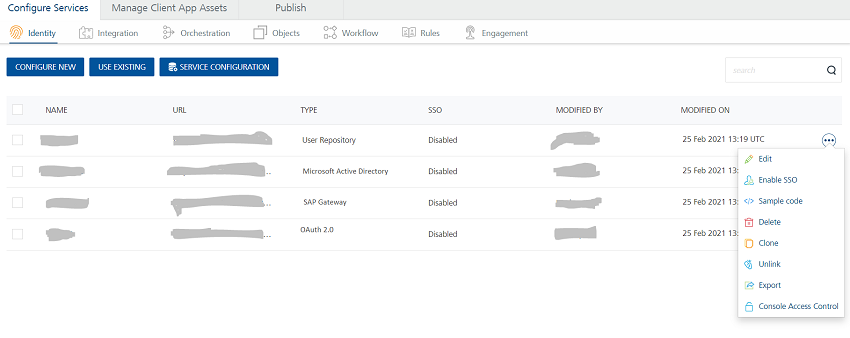

                              

User Guide: [Identity](Identity.html) > [Managing Existing Identity Services](#how-to-use-an-existing-identity-service) > How to Use an Existing Identity Service

How to Use an Existing Identity Service
---------------------------------------

Volt MX  Foundry allows you to use an existing Identity service. You can add more than one services at a time from existing services.

1.  Under the **Identity** page, click **USE EXISTING**.
    
    The **Existing Services** dialog that appears with a list of existing services. The service is added (linked) to your app and is available in the **Identity** page of your app.
    
    > **_Note:_** Existing Services contain a list of services created within the same parent account.
    
2.  Select the check box for the desired services. If you want to add or clone more than one service, select the required check boxes from the existing services.

1.  Click **ADD** button to reuse (link) an existing service. If any changes made to this service, the changes will affect all the apps using this service.
2.  After a service is added successfully, click **CLOSE** to close the process dialog.

How to Unlink or Delete Multiple Existing Identity Services
-----------------------------------------------------------

Volt MX  Foundry allows you to unlink or delete one or more existing identity services from the **Identity** list page.

To unlink or delete multiple existing identity services, follow these steps:

1.  Go to the **Identity** tab. The page lists the existing services (if any). There is a check box provided for each service. By default, the check boxes are cleared for each service in the **Identity** list page.
2.  Select one or more check boxes for services. The quick access bar for the selected services appears with actions such as **Unlink** and **Delete**.
    *   **Unlink**: Allows you remove the service from the Identity tab of an app. When a service is unlinked, it is disassociated from a particular app.
        
        > **_Note:_** If you want to use an unlinked service, select the service from the **[**Existing Identity Service**](#how-to-use-an-existing-identity-service)** dialog.
        
    *   **Delete**: Allows you to delete a service.
        
        > **_Note:_** If a service is a part of a published app, you can delete that service only after you unlink the service from all the published app.
        
    *   **Clear All**: Allow you to clear the selection.
3.  Click the desired (Unlink or Delete) button.
    

Context based Options
---------------------

To perform various actions on an existing service, click the contextual menu of the required service.

The contextual menu contains the following options:

*   **Edit**: Allows you to edit a service. After you edit a service, you have to republish all the apps that are using the service to apply the changes.
    
    > **_Note:_** To know more about publishing an app, refer to [Publish an app](Publish.html).
    
*   **Enable SSO**: Allows you to enable SSO between the mobile app and other apps that use the Identity service. You must republish the app for the new setting to take effect. If a Volt MX Foundry app uses multiple identity services, you must enable SSO for all the identity services linked to the Volt MX Foundry app. For more information about SSO for applications, see [Application SSO](Overview_AppSSO.html#AppSSOoverview).
*   **Sample Code**: A dynamic code is generated based on the configuration of a service. You can use this code in your SDK.
    
*   **Delete**: Allows you to delete a service.
    
    > **_Note:_** If a service is part of a published app, you can delete that service only after you unlink the service from all the published apps.
    
*   **Clone**: Allows you to duplicate an existing identity service.
    
    > **_Note:_** From Volt MX Foundry V8 SP3 onwards, when you click **Clone**, the system generated new name appears for the cloned identity service, in the list. The new name remains in the edit mode until you click anywhere else on the screen. If you want, you can rename it. Changes made to a cloned identity service will not impact the original service.
    
*   **Unlink**: Allows you remove the service from the **Identity** tab of an app. When a service is unlinked, it is disassociated from a particular app.
*   **Export**: Allows you to export the identity service into your local system. The exported Volt MX Foundry Service Package is a file .zip file. You can import the service package to your app in [API Management > Identity](API_Management.html#identity-service).
    
*   **Console Access Control**: Controls the access to the applications and services of apps. Refer to [Console Access Control](ConsoleAccessControl.html).
