                              

User Guide: [Identity](Identity.html) > [Configure the Identity Service](ConfigureIdentiryService.html) > [Microsoft Active Directory](#microsoft-active-directory-identity-service) > [Azure Active Directory - Identity Service Integration](#identity-service-integration-with-azure-active-directory) > SAML

Microsoft Active Directory Identity Service
-------------------------------------------

You can enable Microsoft Active Directory authentication for your application so that only those users listed in Active Directory can access your application.

> **_Note:_**  NTLM authentication is not supported by Microsoft Active Directory identity service.

### Configuring a New Active Directory Service

The process of configuring your Active Directory service depends on the authentication mode. Volt MX Foundry supports the following authentication modes:

*   Security Assertion Markup Language ([SAML](#saml)) - An XML based open standard data format for exchanging authentication and authorization data between parties, in particular, between an identity provider and a service provider.
*   Lightweight Directory Access Protocol ([LDAP/LDAPS](#ldap-ldaps)) - An open source application protocol that is commonly used for single sign-on (SSO) where one user's password is shared among various apps. The following LDAP protocols are supported:
    *   LDAP without SSL - Your credentials are not encrypted before sending them for authentication.
    *   LDAPS (with SSL) - Your credentials are encrypted before sending them for authentication.
*   [Identity Service Integration with Azure Active Directory](#identity-service-integration-with-azure-active-directory)
    

#### SAML

To create an Active Directory service using **SAML** authentication mode, follow these steps:

1.  Under the [Identity service designer](ConfigureIdentiryService.html#IdentitySDpage) page, type a name for the service in the **Enter Service Name** text box.
2.  From the **Type of Identity** list, select **Microsoft Active Directory**.
3.  From the **Auth Mode** list, select **SAML**.
4.  Download metadata from your identity provider from the following link:  
    
    [How to download metadata from Active Directory Federation Service (ADFS)](http://blogs.technet.com/b/rmilne/archive/2014/04/28/how-to-install-adfs-2012-r2-for-office-365.aspx)
    

1.  From the **Metadata Mode**, select an option to upload metadata.
    *   If you click **Metadata File**, the system displays **Metadata File** option. Click **Browse** to navigate to your identity provider metadata file that you downloaded, and  then click **Open**. The system uploads your metadata file - for example, idpmetadata.xml.
    *   If you click **Metadata URL**, the system displays **Metadata URL** text box. Enter the URL for the metadata.
2.  Under the **Choose Assertion Consumer Service Binding**, by default, this field is set to the Artifact Binding. Choose one of the following options:
    *   **Artifact Binding** – to transmit SAML request and response messages in a single protocol using two different bindings.
        
    *   **Post Binding** - to transmit SAML protocol messages within the encoded content of an HTML form control.
        
3.  In the **Mapping of IDP SAML attributes (Optional)**, provide the information if required. This information is used for fetching profile or other information and to retrieve user information from an identity provider while logging in through SAML protocol.
    *   For example, In the Mapping of LDAP attributes to outgoing claim types, you must map at least one attribute to the Name ID as SAML validates the Name ID attribute. If the Name ID is not mapped, the system throws an exception. The Name ID should not be empty - for example, User-Principal-Name to Name ID.
        
        Other mappings are optional - for example, Given-Name, Surname.
        
4.  Click **Save** to create your identity provider.
5.  Publish the app to an environment. The system generates the service provider's metadata for your identity provider.
    
6.  To view the service provider's metadata, click the **Download app documentation** button in the **Published Environment** box.
7.  Click **SAML Metadata** and then select the desired metadata from the list.  
    The system downloads the metadata file generated by your authentication service (service provider) into your local system. For example, spmetadata.xml.
    
    
    
8.  Upload service provider's metadata to your identity provider (ADFS). For more details, refer to [How to Upload Service Provider's Metadata to ADFS](#how-to-upload-service-provider-metadata-to-active-directory-federation-service-adfs).
9.  In the **Publish** tab, navigate to your published app, and use the [app key and app secret of your app to build the app](Publish_LifeCycle.html#code-results-of-a-published-app).
10. Build your app by using Volt MX Foundry SDKs, and deploy the app to a device.
11. From the device, log in to your app by using the SAML identity provider that you configured.
    
    After you are authenticated successfully, the system retrieves the profile information from the identity provider. The profile information depends on mapped attributes. If no attributes are mapped, Volt MX service provider shows an empty profile.
    
    > **_Note:_** You can view the service in the Data Panel feature of Volt MX Iris. By using the Data Panel, you can link back-end data services to your application UI elements seamlessly with low-code to no code. For more information on Data Panel, click [here]({{ site.baseurl }}/docs/documentation/Iris/iris_user_guide/Content/DataPanel.html#top).
    

#### How to Upload Service Provider Metadata to Active Directory Federation Service (ADFS)

To upload your service provider's metadata to ADFS, follow these steps:

1.  Log in to your IDP Active Directory Federation Services 2.0 (AD FS).
    
    
    
    > **_Note:_** If your AD FS is configured on a system different from the current system, you need to copy the metadata file to your AD FS system.
    
2.  In the left pane, navigate to **AD FS > Trust Relationships > Relying Party Trusts**.
3.  From the **Actions** pane, click the **Add Relying Party Trust**. The **Add Relying Party Trust Wizard** appears.
    
    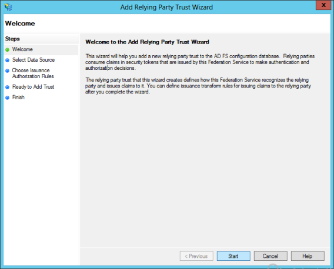
    
4.  Click **Start**.
5.  In the **Select Data Source**, select the **Import data about the relying party from a file** option. Click **Browse** to locate the metadata file that you just downloaded - for example, `spmetadata.xml`.
    
    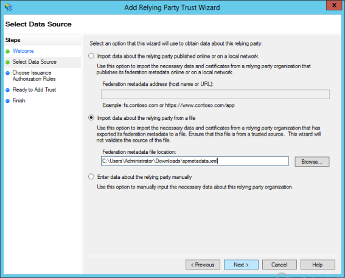
    

1.  Click **Next**. The following message window appears.
    
    
    
2.  Click **OK** to close the message window and to proceed.
3.  In the **Specify Display Name**, enter the name, and click **Next**.
    
    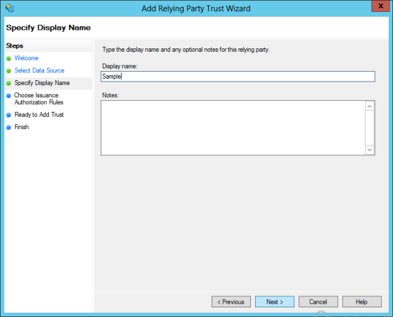
    
4.  Select the **Permit all users to access this relying party** if that option is not already selected, and click **Next**.
    
    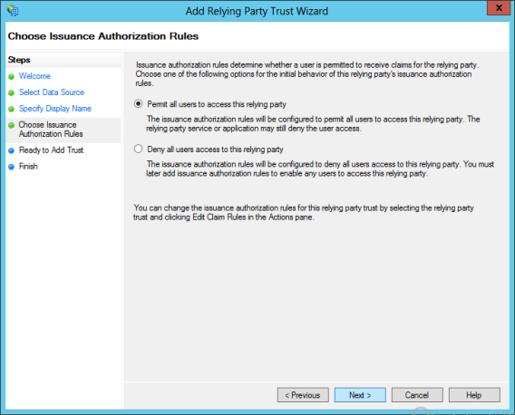
    
5.  In the **Ready to Add Trust**, under the **Monitoring** tab, leave the fields as they are, and then click **Next**.
    
    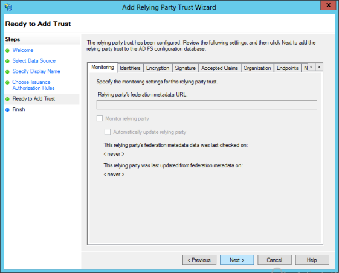
    
6.  In the **Finish**, click **Close**.
    
    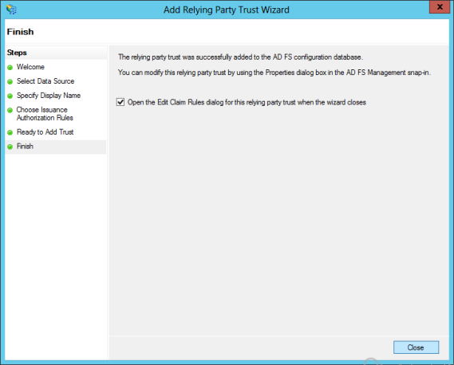
    
    The **Edit Claim Rules** dialog appears. You need to configure the claims that you want to return by AD FS.
    
    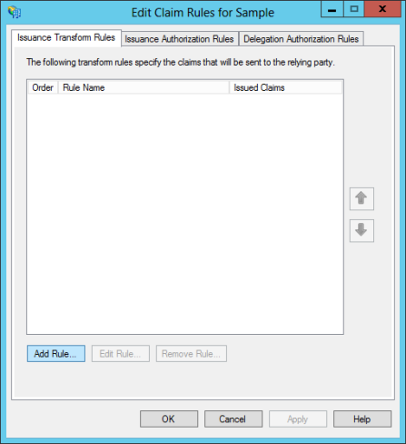
    
7.  Click **Add Rule**. The **Add Transform Claim Rule Wizard** dialog appears.
    
    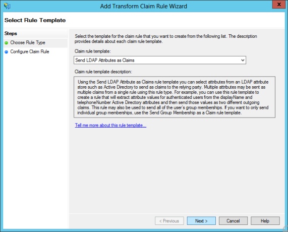
    
8.  From the **Claim rule template** list, select the **Send LDAP Attributes as Claims**, and then click **Next**.
    
    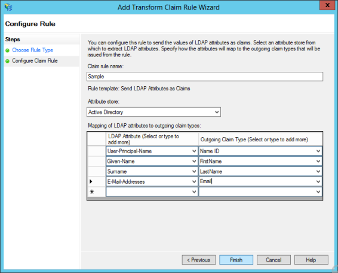
    
9.  In the **Choose Rule Type**, enter the following details:

1.  In the **Claim rule name** text box, enter the name for the rule.
2.  From the **Attribute store** list, select **Active Directory**.
3.  In the **Mapping of LDAP attributes to outgoing claim types**, you must map at least one attribute to the **Name ID** as SAML validates the Name ID attribute. If the Name ID is not mapped, the system throws an exception. The Name ID should not be empty - for example, **User-Principal-Name** to **Name ID**.
    
    Other mappings are optional - for example, Given-Name, Surname.
    
4.  Click **Finish**. The system creates the rule and displays the **Edit Claim Rules** dialog.
    
    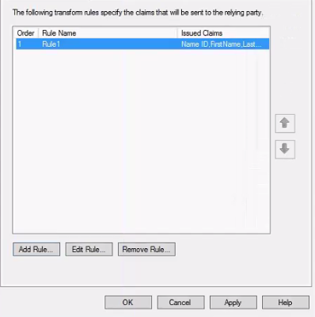
    

11. Click **Apply**, and then click **OK**. The identity provider is configured, and the system displays the **IDP AD FS** dialog.

#### LDAP/LDAPs

To create Active Directory service **using **LDAP/LDAPS** authentication**, follow these steps:

1.  Under the [Identity service designer](Identity.html#IdentitySDpage)** page, type a name for the service in the **Enter Service Name** text box.
2.  From the **Type of Identity** list, select **Microsoft Active Directory**.
    
3.  From the **Auth Mode** list, select **LDAP/LDAPS**.
4.  Under **Configure Active Directory**, provide the following details:
    1.  In the **Domain Name** text field, enter a name.
    2.  In the **LDAP URL** field, enter the fully qualified LDAP URL for example: `ldap://myldapserver.com:389`
    3.  In the **Root Domain** field, enter the distinguished root domain name. For example, `dc=mycompany,dc=com`
    4.  In the **Root Domain Scope** field, enter the scope under which it needs to search for users. For example, `dc=mycompany`, `dc=com`, and `OU=users`.  
        If the root domain scope is not defined, the **Root Domain Scope** field will default to the root domain. If the root domain scope is defined, only the scope is considered, and the root domain is ignored.
        
        > **_Note:_**  Base DN for LDAP search. If unspecified, it will default to Root Domain.
        
    5.  In the **Login Attribute**, select the appropriate identifier from the drop-down list.
        *   **userPrincipalName (UPN)**: The UPN is an Internet-style login name for the user based on the Internet standard RFC 822. The user logon name format is : `testuser@domainname.com`
            
        *   **samAccountName**: The user logon name format is : `domainname\testuser`.
    6.  In the **Federation ID**, select the appropriate identifier from the drop-down list.
5.  After entering the above details, click on the **Test Login** button to verify the credentials. The test results are displayed in the **Identity Response** dialog.
6.  Click the **Advanced** to provide additional configuration of your service definition:
    *   Now you can enable or disable the integrity check for an identity service at the provider level. If the integrity is disabled at the provider level, then the provider is meant for server-to-server communication only. To disable the integrity check, In **Advanced**, select the **Restrict to Foundry Server to Server Authentication** check box. This setting blocks a traditional client app from using an identity service. It will only allow the identity service to be used from a Volt MX Foundry Server to authenticate and invoke services.
    *   **Concurrent User Logins**: Select one of the following three options to configure concurrent user login sessions. For more information, refer to [Concurrent User Logins](ConcurrentUserLogins.html).
        *   **Allow concurrent user sessions (no restrictions)**: When this option is selected, an app user with unique credentials is allowed to have multiple apps from different instances.
        *   **Allow only one active user session per app**: Logging into simultaneous instances of **the same app** is not supported. When this option is selected, an app user can log in to only one instance of client apps linked to a specific Foundry app which has the identity service linked.  
            
        *   **Allow only one active user session across all apps**: Logging to simultaneous instances of **the same app or across apps** is not supported. When this option is selected, a unique app user can log in to only one instance of client apps linked to all Foundry apps using the identity service.  
            
            > **_Important:_** Apps enabled for SSO will not work if the option is selected, Allow only one active user session across all apps.
            
7.  After entering the above details, click **Save** to save the service. The system displays the **Identity** page. The new identity service is created for your app.
    
    > **_Note:_** You can view the service in the Data Panel feature of Volt MX Iris. By using the Data Panel, you can link back-end data services to your application UI elements seamlessly with low-code to no code. For more information on Data Panel, click [here]({{ site.baseurl }}/docs/documentation/Iris/iris_user_guide/Content/DataPanel.html#top).
    

Identity Service Integration with Azure Active Directory
--------------------------------------------------------

You can configure Azure Active Directory (AD) to act as an identity service to support authentication of users through the SAML protocol. To enable single sign-on (SSO), configure Azure Active directory users and the Volt MX Foundry app on the Azure portal.

### How Service Integration with Azure Active Directory Works

A mobile app user attempts to access a resource on the service provider (the Volt MX Foundry identity service). The user does not have a current logon session on the identity service site. The federated identity that the user needs to access the service provider is managed by the identity provider (Azure AD). Azure AD provides a Unique Name ID that the service provider uses as the federated ID for the user.

The user is sent to the identity provider (Azure AD) to log on. The identity provider responds by sending a SAML web SSO assertion for the user's federated identity back to the service provider. In this case, the service provider uses HTTP-Redirect binding to deliver the SAML AuthnRequest message to the identity provider. The service provider uses the HTTP-POST binding to return the SAML Response message that contains the assertion to the service provider. The following figure illustrates the message flow.

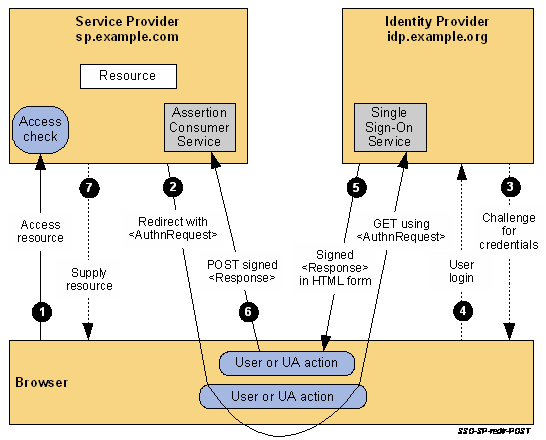

### Process Overview

The following describes the basic steps for configuring Azure AD to act as an identity service to support authentication of users through the SAML protocol.

1.  Create the Azure AD application and configure the identity provider.

Create the Azure AD app before you create the service provider (the Volt MX Foundry identity service).

Configure the App ID URI and Sign-On URL on the Azure AD app. For the App ID URI, you use an ID that is consistent with the format of the entity ID of a service provider. You configure the Reply URL on the Azure AD app after you have created the Volt MX Foundry identity service.

Collect the endpoints for federation metadata and the sign-on URL from the Azure AD app.

5.  Create the Volt MX Foundry identity service.

Use the metadata URL that you collected from the identity provider to create the identity service in Volt MX Foundry.

7.  Copy and save the entity ID for the Volt MX service provider.
8.  Edit the Azure AD app, and change the APP ID URI of the Azure AD app to that of the entity ID of the Volt MX service provider. Configure the Reply URL by copying the reply URL from the Volt MX service provider.

### Configure the Identity Provider on the Azure Portal

To configure the identity provider on the Azure AD directory, do the following:

1.  Sign into the Azure classic portal.
2.  Click on the Active Directory icon on the left menu, and then click on the desired directory.

If you have not created an Azure AD directory, you can add an Azure AD directory in the Azure Management Portal. Select the **Active Directory** extension on the left and click **Add**.

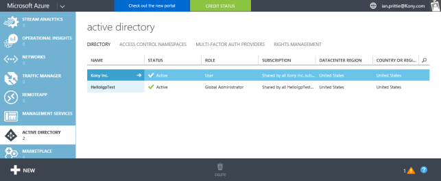

5.  On the top menu, click **Applications**.

If you have not added any apps to your directory, this page shows only the Add an App link.

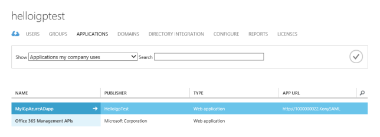

8.  Click on the **Add** button on the command bar.

The **What do you want to do** page appears.

10. Click **Add an application my organization is developing**.

The **Tell us about your application screen** appears. You can indicate the type of application you are registering with Azure AD. Use the default, Web application and/or Web API.

12. Specify a name for your application, and then click the arrow icon on the bottom-right corner of the page.

The **App properties** screen appears.

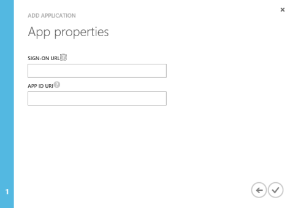

15. Under **Sign-On URL**, provide the URL where users can sign-in and use your app. You can change this URL later after you create the Volt MX Foundry identity service.
16. Under **APP ID URI**, provide a unique URI that Microsoft Azure AD can use for this app. You can change this value later.

Enter a temporary URI that that is consistent with the format of the entity ID of a service provider (the Volt MX Foundry identity service). For example, http://100000002.VoltMXSAML.

Later, after you create the Volt MX Foundry identity service, copy the entity ID for the identity service and enter it as the APP ID URL for the Azure AD app.

19. Click the check box in the bottom-right hand corner of the page.
20. Click **View Endpoints**.

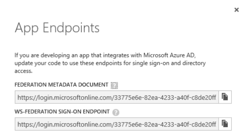

22. Copy and save the **Federation Metadata Document URL**.

This is the URL for the federation metadata document that your Volt MX Foundry app uses for authentication through Microsoft Azure AD.

24. Copy and save the **WS-Federation Sign-On Endpoint**.

This is the endpoint that your mobile app should send sign-on and sign-out requests to when using the WS-Federation protocol. Authentication responses will be sent to the Reply URL for the app.

26. Close the App Endpoints window.
27. Click **Configure**.
28. Under **Single Sign-On**, in **Reply URL**, enter the reply URL, if available, from the Volt MX Foundry identity service.

If the Volt MX Foundry identity service that you create provides a reply URL, copy and use the reply URL from the identity service as the reply URL for the Azure AD app.

31. Under **Permissions to Other Applications**, provide the appropriate application permissions so the Volt MX Foundry app can access and use Azure AD for purposes of authentication.

33. Click **Save**.
    
    > **_Note:_** You can view the service in the Data Panel feature of Volt MX Iris. By using the Data Panel, you can link back-end data services to your application UI elements seamlessly with low-code to no code. For more information on Data Panel, click [here]({{ site.baseurl }}/docs/documentation/Iris/iris_user_guide/Content/DataPanel.html#top).
    

### Configure the Service Provider on the Volt MX Foundry Portal

After you create the identity provider on the Azure AD directory, create the service provider on the Volt MX Foundry portal. The following is the procedure for creating the service provider (the Volt MX Foundry identity service) that uses Azure AD to act as an identity service to support authentication of users through the SAML protocol.

1.  After you create an application, in the **Configure Services** tab, click the **Identity** service tab, if not selected.
2.  In the Identity page, click **Configure New** to create an identity service.

The identity service designer appears.

4.  Type a name for the service in the **Enter Service Name** text box.
5.  From the **Type of Identity** list, select **Microsoft Active Directory**.
6.  From the **Auth Mode** list, select **Azure Active Directory (SAML).**
7.  From the **Metadata Mode**, select **Metadata URL**.

The Metadata URL text box appears.

9.  Enter the URL for the Federation Metadata Document that you copied from your Azure AD app.
    
    Volt MX Foundry provides the entity ID and reply URL of the identity service.
    
    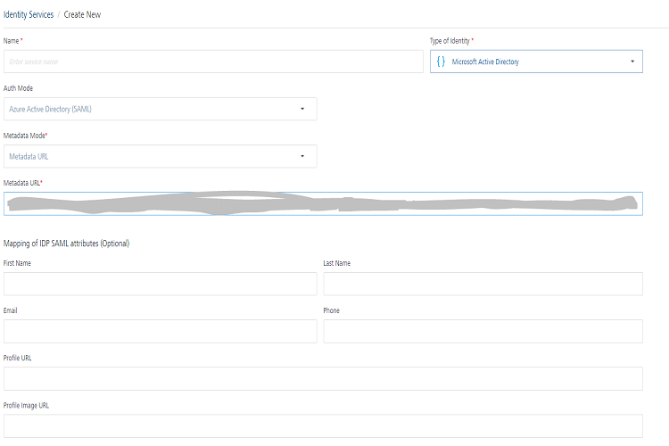
    
10. In the **Mapping of IDP SAML attributes (Optional)**, provide the information if required.

This is used for fetching profile or other information and to retrieve user information from an identity provider while logging in through SAML protocol.

12. Click **Save** to create your identity provider.
13. Publish the app to an environment. The system generates the service provider's metadata for your identity provider.
14. Copy the entity ID and reply URL for the identity service.
    
    Change the APP ID URI of your Azure AD app to that of the entity ID for the identity service. Change the REPLY URL of your Azure AD app to that of the reply URL for the identity service.
    

Steps to copy the entity ID and reply URL for Identity Service.

    
**Pre-Requisite** - App must be in published state to copy the steps.
    
**Steps:**
    
1.  Go to **Publish** tab.
2.  On the relevant **Environment** click **Download**. **Azure SAML Endpoints** option appears.
        
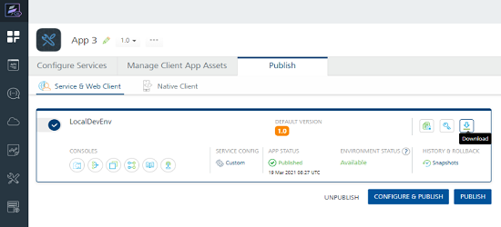
        
3.  Click on it to view the **Entity ID** and **Reply URLs** for all Azure SAML providers linked to the app.
        
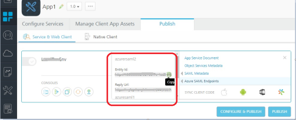
        
4.  Mouse hover on the values and click **Copy** to copy the value.

    
15. To view the service provider's metadata, click the **Download app documentation** button in the **Published Environment** box. Click **SAML Metadata** and then select the desired metadata from the list.  
    The system downloads the metadata file generated by your authentication service (service provider) into your local system. For example, spmetadata.xml.
    
    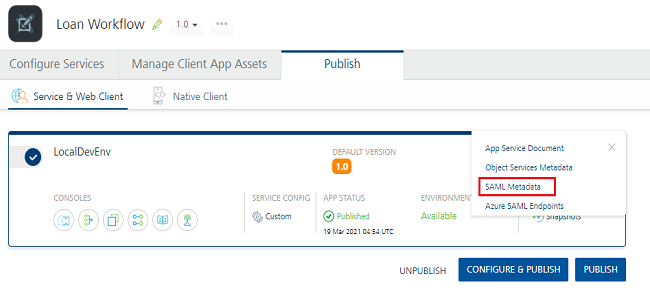
    
    > **_Note:_** You can view the service in the Data Panel feature of Volt MX Iris. By using the Data Panel, you can link back-end data services to your application UI elements seamlessly with low-code to no code. For more information on Data Panel, click [here]({{ site.baseurl }}/docs/documentation/Iris/iris_user_guide/Content/DataPanel.html#top).
