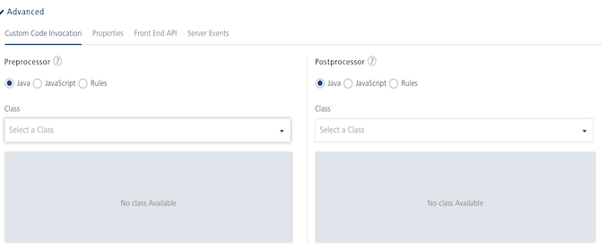
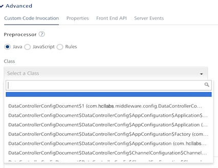
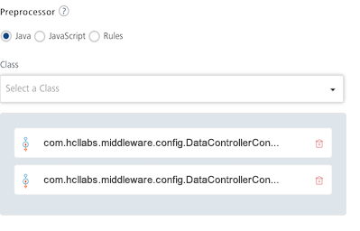
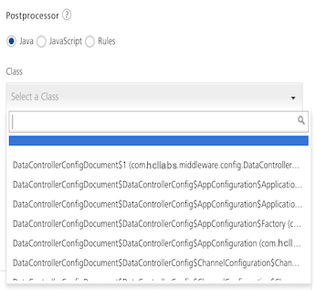
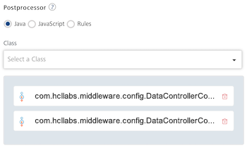

User Guide: [Integration](Services.html#integration) \> [Advanced Configurations](Advanced_Configurations.html) > Exception Handling in Preprocessor - Support to access config map as part of onException handler

## Custom Code Invocation - Preprocessor and Postprocessor

Configure the parameters for the preprocessor and postprocessor to filter the request and response objects for your business requirements. You can specify the Java class name or custom JavaScript code or Rules for preprocessor and postprocessor. Java class names contain the preprocessor and postprocessor.

<table>
  <tbody>
    <tr>
      <td><h2 style="text-decoration:underline;">Java Preprocessor and Postprocessor</h2></td>
    </tr>
    <tr>
      <td>
      
The preprocessor and postprocessor are Java classes that implement <b>DataPreProcessor</b>&#47;<b>DataPreProcessor2</b> and <b>DataPostProcessor</b>&#47;<b>DataPostProcessor2</b> interfaces. A developer can write custom code in the <b>execute</b> method of the preprocessor or postprocessor class. 

      
For a sample Java class code, refer to <a href="Java_Pre-Post_Samples.html" target="_blank">Java Sample Code for Preprocessor and Postprocessor</a>. 

      
For various objects (session and request) and the methods with sample Java class code, refer to <a href="https://opensource.hcltechsw.com/volt-mx-docs/java_docs_apis/MiddlewareAPI/index.html" target="_blank">Volt MX App Services API</a> 
      

      <blockquote><b><i>Note:</i></b> You need the <code>middleware-system.jar</code> for defining custom code      
        <b>- For on-premises</b> Volt MX Foundry, you can find the jar within the installation folder <code> &lt;VoltMXFoundryInstallDir&gt; / middleware_home / </code>. You can also download the <code> middleware-system.jar </code> from Admin Console. 
        <b>- For Cloud</b>, contact Volt MX Cloud Support for getting the appropriate middleware-system.jar for your server version. 
      </blockquote>  
      <blockquote><b><i>Note:</i></b> For details on middleware APIs for preprocessor and postprocessor, contact refer to <a href="https://opensource.hcltechsw.com/volt-mx-docs/java_docs_apis/MiddlewareAPI/index.html">Volt MX App Services API</a> 
       </blockquote> 
      </td>
    </tr>
    <tr><td><h2 style="text-decoration:underline;">JavaScript Preprocessor and Postprocessor</h2></td></tr>
    <tr>
      <td>
            
Based on the interface, the preprocessors and postprocessors implement the following objects:  <code> &lt;serviceInputParams&gt; </code>, <code> &lt;request&gt; </code>, <code> &lt;response&gt; </code> and <code> &lt;result&gt; </code>.

            
 VoltMX Foundry supports modifying the result object as JSON object in JavaScript. Two new APIs, <b>resultToJSON</b> and <b>jsonToResult</b> in <b>JavaScript</b>.

            <ul><li>
            For <b>Postprocessor</b>, you must call <b>resultToJSON</b> API which converts result object to JSON object. You can modify the result object as a string. For sample JavaScript code, refer to <a href="JS_Pre-Post_Samples.html#resultToJSONAPI" target="_blank">Sample code for <b>Postprocessor</b></a>.
            </li><li>
            For <b>Preprocessor</b>, you must call <b>resultToJSON</b> API which returns JSON object. You can use the JSON object to modify the result as JSON and reset the result using <b>jsonToResult</b> API. For sample JavaScript code, refer to <a href="JS_Pre-Post_Samples.html#jsontoResultAPI" target="_blank">Sample code for <b>Preprocessor</b></a>.
            </li></ul>
            
You can use these objects and their corresponding methods directly in JavaScript code.For a sample JavaScript code, refer to <a href="JS_Pre-Post_Samples.html">JavaScript Sample Code for Preprocessor and Postprocessor</a>.

      </td>
    </tr>
    <tr><td><h2 style="text-decoration:underline;">Rules Preprocessor and Postprocessor</h2></td></tr>
    <tr>
            <td>
You can use the <b>Rules</b> option to define you custom logic as a set of rules. This option makes defining pre and post processor custom logic closer to human language and is built using <a href="http://mvel.documentnode.com/" target="_blank" title="MVEL is an expression language based on Java-syntax, with some marked differences specific to MVEL.  Unlike Java however, MVEL is dynamically typed (with optional typing), meaning type qualification is not required in the source.">MVEL</a>.   

            
Based on the interface, the preprocessors and postprocessors implement the following structure for rules:  <code> name: "< Name of the rule >"   description: "< Description of the rule >"   priority: < Priority of the rule >   condition: "< Condition to evaluate >"   actions:   - "< Set of actions to execute >" </code>  

            
For more details on How to write Rules, objects, use cases with sample rules, refer to <a href="https://opensource.hcltechsw.com/volt-mx-docs/docs/documentation/Foundry/voltmx_foundry_user_guide/Content/Rules_as_Pre_Post_Processors.html" target="_blank">Rules for Preprocessor and Postprocessor</a>.

      </td>
    </tr>
  </tbody>
</table>

 

The step allows you to further filter the data received from a service call.

1.  Under the **Custom Code Invocation**, follow these steps:

    - Under **Preprocessor**, configure one of the following:

      - For **Java**, you can configure multiple Preprocessors. This is supported for Integration/Orchestration services and Object services. If you have defined your logic for multiple preprocessors in the uploaded JAR file in the service definition, you can select the available one or other preprocessors. You can arrange the selected pre-processors to be executed in the desired order during the operation call.
      

Use Case 

          When customers have a large amount of custom code, the maintainability of the code becomes an issue. The issue becomes much more complicated when multiple stakeholders working on custom code. In such cases, the custom code can be split into multiple pre/post processors so that stakeholders can work on their respective modules. This increases the upgradability and maintainability of the custom code.  
      

      Select **Java**, and from the **Class** list, select a preprocessor class. You can select one or more classes.  
       This step enables a developer to include any business logic on the data before sending the response to a mobile device.

      

      

      - Select **JavaScript** to open a text box. Here, you can write custom JavaScript code for the preprocessor.

        **JavaScript Code Validation for the Preprocessor:** You can validate your JavaScript Code for the preprocessor before saving an operation. To validate the JavaScript code, click the Validate icon in the JavaScript code text box for the preprocessor.
         
          
         

        **The following are different scenarios that occur when you validate the JavaScript code for the Preprocessor:**

        - If you click **Validate**, and if the JavaScript code has **no errors**, the Validate Successful message appears. You can save the operation.
        - If you click **Validate**, and if the JavaScript code **has errors**, the **Error** message dialog is displayed with a **Download** link to the validation results. When you click **Download**, a .txt file with the validation results will be downloaded to your local system. In this case you must provide a valid JavaScript code, validate the updated code, and only then you can save the operation.

          > **_Important:_** If you have validated the JavaScript code and found errors, the Console does not allow you to save the operation.

        - If you do not want to validate the JavaScript code for the Preprocessor, and want to save the operation, do not click **Validate**.

      - Select **Rules** to open a text box. Here, you can write rules for the preprocessor.

    - Under **Postprocessor**, configure one of the following:

      - For **Java**, you can configure multiple Postprocessors. This is supported for Integration/Orchestration services and Object services. If you have defined your logic for multiple post-processors in the uploaded JAR file in the service definition, you can select the available one or other post-processors. You can arrange the selected post-processors to be executed in the desired order during the operation call.

        

Use Case 

        When customers have a large amount of custom code, the maintainability of the code becomes an issue. The issue becomes much more complicated when multiple stakeholders working on custom code. In such cases, the custom code can be split into multiple pre/post processors so that stakeholders can work on their respective modules. This increases the upgradability and maintainability of the custom code.  
        

        Select **Java**, and from the **Class** list, select a postprocessor class. You can select one or more classes.  
        This step enables a developer to include any business logic on the data before sending the response to a mobile device.**  
          
        **You can rearrange the order of the classes to be executed, if required.\*\*  
          
         

      - Select **JavaScript** to open a text box. Here, you can write custom JavaScript code for the postprocessor.

        **JavaScript Code Validation for the Postprocessor:** You can validate your JavaScript Code for the postprocessor before saving an operation. To validate the JavaScript code, click the Validate icon in the JavaScript code text box for the postprocessor.
         
        
         

        **The following are different scenarios that occur when you validate the JavaScript code for Postprocessor:**

        - If you click **Validate**, and if the JavaScript code has **no errors**, the Validate Successful message appears. You can save the operation.
        - If you click **Validate**, and if the JavaScript code **has errors**, the **Error** message dialog is displayed with a **Download** link to the validation results. When you click **Download**, a .txt file with the validation results will be downloaded to your local system. In this case you must provide a valid JavaScript code, validate the updated code, and only then you can save the operation.

          > **_Important:_** If you have validated the JavaScript code and found errors, the Console does not allow you to save the operation.

        - If you do not want to validate the JavaScript code for the Postprocessor, and want to save the operation, do not click **Validate**.

      - Select **Rules** to open a text box. Here, you can write rules for the postprocessor.

2.  Under the **Properties** section, provide details for the following advanced service properties:
    - **Timeout (in ms)** - the duration in milliseconds after which the service call times out. Provide the details in the text box.
    - **Cache Response** - the duration in seconds within which the service response is fetched from the cache. Select the **Cache Response** check box, and provide the details in the text box.
    - **Unescape embedded xml in response -** To ignore the MuleSoft response received in the XML value field, select the **Unescape embedded xml in response** check box.
    - **Response Encoding -** Select the appropriate response encoding. The default value is UTF-8. For more information about different encoding schemes, refer to [Response Encoding Schemes]({{ site.baseurl }}/docs/documentation/Iris/iris_user_guide/Content/Response_Encoding.html).
    - **No. of connection retries -**Represents the number of times the service should be invoked in case of a failure. For example, consider a case in which an operation is invoked, and it fails due to a network issue. In this case, if you set the value as 2, the operation will invoke the service two more times after the failure. If you set the value to 0 (zero), the operation will not invoke the service after the failure.
3.  Under the **Pass-through Cookies**, specify a comma separated list of cookie names. When cookies names are present in the incoming client request, these cookies are sent to the backend target along with preprocessor request. A sample value looks like - cookie1, cookie2.

#### Exception Handling in Preprocessor - Support to access config map as part of onException handler

The service config and input map are being sent to the onException Implementation of postprocessor.

For example:


@OnException
public Result executeWithAnnotation(@VoltMXContext Result result,
@VoltMXContext DataControllerRequest request, @VoltMXContext DataControllerResponse response,
@VoltMXContext(parameterName = ContextParams.INPUT) Map<String, Object> inputMap,
@VoltMXContext(parameterName = ContextParams.CONFIGMAP) Map<String, Object> configMap,
@VoltMXException Exception exception) throws Exception {

    Param config = new Param();
    config.setName("className");
    config.setValue((String)configMap.get("className"));

    result.setParam(config);
    return result;

}



> **_Note:_**  In a Java service when an exception occurs, middleware calls the OnException method of the postprocessor if configured. Extended the ability to call onException even in the case of exception in preprocessor and postprocessor.

> **_Note:_** You should not modify JVM timezone through custom code as modifying it can result in app server outage.
