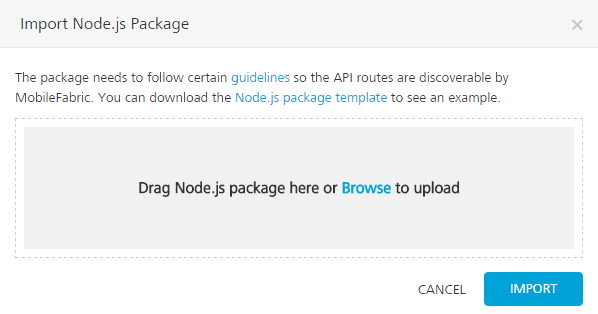
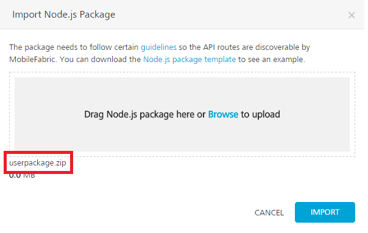
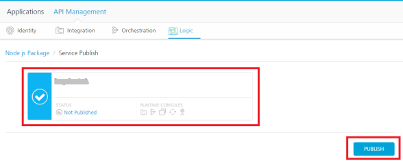
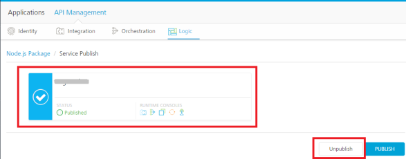

                               

User Guide: [APIs in API Management](API_Management.html) > [Logic in API Management](Logic.html) > How to Unpublish a Package from Node.js Runtime Server

### How to Publish a Node.js Package into Node.js Runtime Server in API Management

After creating services in Node.js, you must zip (package) the project including services, and then publish the package to Node.js Runtime Server by using Volt MX Foundry Console.

To publish Node.js package, follow these steps:

1.  In the [API Management]({{ site.baseurl }}/docs/documentation/Foundry/voltmx_foundry_user_guide/Content/API_Management.html#APIMagmt) page, click the **Logic** tab.
    
    The **Logic** page appears and lists services imported from a Node.js package (if any).
    
2.  If you do not have a package.zip, click **Node.js package template** link to download sample package. The [https://github.com/voltmx/VoltMX-Logic-Nodejs-Contact-Sample](https://github.com/voltmx/VoltMX-Logic-Nodejs-Contact-Sample) page appears.
3.  In the Github page, click the `userpackage.zip` file and click **Download**.
4.  In the Volt MX Foundry API Management > Logic, click the **IMPORT PACKAGE** button. The **Import Node.js Package** dialog appears.
    
    
    
5.  In the **Import Node.js Package** dialog, drag the `Node.js` package from your local system and drop it to the dialog. You can also click **Browse** to select the package through the Microsoft Windows Open dialog. In the **Open** dialog, locate your exported package (for example, USERAPP.zip file), and select it. Click **Open**. In the Import Node.js Package dialog, the selected files from the package are added to the dialog.
    
    While importing a package, if the existing package in Volt MX Foundry Console has the same name as the importing package, the system throws an error, shown below: The system overwrites the existing package with the data in the .zip file.
    
    > **_Important:_** While replacing a package, if the package names are same, the new data will override the existing data.
    
    The selected package.zip is loaded into the **Import Node.js Package** dialog.
    
    
    
6.  Click **IMPORT**. The services from the package are imported to the **Logic** tab.
    
    After the Node.js package is imported into Volt MX Foundry Console, the following fields are displayed:
    
      
    | Number | Field | Description |
    | --- | --- | --- |
    | 1 | NODE.JS PACKAGES | Displays the imported package name. |
    | 2 | RELATIVE PATH FOR SERVICES | Displays the relative paths of the imported services. |
    | 3 | METHOD | Displays the method type of the service. |
    | 4 | SECURITY LEVEL | Displays the security level set in the swagger.json file for the service. You can set the security level for required relative path using `mfidentitylevel`. For example: for the service. `"mfidentitylevel":"<securitylevel>"` The possible values for security level <public/protected/anonymous> The following security levels are supported. **protected** – indicates that the operation is secured. To use the operation, an app user must be authenticated by an associated identity service. **anonymous** – indicates that a user must have the app key and app secret to access the operation. **public** – indicates that the operation requires no special security. **To change the security level, follow these steps**:
    Click the **Edit** button under the **SECURITY LEVEL** column, and select the type of security level from the drop-down list. Click **SAVE**. To cancel the changes, click **CANCEL**.
    
     |
    | 5 | Export Package | Allows you to export a package in a zip file. |
    | 6 | **Delete Package** | Allows you to delete a package. > **_Important:_** You cannot delete a package if it is associated with any of the apps. You cannot delete a package if it published to Node.js Runtime Server. |
    | 7 | PACKAGE LAST UPDATED | Displays the date and time of Node.js package when last updated. |
    | 8 | ASSOCIATED APPS | Displays the **View** hyperlink. When you click the **View** link, the system displays the **Associated Apps** page. The **Associated Apps** page displays the number of apps associated with a particular service. For more details, refer to [Associated Apps]({{ site.baseurl }}/docs/documentation/Foundry/voltmx_foundry_user_guide/Content/API_Management.html#how-to-view-associated-apps-in-apis). |
    | 9 | PUBLISHED STATUS | Displays the **View** hyperlink. When you click the **View** link, the system displays the **Environments** dialog. The **Environments** dialog displays the names of the environments, publish status of the package, and runtime consoles associated with a particular Environment. |
    
    After the Node.js package is imported into Volt MX Foundry Console, you can perform the following actions along with publishing the package.
    
    *   To replace the imported Node.js package, click **REPLACE PACKAGE** . Replacing the package will erase the existing package and will remove the links to the associated application.
    *   To export the updated Node.js package, click **Export Package**.
    *   To delete the imported Node.js package, click **Delete Package**. Replacing the package will erase the existing package and will remove the links to the associated application.
        
        > **_Note:_**  If a service is published or part of a published app, you can delete that service only after you unlink the service from all the published app.
        
7.  Click the **PUBLISH PACKAGE** button to publish the package to Node.js Runtime server.
    
    The **Node.js Package > Service Publish** section appear with the list of Node.js Runtime servers configured for the Volt MX Foundry account. The list also displays the following Node.js package status for that Node.js Runtime Server environment.
    
    *   **Published**: A Node.js package is published to a Node.js Runtime Server environment. You can unpublish the Node.js package, if required.
    *   **Not Published**: A Node.js package is not published to a Node.js Runtime Server environment. You can publish the Node.js package, if required.
    *   **Failed**: A Node.js package is canceled while publishing or unpublishing. You can publish or unpublish the Node.js package, if required.
        
        
        
8.  Select the environment.
    
9.  Click the **PUBLISH** button. The process of uploading the Node.js package to Node.js Runtime server begins.
    
    > **_Note:_** The **PUBLISH** button dims when you have not selected any Node.js environment. When an environment is selected, only then the **PUBLISH** button is available.
    
    After the Node.js package is published to a Node.js Runtime Server, you can link the Node.js services to apps through the **Apps > Logic** tab. For details, refer to [How to Integrate Node.js Services into Volt MX Foundry Apps](Logic_in_Apps.html).
    

### How to Unpublish a Package from Node.js Runtime Server

After a Node.js package is published to Node.js Runtime Server, you can unpublish the package if required.

To unpublish a package from m Node.js Runtime Server, follow these steps:

1.  In the [API Management]({{ site.baseurl }}/docs/documentation/Foundry/voltmx_foundry_user_guide/Content/API_Management.html#APIMagmt) page, click the **Logic** tab.
2.  Click **PUBLISH PACKAGE**. The **Node.js Package > Service Publish** section appears with the list of Node.js Runtime servers configured for the Volt MX Foundry account . The list also displays the following Node.js package status for that Node.js Runtime Server environment.
    *   **Published**: A Node.js package is published to a Node.js Runtime Server environment. You can unpublish the Node.js package, if required.
    *   **Not Published**: A Node.js package is not published to a Node.js Runtime Server environment. You can publish the Node.js package, if required.
    *   **Failed**: A Node.js package is canceled while publishing or unpublishing. You can publish or unpublish the Node.js package, if required.
        
        
        
3.  Under the **Node.js Package > Service Publish** section, select an environment.
    
    > **_Note:_** The **UNPUBLISH** button dims when you have not selected any Node.js environment. When a published environment is selected, only then the **UNPUBLISH** button is available.
    
4.  Click the **UNPUBLISH** button. The process of unpublishing the Node.js package from the Node.js Runtime server begins.
    
    > **_Note:_**  If a service is published or part of a published app, you can unpublish that package only after you unlink the service from all the published app.
