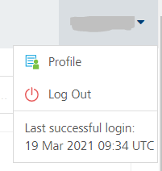
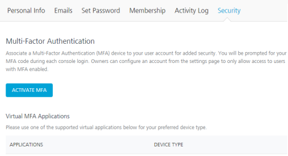
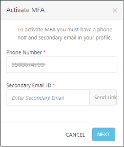
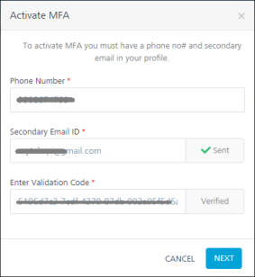
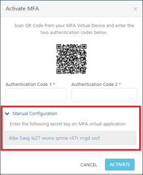

                             

User Guide: [VoltMX Foundry Command Line Utility - Continuous Integration](CI_Foundry.html) > Support for Multi-Factor Authentication from MFCLI

Support for Multi-Factor Authentication from MFCLI
--------------------------------------------------

The Multi-Factor Authentication (MFA) feature helps you activate a user account for an added security authentication on Cloud. If you activate MFA for your account, and you use MFCLI, you must provide additional details such as a **secret key** along with other attributes.

### How to Enable Multi-Factor Authentication (MFA)

To run MFCLI in MFA mode, you need to pass the `--mfa` argument. If MFA is enabled, you must also provide the secret key for multi-factor authentication, which is required to generate one time password (OTP). You must supply the secret key through a property file.

#### How to configure a secret key in a .properties file

You need to provide the secret key value for the `mfa.secret.key` in a `.properties` file, for example, Sample\_mfcli.properties.

 mfa.secret.key = jrlr dm5t vlze clew b64f cptg fwhs d6f2


For more details on secret key for MFA, refer to [How to Generate a Secret Key](#how-to-generate-a-secret-key).

#### How to invoke MFCLI in MFA mode

To invoke MFCLI in MFA mode, pass the command as follows:

 java \-DVOLTMX_MFCLI_PROPERTIES_FILE\=\Sample_mfcli.properties -jar mfcli.jar <command> \--mfa .........


#### How to Generate a Secret Key

To generate a secret key, follow these steps:

1.  Click **Profile** in the user account drop-down menu.
    
    
    
2.  Click the **Security** tab.
    
    
    
    > **_Important:_** The Secret key can only be obtained during registration. If a user is already registered, deactivate the user and then activate the user again to get the secret key.
    
3.  Click **ACTIVATE MFA**.
    
    
    
4.  In the **Activate MFA** dialog, do the following:
    1.  Enter the phone number.
    2.  Enter the secondary email and click **Send Link**. An email from Volt MX Accounts is sent to your registered secondary email ID. The email contains a security code. Also, the **Enter Validation Code** field is enabled under the **Secondary Email ID** field.
    3.  In the **Enter Validation Code**, enter the security code and validate the code by clicking the **Verify** button.
        
        
        
    4.  Once the code is verified, click **NEXT**.
        
        
        
    5.  Expand the **Manual Configuration**, and then copy the secret key.
    6.  Update the secret key in the `Sample_mfcli.properties` file.
        
        You must supply the `Sample_mfcli.properties` file as `-d` parameter for MFCLI.
        
5.  Click **ACTIVATE**.
