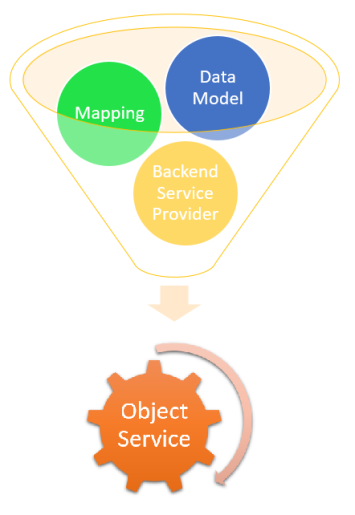
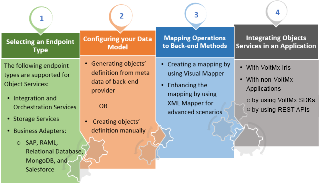

                               

User Guide: Introduction

  

Object Services
===============

Introduction
------------

Object Services is a feature of Volt MX Foundry that enables model-driven application design and development by following a microservices architectural approach to create reusable components and link them to fit into your solution. Using Object Services, you can define your preferred data model, which defines how your application wants to interact with its data. There is a clear separation between the data model and how it maps to the back-end systems of record. The defined data model and mappings encapsulate the back-end data and APIs, and abstract the complexity of the API from your client application.

You can use Object Services to create data models from line-of-business (LOB) objects and define service-driven objects from existing APIs in your enterprise. You can access LOB objects by using Volt MX Foundry business adapters. These business adapters enable you to visually discover and select the entities exposed by the LOB system. You can create a service-driven object from a set of existing Volt MX Foundry _Integration/Orchestration_ Services. These Integration services connect to existing API endpoints or to Volt MX Foundry Orchestration Services, which combine multiple APIs into a new composite or aggregate API.

The Object Services feature enables you to control your API calls and data in a better manner.

*   For simplistic applications, the use of integration services may be sufficient for you to get the job done.
*   **As you start to build bigger and more complex applications, re-usability plays a vital role. In such scenarios, the use of Objects Services will help make your job easier.**

Object Services, as the name suggests, allows you to create and operate on an object for referencing your data. It helps you interact with your back-end data by using the Object data model you mentioned earlier. This feature makes it possible for you to develop applications in a faster and more intuitive manner.

> **_Note:_** For more hands-on approach on how to use Object Services, import and preview the [Employee Directory](https://marketplace.hclvoltmx.com/items/employee-directory-1) app on to your Volt MX Iris.

How do Objects work?
--------------------

Object Services makes application development easy by creating a data model to serve as a bridge between your back-end data and the client application.

The data model is the definition of your object. In the object-oriented world, an Object contains a set of Data fields and operations defined on that data. For example, if you want to build an application to display employee records and their contact information, you can create an “Employee” data model. This data model stores the attributes of an employee. You can then perform operations on the employee object and get a response in the format of the defined data model. For example, if you want to search for a particular employee by Employee ID, you can invoke a “getEmployeeById” method that is defined on your Object Service and get the response in the structure of the Employee data model.

Once your data model is defined, you can start to build your application around it. On the back-end side of things, you can map your data model to your data source. The strength of data models is that you can easily reuse your data model across applications, and easily switch to other data sources with a few changes in the front-end application.

> **_Note:_** Offline Objects feature helps you with a simplified approach to synchronize data to a client app for offline access. The Offline Objects feature connects directly with Object Services and does not require a sync run-time server. You can use the Offline Objects feature with apps that have been created by using Volt MX Iris along with apps developed in native iOS and Android by using Volt MX Foundry SDKs. For more information on Offline Enabled Object Services. refer [Offline Enabled Object Services.](Offline_Enable_Objectservices.html)

Why should I use Object Services?
---------------------------------

A quick comparison of Objects Services with traditional Integration services is as follows:

  
| Object Services | Traditional approach to APIs |
| --- | --- |
| Focus on designing the data model and mapping it to back-end data. | Focus on designing and invoking REST APIs. |
| Independent development of front end and back end. | Tightly coupled interactions between the front end and back end development. |
| Focus on application logic and enthralling user features. | Energy spent on creating back-end interactions. |
| Ease of service creation and invocation. | More code required, more prone to errors. |
| Reuse of same data model across different applications. | Does not encourage pattern-driven development. |
| Easy maintenance, code is generated automatically. | Tough to maintain varies with each developer’s coding style. |
| Three times faster releases by reusing the same data model. Facilitates long-term savings! | No reuse – each application must invoke services from scratch. |
| Four times faster integration. Focus on configuring connectors to access your data. | Requires massive amount of custom code. |

The process of application development is a volatile endeavor, comprising many variable factors. The two most important facets of your application consist of the front-end application and the back-end services. It is vital that these two facets communicate in the simplest manner possible, to pave your path to an awesome application.

Object Services tries to facilitate this communication by helping you create an interim bridge between these two facets. This is achieved by creating a data model, which acts as a contract between front-end and back-end developers.

Object Services View
--------------------

You can navigate to the Object Services View from the Objects tab in your application or from the API Management View. From there, you can create your services or use existing ones already added in your account.

To create an Object Service, you must understand the following basic components:

1.  Data Model
2.  Back-end Service Provider
3.  Mapper

*   Data Model is the core component of an Object Service and development plan. It functions as a vital contract between a client application and the back-end development team. As the first step of your application design, you need to create a data model that works for both your client application and the back-end provider. Once this model is finalized, both the development teams can proceed with their respective development processes without disrupting the other team.
    
    > **_Note:_** To lock fields (read-only fields) in a data model of Object Services, refer to [Configuring Read-only Fields for Object Services through MFCLI]({{ site.baseurl }}/docs/documentation/Foundry/voltmx_foundry_user_guide/Content/Lock_Unlock_Fields_ObjectServices_MFCLI.html).
    
*   Back-end Provider refers to the source of data for your application. Object Services allow you to connect to multiple back-end providers such as SAP, Salesforce, RDBMS and so on. You also have the option to create your own database schema using the storage connector.
*   Mapper helps you map data model and back-end service provider. Visual Mapper provides an intuitive way to connect to do the mapping.

> **_Note:_** To walk-through creating an Object service with Volt MX Foundry, take a look at our hands-on tutorial for [Object Services Overview](https://youtu.be/I82jkllMVP4)

Workflow of Object Services
---------------------------

The following workflow describes the various stages of Object services:

