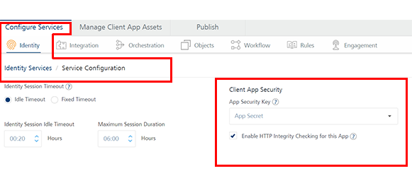

                              

User Guide: [Identity](Identity.html) > How to Configure App Session Settings

How to Configure Identity Session Timeout and HTTP Message Body Integrity
=========================================================================

Volt MX  Foundry supports configuring session timeout (idle timeout and fixed timeout) for an app identity session. In Apps, Volt MX Foundry supports configuration of Identity Session Idle Timeout that applies across all of your apps, as well as support for Enable HTTP Message Body Integrity Checking for an Application. The following procedures describe how to configure session timeout and client app security.

> **_Important:_** HTTP Integrity does not support Scheduler job.

How to Configure App Session Settings
-------------------------------------

You can configure either an idle timeout or fixed timeout for apps in the **Applications > Identity** page.

*   **Idle Timeout**: Specifies the number of minutes that a session can remain idle before Volt MX Foundry automatically terminates the app.
    *   Identity Session Idle Timeout: When an app session on a device remains idle for a certain period of time, the app session expires automatically. The user will need to log into the app again.
    *   **Maximum Session Duration**: An apps log-in session is active until the maximum session duration time is met.
*   **Fixed Timeout**: Specifies the session’s idle timeout (HH:SS) of an app. When the timeout is reached, the session expires automatically, and the user will need to log into the app again.

To configure an Identity Session Idle Timeout, do the following:

1.  Click on an app in the Apps, and then in the **Identity** tab, click the **SERVICE CONFIGURATION** button.
2.  In Identity Session Timeout, do either of the following:
    
    *   Click the **Idle Timeout**.
        *   Enter the hours/seconds (HH:SS) in the **Identity Session Idle Timeout**.
        *   Enter the hours/seconds (HH:SS) in the **Maximum Session Duration**.
    
    Or
    
    *   Click the **Fixed Timeout**, and enter the hours/seconds (HH:SS) in the **Fixed Identity Session Duration**.
3.  Click **Save**.
    
4.  Publish or republish the app to reflect the changes.

How to Enable HTTP Message Body Integrity
-----------------------------------------

The Client App Security feature helps to secure data exchanged between a client app and a server app. Enterprise class applications may need to ensure that network traffic being exchanged between the server and client app is not tampered with. This feature detects and reports network traffic tampering on the data exchanged between the server and client app.

To enable HTTP Message body integrity for an Application, follow these steps:

1.  Click on an app in the Apps, and then in the **Identity** tab, click the **SERVICE CONFIGURATION** button to display the **Client App Security** section.
    
    
    
    The App Security Key is used for HTTP Message body integrity checking and other client security features managed by the client app SDK.
    
2.  In the **App Security Key**, you can select the default app security key or generate a custom security key. To select an app secret key, follow these steps:
    
    1.  From the **App Security Key**, select **App Secret**. The App Secret is selected by default.
    
    1.  If you want to generate a custom key, select **Custom** from the **App Security Key** list.
        
        
        
    2.  Enter the custom security key and click OK. Otherwise you can generate a custom security key by clicking the **Generate Key**. A security key is generated.
        
        > **_Note:_** For more information, refer [Usage of Custom App Security Key](VoltMXStudio/Installing_VoltMXJS_SDK.html#CustomAppSecurityKey).
        
3.  Select the **Enable HTTP Integrity Checking for this App** check box.
    
    The HTTP Message body integrity Checking signs the outbound HTTP requests from a client application and verifies in inbound HTTP response signature to further enhance the security between the client app and backend services.
    
4.  Click **SAVE**.

> **_Note:_** More details to configure [CORS and Identity Session Timeout in APIs](App_User_Session.html)
