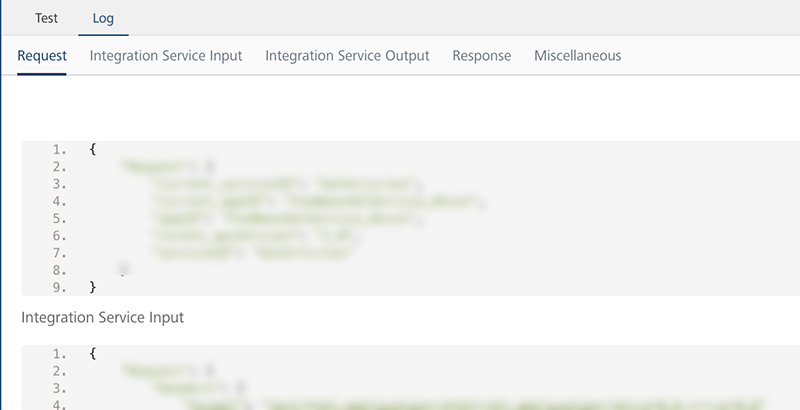
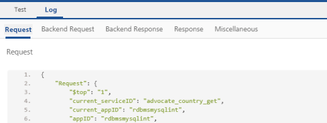
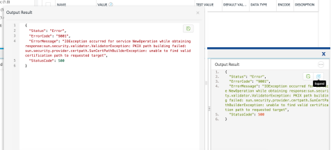
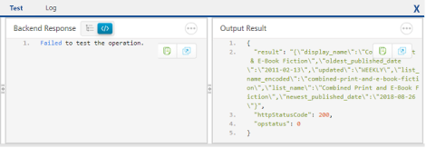

                             

User Guide: [Integration](Services.html#integration) \> [Advanced Configurations](Advanced_Configurations.html) > Test a Service Operation

Test a Service Operation
========================

**To test a service operation, do the following:**

1.  From the **Select Environment** drop-down list, select an environment from the listed run-time environments configured for the Volt MX Foundry account.
2.  Click **SAVE AND FETCH RESPONSE**. The operation gets saved and then the **Output Result** dialog shows the operation test results.
    
    The output result dialog displays two tabs **Test** and **Log**.
    
    1.  The **Test** tab displays three sections Request Payload, Backend Response and Output Result. You can perform a retest by varying the request payload and clicking **Retest**.
    
    
    
    3.  The **Log** tab details the flow of a complete service execution.
    
    
    
    The log tab displays the following details:
    
    *   **Request** displays the data related to request such as service ID, app ID and so on.
        
    *   **Pre-Processor Output** displays the pre-processor details added to the service.
    *   **Integration Service Input** displays the data sent to Integration service such as headers, payload and so on.
        
    *   **Integration Service Output** displays the response received from Integration service such as headers, response and so on.
        
    *   **PostProcessor Output** displays the postprocessor details added to the service.
        
    *   **Response** displays the final output of a service and the status showing success or failure of a test call.
        
    *   **Miscellaneous** displays the payload information before and after the pre-processor execution, performance data (time spent in executing different stages of pipeline), logs, and so on.
        
    *   **Backend Request** displays the data sent to the backend.
    *   **Backend Response** displays the response received from the backend.
        
        
        
    
    7.  You can perform following actions in this window:
        
        *   Click **Copy** to copy the code.
        *   Click **Expand** to pop over the section as a separate pop-up.
            
            
            
        *   **Choose number of sections** and content to view in the pop-over.
        *   **Increase/decrease** the height of the Output Result dialog.
        *   **Dock** the sections to different edges by clicking on the section partitions.
            
            
