                             

Configuring the Framework
=========================

Before using Volt MX Foundry APIs for iOS, you must configure Volt MX iOS SDK into your IDEs, such as Xcode. Configuring the Volt MX iOS SDK involves the following steps:

1.  [Configuring VoltMXSDK.framework to Project](#configuring-voltmxsdk-framework-to-project)
2.  [Adding Framework Dependencies](#adding-framework-dependencies)
3.  [Installing com.voltmx.VoltMXSDK.docset in Xcode](iOS/Installing.html)

Configuring VoltMXSDK.framework to Project
----------------------------------------

To configure VoltMXSDK Framework to project, follow these steps:

1.  Extract the downloaded  `voltmx-ios-sdk.zip` file.
2.  Drag  `VoltMXSDK.framework`  to your **Framework** group in Xcode project.  
    
    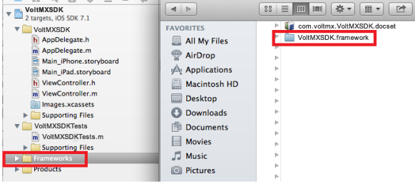
    

1.  Select the **Copy items into destination group's folder** check box. Make sure it adds these libraries to your main target.  
    
    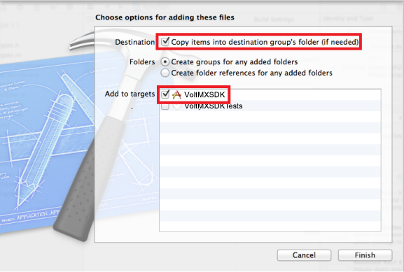
    
2.  Click **Finish**.

Adding Framework Dependencies
-----------------------------

You need to link your binaries with the following libraries.

To configure binaries, follow these steps:

1.  In the **Project Navigator**, select your project.  
    
    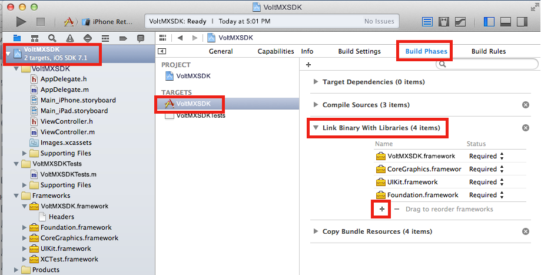
    
2.  In the **Editor**, select your app target, navigate to **Build Phases** \> **Link Binary With Libraries** and then click the **Add (+)** button.  
    
    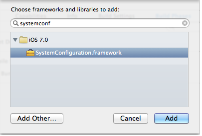  
    
3.  In the **Choose frameworks and libraries to add** dialog, type _systemconf_.
4.  Select the `SystemConfiguration.framework`, and then click **Add**. The system adds the selected frameworks to the project under the **Link Binary With Libraries** section. 
5.  Add the  `MobileCoreServices.framework` by following [Step 3 through Step 4](#Step3).
    
    The system adds the selected frameworks to the project under the **Link Binary With Libraries** section.
    
    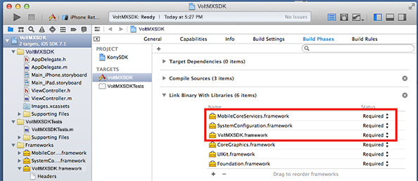
    
6.  Now, add the remaining frameworks (shown in the following image) under the **Embedded Binaries** section in the **General** tab.
    
    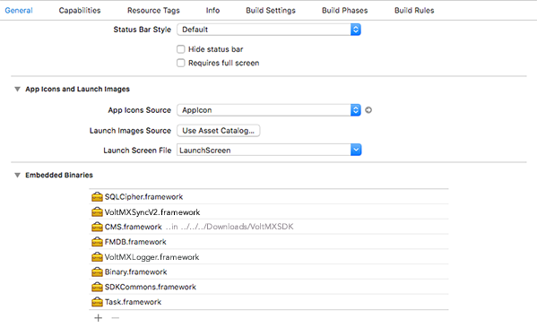
    
    By doing so, these files will be listed in **Link Binary With Libraries** and **Embedded Frameworks** sections in the **Build Phases** tab.
    
    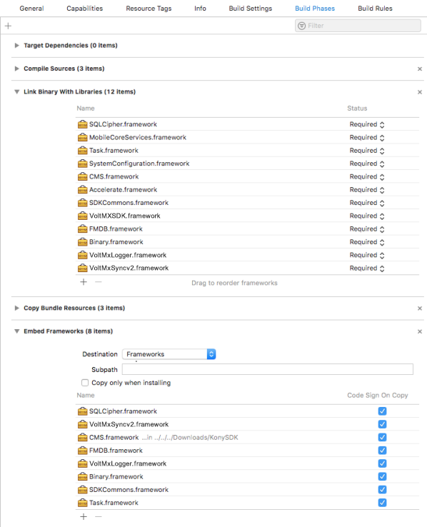
    
7.  For example, if you want to release an app to the AppStore and not include i386 and x86\_64 architectures, you must add a script before building your project. To do so, follow these steps.
    1.  Under the **Build Phases** tab, click the **Add (+)** button and select **New Run Script Phase** from the list. The Run Script section appears.
    2.  Type the following script in the text box.echo "Target architectures: $ARCHS"
        
        APP_PATH="${TARGET_BUILD_DIR}/${WRAPPER_NAME}"
        
        find "$APP_PATH" -name '*.framework' -type d | while read -r FRAMEWORK
        do
        FRAMEWORK_EXECUTABLE_NAME=$(defaults read "$FRAMEWORK/Info.plist" CFBundleExecutable)
        FRAMEWORK_EXECUTABLE_PATH="$FRAMEWORK/$FRAMEWORK_EXECUTABLE_NAME"
        echo "Executable is $FRAMEWORK_EXECUTABLE_PATH"
        echo $(lipo -info "$FRAMEWORK_EXECUTABLE_PATH")
        
        FRAMEWORK_TMP_PATH="$FRAMEWORK_EXECUTABLE_PATH-tmp"
        #remove simulator's archs if location is not simulator's directory
        case "${TARGET_BUILD_DIR}" in
        *"iphonesimulator")
        echo "No need to remove archs"
        ;;
        *)
        if $(lipo "$FRAMEWORK_EXECUTABLE_PATH" -verify_arch "i386") ; then
        lipo -output "$FRAMEWORK_TMP_PATH" -remove "i386" "$FRAMEWORK_EXECUTABLE_PATH"
        echo "i386 architecture removed"
        rm "$FRAMEWORK_EXECUTABLE_PATH"
        mv "$FRAMEWORK_TMP_PATH" "$FRAMEWORK_EXECUTABLE_PATH"
        fi
        if $(lipo "$FRAMEWORK_EXECUTABLE_PATH" -verify_arch "x86_64") ; then
        lipo -output "$FRAMEWORK_TMP_PATH" -remove "x86_64" "$FRAMEWORK_EXECUTABLE_PATH"
        echo "x86_64 architecture removed"
        rm "$FRAMEWORK_EXECUTABLE_PATH"
        mv "$FRAMEWORK_TMP_PATH" "$FRAMEWORK_EXECUTABLE_PATH"
        fi
        ;;
        esac
        
        echo "Completed for executable $FRAMEWORK_EXECUTABLE_PATH"
        echo $(lipo -info "$FRAMEWORK_EXECUTABLE_PATH")
        
        done
        
        cp Resources/* "$TARGET_BUILD_DIR/$UNLOCALIZED_RESOURCES_FOLDER_PATH" > /dev/null 2> /dev/null
        exit 0
        
        
        > **_Note:_** This step should be the final step under the Build Phase.  
          
        >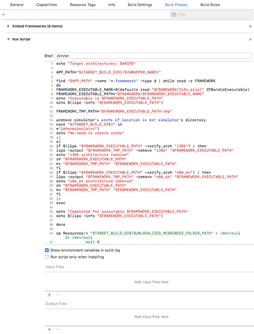  
        
8.  Add dependent libraries to your project, shown below:
    
    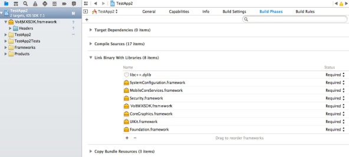
    
9.  Add linker flags to your project , shown below:
    
    
    

Installing com.voltmx.VoltMXSDK.docset in Xcode
-------------------------------------------

Volt MX  provides Xcode docset to search and browse API documentation within Xcode. The docset also provides quick help in the code completion popup.

To view Volt MX iOS Docset help in native format, click [com.voltmx.VoltMXSDK.docset.](http://docs.voltmx.com/8_x_PDFs/voltmxfoundry/voltmx_docsets/ios/com.voltmx.VoltMXSDK.docset/Contents/Resources/Documents/index.html)

To install the com.voltmx.VoltMXSDK.docset in Xcode, follow these steps:

1.  Shutdown **Xcode**.
2.  Copy `com.voltmx.VoltMXSDK.docset` folder from `VoltMXSDK` folder.
3.  Navigate to  `~/Library/Developer/Shared/Documentation/DocSets/` and then paste `com.voltmx.VoltMXSDK.docset` folder.
4.  Restart **Xcode**.
5.  In **Xcode**, click **Window** menu, and then click **Documentation and API Reference**.
    
    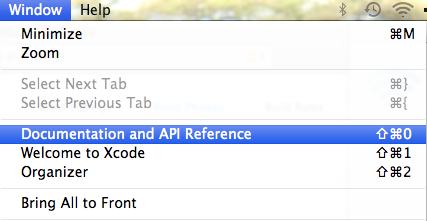
    
6.  In the **Search** box, type _VoltMX_, and then press **Enter**. The system displays the configured Docset.
    
    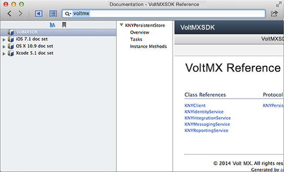
