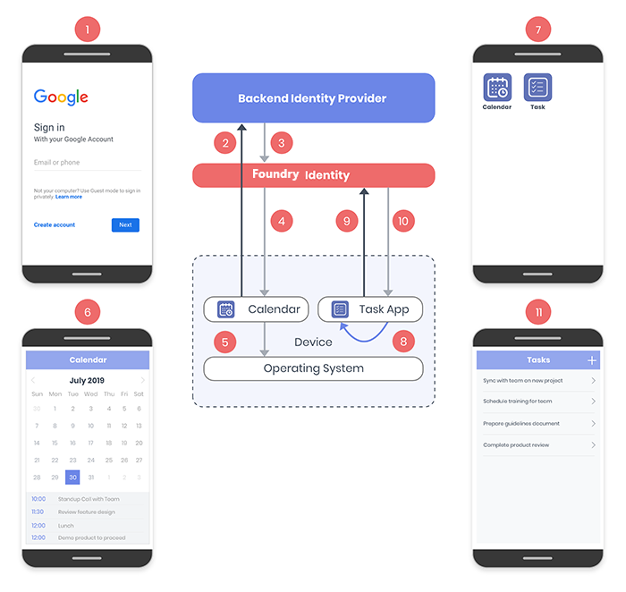
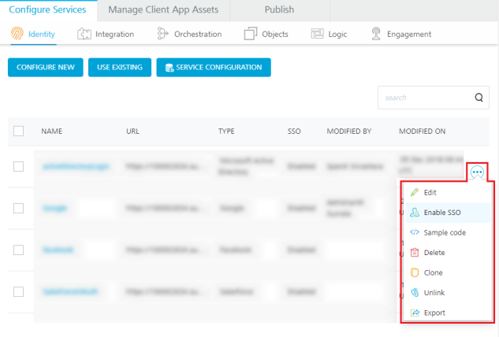
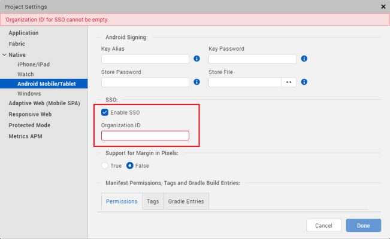
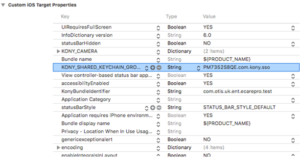

                              

User Guide: [Identity](Identity.html) > Use Case

Single Sign-On
==============

Single Sign-on (SSO) is a session and user authentication process. It allows you to access multiple applications by logging in only once with one set of login credentials.

The SSO feature supports applications using the same identity service.

For example: **Application1** and **Application2** use  a **Google Identity Provider**. When you  sign in to **Application1** by using  the credentials for the Google Identity Provider, you need not  sign in to **Application2**. You will be automatically signed in to **Application2**.

> **Note:**  
*   Single Sign-On is supported for Android, iOS, and Web platforms.  
*   When an Identity Service is mapped using the [Data Panel]({{ site.baseurl }}/docs/documentation/Iris/iris_user_guide/Content/DataPanel.html) in Volt MX Iris, the SSO feature does not function.  

Use Case
--------

To understand the functionality of the SSO feature, consider two applications namely Calendar app and Task app using the same identity provider. The following flow diagram illustrates how SSO feature works on user's device at runtime:

The workflow of these applications is as follows:

1.  The user first starts the Calendar app, and then types the user credentials to log on to the app.
2.  The Calendar app sends the credentials to the Backend Identity Provider for authentication.
3.  On receiving the credentials, the Backend Identity Provider returns an authentication token to Volt MX Foundry Identity.
4.  Volt MX Foundry Identity then sends an SSO token to the Calendar app.
5.  The Calendar app stores the SSO token on the device.
6.  On successful authentication, the Calendar app loads the user's calendar.
7.  The user then starts the Task app.
8.  The Task app fetches the SSO token from the device and sends it to Volt MX Foundry Identity for validation.
9.  After the SSO token is validated, Volt MX Foundry Identity authenticates the user and sends the SSO token to the Task app.
10.  Finally, the Task app is launched without the user having to log on.

SSO Configuration
-----------------

To configure SSO in your applications, perform the following tasks:

*   [Enable SSO in Volt MX Foundry Console](#SSO_VoltMXFoundry)
*   [Configure Client Applications on Volt MX Iris](#SSO_ClientApp)
*   [Configure SSO Permissions for Native Platforms](#SSO_Platforms)

### Enabling SSO in Volt MX Foundry Console

To enable SSO in Volt MX Foundry Console, follow these steps:

1.  Sign in to Volt MX Foundry Console.
2.  Go to the **Apps** tab and open the app for which the Single Sign-On feature is to be enabled.
3.  In the Identity section of the services, click the contextual menu of the required service.  
      
    
4.  A list of options appears. Select the **Enable SSO** option from the list.
5.  After the SSO feature is enabled, republish the app for the SSO feature to come into effect.

### Configuring Client Applications on Volt MX Iris

The client applications are built on Volt MX Iris and they interact with the Volt MX Foundry server using the Volt MX Foundry SDK.

> **_Important:_** Ensure that the Volt MX Foundry application, which you have configured [earlier](#SSO_VoltMXFoundry) is associated with your Volt MX Iris project.

To enable SSO on the client application for **login call**, add the following code in Volt MX Iris:

//Sample code to authenticate to Volt MX Foundry client 
var serviceName = "identity_service_name";
var identitySvc = HCLFoundry.getIdentityService(serviceName);

var options = {};
var loginOptions = {};

**options["userid"] = "userid";
options["password"] = "password";
loginOptions["isSSOEnabled"] = true;**

option["loginOptions"] = loginOptions;

identitySvc.login(options, function(response) {
    voltmx.print("Login Success: " + JSON.stringify(response));
}, function(error) {
    voltmx.print("Login Failure: " + JSON.stringify(error));
});


### Configuring SSO permissions for Native Platforms

The SSO tokens are stored in shared space/keychains of the devices. You must configure application settings to ensure that these tokens are shared among all the SSO enabled apps so that the SSO is implemented and other applications can access these tokens.

[Permissions in Android Devices](#SSO_Android)

[Permissions in iOS Devices](#SSO_iOS)

#### Permissions in Android Devices

For the SSO feature to work in the Android devices, follow these steps.

1.  Go to **Project Settings** > **Native** > **Android Mobile/Tablet**.
2.  In the **SSO** section,
    
    1.  Select the **Enable SSO** check box.
    2.  In the **Organization ID** box, type your organization ID.
        
        > **_Note:_** The Organization ID must be unique for every organization so that the SSO token is shared amongst a particular organization only.  
        
    
    
    
3.  Click **Done** to save the changes.
4.  Repeat the steps for each app that needs SSO capability to be enabled.
    

#### Permissions in iOS Devices

To configure permissions for iOS devices, follow these steps:

1.  Open the project in Xcode.
2.  In the **Capabilities** section, enable the **Keychain Sharing** option and enter a name for the keychain group.  
    
    
    
3.  Go to **Info** tab in Xcode project. Create a new property in the **Custom iOS Target Properties** section called `VOLTMX_SHARED_KEYCHAIN_GROUP` of the string data type. Set the name of the keychain group created in the previous step as value for the new property. For example, `VOLTMX_SHARED_KEYCHAIN_GROUP = PM7352S8QE.com.voltmx.sso`  
      
    
    
      
      
    
    Here, `PM7352S8QE` is an Organizational Unit value in the certificate, which can be obtained from the developer certificate.  
      
    
    
4.  Repeat the steps for each app that needs SSO capability to be enabled.

> **_Important:_** For all apps that intend to share the same SSO group, the key name string must be the same. The key name string must be different for different SSO groups.

Additional Information
----------------------

*   For Android, if you upgrade your Iris from V8 SP3 or earlier versions to V9, delete the previous SSO configurations and reconfigure the SSO as described in the [SSO Configuration](#ConfigureSSO) section.
*   For Iris V8 SP3 and earlier versions, SSO will not work for the first time due to parity issues. It will work in the subsequent executions effectively.
