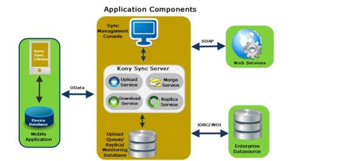
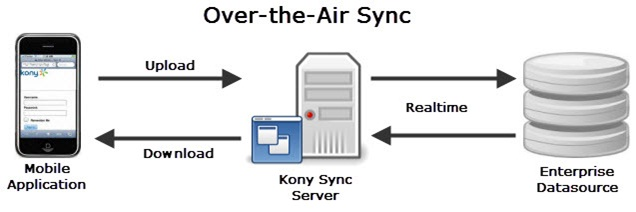
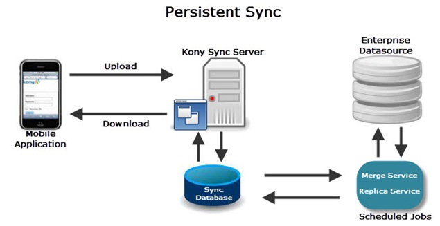

                     

Technical Overview
==================

Architecture
------------

Volt MX  Foundry Sync
----------------

The server has following tasks:

*   It is responsible for the queuing the client requests and applying the client changes to backend datasource.
*   As part of data synchronization, it identifies data packages to be downloaded for individual mobile devices (data allocation), determines the delta data to be sent to the device (delta data determination), manages conflict situations and provides configuration and monitoring tools.
*   It is responsible for loading the appropriate datasource provider and communicating with the backend.

Volt MX  Foundry Sync Client Library
-------------------------------

The client side library has the following tasks:

*   Data persistence to the SQLite device database.
*   Change tracking / delta determination on the client side.
*   Performing data synchronization with the Volt MX Foundry Sync.
*   Logging and tracing.

Sync Strategies
---------------

During offline operation, the mobile application on the device is completely disconnected from the sync. Instances of the same application that may run on other mobile devices at the same time, either connected to or disconnected from the sync. Data stored locally on the mobile device running in offline mode may be modified or deleted or new data may be created. Potentially, the same data entity may be modified by multiple mobile clients concurrently, running either in online or offline operation, with potential effects on the server data store. These modifications that may be in conflict with others, have to be synchronized with the data on the server when a mobile application switches back to online operation. During this process, conflicts need to be reconciled and updates have to be made available to other application clients connected.

To enable the above synchronization needs the server may choose to store the data before merging it with the Enterprise Datasource. Though this is not a mandatory requirement,  it is very desirable when the Enterprise Datasource has not been designed for handling additional mobile users or is only occasionally available.

Volt MX  Foundry Sync provides two flexible sync strategies that help the application developer design the application that best suites the enterprise needs.

### Over The Air Sync (OTAsync)

In this strategy whenever the mobile application invokes sync API, the Sync immediately merges upload packets with the enterprise server. Similarly the sync queries the enterprise server for "delta" changes real-time and sends the same to the mobile application.

In this strategy, Enterprise Datasource is assumed to be available when the device starts the sync session.

### Persistent Sync

In this strategy the application data is first persisted on Volt MX Foundry Sync and later merged with the Enterprise Datasource as part of the offline process. Though this results in some data latency but ensures that the system is still functional even though the Enterprise Datasource may not be available.

In this strategy, the Volt MX Foundry Sync buffers / persists the backend data; during synchronization of a mobile client, the delta for that client is calculated based on the existing data in the sync. You can schedule replication jobs to occur at predetermined intervals to update the sync data. These jobs compare backend data with the data that is persisted in the sync and decide whether an object needs to be updated.

### When to Use which Sync Strategy?

Deciding upon to use a Sync Strategy is one of the key architectural / designs decisions that you need to make when developing any enterprise grade offline application. This is not a simple decision but is based on number of input parameters and system constraints. Below are some of the recommendations that can help you determine to choose the appropriate strategy:

OTASync Strategy is recommended solution when:

*   The Enterprise backend is highly available to the Sync. It can be assumed that the availability of connectivity between the Device and Sync is the same as the availability of connectivity between the Sync and the Enterprise backend. So whenever the device has network availability it can directly post the changes to the Enterprise backend.
*   When there is a need to keep system and operational costs down by not having to replicate the enterprise backend on the sync. Data replication does added to the amount of disk space needed to maintain the data and also resources to monitor the data.
*   The Enterprise backend is “Provisioned”. Provisioned is the term used to signify that typical database design patterns are followed like tracking deletes through a soft delete flag and tracking lastupdated timestamp for each data item (or a table row). These elements are essential for OTASync as they are needed for sending appropriate updates back to the client database and keep the processing as low as possible on the sync.
*   The Enterprise backend can provide delta changes based on the last updated timestamp as that the device sends. Before we get into the details to understand the need for this, it is important to understand that the essence of OTASync strategy to is to avoid “persisting” a copy of the Enterprise backend data on the sync. During OTASync, the device waits for the client changes to merge with enterprise backend and at the same time, enterprise updates to been sent to the device. Now, if the enterprise backend does not provide the ability to query “deltas”, it means that you have to do the real time delta determination. This means that current state of device data is available on the sync to compare with the current state of the data on the Enterprise backend (so that you can determine the deltas between two sources). Since we don’t persist data on the sync (for OTASync strategy), this means sending a snapshot of the client data with every upload request may increase the pay load of the upload request to an unmanageable level. **SalesForce WebServices offers a very good design pattern on how you should design services to suite the OTASync strategy.**
*   Every time the users perform a sync, they get access to the Latest updates on the Enterprise backend.

Persistent Sync is recommended solution when:

*   The Enterprise backend is not highly available. For example: the Order Processing system is busy serving desktop users during the peak hours (say 9:00 AM to 5:00 PM) and cannot take additional load of the “new” mobile users (employees accessing the system using mobile devices). So, in order to make sure that the mobile users are still able to submit requests, you have to persist these requests on sync and merge with the Enterprise backend offline (during off peak hours).
*   A scheduled system down time does not allow users to access the (typically due to time zone differences)
*   The Enterprise backend is “UnProvisioned”. Provisioned is the term used to signify you have to follow typical database design patterns such as tracking deletes through a soft delete flag and tracking lastupdated timestamp for each data item (or a table row). An unprovisioned backend does not follow these characteristics and hence it means that sync has to do delta determination (which dataitems /rows are added new, deleted and updated). When we deal with row items in thousands, this can be a processor intensive and time consuming exercise. Hence this is usually done offline say few times during a day for the entire dataset (data for all users in the system)
*   It is acceptable that users are productive even with information set that is “outdated” or “stale” by a few hours. Merging of the data is done usually at periodic intervals, it means that data in the Replica Database can be outdated with respect to the Enterprise backend.

What are the prerequisites for OTASync strategy ?

In order to select the OTASync strategy for a particular SyncScope, ensure that the follow prerequisites are met:

*   Enterprise backend is Provisioned. This means that it provides a way to query updated records based on a timestamp and also query the deleted records based on a timestamp.
*   It should provide a way to get data items (rows) in batches. This is important as the device has limited memory and can process limited data at any given point in time.

What are the prerequisites for PersistentSync strategy?

*   The system provides access to data for all users with a single login / authentication. This is essential since the replica database stores the data for all users and should be able to query the same from the Enterprise backend. The replica service does not refresh data for a particular user. It does across users. For example: it invokes getAll operation on Account objects. This means that it gets all the accounts across users and then tags the one that is updated and that is deleted. The replica service does not have any context of the users that are defined in the systems. The replica service only job is to refresh data periodically from Enterprise backend.
*   Additional storage capacity to be allocated on sync as it now also stores a copy of the Enterprise backend.

### Change Tracking

Applications requiring data synchronization capabilities require that changes are tracked in the server database so that these changes can be delivered to clients during a subsequent synchronization session (and vice versa). Below, we discuss different strategies that you can apply / configure to ensure that you can share only incremental updates between client and server.

Volt MX  Foundry Sync provides the ability to either utilize change tracking that the datasource provides or in absence of such capability at the datasource, the Volt MX Foundry Sync itself can change tracking in the server.

### Conflict Resolution

During the synchronization two data stores (local device client and enterprise server), conflicts may occur if the same data object is modified independently in both participating stores. You can detect the conflicts by comparing state information of the two objects. The resolution of a conflict is called reconciliation and is always performed on the enterprise schema.

#### Conflict Detection

Conflict detection happens on "hashsum” generated for every row at sync server during downloads.

When a row is modified at the device, the device sends the same “hashsum” along with the content in the modified row during synchronization.

Sync server will fetch the row from backend with the PK (Primary Key) and regenerates the “hashsum”.

If both the “hashsum” values are different, then the backend data is modified by some other source. Sync server treats this as conflict and applies the appropriate conflict mechanism.

#### Conflict Policies

The existing conflict resolution policies are:

*   **Client wins**: The changes on the client side take priority over the changes on the server-side.
*   **Server wins**: The changes on the server side take priority over the changes on the client-side.
*   **Custom**: The logic or policy defined in the user uploaded interceptor class decides the priority.

> **_Note:_** The (hard) delete action on the server and client side is ignored (by not considering it a conflict) and no action is performed.

The following table lists all possible scenarios that can arise with the above supported conflict policies.

  
| Client | Server | Conflict type detected | Policy | Action on Data source | Result returned to client-side |
| --- | --- | --- | --- | --- | --- |
| Insert (only for non-auto generated Primary key) | Record already exists | Client insert server exists | Client wins | Update with client-side record (Insert converted to update as there is a conflict) | Update event with client-side record |
|^^|^^|^^| Server wins | Dummy update | Update event with server-side record |
| Update | Delete (soft delete) Soft delete means the record is marked as delete but the record exists in the database. | Client update Server delete | Client wins | Update with client-side record | Update event with client-side record |
|^^| Update | Client update Server update | Client wins | Update from client-side | Update event with client-side record |
|^^|^^|^^| Server wins | Dummy update | Update event with server-side record |
|^^| Delete (soft delete) | Client update Server delete | Client wins | Update from client-side (Update converted to Insert) | Update event with client-side record |
|^^|^^|^^| Server wins | No action | Delete event with client-side record |
| Delete | Update | Client delete Server update | Client wins | Delete is performed | Delete event will be sent |
|^^|^^|^^| Server wins | Dummy update | Update event with server-side record |
