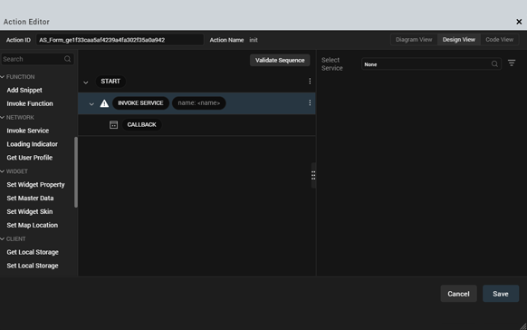
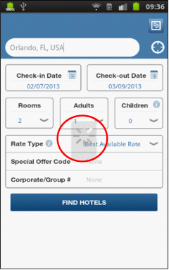
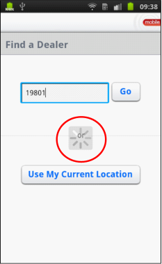
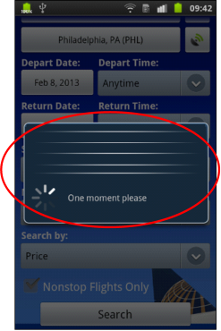

                          

Volt MX  Application Design and Development Guidelines: [Application Design Guidelines](Application_Design_Guidelines_Overview.html) > [UI Guidelines](UI_Guidelines.html) > Create a Progress Indicator

Guidelines for Progress Indicators (Rich Clients)
-------------------------------------------------

Following are the guidelines for progress indicators(Rich clients):

*   It is recommended to use progress indicators to indicate to the user that a long running activity is in progress.
*   If you do not use the progress indicators, it may lead to a bad user experience as the user may try to access other widgets or perform other actions on a form.
*   Below are few scenarios in which a progress indicator is a must.

*   Fetching data from a network call.
*   Rendering data on a Segmented UI.
*   Any “time consuming” activity.
*   Make sure to dismiss the created progress indicator.

*   We can design a form with static content on it and use it as an alternative for progress indicators as per the use case.
*   Use BlockedUI for Mobile Web.
*   Use Block UI whenever there is a use case to block the user interaction while a background activity is in progress, ex: a payments / transfers service call, login / logout service call etc.
*   Block UI should get activated whenever the data starts Loading / Service gets invoked. (i.e. when you select an option in a screen, application starts loading the data, here the Block UI should get activated in that screen so that user should not be able to access other options in the screen).

### Create a Progress Indicator

*   Use the below API to create a progress indicator.
    *   window.showloadingscreen.
        
*   Use the below API to dismiss a progress indicator.
    *   window.dismissloadingscreen.

### Create a Blocking Indicator

### Progress Indicator / Blocking UI Examples

 

 

