                            

Preview a Iris Enterprise App on a Device
===============================================

Using the Volt MX App, you can view the front-end prototype of a project on a device. You can run any action attached to a form or widget such as navigating from one form to another, executing events of the forms, and applying a skin to a widget.

You can make changes to your project and then incrementally preview those changes, you can see those changes reflected in a local preview of the app on your device. For the [incremental preview](#Incremental_Preview) you must set the Volt MX App on your device to do so, as described later in this topic.

> **_Note:_** The Volt MX App does not support the display of Cordova Browser widget in the 7.1.1 version of App User Guide.

> **_Important:_** Incremental preview is supported only for local preview of projects. For previews published to the cloud, the project must do a full **Preview > Publish**; incremental previewing is currently not available for the cloud.

This section provides the following documentation on Previewing an App:

*   [Prerequisites](#prerequisites)

After the prerequisites have been met, you're ready to generate a preview of the app and then view it on a device.

*   [Generate a Preview of the App](#generate-a-preview-of-the-app)

Once you have generated the preview, you can view it on your device via the cloud or locally. For more information, click the option you want:

*   [Preview an App Locally](#preview-an-app-locally): Runs the Volt MX App for a prototype by using the device on which you have App User Guide installed, to act as the host for displaying the app on your device. You can connect your device by either by using a wireless connection or, starting from App User Guide version 7.3, via a USB connection.
    *   [Preview an App by using a USB connection](#preview-an-app-by-using-a-usb-connection)
    *   [Preview an App by using a Wi-Fi connection](#preview-an-app-by-using-a-wi-fi-connection)
*   [Preview an App on the Cloud](#preview-an-app-on-the-cloud): Runs the Volt MX App for a prototype that is published to the cloud.
*   [Access HCL Forge](#view-components-or-applications) : Runs the HCL Forge in a browser to access the available components. You, or those you invite to access the Volt MX App on the cloud, can preview the HCL Forge components.

Prerequisites
-------------

To preview an app, you must satisfy the following prerequisites:

*   [Create a Volt MX Account](#create-a-account)
*   [Install the Volt MX App on your Device](#install-the-on-your-device)

### Create a Volt MX Account

You must have a Volt MX account to use App Viewer feature of the Volt MX App. If you do not have a Volt MX account, you can create one by using one of the following methods:

*   [Self-Registration](#self-registration): Go to the Volt MX website and create a new account.
*   [Receive an Invitation](#receive-an-invitation): You receive an invitation to register with Volt MX from an existing Volt MX user.

#### Self-Registration

To self-register, follow these steps:

1.  Navigate to the App User Guide[VoltMX Cloud registration site](https://manage.hclvoltmx.com/registration).
    
    The **Create your Volt MX Cloud Account** page appears.
    
2.  Provide the required details, and then click **Create your account**.
    
    A message appears confirming that your request for registration has been accepted.
    
3.  You will receive an email from **VoltMX Accounts** with an activation link. Click **Activate My Volt MX Account**.
    
    The **Activate Your Account** page appears.
    
4.  Provide the required details, and then click **Create Cloud**.
    
    Your account is activated, and the Volt MX Cloud dashboard appears.
    

#### Receive an Invitation

The owner (or a member) of a Volt MX account who has the necessary permissions to invite a user can send an invitation from [manage.hclvoltmx.com](http://manage.hclvoltmx.com/). The invitee receives an email asking them to register for App User Guide.

When the owner of a Volt MX account sends an invite to allow you access to the cloud, you receive an email with a Volt MX account registration link.

To create a Volt MX account after receiving an invitation, follow these steps:

1.  In the invitation email, click **Accept Invitation**.
    
    The **Accept Invitation** page appears.
    
2.  Provide the required details, and then click **Accept invitation**.
    
    Your account is activated, and the Volt MX Cloud dashboard appears.
    

### Install the Volt MX App on Your Device

The Volt MX App allows you to view the complete prototype designed on App User Guide on your mobile or tablet device.

You can download the Volt MX App on your

*   [Android](#android) device from Google Play.
*   [iOS](#iphone-or-ipad) device from Apple App Store.

#### Android

To install the Volt MX App, follow these steps:

1.  Tap **Applications**, and then tap **Google Play**. Google Play Store opens.
2.  Search for **VoltMX**.
3.  From the search results, tap **VoltMX**.
4.  Tap **Install**. Type your login credentials, if requested.
5.  Tap the **Applications** folder, and then tap **VoltMX** to open it.
    
    > **_Note:_** Follow the same process for installing the **VoltMX Tablet** app on your Android tablet. The Reports and Analytics feature that is present in the **VoltMX** app is not available in the **VoltMX Tablet** app.
    
    > **_Note:_** On Android, the Volt MX Iris App Viewer has been upgraded with additional enhancements and has been renamed as Volt MX App.
    

#### iPhone or iPad

To install the Volt MX App, follow these steps:

1.  On your Apple device, tap **App Store**.
2.  Search for **VoltMX**.
3.  From the search results, tap **VoltMX**.
4.  Tap **Install**. Type your login credentials, if requested.
    
    The app is downloaded and installed on your mobile or tablet device.
    
5.  Locate **VoltMX** on your home screen and tap it.
6.  Sign in to your Volt MX account by entering your username and password. If you want to bypass entering your login credentials the next time you run the app, select **Remember me**. Then, tap **Sign In**.
    
    > **_Note:_** Follow the same process to install the Volt MX App on your iPad. The Reports and Analytics feature that is present in the **VoltMX** app is not available in the **VoltMX Tablet** app.
    

> **_Note:_** The Volt MX App supports Face ID unlock from iOS 11 onwards.

> **_Note:_** The Volt MX Iris App Viewer is no longer available in the Apple App Store. A new Volt MX App is available with an enhanced feature set and user experience.

Generate a Preview of the App
-----------------------------

You must have Volt MX Foundry configured for Enterprise. This procedure assumes that you have already created and published a Volt MX Foundry app and have bound your client app to it. These details are covered in [Publish a Project to Volt MX Foundry]({{ site.baseurl }}/docs/documentation/Iris/iris_user_guide/Content/PublishVoltMXFoundryServicesApp.html).

From V8 SP4 onwards, to create a prototype viewable on the Volt MX App:

1.  If you are not currently logged in to your Volt MX account, do so now by clicking **Login** in the top right corner of the App User Guide window. The Volt MX Account sign-in window opens.
2.  Enter your email and password credentials for your Volt MX account, and then click **Continue**. Once you are signed in, your account name displays in the top right corner of the App User Guide window.
3.  Do one of the following, depending on whether you want to preview the app via the cloud, or locally by establishing a connection between the device and the computer hosting the app.

*   **Local.** On the **Preview** menu, click **Configure Channels**.
    1.  The **Live Preview Settings** windows appears. Select the [platformsThe operating system of a given device. iOS and Android are examples of platforms.](javascript:void(0);) and [channelsDevice types available within a given platform. These include mobile (i.e. phone), tablet, and desktop.](javascript:void(0);) that you want the Volt MX Appto support.
    2.  Click **Save & Run**. App User Guide builds the local preview. To view it, see [Preview an App Locally](#preview-an-app-locally).
*   **Cloud.** On the **Preview** menu, click **Publish**. The Publish Live Preview window appears.

1.  Select the [platformsThe operating system of a given device. iOS and Android are examples of platforms.](javascript:void(0);) and [channelsDevice types available within a given platform. These include mobile (i.e. phone), tablet, and desktop.](javascript:void(0);) that you want to publish.
2.  If the project has an existing preview with a publish code, the Publish Live Preview window displays a **Preview** option.

Toggle the Preview switch to **Create New** option to publish the app to a new cloud account. If you have access to the app's account, **Replace Existing** is selected by default, so that the preview you are publishing replaces the existing preview, under that same publish code.

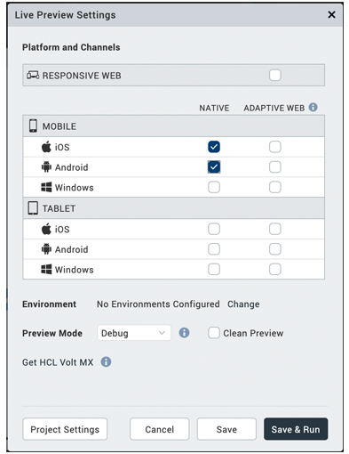 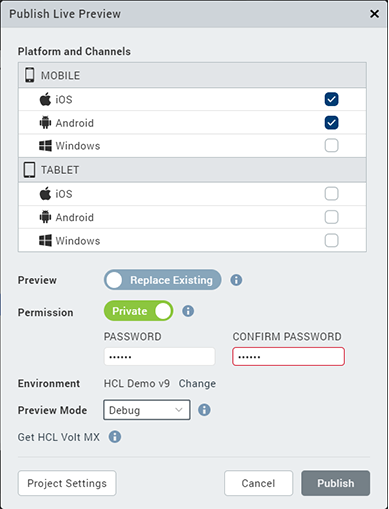

> **_Important:_** Make sure you select the Volt MX Foundry environment you want to use.

6.  If you want to password-protect the preview, toggle the **Permission** to **Private**.
7.  Enter a password, and then re-enter it in the **Confirm Password** text box.
8.  You can change the Preview Mode to **Debug**, to be able to debug the app. **Run** mode is selected by default.
9.  Click **Publish**.  
    App User Guide proceeds to publish the app, as indicated by the progress bar. Depending on the size of your application and the speed of your internet connection, uploading an application may take some time. Once the application is uploaded to your Volt MX account, a publish code is generated as shown here. Also, if you selected the Permission to **Private**, the password you entered is displayed as well.
    
    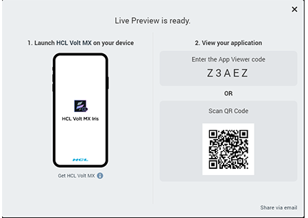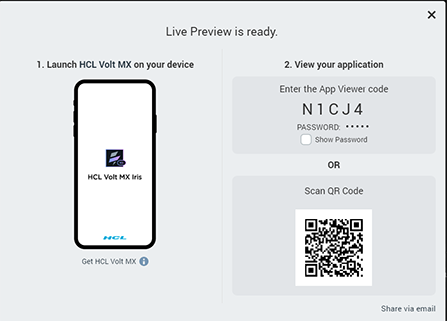
    
    > **_Note:_** The publish code is essential for viewing the preview of the application, and can contain numbers and uppercase letters.
    
10.  You can easily share the publish code and password by clicking **Share Via Email**. A **New Message** window from your default mail client (for example, Outlook) appears. The code, along with the steps for viewing the preview of the app, is auto-generated in the body of your new email message. Add the email address of all the stakeholders to whom you want to give access to the preview of the application, and then send the email.

Once you have generated a preview of the app, the publish code appears in the status bar located over the Properties Editor.

To create a preview viewable on the Volt MX Appfor versions released prior to V8 SP4, follow these steps:

1.  If you are not currently logged in to your Volt MX account, do so now, by clicking **Login** in the upper right corner of the App User Guide window. The Volt MX Account sign in window opens.
2.  Enter your email and password credentials for your Volt MX account, and then click **Continue**. Once you are signed in, your account name displayed in the upper right corner of the App User Guide window.
3.  On the **Preview** menu, click **Configure Channels**.
4.  Select the [platformsThe operating system of a given device. iOS and Android are examples of platforms.](javascript:void(0);) and [channelsDevice types available within a given platform. These include mobile (i.e. phone), tablet, and desktop.](javascript:void(0);) that you want the Volt MX Appto support, and then click **Apply**.
5.  Select **Preview Mode** as **Debug** to enable debug mode for all apps viewed on the Volt MX App.
6.  Click **OK**.
7.  Do one of the following, depending on whether you want to preview the app via the cloud, or locally by establishing a connection between the device and the computer hosting the app.

*   **Local.** On the **Product** menu, click **Run As**. Choose your device from the **Devices** list. A preview is built. To view it, see [Preview an App Locally](#preview-an-app-locally).
*   **Cloud.** On the **Preview** menu, click **Publish**. On the **Publish** menu, click App Viewer. The Publish App dialog box displays.

1.  Select the channels to which you want to publish, and then click **OK**.
2.  If prompted, sign in to your Volt MX account.

The Publish App dialog box appears. If the project does not have an existing preview with a publish code, the dialog box displays only a **Create New** option.

If the project does have an existing preview with a publish code, the dialog box displays both a **Create New** option and a **Replace Existing** option. If you have access to the app's account, **Replace Existing** is selected by default, so that the preview you are publishing replaces the existing preview, under that same publish code, as illustrated in the example. If you do not have access to the app's account, you can only use the **Create New** option; the **Replace Existing** option is deactivated.

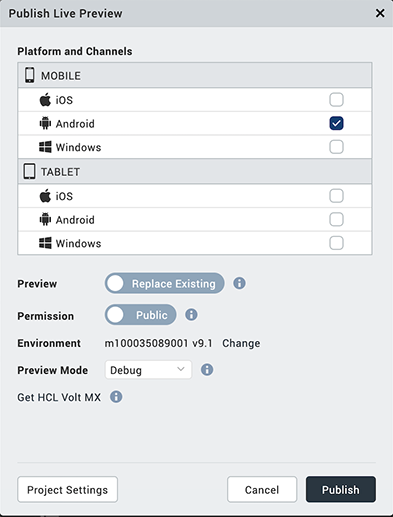  
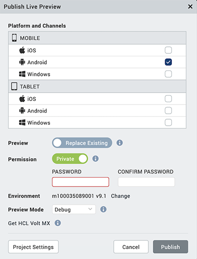

6.  Under **Create New**, the default Volt MX cloud account name and the Iris project name are auto-populated in the **Account** and **Name** fields. From the **Account** drop-down list, select the account that you want to use.

> **_Important:_** Make sure the account you select has the Volt MX Foundry environment that you want to use.

If you want to change the name of the preview to something other than the Iris project name, change the value in the **Name** text box. If you want, enter a description of the app that you are previewing in the **Description** text box.

9.  If you want to password-protect the Volt MX App, enter a password, and then re-enter it in the **Confirm Password** text box.
10.  Click **Apply**.  
    App User Guide proceeds to publish the app, as indicated by the progress bar. Depending on the size of your application and the speed of your internet connection, uploading an application may take some time. Once the application is uploaded to your Volt MX account, a publish code is generated as shown here. Also, if you selected the Access Settings to **Protected**, the password that you entered is displayed as well.
    
    From Volt MX Iris V8 SP3 onwards, a QR code is displayed along with the Publish code. This QR code helps in auto-populating the required data in your device for ease of viewing your application.
    
    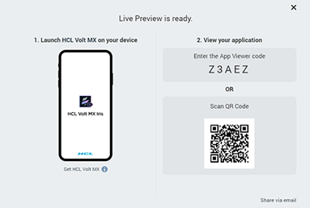
    
    > **_Note:_** The publish code is essential for viewing the preview of the application, and can contain numbers and uppercase letters.
    
11.  You can easily share the publish code and password by clicking **Share Via Email**. A **New Message** window from your default email client (for example, Outlook) appears. The code, along with the steps for viewing the preview of the app, is auto-generated in the body of your new email message. Add the email address of all the stakeholders to whom you want to give access to the preview of the application, and then send the email.

Once you have generated a preview of the app, the publish code appears in the status bar located over the Properties Editor.

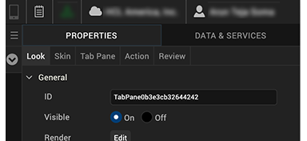

Preview an App Locally
----------------------

Runs the Volt MX App for a prototype by using the device on which you have App User Guide installed, to act as the host for displaying the app on your device. You can connect your device by either by using a wireless connection or, starting from App User Guide version 7.3, via a USB connection.

A French version of the Volt MX App is available. To view the Volt MX App in French, set your device's language to French (and for Apple devices, also set the region to France), and then restart the Volt MX App.

*   [Preview an App by using a USB Connection](#preview-an-app-by-using-a-usb-connection)
*   [Preview an App by using a Wi-Fi Connection](#preview-an-app-by-using-a-wi-fi-connection)

### Preview an App by using a USB Connection

When you preview an app locally, use your App User Guide computer to act as the host for displaying the app on your device via a wireless or USB connection. This procedure assumes that you have already generated a preview on App User Guide and that both your computer and your mobile device have a wireless or USB connection. For more information, see [Generate a Preview of the App](#generate-a-preview-of-the-app).

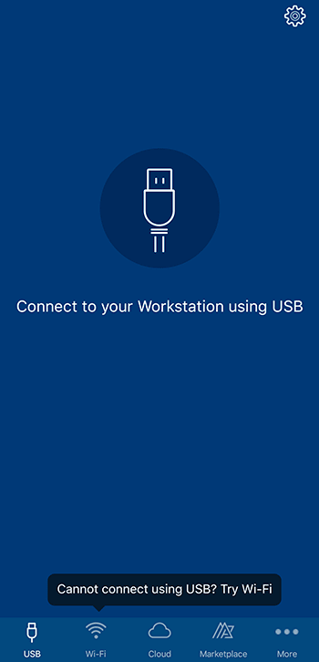

> **_Note:_** To connect to an Android device via a USB connection, the device must have Android version 5.0 or later.

> **_Note:_** To connect to an iOS device via a USB connection, the device must have iOS version 10 or later.

> **_Important:_** **USB Tethering for iOS devices on Windows Machine**:  
**Prerequisites** - Ensure that the latest version of iTunes is installed on the Windows machine. Before you start viewing the app on your iOS device by using the USB feature on the Volt MX App, open iTunes on your Windows machine.

To view the preview of your application locally, follow these steps:  

1.  Establish a USB connection between the computer(Workstation) that generated the preview, and the device.
2.  Tap the **VoltMX App** on your device. The application is launched.
3.  If necessary, provide your Volt MX account credentials on the sign-in page and tap **Sign In**.
4.  Tap the **USB** tab on the Volt MX App tray to display the USB Preview page, if it is not already visible.
5.  The Volt MX App automatically connects to Iris on the computer, and previews the application for which you have performed the **Preview > Run** command on Iris.
6.  If you want the incremental preview changes that take place on App User Guide to be automatically reflected in the preview of the device, enable **Real Time Updates**. Additionally, when you enable **Real Time Updates**, you can opt to enable **Silent Updates**.  
    When enabled, the **Silent Updates** feature refreshes the preview any time you select **Run** on App User Guide, so that the preview reflects the incremental changes made during the last build. If **Silent Update** is disabled but **Real Time Updates** is enabled, when you select **Run** on App User Guide to initiate an incremental preview to incorporate your latest project changes, the Volt MX App shows a dialog box. In the dialog box, the Volt MX App prompts you that an update is available and asks if you want to refresh the preview. Selecting **No** keeps the current preview, while selecting **Yes** refreshes the Volt MX App, thereby loading the latest build.
    
    > **_Important:_** You can enable or disable the **Real Time Updates** and **Silent Updates** options from the **Settings** page on the Volt MX App.
    
    
    
7.  Tap the preview project name that you want to see. This name is identical to the name of the project on App User Guide.

Alternatively, you can tap the **History** icon at the bottom of the screen to see a list of previews previously viewed on the device. If you have signed in by using your Volt MX credentials, the previous preview can be stored on the cloud and can be accessed on any device by using the same cloud credentials.  
If the preview is cached locally on the device so that it can be viewed without a wireless or USB connection, the preview's listing includes a **Cached** status. If the preview has an update available for download, its listing includes an **Update** status.

> **_Note:_** To email information about the preview to a recipient, click the email icon . Included in the email is the App Viewer ID, and for each platform, the preview's name, short notes, and timestamp.

11.  Tap the App Viewer ID of the preview that you want to see.
12.  To cache the preview locally on the device so that you can view it without a wireless connection, activate the **Caching** slider.  
    
13.  Tap any one of the following options:

*   If an update of the preview is available and you want to view it, tap **Update and Launch**.
*   If you want to view the version of the preview to which the device is currently synced, tap **Launch**.
    
    > **_Note:_** If the Volt MX Iris version that you are using is earlier than V8 SP3, you are prompted to enter the Application name.
    
      
    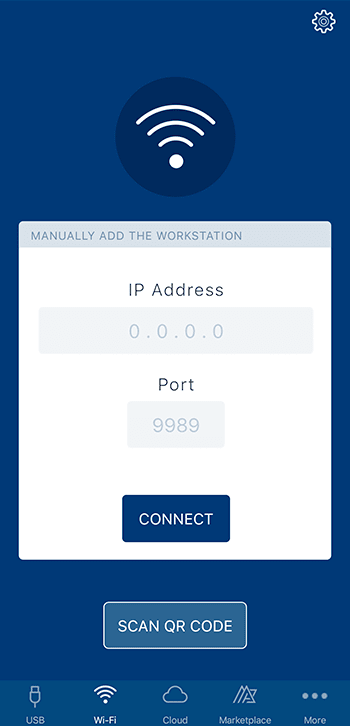  
    

You can cancel the download whenever you want.

1.  The preview build is downloaded to your device. You can view the prototype of the project and execute any actions attached to the prototype.
2.  When you are ready to close the preview and return to the home screen of the Volt MX App, swipe the device screen with two fingers from left to right.  
    

### Preview an App by using a Wi-Fi connection

> **_Important:_** Your computer and your mobile device must be connected to the same wireless network.

To view the preview of your prototype locally, follow these steps:

1.  Tap the **VoltMX App** on your device. The application is launched.
2.  If necessary, provide your Volt MX account credentials on the sign in page, and then tap **Sign In**. The Volt MX App displays its home screen.
3.  Tap **Wi-Fi** on the Volt MX App tray to display the WiFi preview page.
    
    
    

From the list of available Iris workstations, tap the computer hosting the app that you want to preview.

Or, tap **Scan QR Code** and scan the QR code displayed on Volt MX Iris after generating a preview.  
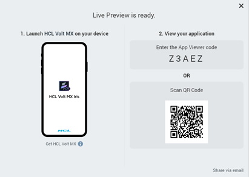

> **_Note:_** The default port used for a Enterprise app is port `8888`, and is different from that used for a Volt MX Iris app. The Starter app uses the `9989` port. If you choose to change the port, it is written to the install location in the `globalPreferences.json` file.

After you select a Iris workstation, The Volt MX App displays a list of previews, listing the most recent preview first.

8.  If you want the incremental preview changes that take place on App User Guide to be automatically reflected in the preview on the device, enable **Real Time Updates**. Additionally, when you enable **Real Time Updates**, you can opt to enable **Silent Updates**.  
    When enabled, the **Silent Updates** feature refreshes the preview any time you select **Run** on App User Guide, so that the preview reflects the incremental changes made during the last build. If **Silent Update** is disabled but **Real Time Updates** is enabled, when you select **Run** on App User Guide to initiate an incremental preview to incorporate your latest project changes, the Volt MX App displays a dialog box. In the dialog box, the Volt MX App prompts you that an update is available and asks if you want to refresh the preview. Selecting **No** keeps the current preview, while selecting **Yes** refreshes the Volt MX App, thereby loading the latest build.
    
    > **_Important:_** You can enable or disable the **Real Time Updates** and **Silent Updates** options from the **Settings** page on the Volt MX App.
    
    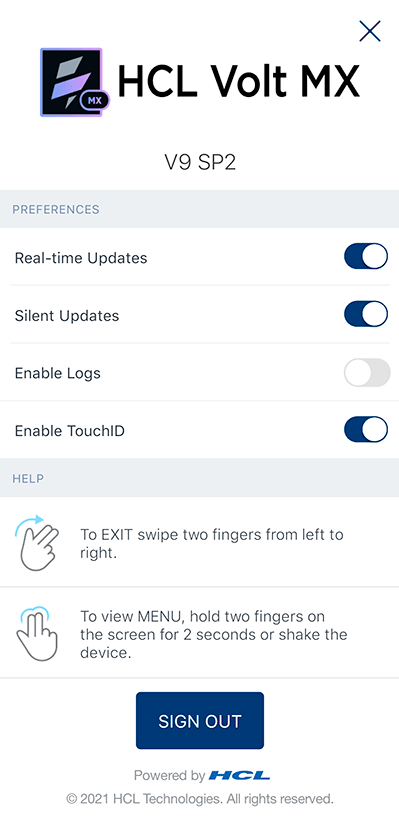
    
9.  Tap the preview project name that you want to see. This name is identical to the name of the project on App User Guide.

Alternatively, you can tap the **History** icon at the bottom of the screen to see a list of previews previously viewed on the device. If you have signed in by using your Volt MX credentials, the previous preview can be stored on the cloud and can be accessed on any device by using the same cloud credentials. If the preview is cached locally on the device so that it can be viewed without a wireless connection, the preview's listing includes a **Cached** status. If the preview has an update available for download, its listing includes an **Update** status.

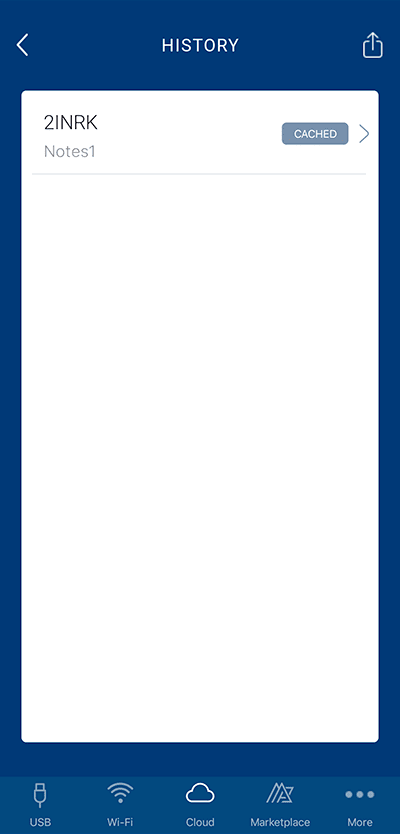

> **_Note:_** To email information about the preview to a recipient, click the email icon . Included in the email is the App Viewer ID, and for each platform the preview's name, short notes, and timestamp.

13.  Tap the App Viewer ID of the preview that you want to see.
14.  To cache the preview locally on the device so that you can view it without a wireless connection, activate the **Caching** slider.  
    
15.  Tap any one of the following options:

*   If an update of the preview is available and you want to view it, tap **Update and Launch**.
*   If you want to view the version of the preview to which the device is currently synced, tap **Launch**.
    
    > **_Note:_** If the Volt MX Iris version that you are using is earlier than V8 SP3, then you are prompted to enter the Application name.
    
      
    

You can cancel the download whenever you want.

1.  The preview build is downloaded to your device. You can view the prototype of the project, and execute any actions attached to the prototype.
2.  When you are ready to close the preview and return to the home screen of the Volt MX App, swipe the device screen with two fingers from left to right.

Preview an App on the Cloud
---------------------------

This procedure assumes that you have already generated a preview on App User Guide. For more information, see [Generate a Preview of the App](#generate-a-preview-of-the-app).

A French version of the Volt MX App is available. To view the Volt MX App in French, set your device's language to French (for Apple devices, also set the region to France), and then restart the Volt MX App.

To view the preview of your prototype on the cloud, follow these steps:

1.  Tap the **VoltMX App** on your device. The application launches.
2.  Tap **Sign In**.

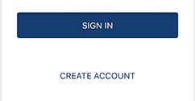

4.  Do any one of the following:

*   If your company's Volt MX account uses standard authentication, enter your Volt MX credentials and tap **Sign In**.
    
    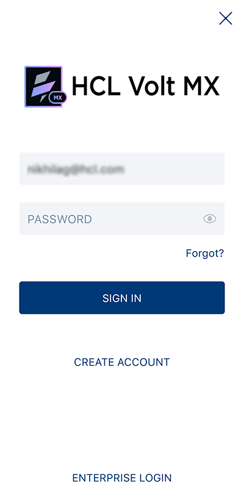
    
*   If your company has a custom authentication arrangement with VoltMX: tap **Enterprise Login**, enter your Enterprise Identifier/ Company Name, tap **Next**, enter your Volt MX credentials and tap **Sign In**.

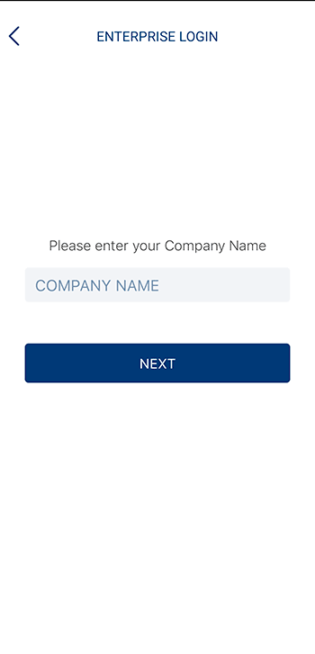

7.  If the Cloud Preview screen does not appear, tap the Cloud icon at the bottom of the screen.

9.  The VoltMX Iris Cloud Preview is displayed, from which you can launch a preview in two ways: by either launching by using the **App Viewer ID**, or opening a previous preview from the **History** screen:

*   **Launch by using the App Viewer ID.** If it is not already highlighted, tap the Cloud icon at the bottom of the screen. Next, tap the **Enter Code** field, type the publish code for the preview you just published, and tap the **Launch** button. Or, you can just tap the **Scan QR Code** button to auto-populate the required details and preview the app.  
    While generating the preview of the app on App User Guide, if you selected the Access Settings to **Protected** and set up a password, when you tap the Launch button, you are prompted to enter the app password.
    
    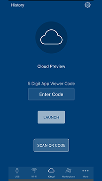
    
*   **Open a previous preview.** Tap the **History** icon at the bottom of the screen to see the list of previews previously viewed on the device. A previous preview can be stored on the cloud and can be accessed on any device by using the same cloud credentials. If the preview is cached locally on the device, it can be viewed without a wireless connection; the Volt MX App's listing includes a Cached status. If the application preview has an update available for download, its listing includes an Update status.  
    When you open the **History** page, it initially shows the app previews stored on your cloud account. You can pull to refresh the screen and load the latest app previews stored in your cloud account.  
    Tap the App Viewer ID of the Project Name that you want to preview.

11.  The preview gets downloaded to your device and is displayed. You can now move around on the Volt MX App and run any actions attached to it.  
    You can execute different lifecycle events of the app. For more information, refer [Execute App Lifecycle Events](ExecuteChildAppEvents.html).
    
    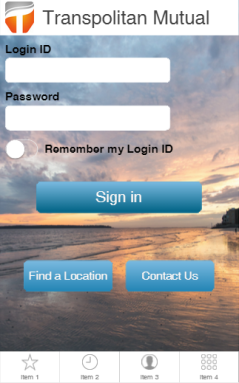
    
12.  At any time, to create or view notes for a particular form, hold two fingers on the device screen for about two seconds or shake the device. The App Viewer menu is displayed. Tap either **Create Note** or **View Notes**, which displays the Form Notes pane. To dismiss the Form Notes pane, tap **X**, which is located near the right edge of the Form Notes title bar. For more information, see [Create a Note](Notes.html#create-a-note), [View Notes](Notes.html#view-notes), and [Edit or Delete a Note](Notes.html#edit-or-delete-a-note).
13.  When you are ready to close the preview and return to the home screen of the Volt MX App, swipe the device screen with two fingers from left to right.

View HCL Forge Components or Applications
---------------------------------------------

Once you launch the Volt MX App on your device, you can access HCL Forge and view components and applications available in it. You can browse and launch HCL Forge applications that interest you on the Volt MX App.

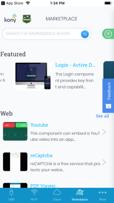

> **_Important:_** When you access an application from HCL Forge through an internet browser on a device, if the Volt MX App is installed on the device, the application will open on the Volt MX App.

To view Marketplace applications on the Volt MX App:

1.  In the Volt MX App, click **HCL Forge** . The HCL Forge page appears with components and applications.
2.  Browse through the components and applications.  
    You can search for a specific component by typing its name or by anpplyig related filters in the search option.  
    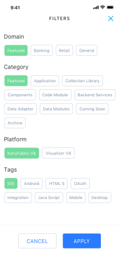
3.  Tap **Preview** to view the details of the component. The **Preview** button does not appear for components that do not have their preview available. You can tap the play icon to play the video of the component.
4.  To view an application, tap the application. The application page is displayed.
5.  Tap **Preview**. The application opens, and you can verify the application functionality.  
    
    > **_Note:_** You may need to sign in to HCL Forge with your credentials to access the app. For more information, see the corresponding documentation for the app you are using in HCL Forge .
    
6.  When you are ready to close the preview and return to the home screen of the Volt MX App, swipe the device screen with two fingers from left to right.
