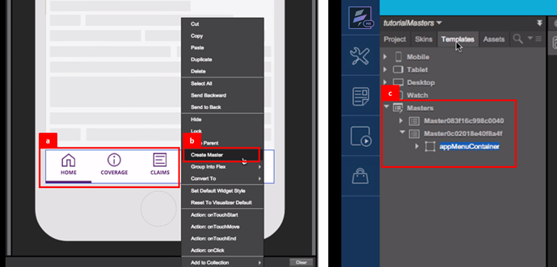
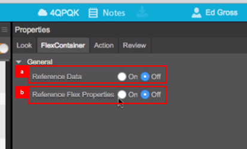
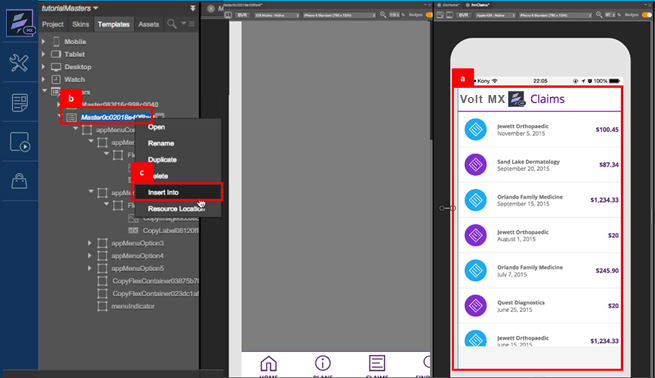
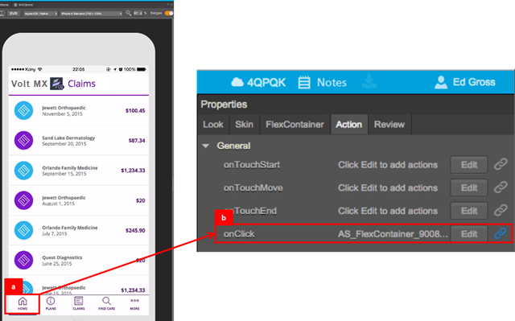
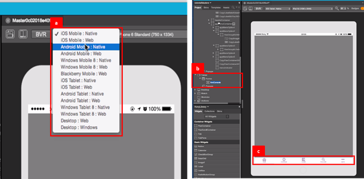

                             

Volt MX  Iris Tutorials

Working with Masters
--------------------

  
  

1\. Creating a Master
---------------------

1.  Select the container from the design, which is to be converted into a Master.
    
2.  Right click on this container and select the **Create Master** option to convert the design into a Master.
    
3.  View all masters created under the templates tab in project explorer.
    

  

2\. Configuring the Properties of Masters
-----------------------------------------

1.  Reference Data
    
    Switching this parameter ON, will ensure changes made to textual content in a Master reflects in all instances of the master in a project.
    
2.  Reference Flex Properties
    
    Switching this parameter **ON**will ensure changes made to the design elements and properties in the Flex container of the master will reflect in all instances of the master in a project.
    

3\. Applying a Master
---------------------

1.  Select the form in the application on which a Master is to be applied.
    
2.  In the templates view of project explorer, right click on the Master to be applied to the application form.
    
3.  Select the **Insert Into** option to apply the Master to the selected application form.
    

4\. Defining Actions in Masters
-------------------------------

1.  Select a widget in the Master, to create an action sequence.
    
2.  Select the **On-Click** event from the properties to define the action sequence to be applied.  
    
3.  Select the **Add Snippet** action from the library.
    
4.  Define the actions to be performed within the action sequence. In this case navigate to the home page.  
    

5\. Applying Masters across channels
------------------------------------

1.  Masters can be applied across channels. The appearance of a master can be view on multiple devices, by toggling between the device type on the Iris console.
    
2.  To apply a master on a tablet form, first select the tablet form and then **right click** on the master and select the **Insert Into** option.
    
3.  A master re-sizes automatically to align with the device form factor on which it is applied, in this case a tablet.
    

