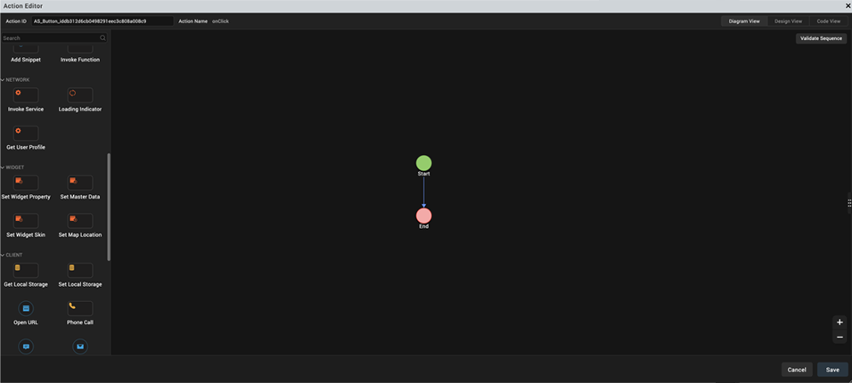
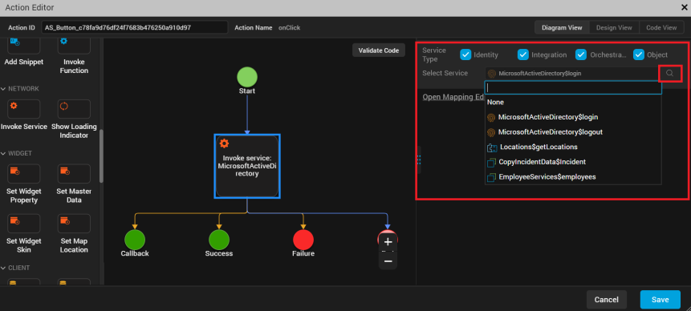
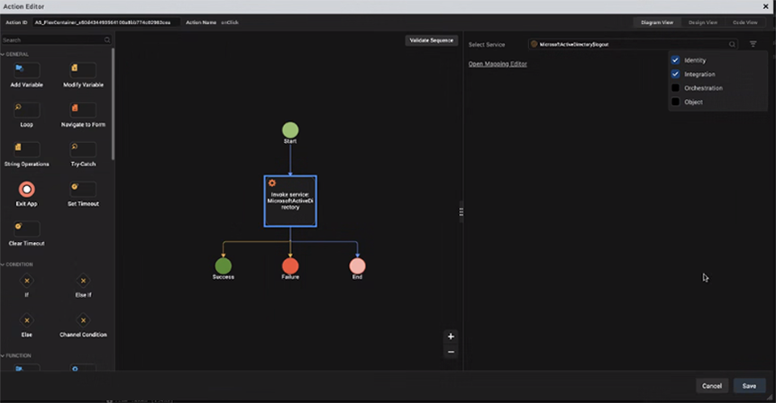
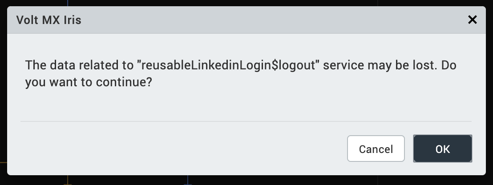

                         

Network Actions
===============

The **Network** category of actions is available in the list of actions on the left pane of Action Editor. You can add the following two actions from the Network section. Click an action for instructions on how to add it to an action sequence.

*   [Invoke a Service](#invoke-a-service)
    *   [Invoke an Identity Service](#invoke-an-identity-service)
    *   [Invoke an Integration Service](#invoke-an-integration-service)
    *   [Invoke an Orchestration Service](#invoke-an-orchestration-service)
    *   [Invoke an Object Service](#invoke-an-object-service)

*   [Show Loading Indicator](#show-loading-indicator)

Invoke a Service
----------------

The **Invoke Service** action is available under the **Network** category of Action Editor. You can also [search for this action](working_with_Action_Editor.html#search-for-an-action-in-action-editor) by typing _Invoke a Service_ in the Search box, on the left pane of Action Editor.

You can use the Invoke Service option to define an action sequence for invoking the following types of services:

*   [Identity](#invoke-an-identity-service)
*   [Integration](#invoke-an-integration-service)
*   [Orchestration](#invoke-an-orchestration-service)
*   [Object](#invoke-an-object-service)

When you add Invoke Service to an action sequence, all four types of services are displayed on the right pane of the Action Editor. In addition, the check boxes of all the service types are selected by default.

If you click the Search icon for the **Select Service** box, every service that is available in your Volt MX Foundry account is displayed in the search result.

However, if you clear any service type check boxes and keep certain check boxes selected, a filtered list of services appears when you click the Search icon.

Consider a scenario where you have added the _MicrosoftActiveDirectory$login_ Identity service to the action sequence of a form or widget. If you then try to change the service of that same action sequence to another service (say, _MicrosoftActiveDirectory$logout_), Volt MX Iris displays a dialog box saying that all the data related to the _MicrosoftActiveDirectory$login_ service will be lost.

You can click **OK** to modify the service of the action sequence, or click **Cancel** to continue with the original service.

### Invoke an Identity Service

To invoke an Identity service when for or widget on a form, use this action sequence in Action Editor. When you select only the **Identity** check box on the right pane of Action Editor, all the Identity services that are available in your Volt MX Foundry account appear in the **Select Service** drop-down list box. You can choose a specific Identity service and define the required mappings in Mapping Editor for the action sequence of a form or widget. You can choose either the **login** or **logout** operation for an Identity service.

To define an action sequence for invoking an Identity service, follow these steps:

1.  From the **Project** tab of the Project Explorer, select the form and widget for which you want to invoke the Identity service action.
2.  Go to the **Properties** panel > **Action**. For the required action (such as, **onClick**), click **Edit**. The Action Editor window opens and an action sequence is created in Diagram View, by default.
3.  In either Diagram View or Design View, on the left pane of the Action Editor, under the **Network** category, locate the **Invoke Service** action.
4.  You can either drag and drop the **Invoke Service** action onto the action sequence, or simply click the **Invoke Service** action. The Invoke Service action is added to the action sequence, and all the types of services are displayed on the right pane of the Action Editor.
5.  The check boxes of all the service types are selected by default. Keep only the **Identity** check box selected, and clear the check boxes of all the other service types.
6.  For the **Select Service** box, click the Search icon. The list of all available Identity services is displayed.

    > **_Note:_** Identity services are displayed with this icon: . This icon is displayed beside all Identity services in the search results, and in the Select Service box after you select an Identity service. The presence of this icon helps you to easily identify the type of service that you want to select. So if different types of services have duplicate names, the accompanying icons help you in not selecting the wrong service by mistake.

7.  Select the required Identity service; for example, _MicrosoftActiveDirectory$login_. The **Open Mapping Editor** button is displayed.
8.  The [Mapping Editor](ActionsMapping.html) opens. [Map](Working_with_Mapping_Editor.html#Mapping) the service parameters to the required form, variable, or widget on the form from which the service was invoked.
9.  Click **Save**. An action sequence for invoking an Identity service is defined in the selected widget.

### Invoke an Integration Service

To invoke an Integration service when an event is triggered for a form or widget, use this action sequence in Action Editor. When you select only the **Integration**check box on the right pane of Action Editor, all the Integration services that are available in your Volt MX Foundry account appear in the **Select Service** drop-down list. You can choose a specific Integration service for the action sequence of a form or widget. You can either define the required mappings of the selected Integration service in Mapping Editor or define custom HTTP headers and HTTP config parameters (timeout).

To define an action sequence for invoking an Integration service, follow these steps:

1.  From the **Project** tab of the Project Explorer, select the form or widget for which you want to apply the action.
2.  Go to the **Properties** panel > **Action**. For the required action (such as, **onTouchStart**), click **Edit**. The Action Editor window opens and an action sequence is created in Diagram View, by default.
3.  In either Diagram View or Design View, on the left pane of the Action Editor, under the **Network** category, locate the **Invoke Service** action.
4.  You can either drag and drop the **Invoke Service** action onto the action sequence, or simply click the **Invoke Service** action. The Invoke Service action is added to the action sequence, and all the types of services are displayed on the right pane of the Action Editor.
5.  The check boxes of all the service types are selected by default. Keep only the **Integration** check box selected, and clear the check boxes of all the other service types.
6.  For the **Select Service** box, click the Search icon. The list of all available Integration services is displayed.

    > **_Note:_** Integration services are displayed with this icon: . This icon is displayed beside all Integration services in the search results, and in the Select Service box after you select an Integration service. The presence of this icon helps you to easily identify the type of service that you want to select. So if different types of services have duplicate names, the accompanying icons help you in not selecting the wrong service by mistake.

7.  Select the required Integration service. The **Open Mapping Editor** button and the **Custom HTTP Headers** and **HTTP Config Parameters** sections are displayed.
8.  You can perform any of the following actions:
    *   Click **Open Mapping Editor**. The [Mapping Editor](ActionsMapping.html) opens. [Map](Working_with_Mapping_Editor.html#Mapping) the service parameters to the required form, variable, or widget on the form from which the service was invoked.
    *   Add your own **Custom HTTP Headers**. Define any information that you want to pass in the header of the service call, apart from the default header parameters. Each row allows you to add a custom header parameter along with its value. Click the **+** icon to add more rows, and click the **X** icon to delete existing rows.
    *   In the **timeout** box, enter a value for the time in milliseconds (ms) after which the timeout of the action sequence must occur. 
9.  Click **Save**. An action sequence for invoking an Integration service is defined in the form or widget.

### Invoke an Orchestration Service

To invoke an Orchestration service when an event is triggered for a form or widget, use this action sequence in Action Editor. When you select only the **Orchestration** check box on the right pane of Action Editor, all the Orchestration services that are available in your Volt MX Foundry account appear in the **Select Service** drop-down list. You can choose a specific Orchestration service and method to add to the action sequence of a form or widget.

To define an action sequence for invoking an Orchestration service, follow these steps:

1.  From the **Project** tab of the Project Explorer, select the form or widget for which you want to apply the action.
2.  Go to the **Properties** panel > **Action**. For the required action (such as, **onTouchStart**), click **Edit**. The Action Editor window opens and an action sequence is created in Diagram View, by default.
3.  In either Diagram View or Design View, on the left pane of the Action Editor, under the **Network** category, locate the **Invoke Service** action.
4.  You can either drag and drop the **Invoke Service** action onto the action sequence, or simply click the **Invoke Service** action. The Invoke Service action is added to the action sequence, and all the types of services are displayed on the right pane of the Action Editor.
5.  The check boxes of all the service types are selected by default. Keep only the **Orchestration** check box selected, and clear the check boxes of all the other service types.
6.  For the **Select Service** box, click the Search icon. The list of all available Orchestration services is displayed.

    > **_Note:_** Orchestration services are displayed with this icon: . This icon is displayed beside all Orchestration services in the search results, and in the Select Service box after you select an Orchestration service. The presence of this icon helps you to easily identify the type of service that you want to select. So if different types of services have duplicate names, the accompanying icons help you in not selecting the wrong service by mistake.

7.  Select the required Orchestration service. The **Open Mapping Editor** button and the **Custom HTTP Headers** and **HTTP Config Parameters** sections are displayed.
8.  You can perform any of the following actions:
    *   Click **Open Mapping Editor**. The [Mapping Editor](ActionsMapping.html) opens. [Map](Working_with_Mapping_Editor.html#Mapping) the service parameters to the required form, variable, or widget on the form from which the service was invoked.
    *   Add your own **Custom HTTP Headers**. Define any information that you want to pass in the header of the service call, apart from the default header parameters. Each row allows you to add a custom header parameter along with its value. Click the **+** icon to add more rows, and click the **X** icon to delete existing rows.
    *   In the **timeout** box, enter a value for the time in milliseconds (ms) after which the timeout of the action sequence must occur. 
9.  Click **Save**. An action sequence for invoking an Orchestration service is defined in the form or widget.

### Invoke an Object Service

To invoke an Object service when an event is triggered for a form or widget, use this action sequence in Action Editor. When you select only the **Object** check box on the right pane of Action Editor, all the Object services that are available in your Volt MX Foundry account appear in the **Select Service** drop-down list. You can choose a specific Object service and method to add to the action sequence of a form or widget.

To define an action sequence for invoking an Object service, follow these steps:

1.  From the **Project** tab of the Project Explorer, select the form or widget for which you want to apply the action.
2.  Go to the **Properties** panel > **Action**. For the required action (such as, **onTouchStart**), click **Edit**. The Action Editor window opens and an action sequence is created in Diagram View, by default.
3.  In either Diagram View or Design View, on the left pane of the Action Editor, under the **Network** category, locate the **Invoke Service** action.
4.  You can either drag and drop the **Invoke Service** action onto the action sequence, or simply click the **Invoke Service** action. The Invoke Service action is added to the action sequence, and all the types of services are displayed on the right pane of the Action Editor.
5.  The check boxes of all the service types are selected by default. Keep only the **Object** check box selected, and clear the check boxes of all the other service types.
6.  For the **Select Service** box, click the Search icon. The list of all available Object services is displayed.
7.  Select the required Object service. The **Select Method** box is displayed.

> **_Note:_** Object services are displayed with this icon: . This icon is displayed beside all Object services in the search results, and in the Select Service box after you select an Object service. The presence of this icon helps you to easily identify the type of service that you want to select. So if different types of services have duplicate names, the accompanying icons help you in not selecting the wrong service by mistake.

1.  For the **Select Method** box, click the Search icon. The list of all available methods for the selected Object service is displayed.
2.  Each Object service contains the following four methods: **get**, **create**, **update**, and **delete**.
3.  If you select the **get** method, the **Construct Filter Query** and **Advanced** buttons are displayed. Follow any of these steps:
    *   Click **Construct Filter Query**. The [Mapping Editor](ActionsMapping.html) opens. [Map](Working_with_Mapping_Editor.html#Mapping) the service parameters to variables, data store keys, or widgets on the form from which the service was invoked. 
    *   Click **Advanced** to manually specify the values of **Request Parameters**, add your own **Custom HTTP Headers**, and define the **HTTP Config Parameters** (timeout):
        *   **Request Parameters**: Configure the appropriate values for the available request parameters.
        *   **Custom HTTP Headers**: Define any information that you want to pass in the header of the service call, apart from the default header parameters. Each row allows you to add a custom header parameter along with its value. Click the **+** icon to add more rows, and click the **X** icon to delete existing rows.
        *   **HTTP Config Parameters**: In the **timeout** box, enter a value for the time in milliseconds (ms) after which the timeout of the action sequence must occur. 
4.  If you select either the **create**, **update**, or **delete** methods, the **Open Mapping Editor** and **Advanced** buttons are displayed. Follow any of these steps:
    *   Click **Open Mapping Editor**. The [Mapping Editor](ActionsMapping.html) opens. [Map](Working_with_Mapping_Editor.html#Mapping) the service parameters to the required form, variable, or widget on the form from which the service was invoked.
    *   Click **Advanced** to manually add your own **Custom HTTP Headers** and define the **HTTP Config Parameters** (timeout). You can define any information that you want to pass in the header of the service call, apart from the default header parameters. Each row allows you to add a custom header parameter along with its value. Click the **+** icon to add more rows and the **X** icon to delete existing rows. In the **timeout** box, enter a value for the time in milliseconds (ms) after which the timeout must occur. 
5.  Click **Save**. An action sequence for invoking an Object service is defined in the form or widget.

Show Loading Indicator
----------------------

To show/dismiss the loading indicator of an action sequence, follow these steps:

1.  From the **Project** tab of the Project Explorer, select the form or widget for which you want to apply the action.
2.  Go to the **Properties** panel > **Action**. For the required action (such as, **onTouchStart**), click **Edit**. The Action Editor window opens and an action sequence is created in Diagram View, by default.
3.  In either Diagram View or Design View, on the left pane of the Action Editor, under the **Network** category, locate the **Show Loading Indicator** action.
4.  You can either drag and drop the **Show Loading Indicator** action onto the action sequence, or simply click the **Show Loading Indicator** action. The Show Loading Indicator action is added to the action sequence, and various associated fields are displayed on the right pane of the Action Editor.
5.  Perform the following actions for the displayed fields:
    *   **Loading Indicator**: To show the loading indicator in the action sequence, select the **Show** option. This option is selected by default.  
        If you do not want to display the loading indicator in the action sequence, select the **Dismiss** option. All the remaining fields are hidden if you select this option.
    *   **Skin**: Select the skin of the loading indicator from the drop-down box.
    *   **Text**: Type the text that must appear in the loading indicator.
    *   **Position**: If you select the **Full Screen** option, the loading indicator will appear in the entire screen of your app. If you select the **Center Only** option, the loading indicator will appear only in the center position of the screen.
    *   **isBlocked**: Select either the **True** or **False** option.
    *   **Show Progress Indicator**: Select either the **True** or **False** option to configure whether the progress of the loading indicator will be displayed.
6.  Click **Save**. The loading indicator configuration details are successfully saved for the selected form or widget.
