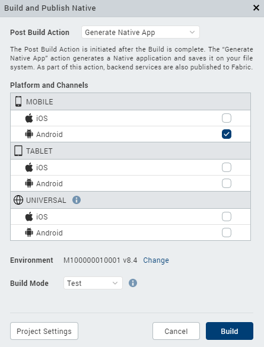

                         

Build a Universal Application
-----------------------------

For iOS and Android platforms, you can build an application in universal binary format, allowing the application to run on both mobile and tablet channels.

To build a universal application:

1.  On the **Build** menu, click **Build and Publish Native**.
2.  In the Build Generation dialog box, select the channels and platforms in the Universal section for which you want to build your app. For example, to build a universal application for the iOS platform only, select the iOS box in the Universal section for either mobile or table channels:

Volt MX  Iris automatically selects the Android box for the mobile channel. Similarly, Volt MX Iris automatically selects the Android box for both mobile and tablet channels if you select the Android box in the Universal column. To select mobile and tablet channels for both iOS and Android platforms, select the boxs in the Universal column, or the boxes on the MOBILE or TABLET sections.

5.  Select the build mode.

*   **Debug mode** \- To help you identify and fix errors, Volt MX Iris emits the complete symbolic debug information . To lessen the amount of time necessary to complete the build, the build is not optimized for code execution, so it may tend to execute slower than a build optimized for release. Also, the inclusion of the symbolic debug information causes the final executable to be larger than a release build.
*   **Release mode** - Volt MX Iris optimizes the build for execution, requiring more time to generate the build. It also does not emit the complete symbolic debug information, making the final executable smaller than a debug build.
*   **Protected Mode** \- Applications built in Volt MX Iris can use the additional security enhancements by building the application in the _Protected Mode_. Volt MX IrisPlatform code for iOS and Android is equipped with mechanisms that can protect your application by detecting attacks like tampering, swizzling, debugging, jail breaking (iOS), rooting (Android), and information disclosure. Additional security mechanisms are provided through the use of White Box Cryptography to protect application business logic and source code. Application reacts to the attack by exiting upon detecting attacks to prevent further attempts.  
    If you choose to build an application in **Protected mode**, then setting the public and private keys is mandatory. To do so, go to **Project Settings** > **Protected Mode**. For more details on how to generate public and private keys, click [here](ApplicationSecurity.html#rsa-key-pair-generation-encryption-and-usage).
*   **Test Mode** - To help you identify and fix errors, Volt MX Iris provides the ability to Test the application on the device or an emulator. When you build an app using the Test Mode, you can leverage the Jasmine testing framework of Volt MX Iris to thoroughly test your app and ensure your application is errors free. You can run jasmine test cases, test suites and test plans by building an app using the Test mode.

7.  Click **Build**.
