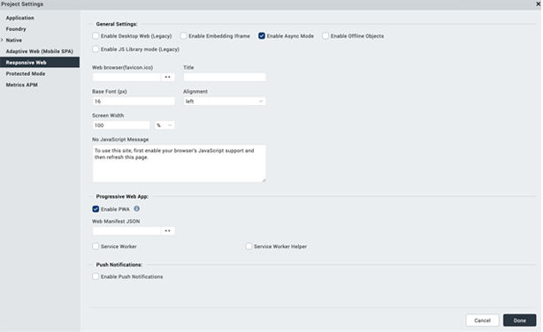
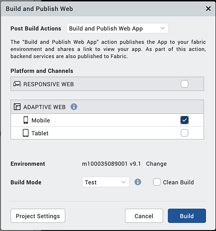

                         

Build a Progressive Web App
===========================

A Progressive Web App (PWA) is the next step of a [Responsive Web](Responsive_Design_8_2.html) app. A Progressive Web App is an application that feels like a Native app, but is available over web browsers to a user. A user can access a Progressive Web App on any web browser on a mobile device. The app is responsive, functions even when the device is offline or has limited network speed, and does not require any updates.

For more information about Progressive Web Apps, click [here](ProgressiveWebApp.html).

> **_Important:_** Before you start to [build a Progressive Web App](#), you must enable the [PWA option](Desktop_Web_Properties.html#ProgressiveWebApp) for a [Responsive Web](Responsive_Design_8_2.html) application. When you do so and build the application, a new output is created in the Progressive Web App format. This new output does not replace any Responsive Web output, but instead a new output is created in the same folder. For more information about Responsive Web apps, click [here](Responsive_Design_8_2.html).

**To build a Progressive Web App, follow these steps**:

1.  In Volt MX Iris, click **Project Settings**.  
    The **Project Settings** dialog box appears.
2.  Click the **Responsive Web** tab.  
    The Responsive Web settings appear.  
    
3.  Under **Progressive Web App**, select **Enable PWA**. The **Web Manifest JSON** field appears.
4.  If you want to add information about the Progressive Web app with a manifest file, select **Browse**. The file explorer opens.  
    
5.  Go to the folder where the JSON file is located, and then select your Web manifest file. The Web Manifest JSON file contains information on the resources that the Progressive Web App requires. The information can be details such as name of the app and app icons. Click [here](https://github.com/HCL-TECH-SOFTWARE/volt-mx-docs/raw/master/voltmxlibrary/iris/zip/user_guide/PWAwebManifest.zip) for a sample.
6.  Click **Done**.  
    
7.  From the Build menu of Volt MX Iris, select **Build and Publish Web**.  
    The Build and Publish Web window appears.  
      
    
8.  Under **Platform and Channels**, select **Responsive Web**.
9.  Click **Build**.  
    The build process starts.

Once the build is completed in Release mode, you must publish the app to your [Foundry environment](PublishVoltMXFoundryServicesApp.html) with HTTPS. Once you publish the app, the Web Application URL is your Progressive Web App.

For a more hands-on approach on the Progressive Web Apps feature provided by Volt MX Iris AppPlatform, import and preview the Events, Employee Directory, and Resort Feature sample apps by using Volt MX Iris.

*   **Events app**: 
*   **Employee Directory app**: 
*   **Resort Feature app**: 
