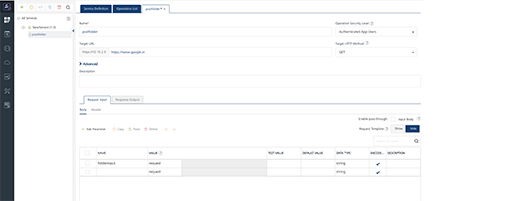
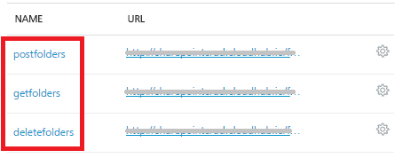
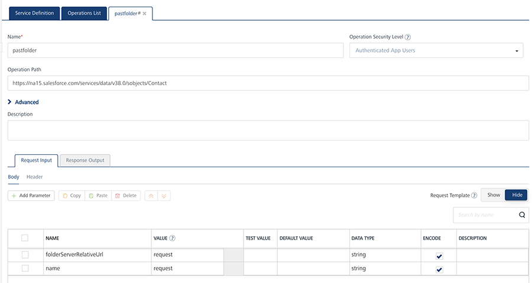
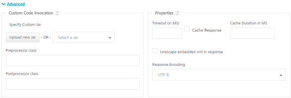
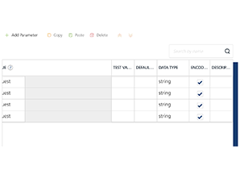

                         

Create a MuleSoft Service
=========================

MuleSoft's Anypoint™ Platform helps app developers design custom APIs and deploy them to a Mule Enterprise Service Bus (ESB) runtime. With the MuleSoft integration service in Volt MX Foundry, developers can interact with over 50 types of connectors.

To integrate a MuleSoft service in Volt MX Foundry, developers need to create a project in MuleSoft Studio, export the project to a local system, and then deploy it to Cloud Hub. On top of the project deployment, a RESTful API modeling language (RAML) file needs to be built, which defines all the API definitions in the project. A RAML file also contains the defined schemas with properties. When a user creates a project from Anypoint API Studio with any connector and builds a RAML file over the project, all the APIs can be used in a Volt MX Foundry integration service. When a Volt MX Foundry user selects a MuleSoft connector from the Volt MX Foundry Console, based on the cloud hub portal credentials of the MuleSoft connector, the system retrieves metadata from the RAML file and displays all its APIs. Developers can add these APIs as operations in the MuleSoft integration service in the Volt MX Foundry Console.

Volt MX  Foundry discovers the MuleSoft endpoints through the RAML file, parsing it and exposing all the MuleSoft endpoints through the integration service. Mobile app developers can use the configured MuleSoft integration service to access the backend systems supported by MuleSoft’s connectors.

> **_Note:_** In the Volt MX Foundry Console, you can provide login credentials for MuleSoft or upload a RAML file to configure an integration service.

**Advantages****of Volt MX Foundry database connector:**

*   Developers can design custom APIs
*   Developers can use more than 50 types of connectors.

**Limitations of Volt MX Foundry MuleSoft connector:**

*   When an apiGroup is created, only one RAML file needs to be created. Multiple files are not supported.
*   Reconfiguration of apps during publish is not supported for MuleSoft.
*   The schema defined must always be in JSON format. XML schema is not supported.
*   API Gateway (On-premises / Cloud) and Mule ESB (On-premises) are not supported.

Prerequisites

*   Log in to MuleSoft with your credentials at [https://anypoint.mulesoft.com/#/signin](https://anypoint.mulesoft.com/#/signin).
*   Download MuleSoft Anypoint Studio from [https://www.mulesoft.com/platform/studio](https://www.mulesoft.com/platform/studio).
*   Create a project and deploy it.
*   Build a RAML file. For more information, refer to the MuleSoft documentation at [https://developer.mulesoft.com/anypoint-platform](https://developer.mulesoft.com/anypoint-platform).

Adding a MuleSoft service involves the following steps:

*   [Configure a Service Definition for a MuleSoft Service](#configure-a-service-definition-for-a-mulesoft-service)
*   [Create Operations for a MuleSoft Service](#create-operations-for-a-mulesoft-service)
*   [Configure Operations for a MuleSoft Service](#configure-operations-for-a-mulesoft-service)

### Configure a Service Definition for a MuleSoft Service

To configure a service definition for a MuleSoft service, do the following:

1.  In Volt MX Iris, open either an existing application or create a new one.
2.  If you have not done so already, log in to your Volt MX account. To do so, in the top right corner of the Volt MX Iris window, click **Login**. The Volt MX Account sign-in window opens. Enter your email and password credentials for your Volt MX user account, and then click **Sign in**.
3.  Create a new Volt MX Foundry application or use an existing one. To do so, on the **Data and Services** panel, click the context menu arrow, and then click either **Create New App**, or **Use Existing App**, and then select from the Volt MX Foundry Application dialog box the services application that you want to publish. The Volt MX Foundry Console opens.

> **_Note:_** If you want to associate your Volt MX Iris project with a different Volt MX Foundry app, on the **Project** tab of the Project Explorer, click the context menu arrow for **VoltMX Foundry**, and then click **Unlink App**. To link to a different Volt MX Foundry app, click the context menu arrow for **VoltMX Foundry**, and then click either **Create New App**, or **Use Existing App**.

6.  To create a new integration service, on the **Integration** tab, click **CONFIGURE NEW**. The **Service Definition** section appears.

8.  On the **Integration** tab, click **CONFIGURE NEW** to create an integration service.
9.  In the **Service Definition** section, follow these steps:
    1.  In the **Name** text box, enter a unique name for your service. When you enter the name, the name is updated for the active service under the **Services** section in the left pane.
    2.  From the **Service Type** list, select **MuleSoft**.  
        By default, XML is selected. If you select **MuleSoft**, the below details are displayed, shown below.
        
        
        
    3.  Under **Choose API Discovery Type**, click one of the following modes:
        
        *   To upload a **RAML File**, follow these steps:
            
            1.  Click **RAML File**.
            2.  Click the **Upload RAML File**  and select the RAML file from your local machine.  
                The system adds your main RAML file to the console. The system displays the added RAML file's name under the **Choose API Discovery Type** section.
        *   To use **AnyPoint Platform URL**, follow these steps:
            
            1.  Click **AnyPoint Platform URL**. The system displays the MuleSoft URL in the text box. You cannot modify these details.
            2.  Under the **User ID** and **Password**, provide valid log-in credentials that you created while registering with `MuleSoft AnyPoint` Platform.
                
            
            To test your database connection details, click **Test Connection**. If the entered details are correct, the system displays the message: Valid MuleSoft connection details.
            
            > **_Note:_**  For on-premises, proxy support is not available for MuleSoft service.
            
    4.  Click the **Advanced** tab to specify dependent JAR and API throttling. All options in the Advanced section are optional.
        
        *   **To specify dependent JAR, follow these steps**:
            
            Select the JAR containing preprocessor or postprocessor libraries from the drop-down list, or click **Upload New** to browse the JAR file from your local system. The step allows you to further filter the data sent to the back end:
            
            > **_Important:_** Make sure that you upload a custom JAR file that is built on the same JDK version used for installing Volt MX Foundry Integration.  
              
            For example, if the JDK version on the machine where Volt MX Foundry Integration is installed is 1.6, you must use the same JDK version to build your custom jar files. If the JDK version is different, an unsupported class version error will appear when a service is used from a device.
            
        *   **API throttling** enables you to limit the number of request calls within a minute. If an API exceeds the throttling limit, the API will not return the service response.**  
            To specify throttling, follow these steps:**  
            1.  In the **Total Rate Limit** text box, enter a required value. With this value, you can limit the number of requests configured in your Volt MX Foundry console in terms of Total Rate Limit.
                
            2.  In the **Rate Limit Per IP** text box, enter a required value. With this value, you can limit the number of IP address requests configured in your Volt MX Foundry console in terms of Per IP Rate Limit.
                
                To override throttling, refer to [Override API Throttling Configuration](../../../MBaasDocs/ConsoleAndID/Foundry8.0ConsoleAndIDSrvUG/Content/API_Throttling_Override.html#OverrideAPIThrottling).
                
                > **_Note:_** In case of On-premises, the number of nodes in a clustered environment is set by configuring the `VOLTMX_SERVER_NUMBER_OF_NODES` property in the Admin Console. This property indicates the number of nodes configured in the cluster. The default value is 1.  
                Refer to [The Runtime Configuration tab on the Settings screen of App Services]({{ site.baseurl }}/docs/documentation/Foundry/vmf_integrationservice_admin_console_userguide/Content/Runtime_Configuration.html).  
                  
                The total limit set in the Volt MX Foundry Console will be divided by the number of configured nodes. For example, a throttling limit of 600 requests/minute with three nodes will be calculated to be 200 requests/minute per node.  
                This is applicable for Cloud and On-premises.
                
    5.  To enable the proxy, select the **Use proxy from settings** check box. By default, the check box is cleared.  
        The **Use proxy from settings** check box dims when no proxy is configured under the ****[Settings > Proxy](../../../MBaasDocs/ConsoleAndID/Foundry8.0ConsoleAndIDSrvUG/Content/Settings.html#Proxy)****.
    6.  Click **SAVE** to save your service definition. The system displays the success message: Service Saved Successfully.  
        The **Operations List** tab appears only after the **Service Definition** is saved. For creating operations for a MuleSoft service, refer to [How To Create Operations for MuleSoft Service.](#create-operations-for-a-mulesoft-service)  
        

### Create Operations for a MuleSoft Service

1.  After you configure the [service definition](#configure-a-service-definition-for-a-mulesoft-service) for a MuleSoft service, click **ADD OPERATION** to display the **Operations List** tab.  
    
    > **_Note:_**  You can also display the **Operations List** tab, by following steps:  
     -  Click the **Operations List** tab.  
     -  From the tree in the left pane, click **Add > Add New Operation**, shown below:
    
    
    
2.  In the **Operations List** tab, follow these steps to configure operations:
    
    
    
3.  From the **Groups** drop-down list, select the title of the RAML file that is uploaded at AnyPoint CloudHub.
    
    Based on the selected groups, the **Versions** drop-down list is loaded with the versions of the RAML file.  
    
4.  From the **Versions** drop-down list, select the required version. You can select only one version of the RAML file.
5.  From the **Resources** drop-down list, select the required resource.
6.  From the **Operations (Http Methods)** drop-down list, select the required check boxes for methods that you defined in the RAML file. You can click **Select all** check box to select all the operations.
7.  Click the **ADD OPERATION** button. The new operations are created under the **Configured Operations** section.
    
    The system creates a JSON service for the MuleSoft service.
    
    The default name format of a MuleSoft operation is `<operation_name><resource_name>`. You can change the operation name if required.  
    For example, `postfolder`.
    
    
    

### Configure Operations for a MuleSoft Service

Once you create [operations](#create-operations-for-a-mulesoft-service) for MuleSoft service, you can configure the operations such as adding parameters, adding test values, and fetching the response.

To configure operations for a MuleSoft service, do the following:

1.  Under **Configured Operations**, hover your cursor over the create operation, click the **Settings** button, and then click **Edit**.
    
    > **_Note:_**  To edit an operation, you can also click the operation from the service tree pane.
    
    The system displays the selected operation in the edit mode.
    
    
    
    The **Name** field is pre-populated with operation names. You can edit this field if required.
    
2.  Select one of the following security operations in the **Operation Security Level** field. By default, this field is set to **Authenticated App User.**
    
    *   **Authenticated App User** – indicates that this operation is secured. To use this operation, an app user must be authenticated by an associated identity service.
    *   **Anonymous App User** – indicates that a user must have the app key and app secret to access this operation.
    *   **Public** – indicates that this operation requires no special security.
    
    The **Operation Path** field is pre-populated with MuleSoft URL. You can edit this field if required.
    
3.  Click the **Advanced** tab, and follow these steps:
    
    
    
    1.  Under the **Custom Code Invocation**, upload the JAR file containing the preprocessor class name and postprocessor class name. This step allows you to further filter the data received from a service call.
        *   **Specify Custom Jar** \- Browse and select the JAR containing preprocessor or postprocessor libraries.
        *   **Preprocessor class** - Enables a developer to include any business logic on the data before forwarding the request to the external data source. Select the JAR file from the list.
        *   **Postprocessor class** - Enables a developer to include any business logic on the data before sending the response to a mobile device. Select the JAR file from the list.
    2.  Under the **Properties** section, provide details for the following advanced service properties:
        *   **Timeout (in ms)** - the duration in milliseconds after which the service call times out. Provide the details in the text box.
        *   **Cachable(sec)** - the duration in seconds within which the service response is fetched from the cache. Select the **Cachable(in sec)** check box and provide the details in the text box.
        *   **Unescape embedded xml in response -** To ignore the MuleSoft response received in the XML value field, select the Decode Response Body response check box.
        *   **Response Encoding -** select the appropriate response encoding. The default value is UTF-8. For more information about different encoding schemes, refer to [Response Encoding Schemes]({{ site.baseurl }}/docs/documentation/Iris/iris_user_guide/Content/Response_Encoding.html).
4.  In the **Request Input** tab, do the following:  
      
    Integration services accept only `form-url-encoded` inputs for all input parameters provided in service input parameters (request input).  
    
    > **_Note:_**  You can add an entry by clicking the **Add Parameter** button if entries for the input and the output tabs do not exist.  
      
    \-  To make duplicate entries, select the check box for the entry, click **Copy**, and then click **Paste**.  
      
      
    \-  To delete an entry, select the check box for an entry, and then click the **Delete** button.Integration services accept only `form-url-encoded` inputs for all input parameters provided in service input parameters (request input).
    

1.  Under the **Body** tab, do the following:
    
    1.  In the **NAME** field, enter the name for the request input parameter.
        
        > **_Note:_**  In the **Body** tab > **NAME** filed, the input parameters are pre-populated based on the properties of the input schema of a RAML file.
        
    2.  In the **TEST VALUE** filed, enter the user input for the selected column.
    
    1.  In the **DEFAULT VALUE**, enter the value if required. The default value will be used if the test value is empty.
    2.  Select request or session in the **Scope** field. By default, the Scope field is set to Request.
        
        *   **Request** - Indicates that the value must be retrieved from the HTTP request received from a mobile device.
        *   **Session** - Indicates that the value must be retrieved from the HTTP session stored on Volt MX Foundry.
        
        The default data type for the selected column is loaded under the **DATATYPE** field.
        
    3.  Select the **Encode** check box to enable an input parameter to be encoded. For example, the name New York Times would be encoded as _New_York_Times_  when the encoding is set to True. The encoding must also adhere to the HTML URL encoding standards.
2.  Under the **Header**, do the following:  
    Based on the operation - for example, post or get -, provide custom HTTP headers.  
    To provide customer headers, click **Header**.
    
    1.  In the **NAME** text box, provide custom HTTP headers required by the external source.
    2.  **TEST VALUE**: Enter a value. A test value is used for testing the service.
    3.  **DEFAULT VALUE:** change the syntax if required.
    4.  **SCOPE:** select request or session. By default, this field is set to **Request.**
    
    To validate the details, click **Fetch Response**. The result of the operation appears.
    

6.  In the **Response Output** tab, configure the fields of the table for displaying the data:
    
    
    
    The **Name** field in the Response Output tab is pre-populated with properties of output schema of a RAML file.
    
    Enter the values for required fields such as name, path, scope, data type, collection ID, record ID, format and format value.
    
    To validate the details, click **Test**. The result of the operation appears.
    
7.  Click **SAVE OPERATION** to save the changes in the create operation.
8.  To close the Volt MX Foundry Console and return to the panes, views, and tabs of the Volt MX Iris integrated development environment (IDE), from the Quick Launch Bar along the upper left edge of Volt MX Iris, click the Workspace icon . Since you are still logged in to your Volt MX account, Volt MX Iris continues to have access to your Volt MX Foundry services.
