                          

Create the Storyboard of Your App
=================================

From Volt MX Iris V9, while designing your app, you can develop a storyboard by using **Storyboard** view. Storyboard view in Volt MX Iris is a progressive way for you to quickly get the overall picture of an application. You can also use this feature to define simple navigation actions between various forms in a project.

When you [create a project in Volt MX Iris]({{ site.baseurl }}/docs/documentation/Iris/iris_user_guide/Content/CreateKRAProject.html), the Storyboard view is displayed by default, containing one form (as shown in the image). The arrow at the bottom of the form (here, _Form1_) indicates that this form is the startup screen or landing page of the app.

> **_Note:_** If you are in Storyboard view and want to open a form in Design view, double-click the form.

> **_Note:_** In Storyboard view, only the Data & Services panel is displayed. If you want to access the Properties panel, click the **Design** view tab on the project canvas.

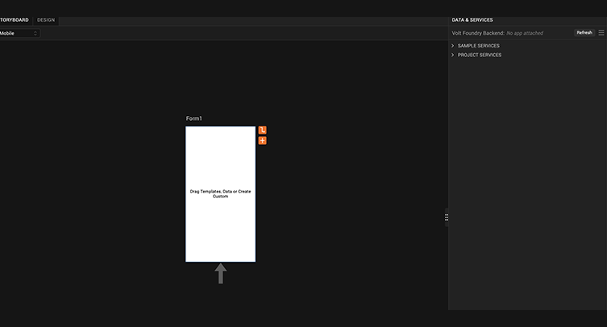

If a form is associated to an App Group, the name of the App Group is displayed by default with the form name in Storyboard view. Here, _Form1_ is associated to _AppGroup1_.

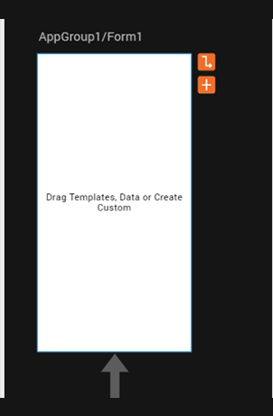

This topic covers the following sections related to the Storyboard view feature:

*   [Benefits of Using Storyboard View](#benefits-of-using-storyboard-view)
*   [Rename a Form](#rename-a-form)
*   [Add a Widget to a Form](#add-a-widget-to-a-form)
*   [Add a New Form with Navigation Link](#add-a-new-form-with-navigation-link)
*   [Add a Navigation Link between Two Forms](#add-a-navigation-link-between-two-forms)

Benefits of Using Storyboard View
---------------------------------

*   Provides a more global, summarized view of a Volt MX Iris application.
    
*   Reduces the number of assets that you have to manage at any given time for large Volt MX Iris projects.
    
*   Simplifies the creation of basic navigation for clicks within apps at the beginning of the application design and development cycle.
    

Rename a Form
-------------

**To rename a form in Storyboard view, follow these steps**:

1.  In Storyboard view, click the **Form1** text. A box appears in which you can enter the new name for Form1.  
      
    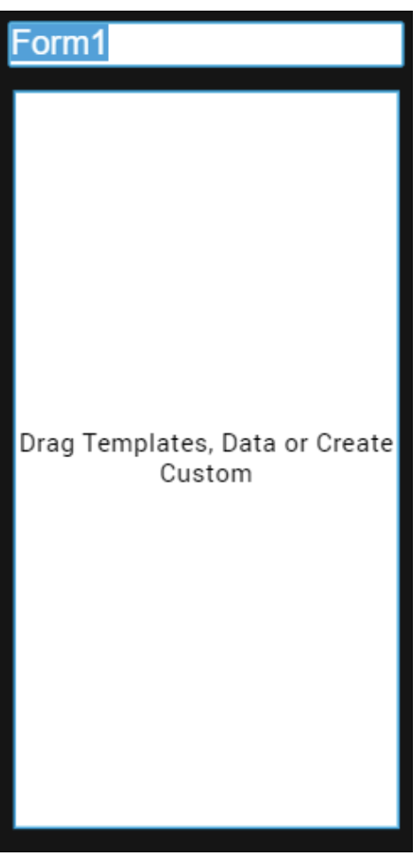

> **_Note:_** In Storyboard view, it is not possible to rename the App Group to which a form is associated; you can only rename a form.

1.  Type the required text in the box as the field name (here, _frmStartUp_), and press Enter. The form is displayed with the updated name in both Storyboard view and Design view.  
      
    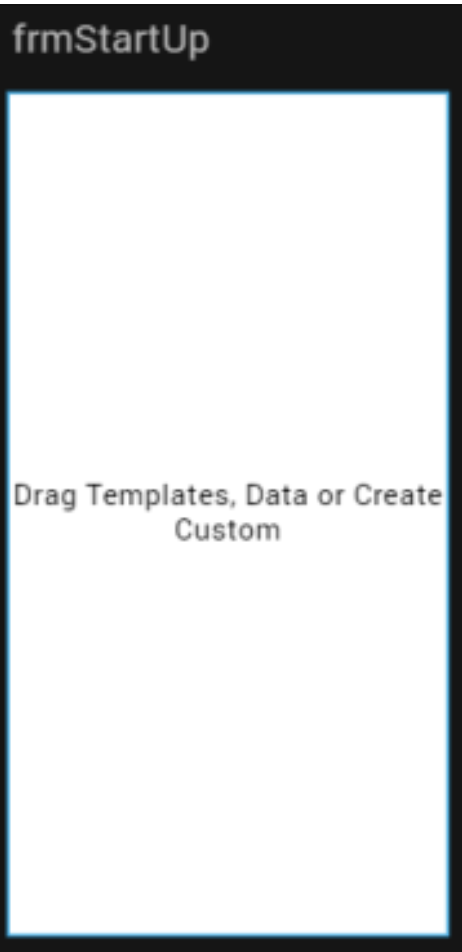  
      
    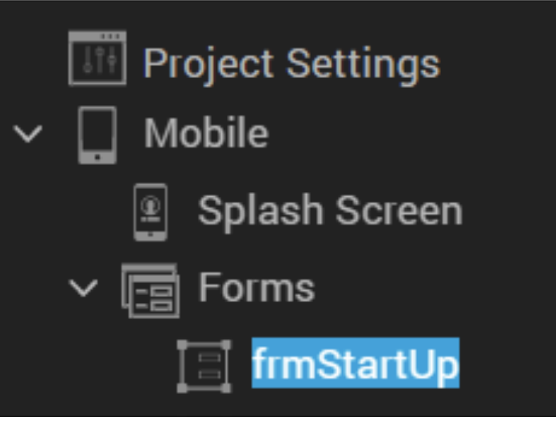

Add a Widget to a Form
----------------------

You can drag and drop any item or widget from the Default Library to a form in Storyboard view.

It is also possible to drag and drop services from the **Data & Services** panel onto the Storyboard view. When you drag and drop a method, object, or service anywhere on the Storyboard view canvas, the relevant forms and associated [hard navigation links](#hardnavigationlink) between the forms are automatically generated.

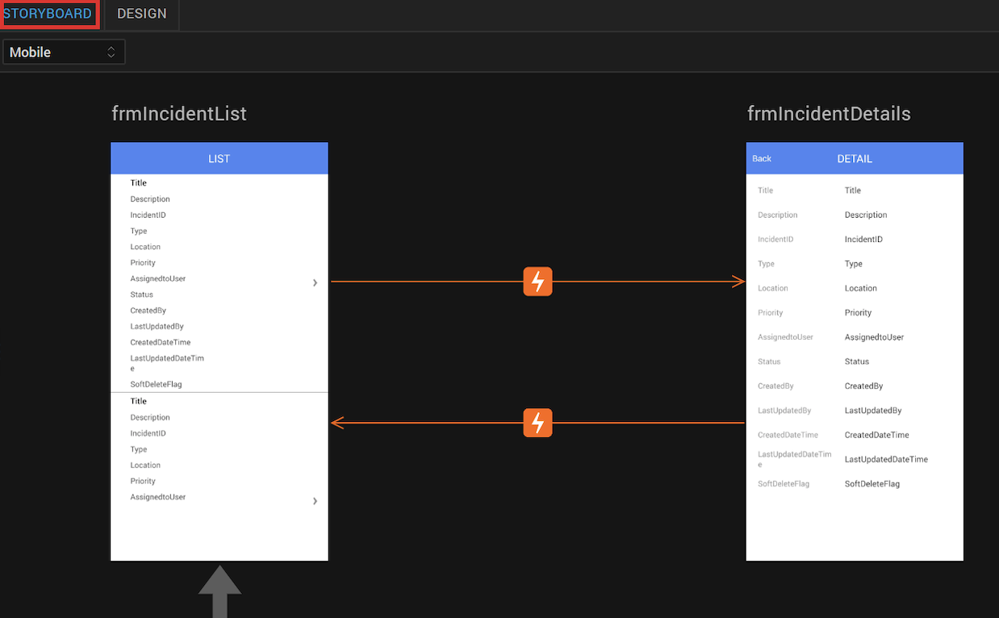

In the following scenario, we have added a SquaredButton widget to the form:

1.  In Storyboard view, under **Default Library**, expand **Buttons**. The list of available Button widgets appears.
2.  Drag and drop the **SquaredButton** widget to **Form1**.  
      
    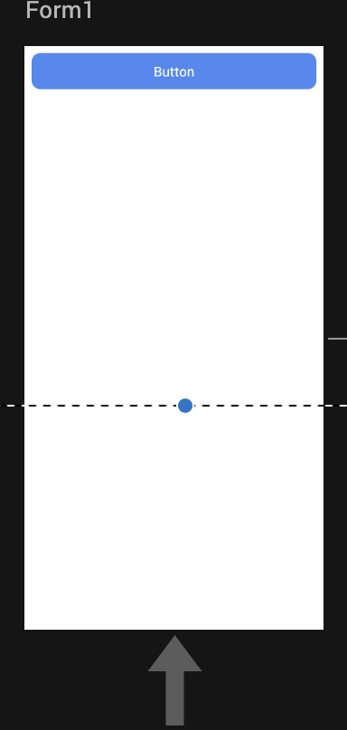
3.  If you want to delete or create a copy of the button, right-click the button on the project canvas and click **Delete** or **Duplicate** respectively.
4.  To view the details of the button that you added to the form, click the **Design** view tab on the project canvas. You can select the button on the Project Explorer, and then view or modify its details on the Properties panel.  
      
    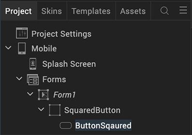

Add a New Form with Navigation Link
-----------------------------------

To add a new form with a navigation link to the existing form in Storyboard view, follow these steps:

1.  In Storyboard view, click **Form1**. Two icons appear beside the form.  
      
    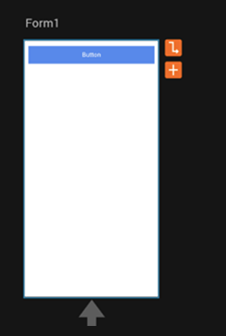
2.  Click the Add icon . A new form, named **Form2** by default, appears with a navigation link connecting to Form1.  
      
    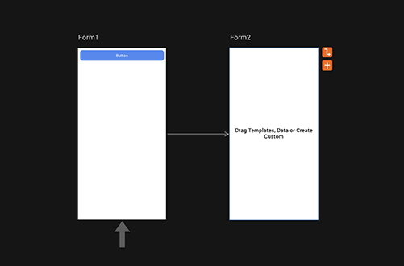  
      
    If an App Group exists under the same channel, when you click the Add icon , the **Select Appgroup** dialog box appears.  
      
    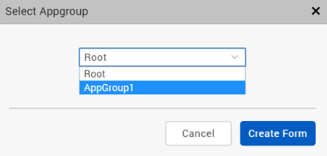  
      
    If you choose **Root** and then click **Create Form**, a new form named **Form2** appears with a navigation link connecting to Form1. In the Project Explorer, Form2 is displayed under **Mobile** > **Forms**.  
      
    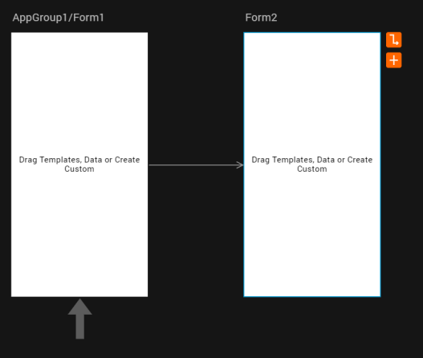  
      
    If you choose **AppGroup1** and then click **Create Form**, a new form **AppGroup1/Form2** appears with a navigation link connecting to Form1. In the Project Explorer, Form2 is displayed under **Mobile** > **Forms** > **AppGroup1**.  
      
    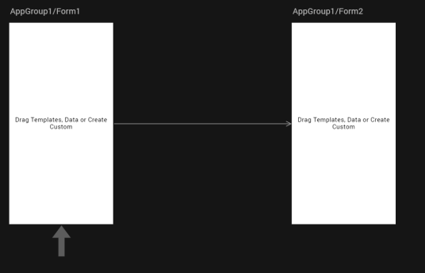

> **_Note:_** This type of navigation link is called as a [soft link](#SoftNavigationLink). It is just a visual representation of the navigation action between two forms; there is no actual navigation action involved between the forms through code.

1.  You can perform any of the following actions on Form2:
    *   **Mark as Startup**: Right-click Form2, and then click **Mark as Startup**. Form2 is selected as the landing page of the app, and the arrow that indicates this appears under Form2.  
          
        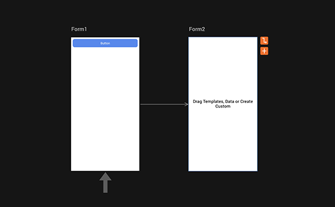
    *   **Duplicate**: Right-click Form2, and then click **Duplicate**. A copy of Form 2 (named _CopyForm2_ by default) is created without a navigation link, and appears beside it.
    *   **Delete**: Right-click Form2, and then click **Delete**. Form2 and its navigation link to Form1 are removed.
2.  If you want to just delete the navigation link between Form1 and Form2, click the navigation link and press the **Delete** key from your keyboard.

1.  To view the details of Form2, click the **Design** view tab on the project canvas. You can select **Form2** on the Project Explorer, and then view or modify its details on the Properties panel.  
      
    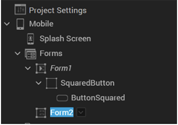

Add a Navigation Link between Two Forms
---------------------------------------

In this section, we will discuss how to create a navigation link between two forms in Storyboard view. There are two types of navigation links: **hard link** and **soft link**.

A _hard_ link is an actual navigation action between two forms through code. You can create this type of link only in Design view.

A _soft_ link is just a visual representation of a navigation action between two forms in the storyboard of your app. There is no actual navigation action involved through code between the forms. You can create this type of link only in Storyboard view.

To add a hard link between two forms in Design view, follow these steps:

1.  In Design view, click **Form1** > **SquaredButton**. We will take the example used earlier to create the navigation from Form1 to Form2, on the click of the button in Form1.
2.  Go to the **Properties** panel > **Action**, and then click **Edit** for the **onClick** action. The Action Editor appears with the Diagram View by default.
3.  In either the Diagram View, Design View, or Code View of the Action Editor, add the **Navigate to Form** action.
4.  Select **Form2** as the form to be navigated to, and then click **Ok**. The onClick navigation action from Form1 to Form2 is added.
5.  Go to Storyboard View. The hard navigation link between Form1 and Form2 is displayed.  
      
    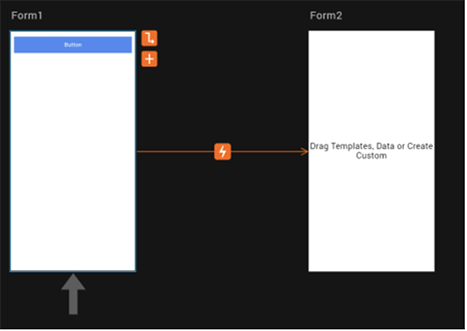

> **_Note:_** If a soft navigation link already exists between two forms and later you define a hard navigation link between those two forms, the hard navigation link replaces the soft navigation one.

> **_Note:_** You cannot delete a hard navigation link; only soft navigation links can be deleted.

1.  If you want to view or modify the details of the navigation action between the two forms in the Action Editor, click the Open Action icon . The Action Editor opens with details of the navigation action.

> **_Note:_** If there are multiple navigation actions between two forms, when you click the Open Action icon , all the created actions are displayed. You can click the required navigation action to view or modify the details in the Action Editor.

To add a soft link between two forms in Storyboard view, follow these steps:

1.  In Storyboard view, click **Form2**. Two icons appear beside the form.
2.  Click the Add icon . A new form, named **Form3** by default, appears with a navigation link connecting to Form2.
3.  To add a visual navigation link from Form1 to Form3, click **Form1** and then click the Draw Navigation Link icon .

> **_Note:_** You can only create soft navigation links between forms that do not have any hard navigation links between them.

1.  Drag the navigation link from Form1 to Form3. The visual representation of a navigation action between two forms is created.  
    If you want to delete the navigation link between Form1 and Form3, click the navigation link and press the **Delete** key from your keyboard.

> **_Note:_** A soft link is just a visual representation of the navigation action between two forms; there is no actual navigation action involved between the forms through code.
