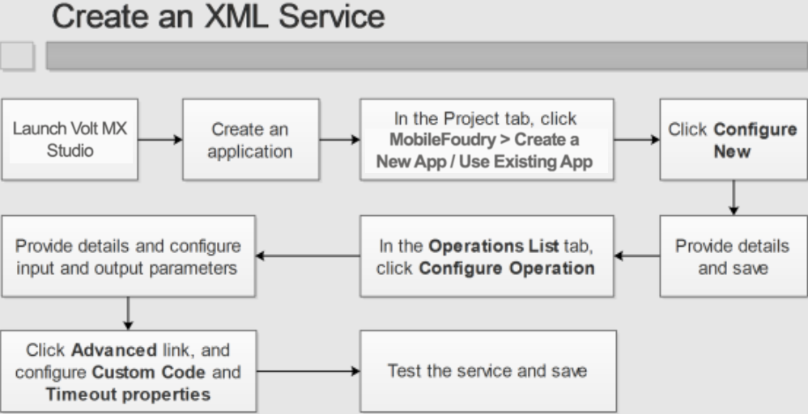
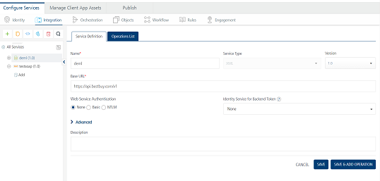
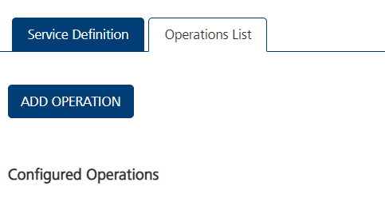
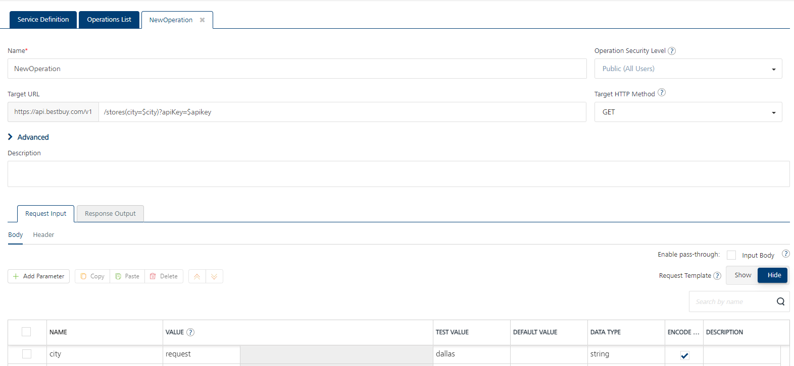
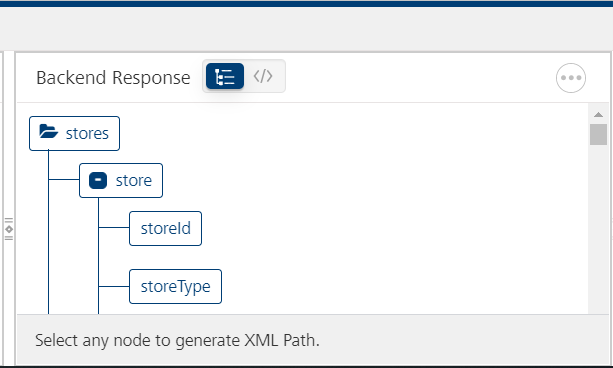

                          

Create an XML Service
---------------------

A service that communicates with an external data source using an XML data connector over the HTTP protocol is known as an XML service, and you can construct your application to use multiple XML web services from various sources that work together. Configured using the Volt MX Foundry Console, XML web services manages the interface between the requests of your app to an XML based data source and the data source's responses to those requests.

### An XML Service Scenario

The remainder of this topic describes how you would use an XML service to retrieve data from a web site, such as a news feed. In this scenario, the following takes place:

*   In the digital application, the user enters a search term (i.e. a keyword) directed to the URL of a news site.
*   The application invokes the designated XML service and hits the URL defined in the service with the keyword as an input parameter.
*   The service fetches the response and the response is sent back to the application.
*   The response received is displayed on a form to the user.

The following procedures describe how you would configure an XML service to carry out this scenario.

[Create an XML Service](#create-an-xml-service)

[Publish the Service](PublishVoltMXFoundryServicesApp.html)

[Map the Service Output to Widgets on a Form](ActionsMapping.html).

### Create an XML Service

This procedure assumes that you have already configured Volt MX Foundry in Volt MX Iris. For more information, see [Connect to the Volt MX Foundry Console](Connect to Volt MX Foundry.html).

To create an XML service, do the following:

1.  In Volt MX Iris, open either an existing application or create a new one.
2.  If you have not done so already, log in to your Volt MX account. To do so, in the top right corner of the Volt MX Iris window, click **Login**. The Volt MX Account sign-in window opens. Enter your email and password credentials for your Volt MX user account, and then click **Sign in**.
3.  Create a new Volt MX Foundry application or use an existing one. To do so, on the **Data and Services** panel, click the context menu arrow, and then click either **Create New App**, or **Use Existing App**, and then select from the Volt MX Foundry Application dialog box the services application that you want to publish. The Volt MX Foundry Console opens.

> **_Note:_** If you want to associate your Volt MX Iris project with a different Volt MX Foundry app, on the **Project** tab of the Project Explorer, click the context menu arrow for **VoltMX Foundry**, and then click **Unlink App**. To link to a different Volt MX Foundry app, click the context menu arrow for **VoltMX Foundry**, and then click either **Create New App**, or **Use Existing App**.

6.  To create a new integration service, on the **Integration** tab, click **CONFIGURE NEW**. The **Service Definition** section appears.

8.  In the **Name** box, enter a unique name for your service.
9.  From the **Service Type** drop-down list, click **XML**.
10.  In the **Base URL** text box, type the URL from which the XML services are extracted.
11.  From the **Client Authentication** drop-down list, select a value.
12.  In the **Web Service Authentication**, select one of the following modes:
    
    **None**: Select this option if you do not want to provide any authentication for the service.
    
    **Basic**: Provide User ID and Password if the external Web service requires form or basic authentication.
    
    **NTLM**: Your service follows the NT LAN Manager authentication process. You are required to provide the User ID, Password, NTLM Host, and NTLM Domain.
    
    > **_Important:_** If you configure an integration service with Basic web service authentication, ensure that reserved IDs are not used as input or header IDs since some key words such as userid, pwd and password are reserved by middleware services.
    
13.  Click the **Advanced** tab.
    
14.  If you want to specify a JAR file to associate with this service, select one from the **Select Existing JAR** drop-down menu, or click **Upload New** to add a new JAR file. Make sure that you upload a custom JAR file that is built on the same JDK version used for installing Volt MX Foundry Integration.
15.  If you want other identity services associated with your app to allow this service to access the identity session of the end-user at runtime, click the **Select Dependent Identity Services** drop-down menu and click the check box next to each identity service you want. This enables any operation to retrieve backend security tokens or other user profile data received during authentication and use it as part of the request sent to the backend target.
16.  If you want to use **API throttling** to limit the number of request calls within a minute. do the following:  
    1.  In the **Total Rate Limit** text box, enter a required value. This will limit the total number of requests processed by this API.
        
    2.  In the **Rate Limit Per IP** field, enter a required value. With this value, you can limit the number of IP address requests configured in your Volt MX Foundry console in terms of Per IP Rate Limit.
        
        To override throttling, refer to [Override API Throttling Configuration](../../../MBaasDocs/ConsoleAndID/Foundry8.0ConsoleAndIDSrvUG/Content/API_Throttling_Override.html#OverrideAPIThrottling).
        
        > **_Note:_** In case of On-premises, the number of nodes in a clustered environment is set by configuring the VOLTMX\_SERVER\_NUMBER\_OF\_NODES property in the Admin Console. This property indicates the number of nodes configured in the cluster. The default value is 1.  
        Refer to [The Runtime Configuration tab on the Settings screen of App Services]({{ site.baseurl }}/docs/documentation/Foundry/vmf_integrationservice_admin_console_userguide/Content/Runtime_Configuration.html).  
          
        The total limit set in the Volt MX Foundry Console will be divided by the number of configured nodes. For example, a throttling limit of 600 requests/minute with three nodes will be calculated to be 200 requests/minute per node.  
        This is applicable for Cloud and On-premises.
        
17.  Enter the qualified name of the URL Provider Class. For more information, refer [URL Provider Support for XML, JSON, SOAP, and API Proxy](../../../MBaasDocs/ConsoleAndID/Foundry8.0ConsoleAndIDSrvUG/Content/URL Provider Support for XML, JSON, SOAP and API Proxy.html).
18.  Click **Save**. A new tab titled **Operations List** appears. Click it.

20.  Click **CONFIGURE OPERATION**. The **New Operation** tab appears.

22.  In the **Name** box, provide a name for the operation.
23.  Select a security level from the **Operation Security Level** list. By default, this field is set to **Authenticated App User.**
    
    You can restrict access to this operation based on the following levels:
    
    *   **Authenticated App User.** Indicates that this operation is secured. To use this operation, an app user must be authenticated by an associated identity service.
    *   **Anonymous App User.** Indicates that a user must have the app key and app secret to access this operation.
    *   **Public.** Indicates that this operation requires no special security.
24.  From the HTTP Methods drop-down list, select a method for the operation.
25.  If necessary, in the **Target URL** text box, modify the URL by adding any needed suffix.
26.  On the **Request Input** tab, add parameters and provide values for them, ensuring that they correspond to the form elements on your digital app that the user has entered or selected. For example, in the case of a news feed scenario, these values might be as follows:

  
| Name | Test Value | Data Type |
| --- | --- | --- |
| newsType | health | string |

> **_Note:_** These values are specific to the example given here. You must do the mapping between the service parameters and the form elements to capture the values that the user enters and pass them to the service.

30.  On the **Request Output** tab, add parameters and provide the following details:

  
| Name | Path | Scope | Data Type | Collection ID |
| --- | --- | --- | --- | --- |
| channel1 | //channel | response | collection |   |
| title | item/title | response | string | channel1 |
| description | item/description | response | string | channel1 |
| pubDate | item/pubDate | response | string | channel1 |
| link | item/link | response | string | channel1 |

32.  Click **Advanced**, and then enter the necessary values for the following parameters:

**Custom Code Invocation**: Upload a JAR file containing the pre-processor class name and post-processor class name. This step allows you to further filter the data received from a service call.

> **_Note:_** For more information on Pre-processor and Post-processor, see the section [Preprocessor/Post Processor](Preprocessor_Postprocessor.html). Invoking a pre-processor or a post-processor within any type of service is optional. The need to invoke these libraries depends on your requirement.

**HTTP Headers**: You can provide the HTTP Headers for the call.

**Properties**: You can configure various advanced service properties.

**Timeout** (in ms) - Specify the maximum time (in milli-seconds) the service waits for a response, before terminating the connection to the external data source.

**Cacheable** - Specify if the service response must be stored in the cache.

Select appropriate **Response encoding** scheme. The default value is UTF-8. For more information about different encoding schemes supported by Volt MX Iris, see [Response Encoding Schemes](Response_Encoding.html).

**Cacheable Duration** - This option is enabled if you select the **Cacheable** property. This property specifies the time duration in seconds.

> **_Note:_** If this service is **Cacheable** and a call is made before the specified time duration, the service response is fetched from the Cache, else a fresh service call is made to fetch response from the server.

42.  Scroll down to the bottom of the window, and then click **Save Operation**.
43.  To view the results of the operation, click **Test**. The results are displayed in the **Output Result** section.

In the **Backend Response** section, you can view the back-end response as either raw data or in a tree format. Clicking an element on the tree displays the Xpath of that tag.

47.  To close the Volt MX Foundry Console and return to the panes, views, and tabs of the Volt MX Iris integrated development environment (IDE), from the Quick Launch Bar along the upper left edge of Volt MX Iris, click the Workspace icon . Since you are still logged in to your Volt MX account, Volt MX Iris continues to have access to your Volt MX Foundry services.
