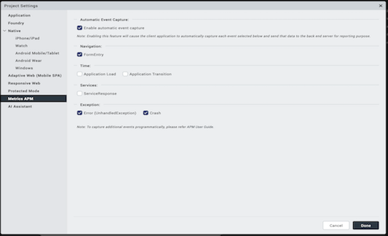

                         

Monitor an App's Performance
============================

With Volt MX Iris, you can conduct application performance monitoring (APM) so that you can evaluate the performance of your app and use the feedback as the basis for improving its performance. This topic only covers how to activate APM in Volt MX Iris. Capturing events and tracing the user journey through an app is handled by Volt MX Foundry. For more information on customizing and using APM, refer [VoltMX Foundry Reporting and Analytics]({{ site.baseurl }}/docs/documentation/Foundry/user_journey_app_events_apm/Content/App_Events_and_APM_Guide.html).

> **_Note:_** From Volt MX Iris V8 SP4 Fixpack 20 onwards, APM events are supported in Volt MX Iris. However, APM is not supported for the Run Live Preview and Publish Live Preview features in Volt MX Iris.

**To activate APM, do the following:**

1.  In Volt MX Iris: From the **Project** menu, click **Settings**. The Project Settings window appears. Click the **Metrics APM** tab.  
      
    

1.  Activate APM by selecting the **Enable automatic event capture** check box.
2.  Configure the extent of the APM activity by setting the following types of events.

*   **Navigation:** To capture when the user enters a form, check **FormEntry**.
*   **Time**: To capture the time the application takes to load, check **Application Load**. To capture the time the application takes to execute any transitions, check **Application Transition**.
*   **Services:** To capture when the app receives a response from a service, check **ServiceResponse**.
*   **Exceptions:** To capture when an unhandled error exception takes place, check **Error**. To capture when the app crashes, check **Crash**.

4.  Click **Done**.
