                            

Segment
-------

A Segment widget consists of multiple segments (rows or records) and each segment can have multiple child widgets. You can use Segment widgets to create menus and grouped lists in your applications.

To learn how to use this widget programmatically, refer [VoltMX Iris Widget guide]({{ site.baseurl }}/docs/documentation/Iris/iris_widget_prog_guide/Content/Overview.html#Segment.html#segmentedui-widget).

You can place a Segment widget within a number of parent widgets, and you can place a number of child widgets within a Segment widget.

You can add a Segment widget to the following widgets:

<table style="mc-table-style: url('Resources/TableStyles/2015DefinitiveBasicTable.css');margin-left: 0;margin-right: auto;" class="TableStyle-2015DefinitiveBasicTable" cellspacing="0"><colgroup><col class="TableStyle-2015DefinitiveBasicTable-Column-Column1" style="width: 110px;"> <col class="TableStyle-2015DefinitiveBasicTable-Column-Column1" style="width: 110px;"></colgroup><tbody><tr class="TableStyle-2015DefinitiveBasicTable-Body-Body1"><td class="TableStyle-2015DefinitiveBasicTable-BodyE-Column1-Body1">Flex Form</td><td class="TableStyle-2015DefinitiveBasicTable-BodyD-Column1-Body1">VBox Form</td></tr><tr class="TableStyle-2015DefinitiveBasicTable-Body-Body1"><td class="TableStyle-2015DefinitiveBasicTable-BodyE-Column1-Body1">FlexContainer</td><td class="TableStyle-2015DefinitiveBasicTable-BodyD-Column1-Body1">FlexScrollContainer</td></tr><tr class="TableStyle-2015DefinitiveBasicTable-Body-Body1"><td class="TableStyle-2015DefinitiveBasicTable-BodyE-Column1-Body1">ScrollBox (vertical orientation only)</td><td class="TableStyle-2015DefinitiveBasicTable-BodyD-Column1-Body1">Tab</td></tr><tr class="TableStyle-2015DefinitiveBasicTable-Body-Body1"><td class="TableStyle-2015DefinitiveBasicTable-BodyB-Column1-Body1">Popup</td><td class="TableStyle-2015DefinitiveBasicTable-BodyA-Column1-Body1">VBox widget (but not an HBox)</td></tr></tbody></table>

You can place the following widgets within a Segment widget:

<table style="mc-table-style: url('Resources/TableStyles/2015DefinitiveBasicTable.css');margin-left: 0;margin-right: auto;" class="TableStyle-2015DefinitiveBasicTable" cellspacing="0"><colgroup><col class="TableStyle-2015DefinitiveBasicTable-Column-Column1" style="width: 110px;"> <col class="TableStyle-2015DefinitiveBasicTable-Column-Column1" style="width: 110px;"> <col class="TableStyle-2015DefinitiveBasicTable-Column-Column1" style="width: 110px;"></colgroup><tbody><tr class="TableStyle-2015DefinitiveBasicTable-Body-Body1"><td class="TableStyle-2015DefinitiveBasicTable-BodyE-Column1-Body1">Button</td><td class="TableStyle-2015DefinitiveBasicTable-BodyE-Column1-Body1">Calendar</td><td class="TableStyle-2015DefinitiveBasicTable-BodyD-Column1-Body1">FlexContainer</td></tr><tr class="TableStyle-2015DefinitiveBasicTable-Body-Body1"><td class="TableStyle-2015DefinitiveBasicTable-BodyE-Column1-Body1">Image2</td><td class="TableStyle-2015DefinitiveBasicTable-BodyE-Column1-Body1">Label</td><td class="TableStyle-2015DefinitiveBasicTable-BodyD-Column1-Body1">Phone</td></tr><tr class="TableStyle-2015DefinitiveBasicTable-Body-Body1"><td class="TableStyle-2015DefinitiveBasicTable-BodyE-Column1-Body1">RichText</td><td class="TableStyle-2015DefinitiveBasicTable-BodyE-Column1-Body1">Slider</td><td class="TableStyle-2015DefinitiveBasicTable-BodyD-Column1-Body1">Switch</td></tr><tr class="TableStyle-2015DefinitiveBasicTable-Body-Body1"><td class="TableStyle-2015DefinitiveBasicTable-BodyB-Column1-Body1">TextArea2</td><td class="TableStyle-2015DefinitiveBasicTable-BodyB-Column1-Body1">TextBox2</td><td class="TableStyle-2015DefinitiveBasicTable-BodyA-Column1-Body1">ListBox</td></tr></tbody></table>

### Important Considerations

The following are important considerations for a Segment widget:

*   Segment occupies memory from two perspectives:
    *   The amount of data required by the number of rows. For example, if you set data for 100 rows, memory for all 100 records will be in memory.
    *   The view hierarchy (Box and other supported widgets) in each segment row. If the View hierarchy is complex, the memory usage is high.
        
        > **_Note:_** iOS, Android, and Windows platforms, if your segment has large data sets (more than 20 records with each record having more than 15 widgets), set the segment as a Screen Level Widget.
        
*   You cannot add any elements to the widgets dynamically, but you can hide any elements if you do not provide any data for that element.
*   You can dynamically change the skin of the widgets in the segment.
*   A Segment widget can be placed in a ScrollBox widget only if the ScrollBox widget has a vertical orientation.
*   The height of the Segment widget is determined by the content of the widget. If you set the Screen Level Widget to **True**, then the height of the Segment widget is the form height excluding headers and footers.
    

### Using the Segment Widget in a Component or Master

One you add a Segment widget to a component or master, you cannot drop other widgets onto that segment widget. To add a widget to a Segment widget in a component or master, create a segment row template, populate it with the widgets you want it to have, and then you configure the segment widget in the component or master to reference that row template. Once the segment widget in your component or master is populated width content from the row template, you can edit the segment widget's master data to have the per-row customized data that you need.

> **_Note:_** A segment template can only apply to one channel. To work around this, create the segment template for one channel, copy it, and then paste it into the other channels.

To use a Segment widget in a component or master:

1.  Create a segment row template. To do so, in the Project Explorer, click the **Templates** tab, open the channel you want to create the segment template for (e.g. Mobile), click the context menu arrow of **Segments**, and then click **New Template**. The template is created and opens on the Iris Canvas. It might be a good idea to rename the template to something descriptive, such as rowMobile. To do so, on the **Templates** tab, click the context menu arrow of the newly-created template, and then click **Rename**.
2.  Drag a FlexContainer widget onto the new template on the Iris Canvas, and configure it how you want.
3.  Drag onto the FlexContainer the widgets that you want the segment row template to have, and configure them how you want.
4.  Once you have the segment row template configured the way you want it, if you want to copy it to other channels, click the context menu arrow of the configured template, and then click **Copy**. Navigate to and open the channel you want to paste it to, click the context menu arrow of **Segments**, and then click **Paste**. Rename the template if you'd like, and then make any needed modifications so that it looks and behaves correctly in that channel.
5.  On the **File** menu (the **Project** menu in Volt MX Iris), click **Save All**.
6.  Add a Segment widget to the component or master. To do so, in the Project Explorer, on the **Templates** tab, in the Components or Masters section, select the component or master so that it opens on the Iris Canvas, add (or select an existing) container widget in the component or master, and then drag a Segment widget onto it.
7.  In the Properties Editor for the Segment widget you just added, click the **Segment** tab. Then from the Row Template drop-down list, select the row template you want to use.
8.  From the **Segment** tab, click the **Edit** button for Master Data, and make any changes needed to the segment data.
9.  On the **File** menu (the **Project** menu in Volt MX Iris), click **Save All**.

### Look Properties

Look properties define the appearance of the widget. The following are the major properties you can set:

*   Whether the widget is visible.
*   The platforms on which the widget is rendered.
*   How the widget aligns with its parent widget and neighboring widgets.
*   If the widget displays content, where the content appears.

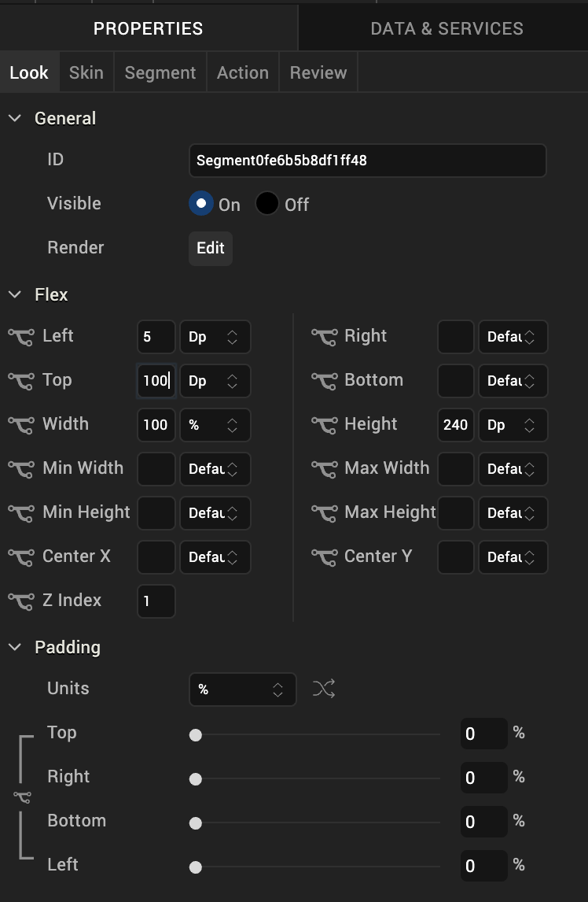

For descriptions of the properties available on the Look tab of the Properties pane, see [Look](Look.html#Flex).

### Skin Properties

Skin properties define a skin for the widget, including background color, borders, and shadows. If the widget includes text, you can also specify the text font.

For the Segment widget, you can apply a skin and its associated properties for the following states:

  
| Skin | Definition |
| --- | --- |
| Row | The skin that is applied for each row. |
| Row - Focus | The skin that is applied when user focuses on a row. |
| Section Header | The skin that is applied to the Section Header of Segment widget. |
| Widget | The skin that is applied to the entire Segment. |
| Row - Alternate | The skin that is applied to every alternate _even numbered_ row in the segment. |
| Blocked UI | The skin that is to block the interface until the action in progress (for example, a service call) is completed. > **_Note:_** Blocked UI is available only for SPA platforms. |
| Pressed | The skin to indicate that the row of the segment is pressed or clicked. |
| Refresh - Pull | The look and feel of a widget when the scroll bar is pulled. |
| Refresh - Push | The look and feel of a widget when the scroll bar is pushed. |

For more information about applying skins, see [Understanding Skins and Themes](Customizing_the_Look_and_Feel_with_Skins.html).

### Segment Properties

Segment properties specify properties that are available on any platform supported by Volt MX Iris, and assign platform-specific properties.

> **_Note:_** Properties that can be forked are identified by an icon  located to the left of the property. For more information, see [Fork a Widget Property](Forking.html#fork-a-widget-property).

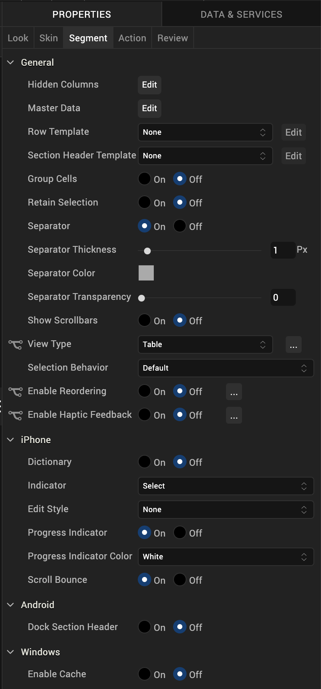

#### Master Data

The master data is enabled only when the widgets are added to the **Segment** widget.

The following example illustrates using the Master Data property to add an image and button to the Segment widget:

1.  Select the Segment widget.
2.  Drag an Image widget and Button widget onto the Segment widget.
3.  From the **Segment** widget properties, click the **Segment** tab.
4.  Click the **Edit** button of the **Master Data** option to open the **Master Data** dialog box.
5.  Provide the image and button widget details as shown in the following image.
6.  Click **OK**.

#### Row Template

Indicates the common template to be used for each row while creating the row and filling the data. This can be overridden at the row level when setting the data using the template key.You can create a new template without going to the Templates section using the **Create New** option from the drop-down list. You can also edit a template inline in the segment.

> **_Note:_** Only those templates that are created from **Project Explorer >Templates > Segments** are visible on the **Row Template** drop-down list.

#### Section Header Template

Specifies the common template to be used for each section while creating the section header and filling the data. This is optional parameter and if not provided the default template provided by each platform will be used. It can also be provided at each section level when setting the data. You can create a new template without going to the Templates section using the **Create New** option from the drop-down list. You can also edit a template inline in the segment.

> **_Note:_** Only those templates that are created from **Project Explorer >Templates > Segments** are visible on the **Row Header Template** drop-down list.

> **_Note:_** When a Section Header is provided along with the rows/items, the Section Header is "clamped" to the top of the scrollable area (on the Form) as one scrolls through a long list of items (for example, if you have a long list of contacts that all begin with the letter "A", the "A" header will be fixed at the top until you scroll down past the last "A" item). This behavior can be clearly seen iPhone's Contacts application.  
This behavior of Section Headers is available on iOS and Android platform and is enabled when the Screen Level Widget has been set to true.  

#### Group Cells

Specifies whether all the rows in a segment should be grouped using a rounded corner background and border.

*   If **On** is selected, the cells will not have rounded border.
*   If **Off** is selected, the cells will have a rounded border.

#### Retain Selection

Specifies whether the segment should retain the selection made when the user navigates out of the form and revisits the form.

*   If **On** is selected, the selection is retained when the user navigates to different form.
*   If **Off** is selected, the selection is not retained.

#### Full Screen Widget

Specifies whether the widget should occupy the whole container or not. You must set the value to true if your segment has large data sets (more than 20 records with each record having more than 15 widgets) to facilitate a better reuse of the widgets and a different scrolling behavior.

*   If **On** is selected, the widget occupies the whole container and there is a reduction in load time of the Segment as only few rows are loaded at the load time. The rest of the rows are loaded as the user scrolls through the widget. But the scrolling speed reduces.
*   If **Off** is selected, the widget does not occupy the whole container and load time of Segment increases because all the rows are loaded at the beginning. But the scrolling speed improves.

> **_Note:_** This property is available only when a Segment widget is placed in a VBox form.

#### Separator

Specifies if the segment should display the separator between the rows.

*   If **On** is selected, the separator appears.
*   If **Off** is selected, the separator is not displayed.

#### Separator Thickness

Specifies the thickness of the separator in pixels.

#### Separator Color

Specifies the color of the separator between rows of a Segment widget. Click the color sampler to open the color picker from where you can select a separator color.

#### Separator Transparency

Provide the desired transparency for the separator.

#### Show Scrollbars

Specifies if the scrollbars of the segment must be visible all the time.

*   If **On** is selected, the scrollbars are displayed.
*   If **Off** is selected, the scrollbars are not displayed.

#### Orientation

Specifies how you can stack the widgets within the Segment. You can set the orientation of the Segment as horizontal or vertical.

Following are the options:

*   Horizontal: Enables you to stack the content within the Segment horizontally.

*   Vertical: Enables you to stack the content within the Segment vertically.

> **_Note:_** This property is available only when Segment widget is placed in a VBox form.

#### View Type

Specifies the view type of a segment. The following are the available view types that you can select and their appearances on iPhone native client:

*   Table: The rows of the segment appear in a table as a list.
    
    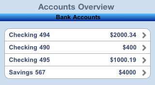
    
*   Page: The rows of the segment appear in pages and you need to scroll through the pages to view the rows.
    
    
    

#### Layout Alignment

Specifies the direction in which the widgets are laid out.

**Default**: LEFT

The options are:

*   Left: The widgets placed inside a Segment are aligned left.
*   Center: The widgets placed inside a Segment are aligned center.
*   Right: The widgets placed inside a Segment are aligned right.

> **_Note:_** This property is avialable only when Segment widget is placed in a VBox form.

#### Selection Behavior

Specifies whether the segment will support single or multiple selection.

Following are the options:

*   Default: Indicates that the segment does not support either single or multiple selection. This option allows you to define an onRowClick event for the segment.
*   Single Select: Indicates that you can make one selection when you have many choices in the segment (the behavior is similar to a RadioButtonGroup).
*   Multi Select: Indicates that you can make more than one selection when you have many choices in the segment (the behavior is similar to a CheckBoxGroup).

#### Enable Reordering

For Volt MX Iris Version 7.3 and later, specifies whether to enable or disable reordering rows in a segment.

#### Autogrow Mode

This property is applicable only when the segment is placed inside a flex container and View Type is set as Table. It specifies the segment to grow when the new content is added.

Following are the options:

*   None: Auto growth of a Segment is disabled.
*   Autogrow-Height: Auto growth of a Segment is enabled.

Rules and Priorities of Autogrow-Mode property

*   If the height of the Segment is not computable and **Autogrow Mode** property is configured as **Autogrow-Height**, then the height of the Segment will be the Preferred Height, and min and max constraints are applied on top of the Preferred Height computed.
    
    > **_Note:_** Preferred Height in the above statement refers to the cumulative height of the segment contents (rows - defined using templates, section headers / footers, separators etc.).
    

*   If the height of the Segment is not computable and **Autogrow Mode** property is configured as **None**, then the height of the Segment will be the default value and min/max constraints are applied on top of the default value.
*   The Autogrow Mode property gets preference, when the height of the Segment is specified as preferred and Autogrow Mode property is configured Autogrow-Height.
*   If the Autogrow Mode property is not specified or the specified value is invalid, then the default value of the Autogrow Mode property is equal to specifying **None**.
*   If Autogrow Mode property is specified, and the templates defined are specified in percentage, then the height of the row, which uses percentage template will be considered as the default row height of the template, which is 100dp.
*   All the above rules are applied even if the template specified is a box template.
*   When a Segment is generated using single bucket constructor, height property must be set as undefined for Autogrow Mode property to work.
*   If the row template height is not specified and the Segment Autogrow Mode property is set as Autogrow-Height, then row height of the Segment is 220dp (preferred height of a flex container).

#### Height

Specifies the height of the Segment in terms of percentage. The percentage is with reference to the value of [Height Reference](#height-reference) property.

> **_Note:_** This property is unavailable on Flex Forms.

#### Height Reference

The Segment height percentage is calculated based on the option selected.

*   Form Reference: The Segment height percentage is calculated based on the height of the form excluding headers and footers. This option is not respected if Segment is placed inside a popup or in templates.
*   Parent Width: This option is used if the Segment is placed inside a popup or in templates. The width is calculated based on the width of the parent container.
    
    > **_Note:_** This property is unavailable on Flex Forms.
    

#### Dictionary

Specifies whether the dictionary must be enabled for easy navigation.

If the dictionary property is enabled, alphabets from A to Z appear on the screen and when you select any alphabet, all the corresponding results that start with the selected alphabet are displayed.

> **_Note:_** This property is applicable if Screen Level Widget property is set to true and the section headers have been set.

*   If **On** is selected, the dictionary is available.
*   If **Off** is selected, the dictionary is not available.

> **_Note:_** This property is specific to the iOS platform.

#### Indicator

Specifies the indicator type as rowSelect, rowClick, or none. Based on your selection, the behavior is exhibited:

Following are the options:

If the user selects the indicator, the related content appears in the next screen .

*   Click: Specifies the disclosure button. The button appears as follows:
    
    
    

If the user selects the disclosure button, the detailed content appears.

*   None: No indicator or button appears.

> **_Note:_** This property is specific to the iOS platform.

#### Edit Style

Specifies the way in which the edit feature of Segment can be enabled.

Following are the options:

*   Icon: An icon will be displayed on the left hand side of each row.
*   Swipe: A delete or insert button will be shown on the right hand side of each row when the user performs a SWIPE gesture on the row. Whether an insert button or delete button is to be shown is controlled by the editmode property that is set using the data property of the Segment.
*   None: No special edit styles are applied.

> **_Note:_** This property is specific to the iOS platform.

#### Progress Indicator

Specifies whether the progress indicator is displayed.

Default: true (the progress indicator appears on the widget)

*   If **On** is selected, the progress indicator appears on the widget.
*   If **Off** is selected, the progress indicator is not displayed on the widget.

> **_Note:_** This property is specific to the iOS platform.

#### Progress Indicator Color

Specifies the color of the progress indicator as white or grey.

*   White: The progress indicator is white in color.
*   Grey: The progress indicator is grey in color.

> **_Note:_** This property is specific to the iOS platform.

#### Scroll Bounces

Specifies whether the scroll view bounces past the edge of the content and back again.

*   If **On** is selected, the scroll view bounce is applied.
*   If **Off** is selected, the scroll view bounce is not applied.

> **_Note:_** This property is specific to the iOS platform.

#### Search Criteria

Specifies the search criteria to be applied when searching has been enabled.

> **_Note:_** This property applies only when the [Full Screen Widget](#full-screen-widget) property is enabled, **[View Type](#view-type)** is set to **Table**, and a template is selected for **[Search By](#search-by)** property.

The options are:

*   Starts With: The search is performed on the strings that start with the input string.
*   Ends With: The search is performed on the strings that end with the input string.
*   Contains: The search is performed on the strings that contain the input string.

> **_Note:_** This property is specific to the iOS platform.

#### Search By

Specifies the identifier of the widget placed inside the row of the Segment. Search will be performed against the content present inside the widget.

> **_Note:_** Note: This property is applicable only when [Full Screen Widget](#full-screen-widget) property is enabled, **[View Type](#view-type)** is set to **Table**, and a template is selected for [Row Template](#row-template) property.

> **_Note:_** This property is specific to the iOS platform.

#### Dock Section Header

Specifies whether to dock the section header at the top of the segment while scrolling the section content. If you are scrolling the segment data, the next section header will be docked on top of the segment

> **_Note:_** This property applies only when the [Full Screen Widget](#full-screen-widget) property is enabled and **[View Type](#view-type)** is set to **Table**.

For example, if you scroll the segment data shown in the following figure, as the segment data scrolls up, the Samsung Phones docked header moves out oThe Samsung header f view. and is replaced with the HTC Phones section header, which is now docked.

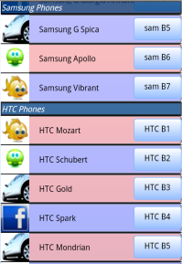

> **_Note:_** This property is specific to the Android platform.

#### Swipe Config

From Volt MX Iris V9 onwards, you can configure swipe functionality for a Segment widget. The Swipe config settings enable users to dismiss a row or to reveal certain actions when they swipe a row to the left or right.

For more information on enabling the swipe functionality on the rows of a Segment using a row template, refer [SwipeConfig](Flex_Container.html#swipe-config).

### Actions

Actions define what happens when an event occurs. On a Segment widget, you can run an action when the following events occur:

*   **onRowClick:** The action is triggered when a user clicks any row of the widget.
*   **onPull:** The action is triggered when the widget is pulled from the top.
*   **onPush:** The action is triggered when the widget is pushed from the bottom.
*   **onReachingBegining:** The action is triggered when scrolling reaches the beginning of the widget.
*   **onReachingEnd:** The action is triggered when scrolling reaches the end of the widget.
*   **onTouchStart:** The action is triggered when the user touches the touch surface. This event occurs asynchronously.
*   **onTouchMove:** The action is triggered when the touch moves on the touch surface continuously until movement ends. This event occurs asynchronously.
*   **onTouchEnd:** The action is triggered when the user touch is released from the touch surface. This event occurs asynchronously.
*   **onEditing:** The action is triggered when a user edits the row. This action is only triggered if the Edit Style is set to SEGUI\_EDITING\_STYLE\_ICON or SEGUI\_EDITING\_STYLE\_SWIPE (iOS).

For more information, see [Add Actions](working_with_Action_Editor.html).

### Create a User-defined Template from an Auto-generated Segment Template

**To create a user-defined Template from an auto-generated Segment Template, follow these steps:**

1.  Right-click the Segment that contains the auto-generated Template and associated UI elements. A list of options appears.  
      
    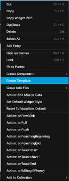
2.  Click **Create Template**. Volt MX Iris displays a dialog box stating that if you have added a code snippet for the widgets inside the Segment Template, the associated code will be cloned in the Segment Template; but, the references in the custom code will not be modified appropriately. You must manually make the changes to the references in the custom code.  
      
    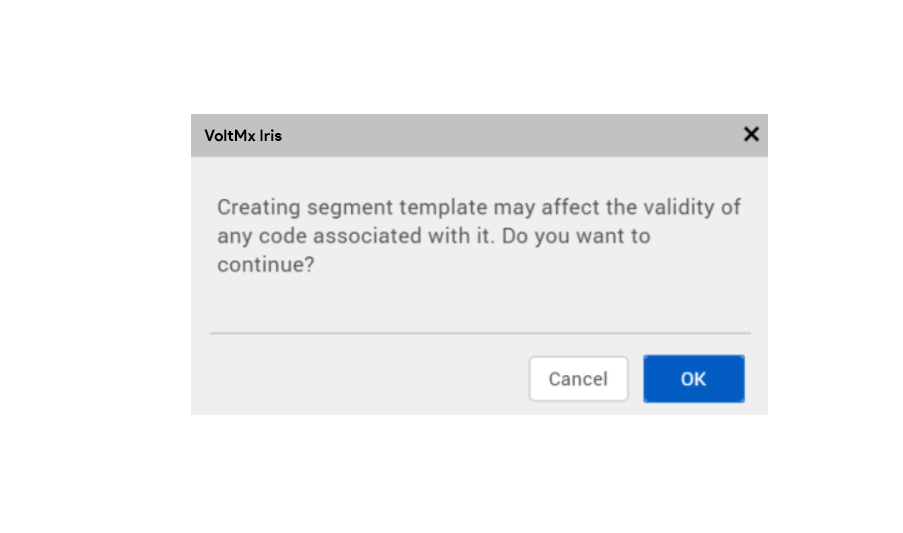
3.  Click **OK**. A new Segment Template, which is a clone of the selected Segment Template, is created and is available at Project Explorer > **Templates** > \*channel\* > **Segments**. Alternatively, you can right-click the original Segment Template and select the **Navigate to Template** option.  
      
    All the properties of the Segment Template and its associated widgets are duplicated in the newly created Template.  
      
    The cloned Template will be assigned as a Row Template of the selected Segment.  
      
    You can only reuse the Segment Template in various forms of the same channel in which you created the Template.

### Map Section Header Template Widgets by using Mapping Editor

To map the widgets of the Section Header Template of a Segment by using Mapping Editor, follow these steps:

1.  In Volt MX Iris, add a Segment widget to a form.
2.  Select the Segment, and then go to **Properties** panel > **Segment**.
3.  In the **Row Template** list box, select the **SampleRowTemplate** option.  
      
    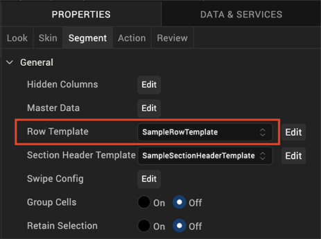
4.  In the **Section Header Template** list box, select the **SampleSectionHeaderTemplate** option.  
      
    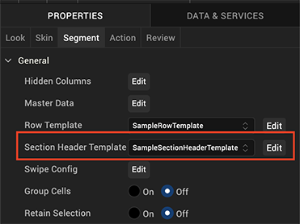
5.  In Project Explorer, select the form to which you had added the Segment and go to **Properties** panel > **Action**.
6.  For any Event (for example, _onMapping_), click **Edit**. The **Action Editor** window appears, with **Diagram View** open by default.
7.  On the left pane of [Action Editor](working_with_Action_Editor.html), locate and click the **Add Mapping** action. The Add Mapping action is added to the flow diagram, as shown here.  
      
    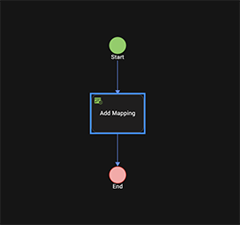
8.  Select **Add Mapping** from the flow diagram. [Mapping Editor](ActionsMapping.html) opens on the right pane of [Action Editor](working_with_Action_Editor.html).
9.  Map the required [global variables](Global_Variables_and_Data_Store_Keys.html), services, and other items to the Segment **rowData** and **sectionData** as well as to associated rowData and sectionData widgets.  
      
    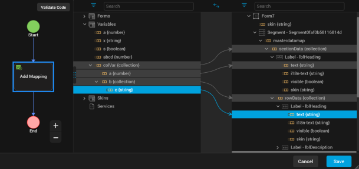

1.  Click **Code View** to see the code details of the data mappings.  
      
    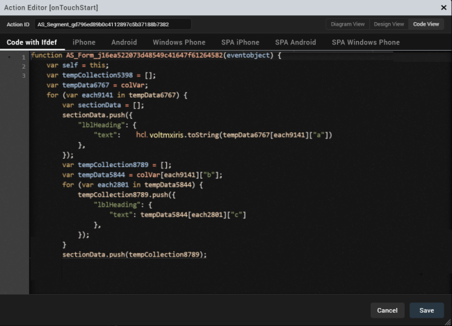
2.  Click **Save**. You have successfully mapped the widgets of the Section Header Template and Row Data of a Segment by using [Mapping Editor](ActionsMapping.html).

#### Remarks

*   For Volt MX Iris V8 SP4 or earlier projects, the elements that had been mapped to the widgets of Segment Master Data will now be mapped to the widgets of Segment Section Data.
*   If you change any of the Segment Templates, all their associated mappings will be automatically deleted.

### Widget Appearance on Platforms

The appearance of the Segment widget varies as follows.

  
| Platform | Appearance |
| --- | --- |
| Android | 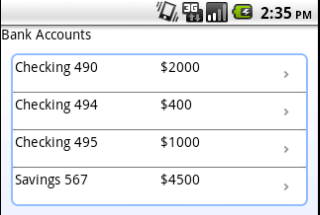 |
| iOS | 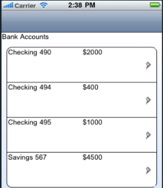 |
| Windows Phone | 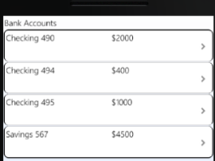 |
| SPA | 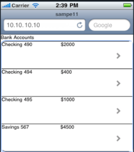 |

<table style="margin-left: 0;margin-right: auto;mc-table-style: url('Resources/TableStyles/RevisionTable.css');" class="TableStyle-RevisionTable" cellspacing="0" data-mc-conditions="Default.HTML5 Only"><colgroup><col class="TableStyle-RevisionTable-Column-Column1" style="width: 42px;"> <col class="TableStyle-RevisionTable-Column-Column1"> <col class="TableStyle-RevisionTable-Column-Column1"></colgroup><tbody><tr class="TableStyle-RevisionTable-Body-Body1"><td class="TableStyle-RevisionTable-BodyE-Column1-Body1" data-mc-conditions="Default.HTML5 Only,Default.Iris7-1,Default.Iris7-1-1,Default.Iris7-2">Rev</td><td class="TableStyle-RevisionTable-BodyE-Column1-Body1" data-mc-conditions="Default.HTML5 Only,Default.Iris7-1,Default.Iris7-1-1,Default.Iris7-2">Author</td><td class="TableStyle-RevisionTable-BodyD-Column1-Body1" data-mc-conditions="Default.HTML5 Only,Default.Iris7-1,Default.Iris7-1-1,Default.Iris7-2">Edits</td></tr><tr class="TableStyle-RevisionTable-Body-Body1"><td class="TableStyle-RevisionTable-BodyB-Column1-Body1" data-mc-conditions="Default.HTML5 Only,Default.Iris7-1,Default.Iris7-1-1,Default.Iris7-2">8</td><td class="TableStyle-RevisionTable-BodyB-Column1-Body1" data-mc-conditions="Default.HTML5 Only,Default.Iris7-1,Default.Iris7-1-1,Default.Iris7-2">SHS</td><td class="TableStyle-RevisionTable-BodyA-Column1-Body1" data-mc-conditions="Default.HTML5 Only,Default.Iris7-1,Default.Iris7-1-1,Default.Iris7-2">SHS</td></tr></tbody></table>
