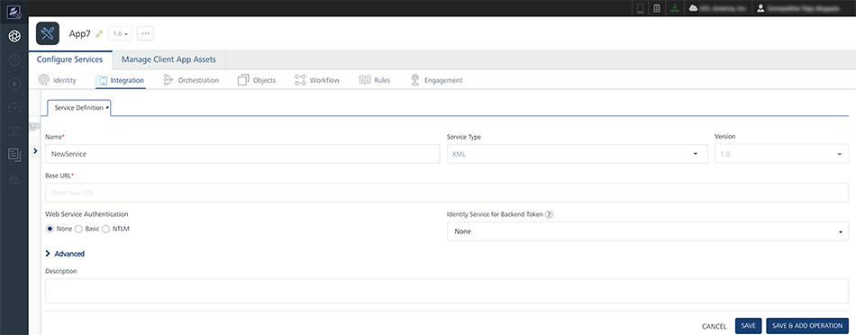
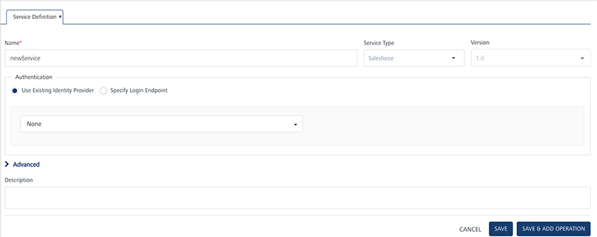
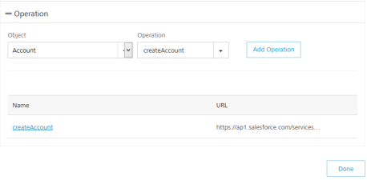
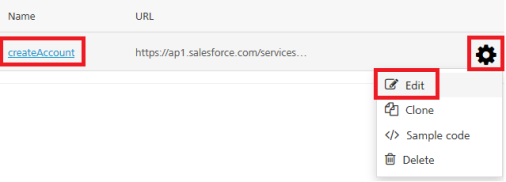
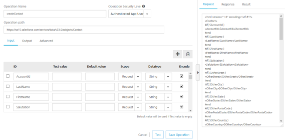
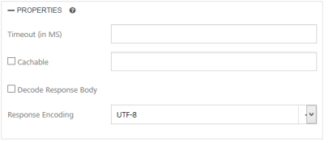
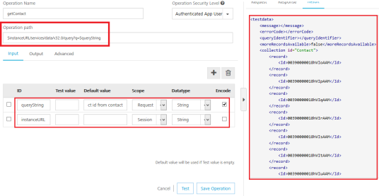

                         

Configure a Salesforce Service
==============================

A service that communicates with an external data source using an Salesforce data connector is known as an Salesforce service, and you can construct your application to use multiple Salesforce services from various sources that work together. Configured using the Volt MX Foundry Console, Salesforce web service manages the interface between the requests of your app to an Salesforce based data source and the data source's responses to those requests.

In this topic, you will learn about: 

[Configure a Salesforce Service](#configure-a-salesforce-service)

[Publishing the Service](PublishVoltMXFoundryServicesApp.html)

[Mapping the Service Output to Widgets on a Form](ActionsMapping.html).

Configure a Salesforce Service
------------------------------

To configure your Salesforce service, follow these steps:

1.  Create a new Volt MX Foundry application or use an existing one. To do so, on the **Data and Services** panel, click the context menu arrow, and then click either **Create New App**, or **Use Existing App**, and then select from the Volt MX Foundry Application dialog box the services application that you want to publish. The Volt MX Foundry Console opens.

    

2.  To create a new integration service, on the **Integration** tab, click **CONFIGURE NEW**. The **Service Definition** section appears.

    

3.  Click the **Integration** tab, click **CONFIGURE NEW** to create an integration service.
4.  In the **Service Definition** section, follow these steps:
    1.  In the **Service Name** text box, enter a unique name for your service.
    2.  From the **Service Type** list, select **Salesforce**.  
        By default, XML is selected. If you select **Salesforce**, the **Choose Salesforce Authentication Type** section is displayed, shown below.
        
        
        
    3.  Under **Choose Salesforce Authentication Type**, click one of the following modes:
        
        *   [Use Existing Identity Provider](#SFExistingIdentityProvider) - to select an identity provider. This drop-down lists all identity providers only if you have already created identity providers for SAP in the Identity page.
        *   [Specify Login Endpoint](#SFSpecify_Login_Endpoint)\- to configure a new endpoint.
        
        To configure **Use Existing Identity Provider**, fill in the details for the following fields:
        
        1.  From the **Select Identity Provider** list, select your Salesforce identity.
            
            The details for the selected identity are displayed in the **Endpoint URL** text box. You cannot modify these details.
            
        2.  Under the **User ID** and **Password**, provide valid log-in credentials that you created while registering with Salesforce services.
        
        To configure **Specify Log-in Endpoint**, fill in the details for the following fields:
        
        1.  In the **Endpoint URL**, enter the URL - for example, `https://login.salesforce.com/services/oauth2/token`_._
        2.  In the **Client ID** box, enter a valid client id.
        3.  In the **Client Secret** box, enter a valid client secret.
        4.  In the **User ID** box, enter a valid user ID.
        5.  In the **Password** box, enter a valid password.
5.  After you configure the authentication service, click **Save and Continue** to display the **Operation** section. Based on your Salesforce authentication, the system loads all tables such as objects and operations.
    

1.  Select an object from the **Object** list that is auto-populated with all the existing Salesforce objects.
    
    > **_Note:_** If you provide incorrect Salesforce endpoint details, the **Object** list will contain only _\_Login_ object.
    
2.  Based on the object added, the operation list is populated. Select the check boxes for required operations.
3.  Click **Add Operation**. The system adds your operation under the Configured Operations section, and it also adds your new Salesforce service into the Integration page.
    
    
    
4.  To configure operations, under **Operations** > **Configured Operations** section, hover your cursor over the required service, click an operation under the **Name** column or click the **Settings** button, and then click **Edit**.
    
    
    
    The operation details are displayed.
    
    
    
5.  In the **Operation Name** box, modify the name if required.
6.  Select one of the following security operations in the **Operation Security Level** field. By default, this field is set to **Authenticated App User.**
    *   **Authenticated App User** – indicates that this operation is secured. To use this operation, an app user must be authenticated by an associated identity service.
    *   **Anonymous App User** – indicates that a user must have the app key and app secret to access this operation.
    *   **Public** – indicates that this operation requires no special security.
7.  In the **Operation Path** text box, modify the path if required.
    
    > **_Note:_** You can add an entry by clicking the **Add** button if entries for the input and the advanced tabs do not exist. You can also delete an existing entry by clicking the **Delete** button.
    
8.  In the **Input** tab, provide the following details:
    1.  The **ID** field contains a unique identifier for a parameter. Change the identifier if required.
    2.  The **Test value** field contains a value to be used to test the service. Change the syntax if required.
    3.  In the **Default value** field, change the syntax if required.
    4.  In the **Scope**, select request or session in the **Scope** field. By default, this field is set to **Request**.
        1.  **Request** - indicates that the value must be retrieved from the HTTP request received from the mobile device.
        2.  **Session** - indicates that the value must be retrieved from the HTTP session stored on Volt MX Foundry.
    5.  Select a data type in the **Datatype** field:
        *   **String** - a combination of alpha-numeric and special characters. Supports all formats including UTF-8 and UTF-16 with no maximum size limit.
        *   **Date** - Date format
            *   If datatype is string, then the options in the Format Type are Currency, Number and Date.
            *   If the datatype is number, then the options in the Format Type are Currency and Date.
            *   If the datatype is boolean, then the options in the Format Type and Format Value text box are disabled.   
        *   **Boolean** - a value that can be true or false.
        *   **Number** - an integer or a floating number.
        *   **Collection** - a group of data, also referred to as data set.
    6.  Select the **Encode** check box to enable an input parameter to be encoded. For example, the name New York Times would be encoded as _New_York_Times_ when the encoding is set to True. The encoding must also adhere to the HTML URL encoding standards.

1.  Click the ****Output**** tab, and enter the values for required fields such as ID, scope, data type, collection ID, record ID, format and format value.

2.  Click the **Advanced** tab, and follow these steps:
    1.  Under the **CUSTOM CODE INVOCATION**, upload the JAR file containing the preprocessor class name and postprocessor class name. This step allows you to further filter the data received from a service call.
        *   **Specify Custom Jar** \- Browse and select the JAR containing preprocessor or postprocessor libraries.
        *   **Preprocessor class** - Enables a developer to include any business logic on the data before forwarding the request to the external data source. Select the JAR file from the list.
        *   **Postprocessor class** - Enables a developer to include any business logic on the data before sending the response to a mobile device. Select the JAR file from the list.
    2.  Based on the operation - for example, post or get - provide custom HTTP headers.  
        To provide customer headers, click **HTTP Headers** . In the **Test values** text box, provide custom HTTP headers required by the external data source, shown below:
        *   **ID**: The rows are created based on the selected operation. Change the value if required.
        *   **Test value**: Enter a value. A test value is used for testing the service.
        *   **Default value:** change the syntax if required.
        *   **Scope:** select request or session. By default, this field is set to **Request.**
    3.  Under the **PROPERTIES** section, provide details for the following advanced service properties:
        
        
        
        *   **Timeout (in ms)** - the duration in milliseconds after which the service call times out. Provide the details in the text box.
        *   **Cachable(sec)** - the duration in seconds within which the service response is fetched from the cache. Select the **Cachable(in sec)** check box and provide the details in the text box.
        *   **Decode Response Body -** To ignore the Salesforce response received in the XMLvalue field, select the Decode Response Body response check box.
        *   **Response Encoding -** select the appropriate response encoding. The default value is UTF-8. For more information about different encoding schemes, refer to [Response Encoding Schemes]({{ site.baseurl }}/docs/documentation/Iris/iris_user_guide/Content/Response_Encoding.html).
3.  Click **Test** to view the results.
4.  Click **Save Operation** to save the operation. They system displays the **Operation** section for your service.
5.  Click **Done** to navigate to the **Integration** page.
6.  To close the Volt MX Foundry Console and return to the panes, views, and tabs of the Volt MX Iris integrated development environment (IDE), from the Quick Launch Bar along the upper left edge of Volt MX Iris, click the Workspace icon . Since you are still logged in to your Volt MX account, Volt MX Iris continues to have access to your Volt MX Foundry services.

### Use Log-in Endpoint with Different Credentials for Design Time and Runtime

If the service is using a log-in endpoint, ensure that you specify the same set of credentials (Client ID, Client Secret, User ID, Password) for design time and run-time.

Because if the log-in endpoint credentials are different for design time and run-time, the system throws an error while accessing a service from an app.

Error 401: Request Unsuccessful Server responded with 401.

If you want to use log-in endpoint with different credentials for design time and run-time, then parametrize instance URL in the operation path, and send that URL from an app.

For example:

To parametrize an instance URL, follow these steps:

1.  In the **login** operation, click **Output** tab, and make the changes.
    
    
    
    | ID | Path | Scope |
    | --- | --- | --- |
    | Authorization | concat(//OAuth/token\_type," ",//OAuth/access\_token | session |
    | instanceURL | //OAuth/instance\_url | session |
    
2.  Click **Test** to view the results.
3.  Click **Save Operation** to save the above changes.
4.  In the **getContact** operation, make the following changes:
    1.  In the **Operation Path** text box, change the URL, for example, from ` https://ap1.salesforce.com/`  to    `$<instanceURL>/`.
        
        
        
    2.  In the **Input** tab, configure the following fields, shown below:
        
        | ID | Path | Scope | Encode |
        | --- | --- | --- | --- |
        | queryString | Select ID from contact | session |   |
        | instanceURL | //OAuth/instance\_url | session | No |
        
5.  Click **Test**. The contacts are fetched from the Salesforce.
6.  Click **Save Operation**.
