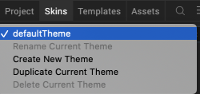
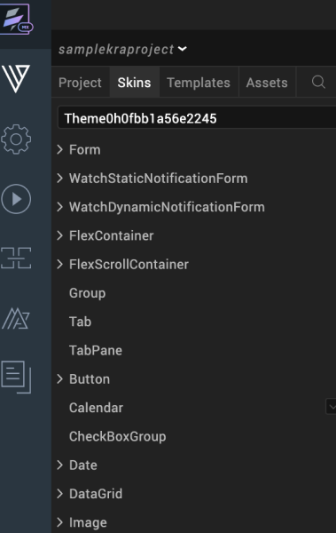
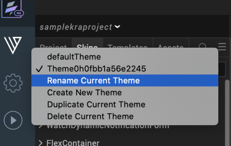
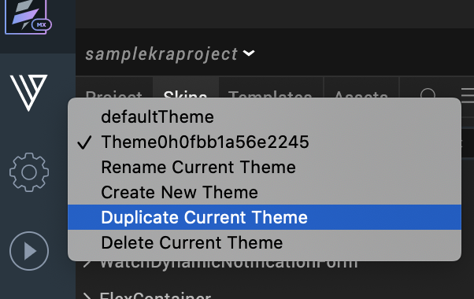
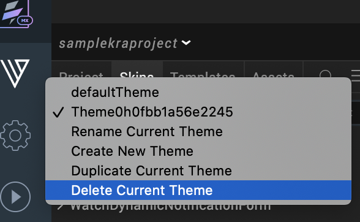

                          

Using Themes - Applying a Collection of Skins as a Group
========================================================

Volt MX  Iris provides a default theme that has a set of skins defined for all the widgets within an application. The skins in this theme can be applied to widgets to get a different look and feel for the widgets. Themes are accessed from the Skins tab of the Project Explorer. A drop-down list at the top of the Skins tab indicates the current theme.   When you create a theme, it is created using the default theme as the base. All the skins available in the default theme are copied to the created theme. Volt MX Iris allows you to add, modify, rename, copy, fork, and delete skins within a theme.

> **_Note:_** Any changes you make to the skins within a theme are limited only to that theme.

Volt MX  Iris provides a set of APIs that allow you to perform different actions with themes. The theme you create using the Volt MX Iris can only be applied using the `voltmx.theme.setCurrentTheme` API. For more information about the APIs related to Theme, see Volt MX Iris API Reference Guide in [VoltMX Documentation Library]({{ site.baseurl }}/docs/documentation/voltmxonpremises/).

What are themes and why would I want them?
------------------------------------------

A theme is a collection of skins. By default, Volt MX provides you with skins for all the widgets. If required, you can configure a new set of skins for your company and group them as a theme. Themes can be exported and imported in Volt MX Iris. Using themes you can apply skins to all the widgets in your application in one single action. For example, if you have configured skins for Button, Form, Label, Segment Widgets based on your company's branding, then you can create a new theme and export the theme. The exported theme can be sent to a designer or developer in your company to maintain consistency while developing the applications.

> **_Important:_** The default Theme and the default skins cannot be modified, deleted, or renamed.

If you attempt to modify a default skin it results in creating a new skin. These new skins can be used within the same project. If you require these skins for other projects, save them in a user-defined theme, and then export them.

Create a Theme
--------------

For storing default as well as modified skins you create a new theme. In the Skin tab of the Project Explorer, click **Default Theme** list and then click **Create New Theme**. A new theme with a default name is created.

> **_Important:_** All the skins (default and customized) that are used in the project until the time of creating this new theme are added automatically to the newly created theme.

To create a new theme, navigate to Skins tab in the project explorer.

1.  Navigate to **Skins** tab in **Project Explorer**.
2.  Click the theme list and select **Create New Theme**.

A new theme will be created with a random name. This theme contains all the skins you have created in Volt MX Iris.

6.  Configure the skins as required and save the theme. The skins modified or created will be available for all the applications in Volt MX Iris.

> **_Note:_** The themes you have created in Volt MX Iris appear in the Theme drop-down list and you can easily navigate to other themes using the list.

### Location of Theme Files

The theme files for a project are located in the following folder:

\<Workspace\>\<ProjectName\>\<themes\>

Rename a Theme
--------------

To rename a theme, do the following: 

1.  Navigate to **Skins** tab in **Project Explorer**.
2.  Click the theme list and select **Rename**.

  
The Rename Theme dialog appears.

5.  Type a name for the name and click **OK**. The theme will be renamed.

Duplicate the Current Theme
---------------------------

To duplicate the current theme, do the following: 

1.  Navigate to **Skins** tab in **Project Explorer**.
2.  Click the theme list and select **Duplicate Current Theme**. The current theme will be duplicated and a random name is generated. You can rename the theme to a meaningful name.

Delete a Theme
--------------

To delete an existing theme, do the following: 

1.  Navigate to **Skins** tab in **Project Explorer**.
2.  Click the theme list and select **Delete Current Theme**. The current theme will be deleted.

> **_Note:_** You can view the theme drop-down list to confirm if the theme is deleted.
