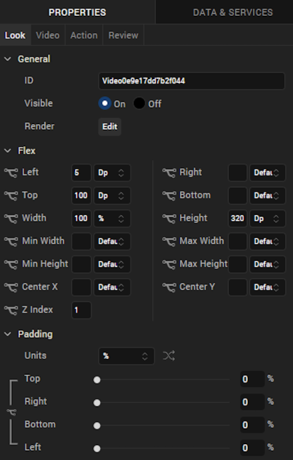
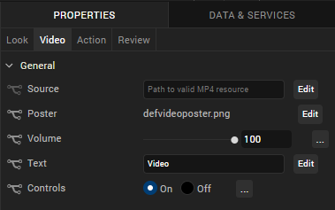
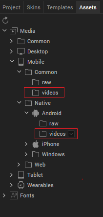

                           

Video
-----

Use a Video widget to stream video within a form.

To learn how to use this widget programmatically, refer [VoltMX Iris Widget guide]({{ site.baseurl }}/docs/documentation/Iris/iris_widget_prog_guide/Content/Video.html).

### Important Considerations

The following are important considerations for a Video Widget:

*   When the form contains dockable components such as headers, footers, or a menu bar, scrolling the video widget on iPhone or iPad does not scroll the form since Video controls on and iPhone or iPad do not respond to custom touch events when media controls are present. To enable scrolling of the form, apply left or right margins to the either side of the video widget.
*   You can play only one video at a time.
*   The Video widget is available for iOS and Android platforms.

### Look

Look properties define the appearance of the widget. The following are the major properties you can set:

*   Whether the widget is visible.
*   The platforms on which the widget is rendered.
*   How the widget aligns with its parent widget and neighboring widgets.
*   If the widget displays content, where the content appears.

For descriptions of the properties available on the Look tab of the Properties pane, see [Look](Look.html#Flex).

### Skin

Skin properties define a skin for the widget, including background color, borders, and shadows. If the widget includes text, you can also specify the text font.

For a Video widget, you can apply a skin and its associated properties for the following state:

*   Normal: The default skin of a widget.

For more information about applying skins, see [Understanding Skins and Themes](Customizing_the_Look_and_Feel_with_Skins.html).

### Video Properties

Video properties specify properties that are available on any platform supported by Volt MX Iris, and assign platform-specific properties.

#### Source

Specifies the video's source. You can add the videos that you want to be part of the app in its respective channels common folder. For example, **Native>Android>Common>Video**.

Prior to Volt MX Iris V8 SP1 release, video files were inside the **raw** folder. Video files are now moved into a separate **video** folder. Project built on versions lower that 8.1 will continue to work without any changes.

> **_Note:_** The supported video formats are MP4, WebM and OGV. The device will play video only if the format is compatible with the underlying SDK

#### Controls

Specifies whether to display the default video controls. When this property is set to false, video is playable by clicking anywhere on the Poster.

> **_Note:_** This property is specific to the SPA and Desktop Web platforms.

#### Poster

Specifies an image to be displayed as a poster or as a starting image for the video. The image location must point to an external URL. For example, www.voltmx.com/sites/all/themes/voltmx/logo.png

> **_Note:_** This property is specific to the SPA and Desktop Web platforms

### Review

Displays review feedback. For more information, see [Capture Product Requirements with Review Notes](CapProdReqsWithNotes.html).

### Placement Inside a Widget

The following table summarizes where a Video widget can be placed:

  
| Widget | Video placement inside a widget |
| --- | --- |
| Flex Form | Yes |
| VBox Form | Yes |
| FlexContainer | Yes |
| FlexScrollContainer | Yes |
| HBox | Yes |
| VBox | Yes |
| ScrollBox | Horizontal Orientation -YesVertical Orientation- Yes |
| Tab | Yes |
| Segment | No |
| Popup | Yes |
| Template | Header- NoFooter- No |

### Specifying a Video

To specify a video:

1.  Click the **Edit** button to open the Source dialog box.
2.  Do one of the following:

*   Locate and select the video you want from the list of available videos.
*   In the video URL text box, enter a video URL.

4.  Click **Open**. The Source property displays the file name or URL of the video.

<table style="margin-left: 0;margin-right: auto;mc-table-style: url('Resources/TableStyles/RevisionTable.css');" class="TableStyle-RevisionTable" cellspacing="0" data-mc-conditions="Default.HTML5 Only"><colgroup><col class="TableStyle-RevisionTable-Column-Column1" style="width: 42px;"> <col class="TableStyle-RevisionTable-Column-Column1"> <col class="TableStyle-RevisionTable-Column-Column1"></colgroup><tbody><tr class="TableStyle-RevisionTable-Body-Body1"><td class="TableStyle-RevisionTable-BodyE-Column1-Body1" data-mc-conditions="Default.HTML5 Only,Default.Iris7-1,Default.Iris7-1-1,Default.Iris7-2">Rev</td><td class="TableStyle-RevisionTable-BodyE-Column1-Body1" data-mc-conditions="Default.HTML5 Only,Default.Iris7-1,Default.Iris7-1-1,Default.Iris7-2">Author</td><td class="TableStyle-RevisionTable-BodyD-Column1-Body1" data-mc-conditions="Default.HTML5 Only,Default.Iris7-1,Default.Iris7-1-1,Default.Iris7-2">Edits</td></tr><tr class="TableStyle-RevisionTable-Body-Body1"><td class="TableStyle-RevisionTable-BodyB-Column1-Body1" data-mc-conditions="Default.HTML5 Only,Default.Iris7-1,Default.Iris7-1-1,Default.Iris7-2">8</td><td class="TableStyle-RevisionTable-BodyB-Column1-Body1" data-mc-conditions="Default.HTML5 Only,Default.Iris7-1,Default.Iris7-1-1,Default.Iris7-2">SHS</td><td class="TableStyle-RevisionTable-BodyA-Column1-Body1" data-mc-conditions="Default.HTML5 Only,Default.Iris7-1,Default.Iris7-1-1,Default.Iris7-2">SHS</td></tr></tbody></table>
