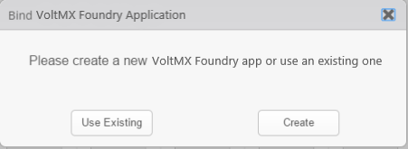
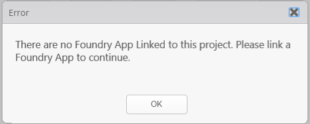
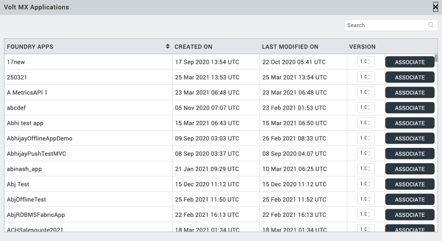

                         

Publishing a Web App in Volt MX Iris
==========================================

Overview
--------

Web Publish, a feature introduced in Volt MX Iris V8 SP4, enables you to build and publish a web app from Volt MX Iris to your Volt MX Foundry cloud.

Seamless in-app Build and Publish Experience

Starting with Volt MX Iris V8 SP4, you can publish a web app to Volt MX Foundry, without leaving the Iris window. Earlier, one had to design their web app in Iris and then open the Volt MX Foundry console to the publish the web app. This process has now been simplified.

The Build and Publish Web feature is available in the Build menu of the Volt MX Iris application.

The publish process occurs in the background, and you can continue to use the Iris canvas while the app is being built and published.

Access to the Published URL within Volt MX Iris

Once the publish is complete, the published URL is displayed on the Build tab in Volt MX App. When you click the URL, the Iris Preview window opens. For more information on the Iris Preview window, click [here](LivePreview.html).

You can also click on **Copy** beside the URL to copy it and view the app in a web browser of your choice.

The Build tab in Iris displays the status of your app publish. If there are any errors, they appear in the Build tab. You can switch to the Console tab for a detailed view of the error logs.

Prerequisites
-------------

**Following are the prerequisites to publish a Web App within Volt MX Iris**:

1.  Sign in to your Volt MX Cloud account.
2.  Link a new or an existing foundry app to your Iris Project.

When you try to publish the app without logging into Volt MX Foundry, the login window appears.

If you try to publish the app, even when you do not have an associated Volt MX Foundry app, you will get a prompt to link a Volt MX Foundry app.

To change the selected Cloud account or Environment, go to **Project Settings** > **VoltMX Foundry**. hen, click the **VoltMX Foundry** tab. At the top of this tab, under Volt MX Foundry Environment, select an environment from the drop-down list. Click **Done**. If you do not see any environments listed, you need to create one. For more information, refer [Environments]({{ site.baseurl }}/docs/documentation/Foundry/voltmx_foundry_user_guide/Content/Environments.html) in the Volt MX Foundry Console User Guide.

To publish the Volt MX Iris web app to Volt MX Foundry, the app needs to be associated with a Volt MX Foundry app.

If no Foundry App is associated to your Iris project, an error message is displayed.

You must either create a new Volt MX Foundry app or use an existing one. For information on how to create a new Volt MX Foundry app, see [How to Add Applications]({{ site.baseurl }}/docs/documentation/Foundry/voltmx_foundry_user_guide/Content/Adding_Applications.html) in the Volt MX Foundry Console User Guide.

Post Build Actions
------------------

The Build and Publish Web option in Volt MX Iris builds the application for the selected Web platforms and performs the selected Post Build Action. You must choose the Post Build Action in the **Build and Publish Web** window, before the build process begins. There are three types of Post Build Actions:

*   [Build and Publish Web App](#build-and-publish-web-app) – This action publishes the application to your Volt MX Foundry environment.
*   [Publish to my App Store](#publish-to-my-app-store) – This action publishes the Web application to your Enterprise App Store.
*   [Generate Web App](#generate-web-app) – This action generates the archive for your Web application and saves it on your file system.

The Post Build Action is initiated after the Build is complete.

### Build and Publish Web App

The Build and Publish Web App action publishes the application to your Volt MX Foundry environment and enables you to view your app by providing a link.

The Build and Publish Web app option also publishes the Volt MX Foundry app to the Volt MX Cloud.

To publish an app to the Volt MX Cloud, logging in to your Volt MX Account is mandatory.

### Publish to my App Store

The Publish to my App Store action generates the web app archive and publishes the application to your Enterprise App Store. After a successful publish, a confirmation window appears, which shares a link to view the Enterprise app store on your device.

To publish an app to the Enterprise App Store, logging in to your Volt MX Account is mandatory.

For more information on Publish to my App Store, click [here](EAS.html#publish-apps-to-the-enterprise-app-store).

### Generate Web App

The Generate Web App action generates the archives for your Web application and saves it on your file system. The Iris project does not have to be linked to Volt MX Foundry to complete this action.

Once the build is complete, the generated web archives will appear in your project's Volt MX Iris workspace > binaries folder. You can then upload and publish the app on Volt MX Foundry.

Alternatively, once the build is complete, you will get notified by an email from "VoltMX Iris – Build Service", with download links for all these binaries.

Publish a Web app
-----------------

Before you publish a web app, ensure that you have a project in which you have a Web app designed.

**To publish a Web app, follow these steps**:

1. Open the Volt MX Iris project in which you have designed a web app.  
2. Sign in to your Volt MX Cloud account.  
3. Link your Iris Project to a Volt MX Foundry app. You can link your Project to a new or an existing Foundry app.
4. On the **Data & Services** panel, click the hamburger menu near the **Refresh** button.
5. Click either **Create New App** or **Link to Existing App**. The Volt MX Foundry console appears.
6. If you have not already, sign in to your Volt MX Foundry account by using your cloud credentials.
7. If you choose:
  * **Create New App**, a new Foundry app with the same name as the Iris Project is created.
  * **Link to Existing App**, a list of existing apps from your Volt MX Foundry account are displayed.
8. To select the Volt MX Foundry app that you want to associate your Volt MX Iris app with, click **Associate** beside the App Name.

     
   The app you chose/created is successfully linked to your Iris Project.

9.  Close the Volt MX Foundry window and return to Volt MX Iris by clicking on the Iris icon on the left navigation pane.
10.  From the main menu of Volt MX Iris, select **Build** > **Build and Publish Web**.  
    The Build and Publish Web window appears.  

    
11.  Select the required Platforms and Channels for which you want to build and publish your web app.
12.  From the **Post Build Action** drop-down menu, select the desired **Post Build Action**. For more details about the Post Build Action, click [here](#post-build-actions).
13.  From the **Build Mode** drop-down list, select your desired build mode.

*   **Debug mode** \- To help you identify and fix errors, Volt MX Iris emits the complete symbolic debug information . To lessen the amount of time necessary to complete the build, the build is not optimized for code execution, so it may tend to execute slower than a build optimized for release. Also, the inclusion of the symbolic debug information causes the final executable to be larger than a release build.
*   **Release mode** - Volt MX Iris optimizes the build for execution, requiring more time to generate the build. It also does not emit the complete symbolic debug information, making the final executable smaller than a debug build.
*   **Protected Mode** \- Applications built in Volt MX Iris can use the additional security enhancements by building the application in the _Protected Mode_. Volt MX IrisPlatform code for iOS and Android is equipped with mechanisms that can protect your application by detecting attacks like tampering, swizzling, debugging, jail breaking (iOS), rooting (Android), and information disclosure. Additional security mechanisms are provided through the use of White Box Cryptography to protect application business logic and source code. Application reacts to the attack by exiting upon detecting attacks to prevent further attempts.  
    If you choose to build an application in **Protected mode**, then setting the public and private keys is mandatory. To do so, go to **Project Settings** > **Protected Mode**. For more details on how to generate public and private keys, click [here](ApplicationSecurity.html#rsa-key-pair-generation-encryption-and-usage).
*   **Test Mode** - To help you identify and fix errors, Volt MX Iris provides the ability to Test the application on the device or an emulator. When you build an app using the Test Mode, you can leverage the Jasmine testing framework of Volt MX Iris to thoroughly test your app and ensure your application is errors free. You can run jasmine test cases, test suites and test plans by building an app using the Test mode.

15.  You can choose to change the cloud environment on which your app will be published. To do so click on **Change** beside the **Environment** option.

7. If you do not use the deprecated SHA1, MD2, MD4, and MD5 hashing algorithms in your application, check **Strict Mode**. If you use any of those algorithms, leave **Strict Mode** unchecked. Otherwise, you will receive an "Unsupported algorithm" error message.

16.  Once all the required settings are ready, click **Build**.  
    The progress of the Web App Publish is displayed in the Build tab of Iris.  
    Once the publish process is complete, a Web App URL appears on the Build tab.
17.  Click on the generated URL to preview your Web app in the [**Live Preview** mode](LivePreview.html#live-preview).  
    The Iris Preview window appears. You can use this window to debug the application.
18.  You can also click on **Copy** to copy the URL to your clipboard and view it in a web browser of your choice.  
    
19.  Click on **View Logs** to access the logs of the publish process.
20.  An **Application was deployed mail** will also be sent to your registered e-mail account. This mail will contain the App details along with the App URL. Click on the URL in the mail to open the web app in your default web browser.
