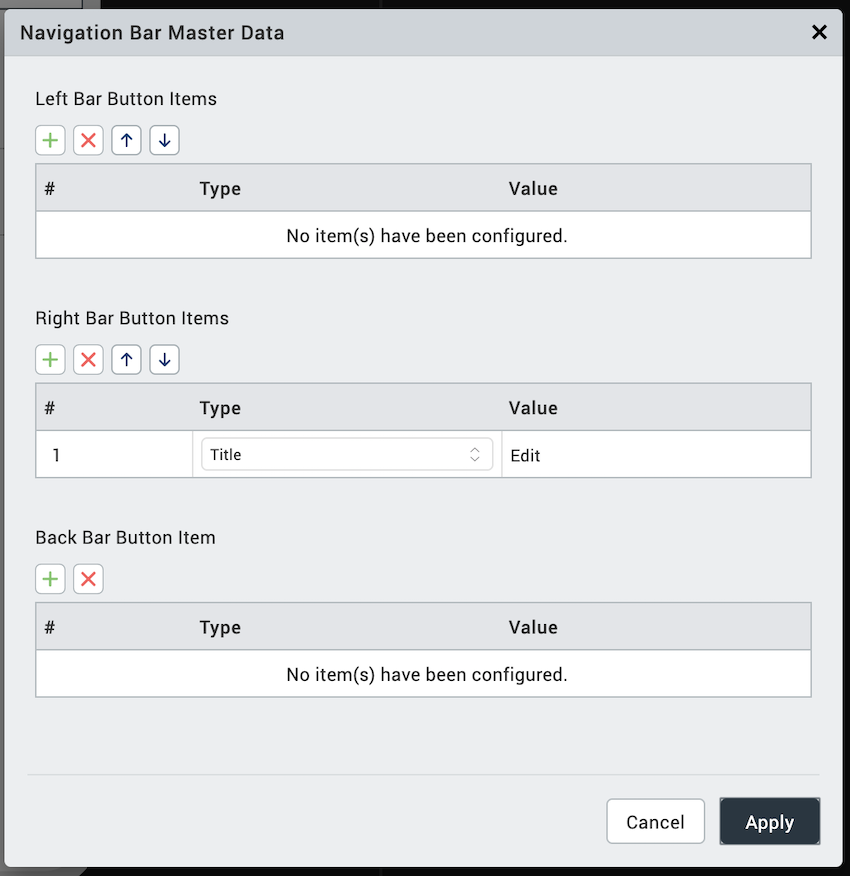

                         

iOS Navigation Bar
==================

With Volt MX IrisV8 SP1 release, you can customize the navigation bar in iOS. Before Volt MX Iris V8 SP1 release, a user could only modify the Left button, Right button, and the title. However, iOS natively provides an option to add other UI controls to the navigation bar. To support the UI controls in the navigation bar, Volt MX has modified the navigation bar to provide the same features in Volt MX Iris.

TitleBar properties for forms created on older version of Iris (< V8 SP1) will be carried over to the new NavigationBar when the projects is migrated to Iris V8 SP1.

The following are the various new keys that are supported in the NavigationBar tab of Properties pane in Iris for iOS.

  
| Key | Description |
| --- | --- |
| Render Title Text | Switches the form title on or off. |
| Bar Style | Specifies the UI bar style to apply to the navigation bar. |
| Master Data | Collection of bar button items that can be set to the properties (Left Bar Button Items, Right Bar Button Items, and Back Bar Button Item). |
| Tint Color | Controls the tint color of the navigation bar. |
| Translucent | Specifies whether the navigation bar is translucent |
| Prompt | A single line of text displayed at the top of the navigation bar |
| Shadow Image | Represents the image used as a shadow beneath the navigation bar. This image is stretched horizontally to match the width of the bar. |
| Extended View | This is a reference to a component without a contract which is displayed at the bottom of the navigation bar. |
| Back Indicator Image | Specifies the image that appears at the leading edge of the back button. This attribute must be used in combination with the **Back Indicator Transition Mask Image** attribute. |
| Back Indicator Transition Mask Image | Specifies the mask associated with the **Back Indicator Image** attribute. This is used to control the appearance of the Back button during animated transitions, and therefore must be used in conjunction with the **Back Indicator Image** attribute. |
| Hides Back Button | Indicates whether the left items are displayed in addition to the back button. |
| Left Items Supplement Back Button | Sets whether the back button is hidden, optionally animating the transition. |

To configure the items on the navigation bar, you must use the **Edit** button in from **Master Data**.

Using the following steps, you can configure any of the Left Bar Button Items, Right Bar Button Items, and the Back Bar Button Item.

> **_Note:_** You can add multiple items for the Left Bar and the Right Bar, however, you can only add one item to the Back Button Item.

**To add an item for the navigation bar, do the following**: 

1.  From the Project tab of the Project Explorer, select the form you want to modify the navigation bar.  
    Ensure that your current form is for iOS.
2.  Select the Navigation bar on the Iris canvas.
3.  In the **Properties** pane, click the **NavigationBar** tab.  
    
4.  Click the **Edit** button next to **Master Data**. The Navigation Bar Master Data window displays. This will display the existing bar button items. Migrated title bar data appears as type **Legacy**. You can not modify the legacy items type and index.  
    
5.  For the item you want to add, for example, Right Bar Button Items, click the + symbol. A new row is added.  
    
6.  Select the type from the **Type** list. Options are Image, Title. System Item, and Custom. Based on your selection, how you enter the value pair changes.
    1.  **Image**: Select an image from your project using the image browser.
    2.  **Title**: Enter the tile in the text box.
    3.  **System Item**: Select an option from the predefined list.
    4.  **Custom**: Select the widget type, Button or Label.  
        
7.  If you want to change the order of the Bar Button Items, you can move them up and down using the up arrow and down arrow icons. You must select the Bar Item to move it up or down.  
    
8.  Once you are done with your changes, click **Apply**. Changes made will reflect in the Iris Canvas.

After you have configured the navigation bar button items, you can select then individually and configure their settings independent of the navigation bar.
