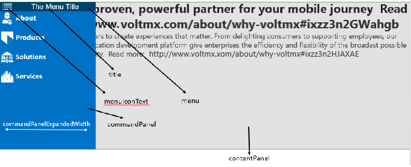

                               

You are here: Creating a SlidingContainer Widget Using a Constructor:voltmx.ui.SlidingContainer

SlidingContainer Widget
=======================

The SlidingContainer widget is a hamburger menu. You use a SlidingContainer widget to create a top-level navigation experience that adapts to different screen widths.

SlidingContainer widget is applicable only for Windows platform and can be created only through code.

Following are a few real-time use cases of SlidingContainer widget:

*   Hamburger menu is used as apps main Navigation menu, to refer to the sections of the app when required. Displaying and hiding the menu is flexible.
    
*   Used in shopping applications to filter items such as western wear, ethnic wear, etc.
    
*   Used in an employee directory to filter employees by department and designation.
    
*   Used in news applications to categorize the news into various fields like sports, business, and technology.
    

The SlidingContainer widget capabilities can be broadly categorized into the following:

*   [Layout](#layout)
*   [UI Appearance](#ui-appearance)
*   [Command Panel](#command-panel)
*   [Enabling RTL](#enabling-rtl)
*   [Miscellaneous](#miscellaneous)

#### Layout

  
| Properties | Description |
| --- | --- |
| [bottom](SlidingContainer_Properties.html#bottom) | Determines the bottom edge of the widget and is measured from the bottom bounds of the parent container. |
| [centerX](SlidingContainer_Properties.html#centerX) | Determines the center of a widget measured from the left bounds of the parent container. |
| [centerY](SlidingContainer_Properties.html#centerY) | Determines the center of a widget measured from the top bounds of the parent container. |
| [height](SlidingContainer_Properties.html#height) | Determines the height of the widget and measured along the y-axis. |
| [left](SlidingContainer_Properties.html#left) | Determines the lower left corner edge of the widget and is measured from the left bounds of the parent container. |
| [maxHeight](SlidingContainer_Properties.html#maxHeigh) | Specifies the maximum height of the widget and is applicable only when the height property is not specified. |
| [maxWidth](SlidingContainer_Properties.html#maxWidth) | Specifies the maximum width of the widget and is applicable only when the width property is not specified. |
| [right](SlidingContainer_Properties.html#right) | Determines the lower right corner of the widget and is measured from the right bounds of the parent container. |
| [top](SlidingContainer_Properties.html#top) | Determines the top edge of the widget and measured from the top bounds of the parent container. |
| [width](SlidingContainer_Properties.html#width) | This property determines the width of the widget and is measured along the x-axis. |
| [zIndex](SlidingContainer_Properties.html#zIndex) | Specifies the stack order of a widget. |

#### UI Appearance

  
| Properties | Description |
| --- | --- |
| [margin](SlidingContainer_Properties.html#margin) | Specifies the space around a widget. |
| [marginInPixel](SlidingContainer_Properties.html#marginIn) | Specifies whether the margin is applied in percentage or in pixels. |
| [menuIconSkin](SlidingContainer_Properties.html#menuIcon) | Specifies the font skins of the menuIcon. |
| [menuSkin](SlidingContainer_Properties.html#menuSkin) | Specifies the skin of the menu bar for the default hamburger menu. |
| [showMenu](SlidingContainer_Properties.html#showMenu) | Enables or disables the default hamburger menu. |
| [widgetAlignment](SlidingContainer_Properties.html#widgetAl) | Indicates how a widget is to be anchored with respect to its parent. |

#### Command Panel

  
| Events | Description |
| --- | --- |
| [commandPanelClosed](SlidingContainer_Events.html#command1) | Invoked by the platform when the command panel is closed. |
| [commandPanelClosing](SlidingContainer_Events.html#command2) | Invoked by the platform when the command panel is about to close. |

 

| Properties | Description |
| --- | --- |
| [commandPanel](SlidingContainer_Properties.html#command1) | Gets or sets the box or flex container that controls the navigation in the contentPanel. |
| [commandPanelCompactWidth](SlidingContainer_Properties.html#command2) | Specifies the size of the commandPanel when it is closed and the display mode is compact type. |
| [commandPanelExpandedWidth](SlidingContainer_Properties.html#command3) | Specifies the size of the commandPanel when it is open. |
| [commandPanelPosition](SlidingContainer_Properties.html#command4) | Gets or sets the command panel position. |
| [commandPanelSkin](SlidingContainer_Properties.html#command5) | Specifies the skin for the commandPanel of the SlidingContainer Widget. |
| [contentPanel](SlidingContainer_Properties.html#contentP) | Gets or sets a box or flex container that has complex content. |
| [openCommandPanel](SlidingContainer_Properties.html#openComm) | Opens or closes the command panel. |

#### Enabling RTL

| Properties | Description |
| --- | --- |
| [retainContentAlignment](SlidingContainer_Properties.html#retainContentAlignment) | Helps to retain the content alignment of the widget while applying RTL. |
| [retainFlexPositionProperties](SlidingContainer_Properties.html#retainFlexPositionProperties) | Helps to retain the left, right and padding properties while applying RTL. |
| [retainFlowHorizontalAlignment](SlidingContainer_Properties.html#retainFlowHorizontalAlignment) | Enables you to change the horizontal flow of the widget from left to right. |

#### Miscellaneous

| Properties | description |
| --- | --- |
| [cacheMode](SlidingContainer_Properties.html#cacheMod) | Enables or disables the cache underlying the OS UI element when the contentPanel content is changed. |
| [menuText](SlidingContainer_Properties.html#menuText) | Gets or sets the default menu icon text. |
| [Title](SlidingContainer_Properties.html#Title) | Gets or sets the default menu title. |
| [menuDisplayMode](SlidingContainer_Properties.html#menuDisp) | Gets or sets the display mode of the menu. |

SlidingContainer Widget Basics
------------------------------

> **_Note:_** The SlidingContainer Widget is supported in Windows platform only.

The widget is a container with two views. One view is for the main content, and the second view is used for navigation commands. The following image shows the main content view of the widget.

The following image of the open widget shows the navigation commands.

The SlidingContainer has two areas of content: a commandPanel and a contentPanel.

The contentPanel area is always present and can contain a single child element, typically a Box- or Flex-derived container that contains additional child elements.

Although the contentPanel is always present, it can be completely covered by the commandPanel. You use the properties of the SlidingContainer Widget to change the appearance and behavior of the commandPanel. For example, you can:

*   Use the [openCommandPanel](SlidingContainer_Properties.html#openComm) property to open or close the commandPanel pane. The SlidingContainer widget allows users to toggle the state of the pane, like a menu (or “hamburger”) button.
*   Use the [commandPanelExpandedWidth](SlidingContainer_Properties.html#command3) property to specify the width of the open commandPanel.
*   Use the [commandPanelPosition](SlidingContainer_Properties.html#command4) property to show the commandPanel on either the left or right side of the contentPanel.
*   Use the [menuDisplayMode](SlidingContainer_Properties.html#menuDisp) property to configure the interaction of the commandPanel with the contentPanel. By default, the commandPanel overlays the contentPanel and has a compact size when closed. Using the property you can show the commandPanel side-by-side with the contentPanel, or have a narrow section of the commandPanel remain visible even when it is closed.

### Creating a SlidingContainer Widget Using a Constructor:voltmx.ui.SlidingContainer

You can create a SlidingContainer Widget dynamically using JavaScript code.


var container = new voltmx.ui.SlidingContainer(allConf);


or


var container = new voltmx.ui.SlidingContainer(basicConf, layoutConf, pspConf);


*   **basicConf** is an object with basic properties.
*   **layoutConf** is an object with layout properties.
*   **pspConf** is an object with platform specific properties.

### Important Considerations

*   Use the SlidingContainer Widget only as a screen-level widget as suggested by Microsoft UI guidelines.
*   Use only container widgets for the commandPanel and contentPanel.
*   A better practice is to create a global content object and change the contentPanel by assigning global objects to it. It will switch smoothly between the two content items.

