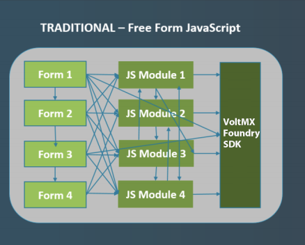
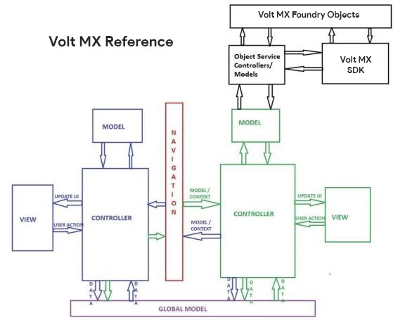

                         

Volt MX  Reference Architecture: Decoded
=======================================

Volt MX  Reference Architecture allows you to develop highly modular and structured apps. Traditional JavaScript development results in the creation of muddled and unstructured apps, which introduce challenges as the apps grow in size and complexity. In a traditional JavaScript app, every element is global and can be accessed from anywhere in the program. Apps developed with Volt MX Reference Architecture, on the other hand, are highly structured even though they are still written in JavaScript. As a result, you can write highly reusable code modules that you can incorporate into many apps.

The following diagrams illustrate the differences between traditional Free Form JS app development and app development by using Volt MX Reference Architecture.

The diagrams show that because virtually everything is global in the traditional JavaScript model, any form could invoke any JavaScript module or any SDK function at any time. The result is that apps are nearly impossible to develop in a modular style. Code reuse is low and each new app often has to be rewritten from scratch, even if a previous app contained similar functionalities.

However, under VoltMX's implementation of the MVC architecture, Volt MX Reference Architecture structures app elements into three distinct components: [Model](A_Deeper_Look_at_VoltMX_Reference_Architecture.html#models), [View](A_Deeper_Look_at_VoltMX_Reference_Architecture.html#views), and [Controller](A_Deeper_Look_at_VoltMX_Reference_Architecture.html#controllers). This leads to benefits such as a structured separation of the code, parallel development of each app component, reduced complexity, and easier testing mechanism. For detailed information on the several advantages of using Volt MX Reference Architecture, click [here](Advantages_of_Using_VoltMX_Reference_Architecture.html).

The functionality of a motorbike is a real-world example for which the MVC architecture components can be explained. Every bike consists of the following three major units:

*   View = User Interface (gears, suspension, seat, brake, clutch, exhaust nozzle)
    
*   Model = Storage (fuel tank)
    
*   Controller = Mechanism (engine)
